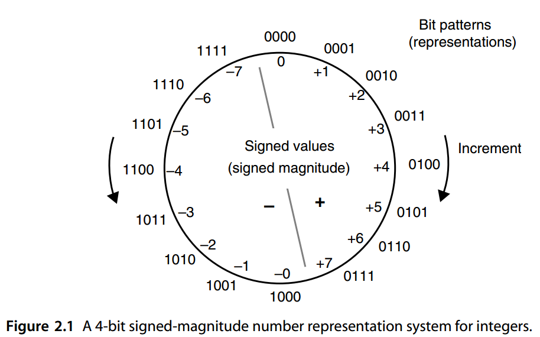

# 2. 有符号数的表示

> *“This can’t be right . . . it goes into the red!”*
>
> LITTLE BOY, WHEN ASKED TO SUBTRACT 36 FROM 24 ( CAPTION ON A CARTOON BY UNKNOWN ARTIST)
>
> *“这不对啊… …要标红(欠钱)了！”*
>
> 当小男孩被要求从 24 中减去36 时（卡通上的字幕，无名艺术家）


This chapter deals with the representation of signed fixed-point numbers by providing an attached sign bit, adding a fixed bias to all numbers, complementing negative values, attaching signs to digit positions, or using signed digits. In view of its importance in the design of fast arithmetic algorithms and hardware, representing signed fixed-point numbers by means of signed digits is further explored in Chapter 3. Chapter topics include:

本章讨论有符号定点数的表示，通过附加符号位，为所有数字添加固定偏差，对负值求补、在数字位上附加符号或使用带符号的数字等方法。鉴于其在快速算术算法和硬件设计中的重要性，第 3 章将进一步探讨用有符号数字表示有符号定点数。本章主题包括：

**2.1** 符号幅度表示法 Signed-Magnitude Representation

**2.2** 偏置表示法 Biased Representations

**2.3** 补码表示 Complement Representations

**2.4** 2 和 1 的补码数 2’s- and 1’s-Complement Numbers

**2.5** 直接和间接有符号算术Direct and Indirect Signed Arithmetic

**2.6** 使用带符号位置或带符号数字 Using Signed Positions or Signed Digits


## 2.1 符号幅度表示法

The natural numbers 0, 1, 2,  *. . .* ,  *max*  can be represented as fixed-point numbers without fractional parts (refer to Section 1.4). In radix  *r*, the number  *k*  of digits needed for representing the natural numbers up to  *max*  is

自然数 0, 1, 2, . 。 。 , max 可以表示为没有小数部分的定点数（请参阅第 1.4 节）。在基数 r 中，表示最大到 max 的自然数所需的位数 k 为


$$
k=\left \lfloor \log_r{max}\right \rfloor + 1= \left \lceil \log_r(max+1) \right \rceil
$$




Conversely, with  *k*  digits, one can represent the values 0 through  $r^k − 1$, inclusive; that is, the intervalo $[0, r^k − 1] = [0, r^k )$f natural numbers. 

相反，对于 $k$ 位数字，可以表示值 $0$ 到  $r^k − 1$（含端点）；即自然数的区间 $[0, r^k − 1] = [0, r^k )$。

Natural numbers are often referred to as “unsigned integers,” which form a special data type in many programming languages and computer instruction sets. The advantage of using this data type as opposed to “integers” when the quantities of interest are known to be nonnegative is that a larger representation range can be obtained (e.g., maximum value of 255, rather than 127, with 8 bits). 

自然数通常被称为“无符号整数”，它在许多编程语言和计算机指令集中形成一种特殊的数据类型。当已知感兴趣的量为非负时，使用此数据类型而不是“整数”的优点是可以获得更大的表示范围（例如，最大值为 255，而不是 8 位的 127）。

One way to represent both positive and negative integers is to use “signed magnitudes,” or the sign-and-magnitude format, in which 1 bit is devoted to sign. The common convention is to let 1 denote a negative sign and 0 a positive sign. In the case of radix-2 numbers with a total width of  *k*  bits,  *k* −1 bits will be available to represent the magnitude or absolute value of the number. The range of  *k*-bit signed-magnitude binary numbers is thus [− *(* 2 *k*−1 − 1 *)*, 2 *k*−1 − 1]. Figure 2.1 depicts the assignment of values to bit patterns for a 4-bit signed-magnitude format. 

表示正整数和负整数的一种方法是使用“有符号的幅度”或“符号加幅度”格式，其中 1 位专用于符号。常见的约定是让 1 表示负号，0 表示正号。以 radix-2 总宽度为 k 位的数字为例，可使用 k-1 位来表示数字的大小或绝对值。因此，k 位有符号数值二进制数的范围为 $[− ( 2^{k−1} − 1 ), 2^{k−1} − 1]$。图 2.1 描述了 4 位有符号数值格式的位模式的值分配。

Advantages of signed-magnitude representation include its intuitive appeal, conceptual simplicity, symmetric range, and simple negation (sign change) by flipping or inverting the sign bit. The primary disadvantage is that addition of numbers with unlike signs (subtraction) must be handled differently from that of same-sign operands. 

符号加幅度表示的优点包括其直观吸引力、概念简单、对称范围以及通过翻转或反转符号位进行简单求反（符号更改）。主要缺点是具有不同符号的数字的加法（减法）必须以与相同符号操作数不同的方式处理。

The hardware implementation of an adder for signed-magnitude numbers either involves a magnitude comparator and a separate subtractor circuit or else is based on the use of complement representation (see Section 2.3) internally within the arithmetic/logic unit (ALU). In the latter approach, a negative operand is complemented at the ALU’s input, the computation is done by means of complement representation, and the result is complemented, if necessary, to produce the signed-magnitude output. Because the pre- and postcomplementation steps add to the computation delay, it is better to use the complement representation throughout. This is exactly what modern computers do. 

用于有符号数值的加法器的硬件实现涉及幅度比较器和单独的减法器电路，或者基于算术/逻辑单元 (ALU) 内部补码表示法的使用（参见第 2.3 节）。在后一种方法中，负操作数在 ALU 的输入处求补，计算通过求补表示来完成，并且如果需要的话，对结果求补以产生带符号的幅度输出。由于补码前和补码后的步骤会增加计算延迟，因此最好始终使用补码表示。这正是现代计算机所做的。

Besides the aforementioned extra delay in addition and subtraction, signed-magnitude representation allows two representations for 0, leading to the need for special Biased Representations care in number comparisons or added overhead for detecting −0 and changing it to +0. This drawback, however, is unavoidable in any radix-2 number representation system with symmetric range. 

除了前面提到的加法和减法的额外延迟之外，有符号数值表示允许 0 的两种表示，导致在数字比较中需要特殊的偏置表示，或者增加检测 -0 并将其更改为 +0 的开销。 然而，这个缺点在任何具有对称范围的基 2 数字表示系统中都是不可避免的。

Figure 2.2 shows the hardware implementation of signed-magnitude addition using selective pre- and postcomplementation. The control circuit receives as inputs the operation to be performed (0 = add, 1 = subtract), the signs of the two operands  *x*  and  *y*, the carry-out of the adder, and the sign of the addition result. It produces signals for the adder’s carry-in, complementation of  *x*, complementation of the addition result, and the sign of the result. Note that complementation hardware is provided only for the  *x* operand. This is because  *x* − *y*  can be obtained by first computing  *y* − *x*  and then changing the sign of the result. You will understand this design much better after we have covered complement representations of negative numbers in Sections 2.3 and 2.4. 

图 2.2 显示了使用选择性前补和后补的有符号数值加法的硬件实现。控制电路接收要执行的操作（0 = 加，1 = 减）、两个操作数 x 和 y 的符号、加法器的进位以及加法结果的符号作为输入。它产生加法器的进位信号、x 的补码、加法结果的补码以及结果的符号。请注意，仅为 x 操作数提供补码硬件。这是因为 x − y 可以通过先计算 y − x 然后改变结果的符号来获得。在我们在 2.3 和 2.4 节中介绍了负数的补码表示之后，您将更好地理解这种设计。


## 2.2 偏置表示法

One way to deal with signed numbers is to devise a representation or coding scheme that converts signed numbers into unsigned numbers. For example, the biased representation is based on adding a positive value  *bias*  to all numbers, allowing us to represent the integers from – *bias*  to  *max* –  *bias*  using unsigned values from 0 to  *max*. Such a representation is sometimes referred to as “excess- *bias*” (e.g., excess-3 or excess-128) coding. 

处理有符号数的一种方法是设计一种将有符号数转换为无符号数的表示或编码方案。例如，有偏差表示基于向所有数字添加正值偏差，允许我们使用从 0 到 max 的无符号值来表示从 $-bias$到$max-bias$的整数。这种表示有时被称为“excess- *bias*” (“过量偏差”)（例如，excess-3 或 excess-3）编码。

We will see in Chapter 17 that biased representation is used to encode the exponent part of a floating-point number. 

我们将在第 17 章中看到，偏置表示法用于对浮点数的指数部分进行编码。

Figure 2.3 shows how signed integers in the range [−8, +7] can be encoded as unsigned values 0 through 15 by using a bias of 8. With  *k*-bit representations and a bias of 2 *k*−1, the leftmost bit indicates the sign of the value represented (0 = negative, 1 = positive). Note that this is the opposite of the commonly used convention for number signs. With a bias of 2 *k*−1 or 2 *k*−1 − 1, the range of represented integers is almost symmetric. 

图 2.3 显示了 [−8, +7] 范围内的有符号整数如何编码为使用 8 的偏差来表示 0 到 15 之间的无符号值。对于 k 位表示和 $2^{k−1}$ 的偏差，最左边的位表示所表示值的符号（0 = 负，1 = 正）。请注意，这与常用的数字符号约定相反。当偏差为 $2^{k−1}$ 或 $2^{k−1} − 1$ 时，表示的整数范围几乎是对称的。


图 2.3 偏置为 8 的 4 位偏置整数表示系统。


Biased representation does not lend itself to simple arithmetic algorithms. Addition and subtraction become somewhat more complicated because one must subtract or add the bias from/to the result of a normal add/subtract operation, since

偏置表示不适合简单的算术算法。加法和减法变得更加复杂，因为必须从正常加/减运算的结果中减去或添加偏差，因为


$$
\begin{array}{l}
x + y + bias = (x + bias) + (y + bias) − bias \\
x − y + bias = (x + bias) − (y + bias) + bias
\end{array}
$$


With  *k*-bit numbers and a bias of 2 *k*−1, adding or subtracting the bias amounts to complementing the leftmost bit. Thus, the extra complexity in addition or subtraction is negligible. 

但如果对于 k 位数字是$2^{k−1}$ 的偏差，添加或减去偏差相当于对最左边的位求补。因此，加法或减法的额外复杂性可以忽略不计。

Multiplication and division become significantly more difficult if these operations are to be performed directly on biased numbers. For this reason, the practical use of biased representation is limited to the exponent parts of floating-point numbers, which are never multiplied or divided. 

如果直接对有偏差的数执行乘法和除法，这些运算就会变得更加困难。因此，偏置表示的实际使用仅限于浮点数的指数部分，这些部分永远不会被乘法或除法。


## 2.3 补码表示

In a complement number representation system, a suitably large complementation constant  *M*  is selected and the negative value − *x*  is represented as the unsigned value  *M* −  *x*.  Figure 2.4 depicts the encodings used for positive and negative values and the arbitrary boundary between the two regions. 

在补数表示系统中，选择适当大的补常数M，并将负值-x表示为无符号值$M-x$。

图 2.4 描述了用于正值和负值的编码以及两个区域之间的任意边界。


To represent integers in the range [− *N* , + *P*] unambiguously, the complementation constant  *M*  must satisfy  *M* ≥  *N* + *P* +1. This is justified by noting that to prevent overlap between the representations of positive and negative values in Figure 2.4, we must have *M* −  *N > P*. The choice of  *M* =  *N* +  *P* + 1 yields maximum coding efficiency, since no code will go to waste. 

为了明确地表示 $[−N , +P]$ 范围内的整数，补码常数 M 必须满足 $M \ge N + P +1$。这是合理的，注意到为了防止图 2.4 中正值和负值的表示之间的重叠，我们必须有 $M − N \gt P$。选择 $M = N + P + 1$ 可以产生最大的编码效率，因为不会浪费任何代码。


表 2.1 补码系统中的加法，使用互补常数M 和范围 $[−N, +P]$

| 期望的操作  | 模M前计算     | 没有上溢的正确结果          | 上溢出条件  |
| ----------- | ------------- | --------------------------- | ----------- |
| $(+x)+(+y)$ | $x+y$         | $x+y$                       | $x+y \gt P$ |
| $(+x)+(-y)$ | $x+(M-y)$     | 如果$y\le x$, 得到$x-y$     | 不会        |
|             |               | 如果$y\gt x$, 得到$M-(y-x)$ |             |
| $(-x)+(+y)$ | $(M-x)+y$     | 如果$x\le y$, 得到$y-x$     | 不会        |
|             |               | 如果$x\gt y$, 得到$M-(x-y)$ |             |
| $(-x)+(-y)$ | $(M-x)+(M-y)$ | $M-(x+y)$                   | $x+y \gt N$ |


In a complement system with the complementation constant  *M*  and the number representation range [− *N* , + *P*], addition is done by adding the respective unsigned representations (modulo  *M*). The addition process is thus always the same, independent of the number signs. This is easily understood if we note that in modulo- *M*  arithmetic adding  *M* − 1 is the same as subtracting 1. Table 2.1 shows the addition rules for complement representations, along with conditions that lead to overflow. 

在具有补码常数 M 和数字表示范围 [− N , + P] 的补码系统中，加法是通过将各个无符号表示相加（模 M）来完成的。因此，加法过程总是相同的，与数字符号无关。如果我们注意到在模 M 算术中加 M − 1 与减 1 相同，那么这很容易理解。表 2.1 显示了补码表示的加法规则，以及导致溢出的条件。

Subtraction can be performed by complementing the subtrahend and then performing addition. Thus, assuming that a selective complementer is available, addition and subtraction become essentially the same operation, and this is the primary advantage of complement representations. 

减法可以通过对减数求补来进行，然后执行加法。因此，假设有选择性补码器可用，加法和减法本质上变成相同的运算，这是补码表示的主要优点。

Complement representation can be used for fixed-point numbers that have a fractional part. The only difference is that consecutive values in the circular representation of Fig. 2.4 will be separated by  *ulp*  instead of by 1. As a decimal example, given the complementation constant  *M* = 12.000 and a fixed-point number range of [−6.000, +5.999], the fixed-point number −3.258 has the complement representation 12.000 −3.258 = 8.742. 

补码表示可用于具有小数部分的定点数。唯一的区别是图 1 的圆形表示中的连续值。图2.4 将用 ulp 而不是用 1 分隔。作为十进制示例，给定补码常数 M = 12.000 和定点数范围 [−6.000, +5.999]，定点数 −3.258 的补码表示形式为 12.000 −3.258 = 8.742。

We note that two auxiliary operations are required for complement representations to be effective: complementation or change of sign (computing  *M* −  *x*) and computations of residues mod  *M*. If finding  *M* −  *x*  requires subtraction and finding residues mod  *M* implies division, then complement representation becomes quite inefficient. Thus *M* must be selected such that these two operations are simplified. Two choices allow just this for fixed-point radix- *r* arithmetic with *k* whole digits and *l* fractional digits: Radix complement

我们注意到，要使补码表示有效，需要两个辅助操作：补码或符号更改（计算 *M* − *x*）以及残数 mod *M* 的计算。 如果找到 *M* − *x* 需要减法，而找到 mod *M* 余数意味着除法，那么补码表示变得非常低效。 因此，必须选择*M*以简化这两个操作。 对于带有 *k* 整数位和 *l* 小数位的定点基数 *r* 算术，有两种选择： 

- 基数补码Radix complement $M=r^k$
- 数字或减基数补码 Digit or diminished-radix complement $M=r^k-ulp$

For radix-complement representations, modulo- *M* reduction is done by ignoring the carry-out from digit position *k* −1 in a *(k*+ *l)*-digit radix- *r* addition. For digit-complement representations, computing the complement of *x* (i.e., *M* − *x*), is done by simply replacing each nonzero digit *xi* by *r* − 1 − *xi*. This is particularly easy if *r* is a power of 2.

对于基数补码表示，模 M 归约是通过忽略 (k+l) 位基数 r 加法中的数字位置 k -1 的进位来完成的。对于数字补码表示，计算 x 的补码（即 M − x）是通过简单地将每个非零数字 xi 替换为 r − 1 − xi 来完成的。如果 r 是 2 的幂，这尤其容易。

Complementation with *M* = *rk* and mod- *M* reduction with *M* = *rk* − *ulp* are similarly simple. You should be able to supply the details for radix *r* after reading Section 2.4, which deals with the important special case of *r* = 2.

M = rk 的互补和 M = rk − ulp 的 mod-M 约简也同样简单。阅读第 2.4 节后，您应该能够提供基数 r 的详细信息，该节涉及 r = 2 的重要特殊情况。


## 2.4 2’S 和1’S 补码数

2’S- AND 1’S-COMPLEMENT NUMBERS

In the special case of *r* = 2, the radix complement representation that corresponds to *M* = 2 *k* is known as *2’s complement*. Figure 2.5 shows the 4-bit, 2’s-complement integer system *(k* = 4, *l* = 0, *M* = 2^4 = 16 *)* and the meanings of the 16 representations allowed with 4 bits. The boundary between positive and negative values is drawn approximately in the middle to make the range roughly symmetric and to allow simple sign detection (the leftmost bit is the sign).

在 r = 2 的特殊情况下，对应于 $M = 2^k$ 的基数补码表示形式称为**二进制补码**。图 2.5 显示了 4 位 2 补码整数系统（$k = 4，l = 0，M = 2^4 = 16$）以及 4 位允许的 16 种表示的含义。正值和负值之间的边界大约绘制在中间，以使范围大致对称并允许简单的符号检测（最左边的位是符号）。


The 2’s complement of a number  *x*  can be found via bitwise complementation of  *x* and the addition of  *ulp*:

数字 x 的 2 补码可以通过 x 的按位求补和 ulp 的加法求出：


$$
2^k − x = [ ( 2^k − ulp) − x] + ulp = x^{compl} + ulp
$$


Note that the binary representation of 2 *k* −  *ulp*  consists of all 1s, making  *(* 2 *k* −  *ulp)* −  *x* equivalent to the bitwise complement of  *x*, denoted as  *x* compl. Whereas finding the bitwise complement of  *x*  is easy, adding  *ulp*  to the result is a slow process, since in the worst case it involves full carry propagation. We will see later how this addition of  *ulp*  can usually be avoided. 

注意$2^k − ulp$ 的二进制表示形式全为 1，使得 $(2^k − ulp) − x$ 等价于 x 的按位补码，表示为 $x^{compl}$。虽然找到 x 的按位补码很容易，但将 ulp 添加到结果中是一个缓慢的过程，因为在最坏的情况下它涉及完全进位传播。稍后我们将看到通常如何避免做加 ulp。

To add numbers modulo 2 *k* , we simply drop a carry-out of 1 produced by position *k* − 1. Since this carry is worth 2 *k*  units, dropping it is equivalent to reducing the magnitude of the result by 2 *k* . 

为了对模 $2^k$ 进行加法，我们只需删除位置 $k − 1$ 生成的 $1$ 进位即可。由于该进位值是 $2^k$ 单位，因此删除它相当于将结果的大小减少 $2^k$ 。

The range of representable numbers in a 2’s-complement number system with  *k* whole bits is from − 2 *k*−1 to 2 *k*−1 −  *ulp*

k 个整数位的 2 补数系统中可表示的数字范围为：从$− 2^{k−1}$ 至 $2^{k−1} − ulp$

Because of this slightly asymmetric range, complementation can lead to overflow! Thus, if complementation is done as a separate sign change operation, it must include overflow detection. However, we will see later that complementation needed to convert subtraction into addition requires no special provision. 

由于这个范围稍微不对称，求补可能会导致溢出！因此，如果补码作为单独的符号更改操作完成，则它必须包括溢出检测。然而，我们稍后会看到，将减法转换为加法所需的补数不需要特殊规定。

The name “2’s complement” actually comes from the special case of  *k* = 1 that leads to the complementation constant  *M* = 2. In this case, represented numbers have 1 whole bit, which acts as the sign, and  *l*  fractional bits. Thus, fractional values in the range [−1, 1 −  *ulp*] are represented in such a fractional 2’s-complement number system. Figure 2.5 can be readily modified to represent this number system by simply inserting a radix point after the leading digit for numbers outside the circle (turning them into 0.000, 0.001, and so on) and replacing each value  *x*  inside the circle with  *x/* 8 (0, 0.125, 0.25, and so on). 

“2 的补码”这个名称实际上来自 k = 1 的特殊情况，它导致补码常数 $M = 2$。在这种情况下，表示的数字有 1 个整数位（充当符号）和 $l$ 个小数位。因此，$[−1, 1−ulp]$ 范围内的小数值以这样的小数 2 补码数字系统表示。图 2.5 可以很容易地修改来表示这个数字系统，只需在圆外数字的前导数字后面插入一个小数点（将它们变成 0.000、0.001 等），并将圆内的每个值 x 替换为 x/ 8（0、0.125、0.25 等）。

The digit or diminished-radix complement representation is known as  *1’s complement* in the special case of  *r* = 2. The complementation constant in this case is  *M* = 2 *k* −  *ulp*. For example, Fig. 2.6 shows the 4-bit, 1’s-complement integer system ( *k* = 4,  *l* = 0,  *M* = 24 − 1 = 15) and the meanings of the 16 representations allowed with 4 bits. The boundary between positive and negative values is again drawn approximately in the middle to make the range symmetric and to allow simple sign detection (the leftmost bit is the sign). 

在 r = 2 的特殊情况下，数字或减基补码表示形式称为 1 的补码。这种情况下的补码常数为 $M = 2^k − ulp$。例如，图 2.6 显示了 4 位、1 的补码整数系统 $( k = 4, l = 0, M = 2^4 − 1 = 15)$ 以及 4 位允许的 16 种表示的含义。正值和负值之间的边界再次大约在中间绘制，以使范围对称并允许简单的符号检测（最左边的位是符号）。


Note that compared with the 2’s-complement representation of Fig. 2.5, the representation for −8 has been eliminated and instead an alternate code has been assigned to 0 (technically, −0). This may somewhat complicate 0 detection in that both the all-0s and the all-1s patterns represent 0. The arithmetic circuits can be designed such that the all-1s pattern is detected and automatically converted to the all-0s pattern. Keeping −0 intact does not cause problems in computations, however, since all computations are modulo 15. For example, adding +1 (0001) to −0 (1111) will yield the correct result of +1 (0001) when the addition is done modulo 15. 

请注意，与图 2.5 的 2 补码表示相比，-8 的表示已被消除，而是将替代代码分配给 0（技术上为 -0）。这可能会使 0 检测变得有些复杂，因为全 0 和全 1 模式都表示 0。算术电路可以设计为检测全 1 模式并自动转换为全 0 模式。保持-0不变不会导致计算出现问题，因为所有计算都是模 15。例如，将 +1 (0001) 添加到 -0 (1111) 将产生正确的结果+1 (0001)， 因为加法最后以 15 取模。

The 1’s complement of a number  *x*  can be found by bitwise complementation: *(* 2^*k* −  *ulp)* −  *x* =  *x* compl

数字 x 的 1 补码可以通过按位补求出：$ (2^k − ulp) − x = x^{compl}$

To add numbers modulo $2^k − ulp$, we simply drop a carry-out of 1 produced by position *k* − 1 and simultaneously insert a carry-in of 1 into position $− l$. Since the dropped carry is worth 2 *k*  units and the inserted carry is worth  *ulp*, the combined effect is to reduce the magnitude of the result by $2^k − ulp$. In terms of hardware, the carry-out of our ( *k* +  *l*)-bit adder should be directly connected to its carry-in; this is known as  *end-around carry*. 

为了对模 $2^k − ulp$ 进行加法，我们只需删除位置 $k − 1$ 产生的 1 的进位输出，同时将 1 的进位插入到位置 $−l$中。由于丢弃的进位值为 $2^k$个单位，而插入的进位价值为 $ulp$，因此综合效果是将结果的大小减少 $2^k − ulp$。在硬件方面，我们的（$k+l$）位加法器的进位输出应该直接连接到它的进位输入；这就是所谓的*末端循环进位*。

The foregoing scheme properly handles any sum that equals or exceeds 2 *k* . When the sum is 2 *k* −  *ulp*, however, the carry-out will be zero and modular reduction is not accomplished. As suggested earlier, such an all-1s result can be interpreted as an alternate representation of 0 that is either kept intact (making 0 detection more difficult) or is automatically converted by hardware to +0. 

上述方案正确地处理等于或超过2 k 的任何总和。然而，当总和为 $2^k − ulp$ 时，进位将为零，并且未完成模约简。如前所述，这样的全 1 结果可以解释为 0 的替代表示，它要么保持不变（使 0 检测更加困难），要么由硬件自动转换为 +0。

The range of representable numbers in a 1’s-complement number system with  *k* whole bits is from $−(2^{k−1} − ulp)$ to $2^{k−1} − ulp$ . This symmetric range is one of the advantages of 1’s-complement number representation. 

k 个整数位的 1 补数系统中可表示的数字范围为从$−(2^{k−1} − ulp)$到$2^{k−1} − ulp$。这种对称范围是 1 补码数字表示的优点之一。

Table 2.2 presents a brief comparison of radix- and digit-complement number representation systems for radix  *r*. We might conclude from Table 2.2 that each of the two complement representation schemes has some advantages and disadvantages with respect to the other, making them equally desirable. However, since complementation is often performed for converting subtraction to addition, the addition of  *ulp*  required in the case of 2’s-complement numbers can be accomplished by providing a carry-in of 1 into the least significant, or (− *l*)th, position of the adder. Figure 2.7 shows the required elements for a 2’s-complement adder/subtractor. With the complementation disadvantage mitigated in this way, 2’s-complement representation has become the favored choice in virtually all modern digital systems.

表 2.2 简要比较了基数 r 的基数和数字补数表示系统。我们可以从表 2.2 中得出结论，两种补码表示方案相对于另一种方案都有一些优点和缺点，因此它们同样值得期待。然而，由于通常执行补码来将减法转换为加法，因此在 2 补码数的情况下所需的 ulp 加法可以通过向加法器的最低有效位置或第 $(−l)$ 个位置提供进位 1 来完成。图 2.7 显示了 2 补码加法器/减法器所需的元素。劣势通过这种方式缓解，2 的补码表示已成为几乎所有现代数字系统中的首选。

| 特征/特性       | 基数补码                            | 数字补码          |
| --------------- | ----------------------------------- | ----------------- |
| 对称性（P=N？） | 对于奇数 r 可能（实际用的都是偶数） | 对于奇偶数 r 都是 |
| 独特的零？      | Yes                                 | No                |
| 求补            | 对所有数字求反并添加 ulp            | 对所有数字求补    |
| Mod-M 加法      | 丢弃进位输出                        | 末端循环进位      |


Interestingly, the arrangement shown in Fig. 2.7 also removes the disadvantage of asymmetric range. If the operand  *y*  is −2 *k*−1, represented in 2’s complement as 1 followed by all 0s, its complementation does not lead to overflow. This is because the 2’s complement of  *y*  is essentially represented in two parts:  *y* compl, which represents 2 *k*−1 − 1, and  *cin*  which represents 1. 

有趣的是，图2.7所示的安排也消除了不对称范围这个缺点。如果操作数 y 为 $−2^{k−1}$，则用 2 的补码表示为 1后面全0，其补码不会导致溢出。这是因为 y 的 2 补码本质上由两部分表示：$y^{compl}$，表示 $2^{k−1} − 1$，$c_{in}$ 表示 1。

Occasionally we need to extend the number of digits in an operand to make it of the same length as another operand. For example, if a 16-bit number is to be added to a 32-bit number, the former is first converted to 32-bit format, with the two 32-bit numbers then added using a 32-bit adder. Unsigned- or signed-magnitude fixed-point binary numbers can be extended from the left (whole part) or the right (fractional part) by simply padding them with 0s. This type of range or precision extension is only slightly more difficult for 2’s- and 1’s-complement numbers. 

有时我们需要扩展一个操作数的位数，使其与另一个操作数的长度相同。例如，如果要将 16 位数字与 32 位数字相加，则首先将 16 位数字转换为 32 位格式，然后使用 32 位加法器将两个 32 位数字相加。无符号或有符号数值定点二进制数可以通过简单地用 0 填充来从左侧（整个部分）或右侧（小数部分）进行扩展。对于 2 和 1 补码数字来说，这种类型的范围或精度扩展只是稍微困难一些。

Given a 2’s-complement number$x_{k−1} x_{k−2} · · · x_1 x_0 . x_{−1} x_{−2} · · · x_{−l}$, extension can be achieved from the left by replicating the sign bit ( *sign extension*) and from the right by padding it with 0s. 

给定一个 2 的补码 $x_{k−1} x_{k−2} · · · x_1 x_0 . x_{−1} x_{−2} · · · x_{−l}$，可以通过复制符号位（符号扩展）从左侧实现扩展，并通过用 0 填充从右侧实现扩展。


$$
\cdots x_{k−1} x_{k−1} x_{k−1} x_{k−1} x_{k−2} · · · x_1 x_0 . x_{−1} x_{−2} · · · x_{−l} 000 \cdots
$$


To justify the foregoing rule, note that when the number of whole (fractional) digits is increased from  *k* ( *l*) to  *k* ( *l*), the complementation constant increases from  *M* = 2 *k*  to  *M*  = 2 *k*. Hence, the difference of the two complementation constants

为了证明上述规则的合理性，请注意，当整数（小数）位数从 $k ( l)$ 增加到 ${k}' ({l}')$ 时，补码常数从 $M = 2^k$ 增加到${M}' = 2^{{k}'}$。因此，两个补码常数的差


$$
{M}' − M = 2^{{k}'} − 2^k = 2^k ( 2^{{k}'− k}  − 1 )
$$


must be added to the representation of any negative number. This difference is a binary integer consisting of  *k* −  *k*  1s followed by  *k*  0s; hence the need for sign extension. 

必须添加到任何负数的表示中。该差值是一个二进制整数，由 ${k}' − k$ 个 1 和后面的 k 个 0 组成；因此需要符号扩展。


A 1’s-complement number must be sign-extended from both ends:

1 的补码数必须从两端进行符号扩展：


$$
\cdots x_{k−1} x_{k−1} x_{k−1} x_{k−1} x_{k−2} · · · x_1 x_0 . x_{−1} x_{−2} · · · x_{−l} x_{k−1} x_{k−1} x_{k−1}  \cdots
$$


Justifying the rule above for 1’s-complement numbers is left as an exercise. 

证明上述 1 补码规则的留作练习。


An unsigned binary number can be multiplied or divided by 2^*h*  via an  *h*-bit left or right shift, essentially changing the location of the radix point within the original digit-vector.  To perform similar operations on 2’s- and 1’s-complement numbers, the operand must be first extended, so that the vacated positions on the right or left side of the fixed-width number after shifting receive the correct digit values. Put another way, in performing an *h*-bit right shift for dividing a number by 2^*h*, copies of the sign bit must be shifted in from the left. In the case of an  *h*-bit left shift to multiply an operand by 2^*h*, we need to shift in the sign bit for 1’s complement and 0s for 2’s complement. 

无符号二进制数可以通过 h 位左移或右移乘以或除以 $2^h$，本质上改变了原始数字向量中小数点的位置。要对 2 和 1 补码进行类似的操作，必须先扩展操作数，以便固定宽度数字在移位后右侧或左侧空出的位置接收到正确的数字值。换句话说，在执行 h 位右移以将数字除以 $2^h$ 时，符号位的副本必须从左侧移入。在 h 位左移将操作数乘以 $2^h$ 的情况下，我们需要移入 1 补码的符号位和 2 补码的 0。


## 2.5 直接和间接有符号算术

DIRECT AND INDIRECT SIGNED ARITHMETIC

In the preceding pages, we dealt with the addition and subtraction of signed numbers for a variety of number representation schemes (signed-magnitude, biased, complement). In all these cases, signed numbers were handled directly by the addition/subtraction hardware ( *direct signed arithmetic*), consistent with our desire to avoid using separate addition and subtraction units. 

在前面的几页中，我们讨论了各种数字表示方案（有符号数值、有偏差、补码）的有符号数的加法和减法。在所有这些情况下，带符号的数字都由加法/减法硬件直接处理（直接带符号算术），这与我们避免使用分开的加法和减法单元的愿望一致。

For some arithmetic operations, it may be desirable to restrict the hardware to unsigned operands, thus necessitating  *indirect signed arithmetic*. Basically, the operands are converted to unsigned values, a tentative result is obtained based on these unsigned values, and finally the necessary adjustments are made to find the result corresponding to the original signed operands. Figure 2.8 depicts the direct and indirect approaches to signed arithmetic. 

对于某些算术运算，可能需要将硬件限制为无符号操作数，因此需要 *间接有符号算术*。基本上，操作数被转换为无符号值，根据这些无符号值获得暂定结果，最后进行必要的调整以找到与原始有符号操作数相对应的结果。图 2.8 描述了有符号算术的直接和间接方法。


Indirect signed arithmetic can be performed, for example, for multiplication or division of signed numbers, although we will see in Parts III and IV that direct algorithms are also available for this purpose. The process is trivial for signed-magnitude numbers. If  *x*  and  *y*  are biased numbers, then both the sign removal and adjustment steps involve addition/subtraction. If  *x*  and  *y*  are complement numbers, these steps involve selective complementation. 

间接有符号算术可以执行，例如有符号数的乘法或除法，尽管我们将在第三部分和第四部分中看到直接算法也可用于此目的。对于符号-幅度表示来说，这个过程很简单。如果x和y是偏置数，则去除符号和调整步骤都涉及加法/减法。如果 x 和 y 是补码，则这些步骤涉及选择性互补。

This type of preprocessing for operands, and postprocessing for computation results, is useful not only for dealing with signed values but also in the case of unacceptable or inconvenient operand values. For example, in computing sin  *x*, the operand can be brought to within [0,  *π/* 2] by taking advantage of identities such as sin *(*− *x)* = − sin  *x*  and sin *(* 2 *π* + *x)* = sin *(π* − *x)* = sin  *x*. Chapter 22 contains examples of such transformations. 

这种类型的操作数预处理和计算结果后处理不仅对于处理有符号值很有用，而且在处理不可接受或不方便的操作数值的情况下也很有用。例如，在计算 sin x 时，可以利用 $\sin(− x) = −\sin x$ 和 $\sin ( 2 \pi + x) = \sin (\pi − x) = \sin x$ 等恒等式将操作数限制在 [0, π/ 2] 范围内。第 22 章包含此类转换的示例。


As a second example, some division algorithms become more efficient when the divisor is in a certain range (e.g., close to 1). In this case, the dividend and divisor can be scaled by the same factor in a preprocessing step to bring the divisor within the desired range (see Section 15.1).

作为第二个例子，当除数在一定范围内（例如，接近 1）时，某些除法算法会变得更有效。在这种情况下，被除数和除数可以在预处理步骤中按相同的因子缩放，以使除数处于所需的范围内（参见第 15.1 节）。


## 2.6 使用带符号位置或带符号数字

Using Signed Positions or Signed Digits


The value of a 2’s-complement number can be found by using the standard binary-to-decimal conversion process, except that the weight of the most significant bit (sign position) is taken to be negative. Figure 2.9 shows an example 8-bit, 2’s-complement number converted to decimal by considering its sign bit to have the negative weight −2^7.

2 的补码数的值可以通过使用标准二进制到十进制的转换过程，不同之处在于最高有效位（符号位置）的权重被取为负数。图 2.9 显示了一个 8 位 2 补码数转换为十进制的示例，考虑其符号位具有负权重 −$2^7$。


This very important property of 2’s-complement systems is used to advantage in many algorithms that deal directly with signed numbers. The property is formally expressed as follows:

2 补码系统的这一非常重要的属性在许多直接处理有符号数的算法中得到了利用。该属性正式表示如下：


$$
\begin{array}{l}
x &= (x_{k−1} x_{k−2} \cdots x_1 x_0 . x_{−1} x_{−2} \cdots x_{−l})_{2's−compl} \\
  &= −x_{k−1}2^{k−1} + \sum_{i=-l}^{k-2}x_i2^i
\end{array}
$$


证明是相当简单的，如果我们考虑分别两种情况：$x_{k-1}=0$ 和 $x_{k-1}=1$

对于$x_{k-1}=0$ 的情况我们有


$$
\begin{array}{l}
x &= (0x_{k−2} \cdots x_1 x_0 . x_{−1} x_{−2} \cdots x_{−l})_{2's−compl} \\
  &= (0x_{k−2} \cdots x_1 x_0 . x_{−1} x_{−2} \cdots x_{−l})_2 \\
  &= \sum_{i=-l}^{k-2}x_i2^i
\end{array}
$$


对于$x_{k-1}=1$ 的情况我们有


$$
\begin{array}{l}
x &= (1x_{k−2} \cdots x_1 x_0 . x_{−1} x_{−2} \cdots x_{−l})_{2's−compl} \\
  &= -[2^k-(1x_{k−2} \cdots x_1 x_0 . x_{−1} x_{−2} \cdots x_{−l})_2] \\
  &= -2^{k-1}+\sum_{i=-l}^{k-2}x_i2^i
\end{array}
$$


Developing the corresponding interpretation for 1’s-complement numbers is left as an exercise. 

开发 1 补码的相应解释留作练习。

A simple generalization of the notion above immediately suggests itself [Kore81]. Let us assign negative weights to an arbitrary subset of the  *k* +  *l*  positions in a radix- *r* number and positive weights to the rest of the positions. A vector

上述概念的简单概括立即显现出来[Kore81]。让我们将负权重分配给基数 r 数中 $k + l$ 个位置的任意子集，并将正权重分配给其余位置。一个向量


$$
λ = (λ_{k−1} λ_{k−2} · · · λ_1 λ_0 . λ_{−1} λ_{−2} · · · λ_{−l})
$$


with elements  *λi*  in {−1, 1}, can be used to specify the signs associated with the various positions. With these conventions, the value represented by the digit vector  *x*  of length *k* +  *l*  is

元素 $λ_i$ 属于 {−1, 1} ，可用于指定与任意位置相关的符号。根据这些约定，长度为 $k + l$ 的数字向量 x 表示的值是


$$
(x_{k−1} x_{k−2} \cdots x_1 x_0. x_{−1} x_{−2} \cdots x_{−l})_{r, λ} = \sum_{i=-l}^{k-1}\lambda_ix_ir^i
$$


Note that the scheme above covers unsigned radix- *r*, 2’s-complement, and negative-radix number systems as special cases:

请注意，上面的方案涵盖了无符号基数 r、2 的补码和负基数系统作为特殊情况：

```
λ =  1  1  1 · · ·  1  1  1  1     正基数 Positive radix
λ = −1  1  1 · · ·  1  1  1  1     2的补码 2's complement
λ =          · · · −1  1 −1  1     负基数 Negative radix
```

We can take one more step in the direction of generality and postulate that instead of a single sign vector *λ* being associated with the digit positions in the number system (i.e., with all numbers represented), a separate sign vector is defined for each number. Thus, the digits are viewed as having signed values:

我们可以在一般性的方向上再迈出一步，假设不是单个符号向量 λ 与数字系统中的数字位置相关联（即表示所有数字），为每个数字定义一个单独的符号向量。因此，数字被视为具有有符号值：


$$
x_i = \lambda_i|x_i| \text{ 其中 }\lambda_i \in \{ -1, 1\}
$$


Here,  *λi*  is the sign and | *xi*| is the magnitude of the  *i* th digit. In fact once we begin to view the digits as signed values, there is no reason to limit ourselves to signed-magnitude representation of the digit values. Any type of coding, including biased or complement representation, can be used for the digits. Furthermore, the range of digit values need not be symmetric. We have already covered some examples of such signed-digit number systems in Section 1.4 (see Examples 1.1, 1.3, and 1.4). 

这里， $λ_i$ 是符号而 $|x_i|$是第 i 位数字的大小。事实上，一旦我们开始将数字视为有符号值，就没有理由将自己限制于值的符号幅度表示。任何类型的编码，包括偏置或补码表示，都可以用于数字。此外，数字值的范围不必是对称的。我们已经在 1.4 节中介绍了此类带符号数字系统的一些示例（参见示例 1.1、1.3 和 1.4）。

Basically, any set [− *α*,  *β*] of  *r*  or more consecutive integers that includes 0 can be used as the digit set for radix  *r*. If exactly  *r*  digit values are used, then the number system is irredundant and offers a unique representation for each value within its range. On the other hand, if more than  *r*  digit values are used,  *ρ* =  *α* +  *β* + 1 −  *r*  represents the  *redundancy index*  of the number system and some values will have multiple representations. In Chapter 3, we will see that such redundant representations can eliminate the propagation of carries in addition and thus allow us to implement truly parallel fast adders. 

基本上，任何包含 0 的 r 个或更多连续整数的集合 [− α, β] 都可以用作基数 r 的数字集。如果恰好使用 r 位值，则数字系统是非冗余的，并为其范围内的每个值提供唯一的表示。另一方面，如果使用多于 r 个数字的值，则 $ρ = α + β + 1 − r$ 表示数字系统的 *冗余索引* ，并且某些值将具有多种表示形式。在第3章中，我们将看到这种冗余表示可以额外消除进位传播，从而使我们能够实现真正的并行快速加法器。

As an example of nonredundant signed-digit representations, consider a radix-4 number system with the digit set [−1, 2]. A  *k*-digit number of this type can represent any integer from − *(* 4 *k* − 1 *)/* 3 to 2 *(* 4 *k* − 1 *)/* 3. Given a standard radix-4 integer using the digit set [0, 3], it can be converted to the preceding representation by simply rewriting each digit of 3 as −1 + 4, where the second term becomes a carry of 1 that propagates leftward. Figure 2.10 shows a numerical example. Note that the result may require  *k* + 1 digits. 

作为非冗余符号数字表示的示例，请考虑具有数字集 [−1, 2] 的基 4 数字系统。这种类型的 k 位数字可以表示从 $- (4^k - 1 )/3$ 到 $2(4^k - 1)/3$ 的任何整数。给定使用数字集 [0, 3] 的标准基 4 整数，可以通过简单地将 3 的每个数字重写为 $-1 + 4$ 来转换为前面的表示形式，其中第二项成为向左传播的进位 1。图 2.10 显示了一个数值示例。请注意，结果可能需要 $k + 1$ 数字。


The conversion process of Fig. 2.10 stops when there remains no digit with value 3 that needs to be rewritten. The reverse conversion is similarly done by rewriting any digit of −1 as 3 with a borrow of 1 (carry of −1). 

当没有需要重写的值为3的数字时，图2.10的转换过程停止。反向转换类似地通过将任何 -1 数字重写为 3 并借位 1（进位 -1）来完成。

More generally, to convert between digit sets, each old digit value is rewritten as a valid new digit value and an appropriate transfer (carry or borrow) into the next higher digit position. Because these transfers can propagate, the conversion process is essentially a digit-serial one, beginning with the least-significant digit. 

更一般地说，为了在数字集之间进行转换，每个旧数字值都被重写为有效的新数字值，并适当转移（进位或借位）到下一个更高的数字位置。由于这些传输可以传播，因此转换过程本质上是一个数字串行过程，从最低有效位开始。

As an example of redundant signed-digit representations, consider a radix-4 number system with the digit set [−2, 2]. A  *k*-digit number of this type can represent any integer from −2 *(* 4 *k* − 1 *)/* 3 to 2 *(* 4 *k* − 1 *)/* 3. Given a standard radix-4 number using the digit set [0, 3], it can be converted to the preceding representation by simply rewriting each digit of 3 as −1 + 4 and each digit of 2 as −2 + 4, where the second term in each case becomes a carry of 1 that propagates leftward. Figure 2.11 shows a numerical example. 

作为冗余符号数字表示的示例，请考虑具有数字集 [−2, 2] 的基 4 数字系统。这种类型的 k 位数字可以表示从 $−2 ( 4^k − 1 )/ 3 到 2 ( 4^k − 1 )/ 3$ 的任何整数。给定使用数字集 [0, 3] 的标准基 4 数字，可以通过简单地将 3 的每个数字重写为 $−1 + 4$ 并将 2 的每个数字重写为 $−2 + 4$ 来转换为前面的表示形式，其中每种情况下的第二项都成为向左传播的进位 1。图 2.11 显示了一个数值示例。


In this case, the transfers do not propagate, since each transfer of 1 can be absorbed by the next higher position that has a digit value in [−2, 1], forming a final result digit in [−2, 2]. The conversion process from conventional radix-4 to the preceding redundant representation is thus carry-free. The reverse process, however, remains digit-serial. 

在这种情况下，传输不会传播，因为每个 1 的传输都可以被具有 [−2, 1] 中数字值的下一个更高位置吸收，形成最终结果数字范围在[−2, 2]。因此，从传统基数 4 到前面的冗余表示的转换过程是无进位的。然而，相反的过程仍然是数字串行的。

We end this chapter by extending the dot notation of Section 1.6 to include negatively weighted bits, or negabits, which are represented as small hollow circles. Using this extended dot notation, positive-radix, 2’s-complement, and negative-radix numbers, compared earlier in this section, can be represented graphically as in Fig. 2.12. Also, arithmetic algorithms on such numbers can be visualized for better understanding. For example, Fig. 2.13 depicts the operands, intermediate values, and final results when 

我们通过扩展第 1.6 节的点表示法来结束本章，以包括负权重位或负位，它们表示为小空心圆圈。使用这种扩展的点表示法，本节前面比较的正基数、2 的补码和负基数可以用图形表示，如图 2.12 所示。此外，可以将这些数字的算术算法可视化，以便更好地理解。例如，图2.13描述了图2.11时的操作数、中间值和最终结果


adding or multiplying 2’s-complement numbers. As a case in point, Fig. 2.13b helps us understand that to multiply 2’s-complement numbers, we need a process that allows us to add partial results containing a mix of posibits and negabits, in a way that yields a final result that includes only 1 negabit.

2 的补码数相加或相乘。作为一个例子，图 2.13b 帮助我们理解，要乘以 2 的补码，我们需要一个过程，允许我们将包含正位和负位混合的部分结果相加，从而产生仅包含 1 个负位的最终结果。


## 问题


## 参考文献和进一步阅读

```
[Aviz61]	Avizienis, A., “Signed-Digit Number Representation for Fast Parallel Arithmetic,”
			IRE Trans. Electronic Computers, Vol. 10, pp. 389–400, 1961.
[Gosl80] 	Gosling, J. B., Design of Arithmetic Units for Digital Computers, Macmillan,
			1980.
[Knut97] 	Knuth, D. E., The Art of Computer Programming, 3rd ed., Vol. 2: Seminumerical
			Algorithms, Addison-Wesley, 1997.
[Kore81] 	Koren, I., and Y. Maliniak, “On Classes of Positive, Negative, and Imaginary Radix
			Number Systems,” IEEE Trans. Computers, Vol. 30, No. 5, pp. 312–317, 1981.
[Korn94] 	Kornerup, P., “Digit-Set Conversions: Generalizations and Applications,” IEEE
			Trans. Computers, Vol. 43, No. 8, pp. 622–629, 1994.
[Parh90] 	Parhami, B., “Generalized Signed-Digit Number Systems: A Unifying Framework
			for Redundant Number Representations,” IEEE Trans. Computers, Vol. 39, No. 1,
			pp. 89–98, 1990.
```

