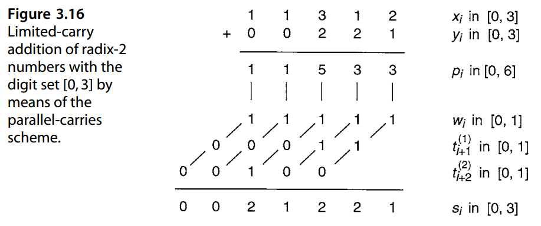

# 3. 冗余数系统 

Redundant Number Systems


> *“Numbers constitute the only universal language.”* 
>
>   — NATHANAE LWEST
>
> 
>
> “数字构成了唯一的通用语言。”
>
> — 纳撒尼尔·韦斯特


This chapter deals with the representation of signed fixed-point numbers using a positive integer radix  *r*  and a redundant digit set composed of more than  *r*  digit values. After showing that such representations eliminate carry propagation, we cover variations in digit sets, addition algorithms, input/output conversions, and arithmetic support functions. Chapter topics include:

本章讨论有符号定点数使用正整数基数r和由多于r个数字值组成的冗余数字集的表示法。在证明这种表示消除了进位传播之后，我们介绍了数字集、加法算法、输入/输出转换和算术支持函数的变化。章节主题包括：

**3.1** 处理进位问题 Coping with the Carry Problem

**3.2** 计算机算术中的冗余 Redundancy in Computer Arithmetic

**3.3** 数字集和数字集转换Digit Sets and Digit-Set Conversions

**3.4** 广义的有符号数字数 Generalized Signed-Digit Numbers

**3.5** 无进位加法算法 Carry-Free Addition Algorithms

**3.6** 转换和支持功能 Conversions and Support Functions


## 3.1 处理进位问题

Addition is a primary building block in implementing arithmetic operations. If addition is slow or expensive, all other operations suffer in speed or cost. Addition can be slow and/or expensive because:

**a.** With  *k*-digit operands, one has to allow for O( *k*) worst-case carry-propagation stages in simple ripple-carry adder design. 

**b.** The carry computation network is a major source of complexity and cost in the design of carry-lookahead and other fast adders. 

The carry problem can be dealt with in several ways:

**1.** Limit carry propagation to within a small number of bits. 

**2.** Detect the end of propagation rather than wait for worst-case time. 

**3.** Speed up propagation via lookahead and other methods. 

**4.** Ideal: Eliminate carry propagation altogether! 


加法是实现算术运算的主要构建块。如果加法速度慢或成本高，则所有其他操作的速度或成本都会受到影响。加法可能会很慢和/或昂贵是因为：

  **a.** 对于 k 位操作数，在简单的纹波进位加法器设计中必须考虑到 O(k) 个最坏情况的进位传播阶段。

  **b.** 进位计算网络是超前进位和其他快速加法器设计中复杂性和成本的主要来源。

进位问题可以通过多种方式处理：

1. 将进位传播限制在少量位内。

2. 检测传播的结束而不是等待最坏情况的时间。

3. 通过超前看和其他方法加速传播。

4. 理想：完全消除进位传播！

As examples of option 1, hybrid-redundant and residue number system representations are covered in Section 3.4 and Chapter 4, respectively. Asynchronous adder design (option 2) is considered in Section 5.4. Speedup methods for carry propagation are covered in Chapters 6 and 7. 

In the remainder of this chapter, we deal with option 4, focusing first on the question: Can numbers be represented in such a way that addition does not involve carry propagation? We will see shortly that this is indeed possible. The resulting number representations can be used as the primary encoding scheme in the design of high-performance systems and are also useful in representing intermediate results in machines that use conventional number representation. 

作为选项 1 的示例，第 3.4 节和第 4 章分别介绍了混合冗余和残数系统表示。第 5.4 节考虑了异步加法器设计（选项 2）。第 6 章和第 7 章介绍了进位传播的加速方法。

在本章的其余部分，我们将讨论选项 4，首先关注这个问题：数字是否可以用加法不涉及进位传播的方式表示？我们很快就会看到这确实是可能的。由此产生的数字表示可以用作高性能系统设计中的主要编码方案，并且也可用于表示使用传统数字表示的机器中的中间结果。

We begin with a decimal example  *(r* = 10 *)*, assuming the standard digit set [0, 9].  Consider the addition of the following two decimal numbers without carry propagation.  For this, we simply compute “position sums” and write them down in the corresponding columns. We can use the symbols  *A* = 10,  *B* = 11,  *C* = 12, etc., for the extended digit values or simply represent them with two standard digits. 

我们从一个十进制示例 (r = 10) 开始，假设标准数字集 [0, 9]。 考虑以下两个十进制数相加而不进行进位传播。为此，我们只需计算“位置总和”并将其写在相应的列中。我们可以使用符号 A = 10、B = 11、C = 12 等来表示扩展数字值，或者简单地用两个标准数字来表示它们。

```
   5  7  8  2  4  9
+  6  2  9  3  8  9     Operand digits in [0, 9]
----------------------------------------------------
  11  9 17  5 12 18     Position sums in [0, 18]
```

So, if we allow the digit set [0, 18], the scheme works, but only for the first addition! Subsequent additions will cause problems. 

因此，如果我们允许数字集 [0, 18]，则该方案有效，但仅适用于第一次加法！后续添加会出现问题。

Consider now adding two numbers in the radix-10 number system using the digit set [0, 18]. The sum of digits for each position is in [0, 36], which can be decomposed into an interim sum in [0, 16] and a transfer digit in [0, 2]. In other words

现在考虑使用数字集[0, 18]将基 10 数字系统中的两个数字相加。每个位置的数字和在[0, 36]中，可以分解为[0, 16]中的中间和和[0, 2]中的转移数字。换句话说

​     [0, 36] = 10 × [0, 2] + [0, 16]

Adding the interim sum and the incoming transfer digit yields a digit in [0, 18] and creates no new transfer. In interval notation, we have

将临时总和与传入的传输数字相加会产生 [0, 18] 中的数字，并且不会创建新的传输。在区间表示法中，我们有

​    [0, 16] + [0, 2] = [0, 18]

Figure 3.1 shows an example addition. 

图 3.1 显示了一个加法示例。


So, even though we cannot do true carry-free addition (Fig. 3.2a), the next best thing, where carry propagates by only one position (Fig. 3.2b), is possible if we use the digit set [0, 18] in radix 10. We refer to this best possible scheme as “carry-free” addition. The key to the ability to do carry-free addition is the representational redundancy that provides multiple encodings for some numbers. Figure 3.2c shows that the single-stage propagation of transfers can be eliminated by a simple lookahead scheme; that is, instead of first computing the transfer into position  *i*  based on the digits  *xi*−1 and  *yi*−1 and then combining it with the interim sum, we can determine  *si*  directly from  *xi*,  *yi*,  *xi*−1, and *yi*−1. This may make the adder logic somewhat more complex, but in general the result is higher speed. 

因此，即使我们不能进行真正的无进位加法（图 3.2a），如果我们在基数 10 中使用数字集 [0, 18]，则下一个最好的方案是可能的，其中进位仅传播一个位置（图 3.2b）。我们将这种最佳可能方案称为“无进位”加法。进行无进位加法的能力的关键是表示冗余，它为某些数字提供了多种编码。图3.2c显示单级传输的传播可以通过简单的前瞻方案来消除；也就是说，我们可以直接根据 $x_i、y_i、x_{i−1}$ 和 $y_{i−1}$ 确定 $s_i$，而不是首先根据数字 $x_{i−1}$ 和 $y_{i−1}$ 计算到位置 $i$ 的转移，然后将其与临时和相结合。这可能会使加法器逻辑更加复杂，但通常结果是速度更高。


In the decimal example of Fig. 3.1, the digit set [0, 18] was used to effect carry-free addition. The 9 “digit” values 10 through 18 are redundant. However, we really do not need this much redundancy in a decimal number system for carry-free addition; the digit set [0, 11] will do. Our example addition (after converting the numbers to the new digit set) is shown in Fig. 3.3. 

在图 3.1 的十进制示例中，数字集 [0, 18] 用于实现无进位加法。 10 到 18 的 9 个“数字”值是冗余的。在十进制数字系统中，我们确实不需要这么多冗余来进行无进位加法；数字集 [0, 11] 即可。我们的加法示例（将数字转换为新的数字集之后）如图 3.3 所示。


A natural question at this point is: How much redundancy in the digit set is needed to enable carry-free addition? For example, will the example addition of Fig. 3.3 work with the digit set [0, 10]? (Try it and see.) We will answer this question in Section 3.5. 

此时一个自然的问题是：数字集中需要多少冗余才能实现无进位加法？例如，图 3.3 中的加法示例是否适用于数字集 [0, 10]？ （尝试一下看看。）我们将在 3.5 节中回答这个问题。

## 3.2 计算机算术中的冗余

Redundancy is used extensively for speeding up arithmetic operations. The oldest example, first suggested in 1959 [Metz59], pertains to carry-save or stored-carry numbers using the radix-2 digit set [0, 2] for fast addition of a sequence of binary operands. Figure 3.4 provides an example, showing how the intermediate sum is kept in stored-carry format, allowing each subsequent addition to be performed in a carry-free manner. 

冗余被广泛用于加速算术运算。最古老的示例于 1959 年首次提出 [Metz59]，涉及使用基数 2 数字集 [0, 2] 进行二进制操作数序列的快速加法的进位保存或存储进位数。图 3.4 提供了一个示例，显示了中间和如何以存储进位格式保存，从而允许以无进位方式执行每个后续加法。


Why is this scheme called carry-save or stored-carry? Figure 3.5 provides an explanation. Let us use the 2-bit encoding

为什么这个方案被称为进位保存或存储进位？图 3.5 提供了一个解释。让我们使用2位编码

​      **0** :  (0, 0),  **1** : (0, 1) 或 (1, 0),  **2** :  (1, 1)

to represent the digit set [0, 2]. With this encoding, each stored-carry number is really composed of two binary numbers, one for each bit of the encoding. These two binary numbers can be added to an incoming binary number, producing two binary numbers composed of the sum bits kept in place and the carry bits shifted one position to the left. 

表示数字集 [0, 2]。通过这种编码，每个存储进位数实际上由两个二进制数组成，每个二进制数对应编码的每一位。这两个二进制数可以与传入的二进制数相加，产生两个二进制数，其中和位保持在原位，进位位向左移动一位。

These sum and carry bits form the partial sum and can be stored in two registers for the next addition. Thus, the carries are “saved” or “stored” instead of being allowed to propagate. 

这些和和进位位形成部分和，并且可以存储在两个寄存器中以供下一次加法使用。因此，进位被“保存”或“存储”，而不是被允许传播。


Figure 3.5 shows that one stored-carry number and one standard binary number can be added to form a stored-carry sum in a single full-adder delay (2–4 gate levels, depending on the full adder’s logic implementation of the outputs  *s* =  *x* ⊕  *y* ⊕  *c* in and *c* out =  *xy*∨ *xc* in ∨ *yc* in *)*. This is significantly faster than standard carry-propagate addition to accumulate the sum of several binary numbers, even if a fast carry-lookahead adder is used for the latter. Of course once the final sum has been obtained in stored-carry form, it may have to be converted to standard binary by using a carry-propagate adder to add the two components of the stored-carry number. The key point is that the carry-propagation delay occurs only once, at the very end, rather than in each addition step. 

图3.5显示了1个存储进位数和1个标准二进制数可以相加得到存储进位数，需要单个全加器延迟（2-4 个门级，取决于全加器的输出逻辑实现 s = x ⊕ y ⊕ c in 和 c out = xy∨ xc in ∨ yc in ）。这比累加几个二进制数之和的标准进位传播加法要快得多，即使后者使用快速进位超前加法器也是如此。当然，一旦以存储进位形式获得最终总和，可能必须使用进位传播加法器将存储进位数的两个分量相加，将其转换为标准二进制。关键点是进位传播延迟仅在最后发生一次，而不是在每个加法步骤中发生。

Since the carry-save addition scheme of Fig. 3.5 converts three binary numbers to two binary numbers with the same sum, it is sometimes referred to as a 3/2 reduction circuit or (3; 2) counter. The latter name reflects the essential function of a full adder: it counts the number of 1s among its three input bits and outputs the result as a 2-bit binary number. More on this in Chapter 8. 

由于图 3.5 的进位保存加法方案将三个二进制数转换为具有相同和的两个二进制数，因此有时将其称为 3/2 归约电路或 (3; 2) 计数器。后一个名称反映了全加器的基本功能：它计算三个输入位中 1 的数量，并将结果作为 2 位二进制数输出。更多内容请参见第 8 章。

Other examples of the use of redundant representations in computer arithmetic are found in fast multiplication and division schemes, where the multiplier or quotient is represented or produced in redundant form. More on these in Parts III and IV. 

在计算机算术中使用冗余表示的其他示例可以在快速乘法和除法方案中找到，其中乘数或商以冗余形式表示或产生。有关这些的更多信息，请参见第三部分和第四部分。


## 3.3 数字集和数字集转换

Conventional radix- *r* numbers use the standard digit set [0, *r* − 1]. However, many other redundant and nonredundant digit sets are possible. A necessary condition is that the digit set contain at least *r* different digit values. If it contains more than *r* values, the number system is redundant.

传统的基数 r 数字使用标准数字集 $[0, r − 1]$。然而，许多其他冗余和非冗余数字集也是可能的。必要条件是数字集合至少包含r个不同的数字值。如果它包含多于 r 值，则数字系统是冗余的。

Conversion of numbers between standard and other digit sets is quite simple and essentially entails a digit-serial process in which, beginning at the right end of the given number, each digit is rewritten as a valid digit in the new digit set and a transfer (carry or borrow) into the next higher digit position. This conversion process is essentially like carry propagation in that it must be done from right to left and, in the worst case, the most significant digit is affected by a “carry” coming from the least significant position. The following examples illustrate the process (see also the examples at the end of Section 2.6).

标准数字集和其他数字集之间的数字转换非常简单，本质上需要一个数字串行过程，其中从给定数字的右端开始，每个数字都被重写为新数字集中的有效数字，并转移（进位或借位）到下一个更高的数字位置。此转换过程本质上类似于进位传播，因为它必须从右到左完成，并且在最坏的情况下，最高有效数字会受到来自最低有效位置的“进位”的影响。以下示例说明了该过程（另请参见第 2.6 节末尾的示例）。


**EXAMPLE 3.1** Convert the following radix-10 number with the digit set [0, 18] to one using the conventional digit set [0, 9].

**示例3.1** 将以下数字集[0, 18] 的基10 数转换为使用传统数字集[0, 9] 的。

```
  11  9 17 10 12 18   Rewrite 18 as 10 (carry 1) +8
  11  9 17 10 13  8   13 = 10 (carry 1) + 3
  11  9 17 11  3  8   11 = 10 (carry 1) + 1
  11  9 18  1  3  8   18 = 10 (carry 1) + 8
  11 10  8  1  3  8   10 = 10 (carry 1) + 0
  12  0  8  1  3  8   12 = 10 (carry 1) + 2
1  2  0  8  1  3  8   Answer: all digits in [0, 9]
```


**EXAMPLE 3.2** Convert the following radix-2 carry-save number to binary; that is, from digit set [0, 2] to digit set [0, 1].

**示例3.2** 将以下基2 进位保存数转换为二进制；即从数字集[0, 2]到数字集[0, 1]。

```
  1 1 2 0 2 0   Rewrite 2 as 2 (carry 1) + 0
  1 1 2 1 0 0   2 = 2 (carry 1) + 0
  1 2 0 1 0 0   2 = 2 (carry 1) + 0
  2 0 0 1 0 0   2 = 2 (carry 1) + 0
1 0 0 0 1 0 0   Answer: all digits in [0, 1]
```

Another way to accomplish the preceding conversion is to decompose the carry-save number into two numbers, both of which have 1s where the original number has a digit of 2. The sum of these two numbers is then the desired binary number.

完成上述转换的另一种方法是将进位保存数分解为两个数，这两个数都是 1，而原始数的位数为 2。这两个数的和就是所需的二进制数。

```
  1 1 1 0 1 0 First number: “sum” bits
+ 0 0 1 0 1 0 Second number: “carry” bits
--------------------------------------------
1 0 0 0 1 0 0 Sum of the two numbers
```


**EXAMPLE 3.3** Digit values do not have to be positive. We reconsider Example 3.1 using the asymmetric target digit set [−6, 5].

**示例3.3** 数字值不必是正数。我们使用不对称目标数字集 [−6, 5] 重新考虑示例 3.1。

```
   11   9  17  10  12  18    Rewrite 18 as 20 (carry 2) − 2
   11   9  17  10  14  −2    14 = 10 (carry 1) + 4
   11   9  17  11   4  −2    11 = 10 (carry 1) + 1
   11   9  18   1   4  −2    18 = 20 (carry 2) − 2
   11  11  −2   1   4  −2    11 = 10 (carry 1) + 1
   12   1  −2   1   4  −2    12 = 10 (carry 1) + 2
1   2   1  −2   1   4  −2    Answer: all digits in [−6, 5]
```

On line 2 of this conversion, we could have rewritten 14 as 20 (carry 2) − 6, which would have led to a different, but equivalent, representation. In general, several representations may be possible with a redundant digit set.

在这个转换的第 2 行，我们可以将 14 重写为 20 (carry 2) − 6，这将导致不同但等效的表示。一般来说，冗余数字集可能有多种表示形式。


**EXAMPLE 3.4** If we change the target digit set of Example 3.2 from [0, 1] to [−1, 1], we can do the conversion digit-serially as before. However, carry-free conversion is possible for this example if we rewrite each 2 as 2 (carry 1) + 0 and each 1 as 2 (carry 1) −1.

**例3.4** 如果我们将例3.2 的目标数字集从[0, 1] 更改为[−1, 1]，我们可以像以前一样进行数字串行转换。然而，如果我们将每个 2 重写为 2 (进位 1) + 0，并将每个 1 重写为 2 (进位 1) -1，则在本示例中，无进位转换是可能的。

The resulting interim digits in [−1, 0] can absorb an incoming carry of 1 with no further propagation.

[−1, 0] 中产生的中间数字可以吸收传入的 1 进位，而不会进一步传播。

```
   1  1  2  0  2  0  Given carry-save number
  −1 −1  0  0  0  0  Interim digits in [−1, 0]
   1  1  1  0  1  0  Transfer digits in [0, 1]
1  0  0  0  1  0  0  Answer: all digits in [−1, 1]
```


## 3.4 广义有符号数字数

We have seen thus far that the digit set of a radix- *r*  positional number system need not be the standard set [0,  *r*−1]. Using the digit set [−1, 1] for radix-2 numbers was proposed by E. Collignon as early as 1897 [Glas81]. Whether this was just a mathematical curiosity, or motivated by an application or advantage, is not known. In the early 1960s, Avizienis [Aviz61] defined the class of signed-digit number systems with symmetric digit sets [− *α*,  *α*] and radix  *r >*  2, where  *α*  is any integer in the range  *r/* 2 + 1 ≤  *α* ≤  *r* − 1.  These number systems allow at least 2 *r/* 2 + 3 digit values, instead of the minimum required  *r*  values, and are thus redundant. 

到目前为止我们已经看到，基数 r 位置数系统的数字集不一定是标准集 $[0, r−1]$。 E. Collignon 早在 1897 年就提出使用数字集 $[−1, 1]$ 表示基 2 数 [Glas81]。这是否只是一种数学好奇心，还是出于应用或优势的动机，尚不清楚。 20 世纪 60 年代初，Avizienis [Aviz61] 定义了具有对称数字集的有符号数的数字系统类 $[− α, α]$ 且基数 $r > 2$，其中 $α$ 是 $\left \lfloor r/2 \right \rfloor + 1 ≤ α ≤ r − 1$ 范围内的任意整数。这些数字系统允许至少 $2 \left \lfloor r/2 \right \rfloor + 3$ 位数字值，而不是所需的最小 r 值，因此是冗余的。

Subsequently, redundant number systems with general, possibly asymmetric, digit sets of the form [− *α*,  *β*] were studied as tools for unifying all redundant number representations used in practice. This class is called “**generalized signed-digit (GSD)** representation” and differs from the **ordinary signed-digit (OSD)** representation of Avizienis in its more general digit set as well as the possibility of higher or lower redundancy. 

随后又有研究具有一般的、可能不对称的、形式为 $[− α, β]$ 的数字集的冗余数系统，作为工具来统一实践中使用的所有冗余数表示。此类称为“广义符号数字 (GSD) 表示”，与 Avizienis 的普通符号数字 (OSD) 表示不同，其更通用的数字集以及更高或更低冗余的可能性。

Binary stored-carry numbers, with  *r* = 2 and digit set [0, 2], offer a good example for the usefulness of asymmetric digit sets. Higher redundancy is exemplified by the digit set [−7, 7] in radix 4 or [0, 3] in radix 2. An example for lower redundancy is the **binary signed-digit (BSD)** representation with  *r* = 2 and digit set [−1, 1]. None of these is covered by OSD. 

二进制存储进位数，其中 r = 2 和数字集 [0, 2]，为非对称数字集的有用性提供了一个很好的例子。较高冗余的示例是基数 4 中的数字集 [−7, 7] 或基数 2 中的 [0, 3]。较低冗余的示例是二进制有符号数字 (BSD) 表示，其中 r = 2 和数字集 [−1, 1]。 OSD 不涵盖这些内容。

An important parameter of a GSD number system is its  ***redundancy index***, defined as *ρ* =  *α* +  *β* + 1 −  *r* (i.e., the amount by which the size of its digit set exceeds the size  *r*  of a nonredundant digit set for radix  *r*). Figure 3.6 presents a taxonomy of redundant and nonredundant positional number systems showing the names of some useful subclasses and their various relationships. Note that the redundancy index  *ρ*  is quite general and can be applied to any digit set. Another way of quantifying the redundancy of a number system with the symmetric digit set [− *α*,  *α*] in radix  *r*  is to use the ratio  *h* =  *α/(r* − 1 *)*. This formulation of redundancy, which is inapplicable to the general digit set [− *α*,  *β*], has been used in connection with high-radix division algorithms, to be discussed in Chapter 14. Besides its general inapplicability, the index  *h*  suffers from the problem that it varies from 1 (for no redundancy), through 1 (for  *α* =  *r* − 1), to values larger than 1 for highly redundant number representation systems. Encountering redundancy indices below 1 is unusual and could be misleading.

GSD 数字系统的一个重要参数是其**冗余指数**，定义为 $ρ = α + β + 1 − r$（即，其数字集的大小超过基数 r 的非冗余数字集的大小 r 的量）。图 3.6 展示了冗余和非冗余位置数字系统的分类，显示了一些有用子类的名称及其各种关系。请注意，冗余指数 ρ 非常通用，可以应用于任何数字集。度量具有基数 r 中的对称数字集 $[− α, α]$ 的数字系统的冗余度的另一种方法是使用比率 $h = α/(r − 1 )$。这种冗余公式不适用于一般数字集 $[− α, β]$，已与高基数除法算法结合使用，将在第 14 章中讨论。除了其一般不适用性之外，索引 h 还存在以下问题：它从 $\frac{1}{2}$（对于无冗余）到 1（对于 α = r − 1）到大于 1 的值用于高度冗余的数字表示系统。遇到低于 1 的冗余指数是不寻常的，并且可能会产生误导。


Any hardware implementation of GSD arithmetic requires the choice of a binary encoding scheme for the  *α* +  *β* + 1 digit values in the digit set [− *α*,  *β*]. Multivalued logic realizations have been considered, but we limit our discussion here to binary logic and proceed to show the importance and implications of the encoding scheme chosen through some examples. 

任何 GSD 算术的硬件实现都需要选择二进制的编码方案对数字集 $[− α, β]$ 中 $α + β + 1$ 个数字值编码。已经考虑了多值逻辑实现，但我们将这里的讨论限制为二进制逻辑，并继续通过一些示例来展示所选择的编码方案的重要性和含义。

Consider, for example, the BSD number system with  *r* = 2 and the digit set [−1, 1]. One needs at least 2 bits to encode these three digit values. Figure 3.7 shows four of the many possible encodings that can be used. 

例如，考虑 BSD 数字系统，其中 r = 2 和数字集 [−1, 1]。至少需要 2 位来对这三位数字值进行编码。图 3.7 显示了可以使用的多种可能编码中的四种。


With the ( *n*,  *p*) encoding, the code (1, 1) may be considered an alternate representation of 0 or else viewed as an invalid combination. Many implementations have shown that the ( *n*,  *p*) encoding tends to simplify the hardware and also increases the speed by reducing the number of gate levels [Parh88]. The 1-out-of-3 encoding requires more bits per number but allows the detection of some storage and processing errors. 

对于 (n, p) 编码，代码 (1, 1) 可以被视为 0 的替代表示，或者被视为无效组合。许多实施表明( n, p) 编码倾向于简化硬件，并通过减少门级数量来提高速度 [Parh88]。 3 取 1 编码每个数字需要更多位，但允许检测一些存储和处理错误。

The  *(n*,  *p)*  and 2’s-complement encodings of Fig. 3.7 are examples of encodings in which two-valued signals having various weights collectively represent desired values. Figure 3.8a depicts three new symbols, besides **posibits** and **negabits** previously introduced in Figs. 1.4 and 2.13. A  ***doublebit***  represents one of the two values in the set {0, 2}. A  ***negadoublebit***  is a negatively weighted doublebit. Finally, a  ***unibit***  assumes one of the two values in {−1, 1}. A posibit and a negabit together represent one of the values in the set {−1, 0, 1}, yielding the  *(n*,  *p)*  encoding of a BSD. A negadoublebit and a posibit form a 2-bit 2’s-complement number capable of representing a value in [−2, 1] and thus a BSD. These two encodings for a 5-digit BSD number are shown in Fig. 3.8b. The third representation in Fig. 3.8b is derived from the second one by shifting the negadoublebits to the left by one position and changing them into negabits. Each BSD digit now spans two digit positions in its encoding. These weighted bit-set encodings have been found quite useful for the efficient representation and processing of redundant numbers [Jabe05]. 

图 3.7 的 (n, p) 和 2 补码编码是具有各种权重的二值信号共同表示期望值的编码示例。除了之前在图 1.4 和 2.13 中介绍的**正位**和**负位**之外，图 3.8a 还描述了三个新符号。 **双位**表示集合 {0, 2} 中的两个值之一。**负双位**是负加权双位。最后，一个单比特采用 {−1, 1} 中的两个值之一。正位和负位一起表示集合 {−1, 0, 1} 中的值之一，产生 BSD 的 (n, p) 编码。 negadoublebit 和 posibit 形成一个 2 位 2 的补码数，能够表示 [−2, 1] 中的值，从而表示 BSD。5 位 BSD 号码的这两种编码如图 3.8b 所示。图 3.8b 中的第三种表示法是从第二种表示法中导出的，方法是将负双位向左移动一位并将其更改为负位。每个 BSD 数字现在在其编码中跨越两个数字位置。人们发现这些加权位集编码对于冗余数的有效表示和处理非常有用[Jabe05]。


Hybrid signed-digit representations [Phat94] came about from an attempt to strike a balance between algorithmic speed and implementation cost by introducing redundancy in selected positions only. For example, standard binary representation may be used with BSD digits allowed in every third position, as shown in the addition example of Fig. 3.9. 

混合符号数字表示法 [Phat94] 的产生是为了通过仅在选定位置引入冗余来在算法速度和实现成本之间取得平衡。例如，标准二进制表示可以与每第三个位置允许的 BSD 数字一起使用，如图 3.9 的加法示例所示。


The addition algorithm depicted in Fig. 3.9 proceeds as follows. First one completes the position sums  *pi*  that are in [0, 2] for standard binary and [−2, 2] in BSD positions. The BSD position sums are then broken into an interim sum  *wi*  and transfer  *ti*+1, both in [−1, 1]. For the interim sum digit, the value 1 (−1) is chosen only if it is certain that the incoming transfer cannot be 1 (−1); that is, when the two binary operand digits in position  *i* − 1 are (not) both 0s. The worst-case carry propagation spans a single group, beginning with a BSD that produces a transfer digit in [−1, 1] and ending with the next higher BSD position. 

图 3.9 中描述的加法算法进行如下。第一个完成标准二进制的 [0, 2] 和 BSD 位置的 [−2, 2] 中的位置总和 $p_i$。然后，BSD 位置和被分解为临时和 $w_i$ 并传输 $t_{i+1}$，两者都在 [−1, 1] 中。对于临时和数位，仅当确定传入不能为 1 (−1) 时才选择值 1 (−1)；也就是说，当位置 $i − 1$ 中的两个二进制操作数数字（不是）都是 0 时。最坏情况的进位传播跨越单个组，从在 [−1, 1] 中产生传输数字的 BSD 开始，并以下一个更高的 BSD 位置结束。

More generally, the group size can be  *g*  rather than 3. A larger group size reduces the hardware complexity (since the adder block in a BSD position is more complex than that in other positions) but adds to the carry-propagation delay in the worst case; hence, the hybrid scheme offers a trade-off between speed and cost. 

更一般地，组大小可以是 g 而不是 3。较大的组大小会降低硬件复杂性（因为 BSD 位置的加法器块比其他位置的加法器块更复杂），但在最坏的情况下会增加进位传播延迟；因此，混合方案提供了速度和成本之间的权衡。

Hybrid signed-digit representation with uniform spacing of BSD positions can be viewed as a special case of GSD systems. For the example of Fig. 3.9, arranging the numbers in 3-digit groups starting from the right end leads to a radix-8 GSD system with digit set [−4, 7]: that is, digit values from  *(*−1 0 0 *)* two to  *(* 1 1 1 *)* two. So the hybrid scheme of Fig. 3.9 can be viewed as an implementation of (digit encoding for) this particular radix-8 GSD representation. 

具有均匀 BSD 位置间距的混合符号数字表示可以被视为 GSD 系统的特例。对于图 3.9 的示例，从右端开始将数字排列为 3 位组，得到一个数字集为 [−4, 7] 的基 8 GSD 系统：即从 (−1 0 0 ) 2 到 ( 1 1 1 ) 2 的数字值。因此，图 3.9 的混合方案可以被视为此特定基 8 GSD 表示（的数字编码）的实现。

The hybrid-redundant representation of Fig. 3.9, constituting an encoding for the radix-8 digit set [−4, 7], is depicted in Fig. 3.10 using extended dot notation. The asymmetry of the digit set, and thus of the number representation range, is an unfortunate feature of such representations that allow only posibits in nonredundant positions. By removing the latter restriction, we can obtain more desirable symmetric hybrid-redundant representations, exemplified by the second encoding of Fig. 3.10, which constitutes an encoding for the radix-8 digit set [−4, 4]. Arithmetic on all such extended hybrid-redundant representations can be performed with equal ease [Jabe06]. 

图 3.9 的混合冗余表示构成了基数 8 数字集 [−4, 7] 的编码，在图 3.10 中使用扩展点表示法进行了描述。数字集的不对称性以及数字表示范围的不对称性是此类仅允许非冗余位置中的 pos 位的表示法的一个不幸特征。通过消除后一个限制，我们可以获得更理想的对称混合冗余表示，如图3.10的第二个编码所示，它构成了基8数字集[−4, 4]的编码。所有此类扩展混合冗余表示的算术都可以同样轻松地执行[Jabe06]。


## 3.5 无进位加法算法

The GSD carry-free addition algorithm, corresponding to the scheme of Fig. 3.2b, is as follows:

GSD无进位加法算法，对应图3.2b的方案如下：


<center><strong>Carry-free addition algorithm for GSD numbers</strong></center>

- Compute the position sums *pi* = *xi* + *yi*.

- Divide each *pi* into a transfer *ti*+1 and an interim sum *wi* = *pi* − *rti*+1.

- Add the incoming transfers to obtain the sum digits *si* = *wi* + *ti*.


<center><strong>GSD 数字的无进位加法算法</strong></center>

- 计算位置总和 $p_i = x_i + y_i$。

- 将每个 $p_i$ 分为进位 $t_{i+1}$ 与中间总和 $w_i = p_i − rt_{i+1}$。

- 将传入传输相加以获得数字总和 $s_i = w_i + t_i$。


Let us assume that the transfer digits *ti* are from the digit set [− *λ*, *µ*]. To ensure that the last step leads to no new transfer, the following condition must be satisfied:

让我们假设传输数字 $t_i$ 来自数字集 $[− λ, µ]$。为了确保最后一步不会导致新的转移，必须满足以下条件：
$$
\begin{array}{c}
-\alpha+\lambda & \le p_i-rt_{i+1} \le & \beta-\mu \\
| & \text{ 中间和 } & | \\
\text{如果传入的−λ是可吸收的，最小的中间和} & \text{} & \text{如果传入的µ是可吸收的，最大的中间和}
\end{array}
$$
From the preceding inequalities, we can easily derive the conditions  *λ* ≥  *α/(r* − 1 *)* and  *µ* ≥  *β/(r* − 1 *)*. Once  *λ*  and  *µ*  are known, we choose the transfer digit value by comparing the position sum  *pi*  against  *λ* +  *µ* + 2 constants  *Cj*, − *λ* ≤  *j* ≤  *µ* + 1, with the transfer digit taken to be  *j*  if and only if  *Cj* ≤  *pi < Cj*+1. Formulas giving possible values for these constants can be found in [Parh90]. Here, we describe a simple intuitive method for deriving these constants. 

从前面的不等式，我们可以很容易地推导出条件 $λ ≥ α/(r − 1 )$ 和 $µ ≥ β/(r − 1 )$。一旦已知 λ 和 µ，我们通过将位置总和 $p_i$ 与 $λ + µ + 2$ 常数 $C_j$ 进行比较来选择传输数字值，$− λ ≤ j ≤ µ + 1$，当且仅当 $C_j ≤ p_i < C_{j+1}$ 时，传输数字取为 j。给出这些常量可能值的公式可以在 [Parh90] 中找到。在这里，我们描述了一种简单直观的方法来导出这些常数。

**EXAMPLE 3.5** For  *r* = 10 and digit set [−5, 9], we need  *λ* ≥ 5 */* 9 and  *µ* ≥ 1. Given minimal values for  *λ*  and  *µ*  that minimize the hardware complexity, we find by choosing the minimal values for  *λ*  and  *µ*

**例 3.5** 对于 r = 10 和数字集 [−5, 9]，我们需要 $λ ≥ 5 / 9$ 且 $µ ≥ 1$。给定 λ 和 µ 的最小值以最小化硬件复杂性，我们通过选择 λ 和 µ 的最小值来找到


$$
\begin{array}{c}
\lambda_{min}=\mu_{min}=1 \text{ 就是说传输的数字是在[-1, 1]中} \\
-\infty=C_{-1} \text{, } -4\le C_0 \le -1\text{, }  6 \le C_1 \le 9\text{, }  C_2=+\infty
\end{array}
$$


We next show how the allowable values for the comparison constant *C* 1, shown above, are derived. The position sum *pi* is in [−10, 18]. We can set *ti*+1 to 1 for *pi* values as low as 6; for *pi* = 6, the resulting interim sum of −4 can absorb any incoming transfer in [−1, 1] without falling outside [−5, 9]. On the other hand, we must transfer 1 for *pi* values of 9 or more. Thus, for *pi* ≥ *C* 1, where 6 ≤ *C* 1 ≤ 9, we choose an outgoing transfer of 1. Similarly, for *pi < C* 0, we choose an outgoing transfer of −1, where −4 ≤ *C* 0 ≤ −1. In all other cases, the outgoing transfer is 0.

接下来我们将展示如何导出上面所示的比较常数 $C_1$ 的允许值。位置和 $p_i$ 在 [−10, 18] 中。对于低至 6 的 $p_i$ 值，我们可以将 $t_{i+1}$ 设置为 1；对于 $p_i = 6$，所得的临时和 $-4$ 可以吸收 [−1, 1] 中的任何传入传输，而不会落在 [−5, 9] 之外。另一方面，当 $p_i$ 值为 9 或更大时，我们必须传输 1。因此，对于 $p_i ≥ C_1$，其中 $6 ≤ C_1 ≤ 9$，我们选择传出传输为 1。类似地，对于 $p_i < C_0$，我们选择 $-1$ 的传出传输，其中 $-4 ≤ C_0 ≤ -1$。在所有其他情况下，传出传输均为 0。

Assuming that the position sum *pi* is represented as a 6-bit, 2’s-complement number *abcdef* , good choices for the comparison constants in the above ranges are *C* 0 = −4 and *C* 1 = 8. The logic expressions for the signals *g* 1 and *g*−1 then become *g*−1 = *a(*¯ *c* ∨ ¯ *d)*

假设位置和 $p_i$ 表示为 6 位、2 的补数 $abcdef$ ，则上述范围内的比较常数的较好选择是 $C_0 = −4$ 和 $C_1 = 8$。信号 $g_1$ 和 $g_{−1}$ 的逻辑表达式变为 

$g_{−1} = a(\overline c \vee \overline d)$   生成−1 的传输

$g_1 = \overline a (b \vee c)$  生成1的转账

An example addition is shown in Fig. 3.11.

图 3.11 显示了另外一个示例。


It is proven in [Parh90] that the preceding carry-free addition algorithm is applicable to a redundant representation if and only if one of the following sets of conditions is satisfied:

[Parh90]中证明，当且仅当满足以下一组条件之一时，前述无进位加法算法才适用于冗余表示：

**a**. $r \gt 2，ρ \ge 3$

**b**. $r \gt 2，ρ = 2，α \ne 1，β \ne 1$

In other words, the carry-free algorithm is not applicable for  *r* = 2,  *ρ* = 1, or  *ρ* = 2 with  *α* = 1 or  *β* = 1. In such cases, a limited-carry addition algorithm is available: 

换句话说，无进位算法不适用于 $r = 2、ρ = 1$ 或 $ρ = 2$其中 α = 1 或 β = 1。在这种情况下，可以使用有限进位加法算法：

> ***Limited-carry addition algorithm for GSD numbers*** 
>
> Compute the position sums  *pi* =  *xi* +  *yi*. 
>
> Compare each  *pi*  to a constant to determine whether  *ei*+1 = “low” or “high” ( *ei*+1 is a binary range estimate for  *ti*+1). 
>
> Given  *ei*, divide each  *pi*  into a transfer  *ti*+1 and an interim sum  *wi* =  *pi* −  *rti*+1. 
>
> Add the incoming transfers to obtain the sum digits  *si* =  *wi* +  *ti*. 

<center><strong>GSD 数字的有限进位加法算法</strong></center>

- 计算位置总和 $p_i = x_i + y_i$。

- 将每个 $p_i$ 与常数进行比较，以确定 $e_{i+1}$ =“低”还是“高”（$e_{i+1}$ 是 $t_{i+1}$ 的二进制范围估计值）。

- 给定 $e_i$，将每个 $p_i$ 分为传输 $t_{i+1}$ 和临时和 $w_i = p_i − rt_{i+1}$。

- 将传入传输相加以获得数字总和 $s_i = w_i + t_i$。


This “limited-carry” GSD addition algorithm is depicted in Fig. 3.12a; in an alternative implementation (Fig. 3.12b), the “transfer estimate” stage is replaced by another transfer generation/addition phase. 

这种“有限进位”GSD 添加算法如图 3.12a 所示；在替代实现中（图3.12b），“传输估计”阶段被另一个传输生成/添加阶段取代。


Even though Figs. 3.12a and 3.12b appear similar, they are quite different in terms of the internal designs of the square boxes in the top and middle rows. In both cases, however, the sum digit  *si*  depends on  *xi*,  *yi*,  *xi*−1,  *yi*−1,  *xi*−2, and  *yi*−2. Rather than wait for the limited transfer propagation from stage  *i* − 2 to  *i*, one can try to provide the necessary information directly from stage *i* − 2 to stage *i*. This leads to an implementation with parallel carries$t_{i+1}^{(1)}$ and $t_{i+1}^{(2)}$ from stage *i*, which is sometimes applicable (Fig. 3.12c).

尽管 3.12a和3.12b看起来很相似，但在顶排和中间排的方框的内部设计方面它们有很大不同。然而，在这两种情况下，总和数字 $s_i$ 取决于 $x_i、y_i、x_{i−1}、y_{i−1}、x_{i−2}$ 和 $y_{i−2}$。与其等待从第 i − 2 阶段到第 i 阶段的有限传输传播，不如尝试提供必要的信息直接从阶段 $i − 2$ 传递到阶段 $i$。这导出一个实现是并行承载来自阶段 $i$ 的两个进位$t_{i+1}^{(1)}$和 $t_{i+2}^{(2)}$，这有时是适用的（图 3.12c）。


**EXAMPLE 3.6** Figure 3.13 depicts the use of carry estimates in limited-carry addition of radix-2 numbers with the digit set [−1, 1]. Here we have  *ρ* = 1,  *λ* min = 1, and  *µ* min = 1. The “low” and “high” subranges for transfer digits are [−1, 0] and [0, 1], respectively, with a transfer  *ti*+1 in “high” indicated if  *pi* ≥ 0. 

**示例3.6** 图3.13 描述了数字集[−1, 1] 的基2 数的有限进位加法中进位估计的使用。这里我们有 $ρ = 1，λ_{min} = 1，μ_{min} = 1$。传输数字的“低”和“高”子范围分别为 [−1, 0] 和 [0, 1]，如果 $p_i ≥ 0$，则表示“高”中的传输 $t_{i+1}$。


图 3.13 通过进位估计对数字集 [−1, 1] 的基 2 数进行有限进位加法。当传入传输位于 [0, 1] 时，位置和 -1 保持不变，而如果传入传输位于 [−1, 0]，则将其重写为 1，进位为 -1。该方案保证 $t_i = w_i$，因此 $-1 ≤ s_i ≤ 1$。


**EXAMPLE 3.7** Figure 3.14 shows another example of limited-carry addition with  *r* = 2, digit set [0, 3],  *ρ* = 2,  *λ* min = 0, and  *µ* min = 3, using carry estimates. The “low” and “high” subranges for transfer digits are [0, 2] and [1, 3], respectively, with a transfer  *ti*+1 in “high” indicated if  *pi* ≥ 4. 

**示例3.7** 图3.14 显示了使用进位估计的限制进位加法的另一个示例，其中$r = 2$、数字集[0, 3]、$ρ = 2、λ_{min} = 0 和μ_{min} = 3$。 传输数字的“高”和“低”子范围分别为 [0, 2] 和 [1, 3]，其中传输 $t_{i+1}$ 如果 $p_i ≥ 4$，则表示“高”。


图 3.14 通过进位估计对数字集 [0, 3] 的基 2 数进行有限进位加法。当传入传输位于 [0, 2] 时，位置和 1 保持不变，而如果传入传输位于 [1, 3]，则将其重写为 -1，进位为 1。


**EXAMPLE 3.8** Figure 3.15 shows the same addition as in Example 3.7 ( *r* = 2, digit set [0, 3],  *ρ* = 2,  *λ* min = 0,  *µ* min = 3) using the repeated-carry scheme of Fig. 3.12b. 

**例 3.8** 图 3.15 显示了与例 3.7 相同的加法（ $r = 2$，数字集 [0, 3], $ρ = 2, λ_{min} = 0, µ_{min} = 3$) 使用图 3.12b 的重复进位方案。


**EXAMPLE 3.9** Figure 3.16 shows the same addition as in Example 3.7 ( *r* = 2, digit set [0, 3],  *ρ* = 2,  *λ* min = 0,  *µ* min = 3) using the parallel-carries scheme of Fig. 3.12c. 

**例 3.9** 图 3.16 显示了与例 3.7 相同的加法（ $r = 2$，数字集 [0, 3], $ρ = 2, λ_{min} = 0, µ_{min} = 3$) 使用图 3.12c 的并行进位方案。




Subtraction of GSD numbers is very similar to addition. With a symmetric digit set, one can simply invert the signs of all digits in the subtractor  *y*  to obtain a representation of − *y* and then perform the addition *x*+ *(*− *y)* using a carry-free or limited-carry algorithm as already discussed. Negation of a GSD number with an asymmetric digit set is somewhat more complicated, but can still be performed by means of a carry-free algorithm [Parh93].

GSD 数字的减法与加法非常相似。对于对称数字集，可以简单地反转减法器 $y$ 中所有数字的符号以获得$−y$的表示，然后使用已经讨论过的无进位或有限进位算法执行加法 $x+ (− y)$。具有非对称数字集的 GSD 数的求反稍微复杂一些，但仍然可以通过无进位算法 [Parh93] 来执行。

This algorithm basically converts a radix- *r* number from the digit set [− *β*, *α*], which results from changing the signs of the individual digits of *y*, to the original digit set [− *α*, *β*]. Alternatively, a direct subtraction algorithm can be applied by first computing position differences in [− *α* − *β*, *α* + *β*], then forming interim differences and transfer digits. Details are omitted here.

基本上该算法是将基数 r 的数从数字集 $[− β, α]$ 转换为原始数字集$[− α, β]$，该数字集是通过更改 y 的各个数字的符号而产生的。或者也可以通过首先计算 [− α − β, α + β] 中的位置差，然后形成临时差并传输数字来应用直接减法算法。此处省略详细内容。


## 3.6 转换和支持功能

Since input numbers provided from the outside (machine or human interface) are in standard binary or decimal and outputs must be presented in the same way, conversions between binary or decimal and GSD representations are required.

由于从外部（机器或人机界面）提供的输入数字是标准二进制或十进制，并且输出必须以相同的方式呈现，因此需要二进制或十进制与 GSD 表示之间的转换。


**EXAMPLE 3.10** Consider number conversions from or to standard binary to or from BSD representation. To convert from signed binary to BSD, we simply attach the common number sign to each digit, if the ( *s*, *v*) code of Fig. 3.7 is to be used for the BSD digits. Otherwise, we need a simple digitwise converter from the ( *s*, *v*) code to the desired code. To convert from BSD to signed binary, we separate the positive and negative digits into a positive and a negative binary number, respectively. A subtraction then yields the desired result. Here is an example:

**示例3.10** 考虑标准二进制与BSD表示之间的数字转换。

为了从有符号二进制转换为 BSD，如果图 3.7 的 (s, v) 代码用于 BSD 数字，我们只需将公共数字符号附加到每个数字上。否则，我们需要一个简单的数字转换器，将 ( s, v) 代码转换为所需的编码。

为了从 BSD 转换为有符号二进制，我们将正数和负数分别分成正二进制数和负二进制数。然后进行减法即可得到所需的结果。这是一个例子：

```
1 −1  0 −1  0  +6 的 BSD 表示 BSD representation of +6 
1  0  0  0  0  正数部分（+1处的位）Positive part (1 digits)
0  1  0  1  0  负数部分（−1处的位）Negative part (−1 digits)
0  0  1  1  0  差值=转换结果 Difference = conversion result
```

The positive and negative parts required above are particularly easy to obtain if the BSD number is represented using the ( *n*, *p*) code of Fig. 3.7. The reader should be able to modify the process above for dealing with numbers, or deriving results, in 2’s-complement format.

如果 BSD 数字使用图 3.7 的 (n, p) 代码表示的话，上述所需的正负部分特别容易获得。读者应该能够修改上述过程，以 2 的补码格式处理数字或导出结果。


The conversion from redundant to nonredundant representation essentially involves carry propagation and is thus rather slow. It is expected, however, that we will not need conversions very often. Conversion is done at the input and output. Thus, if long sequences of computation are performed between input and output, the conversion overhead can become negligible. 

从冗余表示到非冗余表示的转换本质上涉及进位传播，因此相当慢。然而，预计我们不会经常需要转换。转换在输入和输出处完成。因此，如果在输入和输出之间执行长序列的计算，则转换开销可以忽略不计。


Storage overhead (the larger number of bits that may be needed to represent a GSD digit compared to a standard digit in the same radix) used to be a major disadvantage of redundant representations. However, with advances in VLSI (very large-scale integration) technology, this is no longer a major drawback; though the increase in the number of pins for input and output may still be a factor.

存储开销（GSD表示与相同基数中的标准数字表示相比，可能需要的较大位数的数字）曾经是冗余表示的主要缺点。然而，随着VLSI（超大规模集成）技术的进步，这不再是一个主要缺点；尽管输入和输出引脚数量的增加可能仍然是一个因素。


In the rest of this section, we review some properties of GSD representations that are important for the implementation of arithmetic support functions: zero detection, sign test, and overflow handling [Parh93]. 

在本节的其余部分中，我们将回顾 GSD 表示的一些对于算术支持函数的实现很重要的属性：零检测、符号测试和溢出处理 [Parh93]。

In a GSD number system, the integer 0 may have multiple representations. For example, the three-digit numbers 0 0 0 and −1 4 0 both represent 0 in radix 4. However, in the special case of  *α < r*  and  *β < r*, zero is uniquely represented by the all-0s vector. So despite redundancy and multiple representations, comparison of numbers for equality can be simple in this common special case, since it involves subtraction and detecting the all-0s pattern. 

在GSD数字系统中，整数0可以有多种表示形式。例如，三位数 0 0 0 和 −1 4 0 都表示基数 4 中的 0。但是，在 α < r 和 β < r 的特殊情况下，零由全 0 向量唯一表示。因此，尽管存在冗余和多重表示，但在这种常见的特殊情况下，数字比较是否相等可以很简单，因为它涉及减法和检测全 0 模式。

Sign test, and thus any relational comparison ( *<* , ≤, etc.), is more difficult. The sign of a GSD number in general depends on all its digits. Thus sign test is slow if done through signal propagation (ripple design) or expensive if done by a fast lookahead circuit (contrast this with the trivial sign test for signed-magnitude and 2’s-complement representations). In the special case of  *α < r*  and  *β < r*, the sign of a number is identical to the sign of its most significant nonzero digit. Even in this special case, determination of sign requires scanning of all digits, a process that can be as slow as worst-case carry propagation. 

符号测试以及任何关系比较（<、≤等）都更加困难。 GSD 编号的符号通常取决于其所有数字。因此，如果通过信号传播（ripple纹波设计）进行符号测试，则速度很慢；如果通过快速先行电路进行，则符号测试成本较高（与符号幅度和 2 补码表示的简单符号测试相比）。在 α < r 和 β < r 的特殊情况下，数字的符号与其最高有效非零数字的符号相同。即使在这种特殊情况下，确定符号也需要扫描所有数字，这个过程可能与最坏情况的进位传播一样慢。

Overflow handling is also more difficult in GSD arithmetic. Consider the addition of two  *k*-digit numbers. Such an addition produces a transfer-out digit  *tk* . Since  *tk*  is produced using the worst-case assumption about the as yet unknown  *tk*−1, we can get an overflow indication ( *tk* = 0) even when the result can be represented with  *k*  digits.  It is possible to perform a test to see whether the overflow is real and, if it is not, to obtain a  *k*-digit representation for the true result. However, this test and conversion are fairly slow. 

GSD 算法中的溢出处理也更加困难。考虑两个 k 位数字的加法。这样的加法产生转出数字tk 。由于 tk 是使用关于未知 tk−1 的最坏情况假设生成的，因此即使结果可以用 k 位数字表示，我们也可以获得溢出指示（ tk = 0）。可以执行测试来查看溢出是否真实，如果不是，则获得真实结果的 k 位表示。然而，这个测试和转换相当缓慢。

The difficulties with sign test and overflow detection can nullify some or all of the speed advantages of GSD number representations. This is why applications of GSD are presently limited to special-purpose systems or to internal number representations, which are subsequently converted to standard representation. 

符号测试和溢出检测的困难可能会抵消 GSD 数字表示的部分或全部速度优势。这就是为什么GSD目前仅限于应用在专用系统或内部数字表示，随后就会转换为标准表示。


## 问题（略）


## 参考文献和进一步阅读

```
[Aviz61] Avizienis, A., “Signed-Digit Number Representation for Fast Parallel Arithmetic,”
         IRE Trans. Electronic Computers, Vol. 10, pp. 389–400, 1961.
[Glas81] Glaser, A., History of Binary and Other Nondecimal Numeration, rev. ed., Tomash
         Publishers, 1981.
[Jabe05] Jaberipur, G., B. Parhami, and M. Ghodsi, “Weighted Two-Valued Digit-Set
         Encodings: Unifying Efficient Hardware Representation Schemes for Redundant
         Number Systems,” IEEE Trans. Circuits and Systems I, Vol. 52, No. 7,
         pp. 1348–1357, 2005.
[Jabe06] Jaberipur, G., B. Parhami, and M. Ghodsi, “An Efficient Universal Addition Scheme
         for All Hybrid-Redundant Representations with Weighted Bit-Set Encoding,” J. VLSI
         Signal Processing, Vol. 42, pp. 149–158, 2006.
[Korn94] Kornerup, P., “Digit-Set Conversions: Generalizations and Applications,” IEEE
         Trans. Computers, Vol. 43, No. 8, pp. 622–629, 1994.
[Metz59] Metze, G., and J. E. Robertson, “Elimination of Carry Propagation in Digital
         Computers,” Information Processing ’59 (Proceedings of a UNESCO Conference),
         1960, pp. 389–396.
[Parh88] Parhami, B., “Carry-Free Addition of Recoded Binary Signed-Digit Numbers,” IEEE
         Trans. Computers, Vol. 37, No. 11, pp. 1470–1476, 1988.
[Parh90] Parhami, B., “Generalized Signed-Digit Number Systems: A Unifying Framework for
         Redundant Number Representations,” IEEE Trans. Computers, Vol. 39, No. 1, pp.
         89–98, 1990.
[Parh93] Parhami, B., “On the Implementation of Arithmetic Support Functions for
         Generalized Signed-Digit Number Systems,” IEEE Trans. Computers, Vol. 42, No. 3,
         pp. 379–384, 1993.
[Parh96] Parhami, B., “Comments on ‘High-Speed Area-Efficient Multiplier Design Using
         Multiple-Valued Current Mode Circuits,’” IEEE Trans. Computers, Vol. 45, No. 5,
         pp. 637–638, 1996.
[Parh08] Parhami, B., “Double-Least-Significant-Bits 2’s-Complement Number
         Representation Scheme with Bitwise Complementation and Symmetric Range,” IET
         Circuits, Devices & Systems, Vol. 2, No. 2, pp. 179–186, 2008.
[Phat94] Phatak, D. S., and I. Koren, “Hybrid Signed-Digit Number Systems: A Unified
         Framework for Redundant Number Representations with Bounded Carry Propagation
         Chains,” IEEE Trans. Computers, Vol. 43, No. 8, pp. 880–891, 1994.
[Phat01] Phatak, D. S., T. Goff, and I. Koren, “Constant-Time Addition and Simultaneous
         Format Conversion Based on Redundant Binary Representations,” IEEE Trans.
         Computers, Vol. 50, No. 11, pp. 1267–1278, 2001.
[Tenc06] Tenca, A. F., S. Park, and L. A. Tawalbeh, “Carry-Save Representation Is
         Shift-Unsafe: The Problem and Its Solution,” IEEE Trans. Computers, Vol. 55, No. 5,
         pp. 630–635, 2006
```


