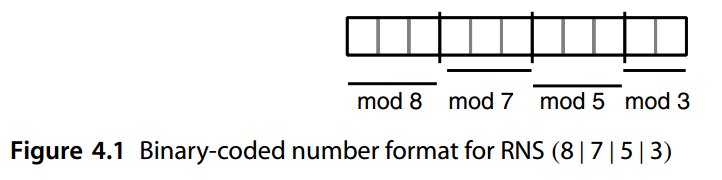
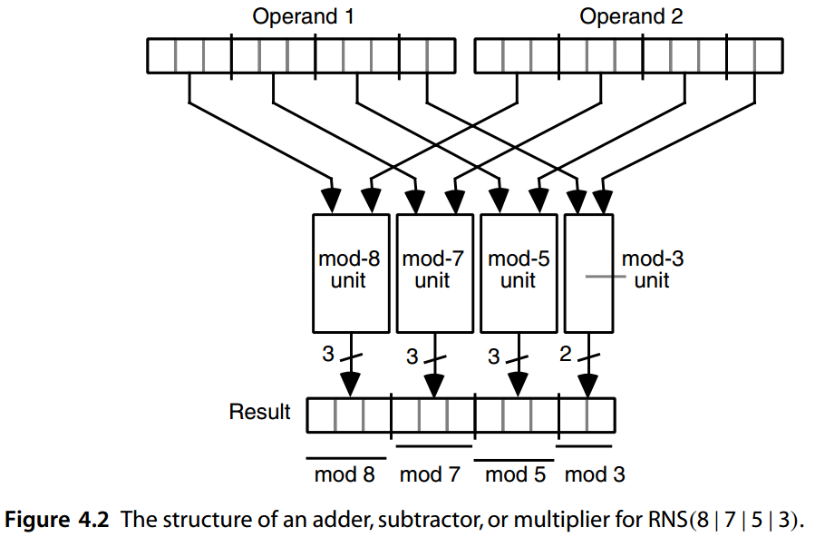
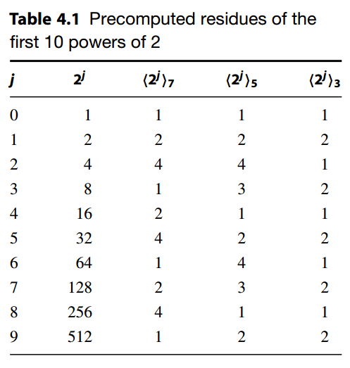
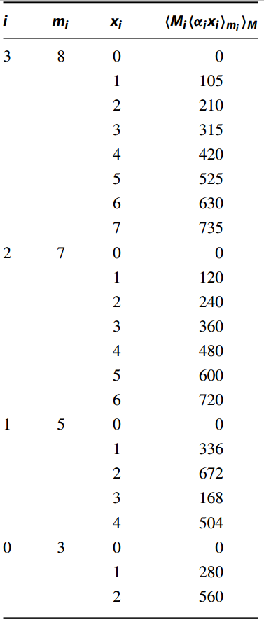
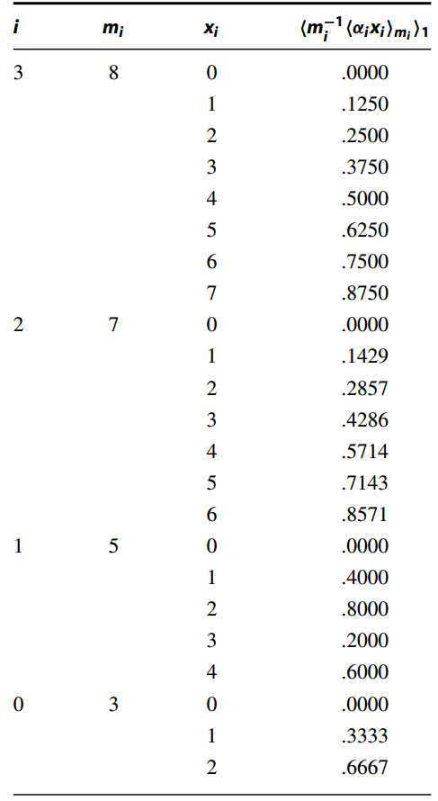
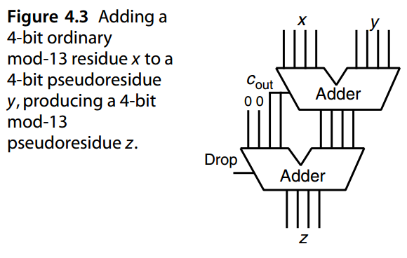
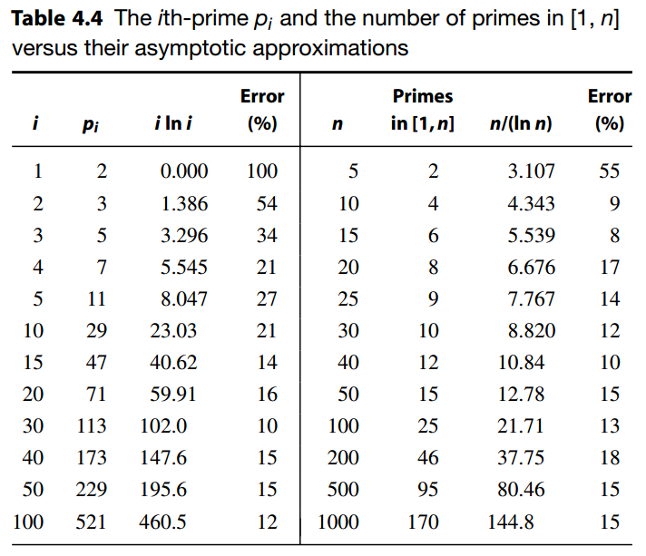

# 4 剩余数系统

Residue Number Systems


 *“God created the integers, all else is the work of man”* 

​                           —— LEOPOLD KRONECKER , 1886

“上帝创造了整数，其他一切都是人类的工作”

​                           —— 利奥波德·克罗内克 , 1886


By converting arithmetic on large numbers to arithmetic on a collection of smaller numbers, residue number system (RNS) representations produce significant speedup for some classes of arithmetic-intensive algorithms in signal processing applications. Additionally, RNS arithmetic is a valuable tool for theoretical studies of the limits of fast arithmetic. In this chapter, we study RNS representations and arithmetic, along with their advantages and drawbacks. Chapter topics include:

通过将对于大数的算术转换为对于较小数集合的算术，剩余数数系统（RNS）表示对于信号处理应用中某些类型的算术密集型算法产生显著的加速。此外，RNS 算术对于快速算术极限的理论研究来说是一个很有价值的工具。在本章中，我们研究 RNS 表示和算法，以及它们的优点和缺点。章节主题包括：

**4.1** RNS表示和算术 RNS Representation and Arithmetic

**4.2** 选择 RNS 模数 Choosing the RNS Moduli

**4.3** 数字的编码和解码 Encoding and Decoding of Numbers

**4.4** 困难的RNS算术运算 Difficult RNS Arithmetic Operations

**4.5** 冗余RNS表示 Redundant RNS Representations

**4.6** RNS 中快速算术的局限性 Limits of Fast Arithmetic in RNS


## 4.1 RNS 表示和算法

What number has the remainders of 2, 3, and 2 when divided by the numbers 7, 5, and 3, respectively? This puzzle, written in the form of a verse by the Chinese scholar Sun Tsu more than 1500 years ago [Jenk93], is perhaps the first documented use of number representation using multiple residues. The puzzle essentially asks us to convert the coded representation  *(* 2|3|2 *)*  of a residue number system, based on the moduli  *(* 7|5|3 *)*, into standard decimal format. 

哪个数字分别除以数字 7、5 和 3 时，余数为 2、3 和 2？这个谜题由中国学者孙子在 1500 多年前以诗句的形式写成 [Jenk93]，可能是第一个有记录的使用多个余数的数字表示形式。该难题本质上要求我们将基于模（7|5|3 ）的余数系统的编码表示（ 2|3|2 ）转换为标准十进制格式。


In a residue number system (RNS), a number  *x*  is represented by the list of its residues with respect to  *k*  pairwise relatively prime moduli  *mk*−1  *>* · · ·  *> m* 1  *> m* 0. The residue *xi*  of  *x*  with respect to the  *i* th modulus  *mi*  is akin to a digit and the entire  *k*-residue representation of  *x*  can be viewed as a  *k*-digit number, where the digit set for the  *i* th position is [0,  *mi* − 1]. Notationally, we write

在余数系统 (RNS) 中，数字 x 由其相对于 k 个成对互素模 $m_{k−1} > · · · > m_1 > m_0$ 的余数列表表示。x 相对于第 i 个模数 $m_i$ 的余数 $x_i$ 类似于一个数字，并且 x 的整个 k 余数表示可以视为一个 k 位数字，其中第 i 个位置的数字集是 [$0, m_{i − 1}$]。我们记为


$$
x_i = x \mod m_i = \left \langle x  \right \rangle _{mi}
$$


and specify the RNS representation of  *x*  by enclosing the list of residues, or digits, in parentheses. For example, 

并通过将余数或数字列表括在括号中来指定 x 的 RNS 表示形式。例如，


$$
x = ( 2|3|2 )_{RNS ( 7|5|3 )}
$$


represents the puzzle given at the beginning of this section. The list of moduli can be deleted from the subscript when we have agreed on a default set. In many of the examples of this chapter, the following RNS is assumed:

代表本节开头给出的难题。当我们就默认集达成一致时，可以从下标中删除模数列表。在本章的许多示例中，假设了以下 RNS：

 <center>RNS ( 8|7|5|3 )      第 4 章的默认 RNS</center>


The product  *M*  of the  *k*  pairwise relatively prime moduli is the number of different representable values in the RNS and is known as its  *dynamic range*. 

k 个成对互质模的乘积 M 是 RNS 中不同可表示值的数量，称为其动态范围。


$$
M = m_{k−1} × · · · × m_1 × m_0
$$


For example,  *M* = 8 × 7 × 5 × 3 = 840 is the total number of distinct values that are representable in our chosen 4-modulus RNS. Because of the equality

例如，$M = 8 × 7 × 5 × 3 = 840$ 是我们选择的 4 模 RNS 中可表示的不同值的总数。因为等式


$$
\left \langle -x \right \rangle _{m_i} = \left \langle M-x \right \rangle _{m_i}
$$


the 840 available values can be used to represent numbers 0 through 839, −420 through +419, or any other interval of 840 consecutive integers. In effect, negative numbers are represented using a complement system with the complementation constant  *M* . 

840 个可用值可用于表示数字 0 到 839、-420 到 +419，或 840 个连续整数的任何其他区间。实际上，负数是使用具有补码常数 M 的补码系统来表示的。

Here are some example numbers in RNS *(* 8|7|5|3 *)*:

以下是 RNS 中的一些示例数字 ( 8|7|5|3 )：

```
( 0 | 0 | 0 | 0 ) RNS 代表0或840或····
( 1 | 1 | 1 | 1 ) RNS 代表1或841或····
( 2 | 2 | 2 | 2 ) RNS 代表2或842或····
( 0 | 1 | 3 | 2 ) RNS 代表8或848或····
( 5 | 0 | 1 | 0 ) RNS 代表21或861或····
( 0 | 1 | 4 | 1 ) RNS 代表64或904或····
( 2 | 0 | 0 | 2 ) RNS 代表−70或770或····
( 7 | 6 | 4 | 2 ) RNS 代表−1或839或····
```


Given the RNS representation of  *x*, the representation of − *x*  can be found by complementing each of the digits  *xi*  with respect to its modules  *mi* (0 digits are left unchanged). 

给定 x 的 RNS 表示，− x 的表示可以通过对每个数字 xi 相对于其模块 mi 求补来找到（0 位保持不变）。


Thus, given that 21 =  *(* 5 | 0 | 1 | 0 *)* RNS, we find

因此，假设 21 = ( 5 | 0 | 1 | 0 ) RNS，我们可以得到


$$
−21 = ( 8 − 5 | 0 | 5 − 1 | 0 )_{RNS} = ( 3 | 0 | 4 | 0 )_{RNS}
$$


Any RNS can be viewed as a weighted representation. We will present a general method for determining the position weights (the Chinese remainder theorem) in Section 4.3. For RNS *(* 8|7|5|3 *)*, the weights associated with the four positions are

任何 RNS 都可以被视为加权表示。我们将在 4.3 节中提出确定位置权重的通用方法（中国剩余定理）。对于 RNS ( 8|7|5|3 )，与四个位置相关的权重为 

​          105     120    336    280

As an example,  *(* 1 | 2 | 4 | 0 *)* RNS represents the number

例如，( 1 | 2 | 4 | 0 ) RNS 代表数字


$$
\left \langle (105×1)+(120×2)+(336×4)+(280×0) \right \rangle _{840}=\left \langle 1689 \right \rangle _{840}=9
$$


In practice, each residue must be represented or encoded in binary. For our example RNS, such a representation would require 11 bits (Fig. 4.1). To determine the number representation efficiency of our 4-modulus RNS, we note that 840 different values are being represented using 11 bits, compared with 2048 values possible with binary representation. Thus, the representational efficiency is

实际上，每个余数必须以二进制表示或编码。对于我们的示例 RNS，这样的表示需要 11 位（图 4.1）。为了确定 4 模 RNS 的数字表示效率，我们注意到使用 11 位表示了 840 个不同的值，而二进制表示可能表示 2048 个值。因此，表征效率为 $840 / 2048 = 41\%$

Since log2 840 = 9.714, another way to quantify the representational efficiency is to note that in our example RNS, about 1.3 bits of the 11 bits go to waste. 

由于 $\log_2 840 = 9.714$，量化表示效率的另一种方法是, 本例中，11 位中大约有 1.3 位被浪费了。



图 4.1 RNS ( 8 | 7 | 5 | 3 ) 的二进制编码数字格式 


As noted earlier, the sign of an RNS number can be changed by independently complementing each of its digits with respect to its modulus. Similarly, addition, subtraction, and multiplication can be performed by independently operating on each digit. The following examples for RNS *(* 8 | 7 | 5 | 3 *)*  illustrate the process:

如前所述，RNS 编号的符号可以通过独立更改对每个数字的模数求补。类似地，加法、减法和乘法可以通过对每个数字进行独立运算来进行。以下 RNS ( 8 | 7 | 5 | 3 ) 示例说明了该过程： 

```
( 5 | 5 | 0 | 2 ) RNS    代表x=+5
( 7 | 6 | 4 | 2 ) RNS    表示 y = −1
( 4 | 4 | 4 | 1 ) RNS    x + y：(5 + 7) mod 8 = 4、(5 + 6) mod 7 = 4 等。
( 6 | 6 | 1 | 0 ) RNS    x − y：(5 − 7) mod 8 = 6、(5 − 6) mod 7 = 6 等。
                        （或者，找到 -y 并加上 x）
( 3 | 2 | 0 | 1 ) RNS    x × y：5 × 78 = 3、5 × 67 = 2 等。
```


Figure 4.2 depicts the structure of an adder, subtractor, or multiplier for RNS arithmetic. Since each digit is a relatively small number, these operations can be quite fast and simple in RNS. This speed and simplicity are the primary advantages of RNS arithmetic. In the case of addition, for example, carry propagation is limited to within a single residue (a few bits). Thus, RNS representation pretty much solves the carry-propagation problem. As for multiplication, a 4 × 4 multiplier for example is considerably more than four times simpler than a 16 × 16 multiplier, besides being much faster. In fact, since the residues are small (say, 6 bits wide), it is quite feasible to implement addition, subtraction, and multiplication by direct table lookup. With 6-bit residues, say, each operation requires a 4K × 6 table. Thus, excluding division, a complete arithmetic unit module for one 6-bit residue can be implemented with 9 KB of memory. 


图 4.2 描述了 RNS 算术的加法器、减法器或乘法器的结构。由于每个数字都是一个相对较小的数字，因此这些操作在 RNS 中可以非常快速且简单。这种速度和简单性是 RNS 算法的主要优点。例如，在加法的情况下，进位传播仅限于单个余数（一些比特位）。因此，RNS 表示几乎解决了进位传播问题。至于乘法，例如 4 × 4 乘法器比 16 × 16 乘法器简单四倍多，而且速度更快。事实上，由于余数很小（比如6位宽），通过直接查表来实现加法、减法和乘法是相当可行的。例如，对于 6 位余数，每个操作都需要一个 4K × 6 表。因此，除了除法之外，一个 6 位余数的完整算术单元模块可以用 9 KB 的内存来实现。




Unfortunately, however, what we gain in terms of the speed and simplicity of addition, subtraction, and multiplication can be more than nullified by the complexity of division and the difficulty of certain auxiliary operations such as sign test, magnitude comparison, and overflow detection. Given the numbers

然而不幸的是，我们在加法、减法和乘法的速度和简单性方面所获得的成果可能会被除法的复杂性和某些辅助操作（例如符号测试、幅度比较和溢出检测）的难度所抵消。对于下面两个数字

​      ( 7 | 2 | 2 | 1 ) RNS   和   ( 2 | 5 | 0 | 1 ) RNS

we cannot easily tell their signs, determine which of the two is larger, or find out whether *(* 1 | 0 | 2 | 2 *)* RNS represents their true sum as opposed to the residue of their sum modulo 840. 

我们无法轻易辨别它们的符号，确定两者中哪一个更大，或者找出 ( 1 | 0 | 2 | 2 ) RNS 是否代表它们的真实和，而不是它们模 840 的和的余数。

These difficulties have thus far limited the application of RNS representations to certain signal processing problems in which additions and multiplications are used either exclusively or predominantly and the results are within known ranges (e.g., digital filters, Fourier transforms). We discuss division and other “difficult” RNS operations in Section 4.4. 

迄今为止，这些困难限制了 RNS 表示在某些信号处理问题中的应用，在这些问题中，仅使用加法和乘法，或者主要使用加法和乘法，并且结果在已知范围内（例如，数字滤波器、傅立叶变换）。我们在 4.4 节中讨论除法和其他“困难”的 RNS 操作。


## 4.2 选择 RNS 模数

The set of the moduli chosen for RNS affects both the representational efficiency and the complexity of arithmetic algorithms. In general, we try to make the moduli as small as possible, since it is the magnitude of the largest modulus  *mk*−1 that dictates the speed of arithmetic operations. We also often try to make all the moduli comparable in magnitude to the largest one, since with the computation speed already dictated by  *mk*−1, there is usually no advantage in fragmenting the design of Fig. 4.2 through the use of very small moduli at the right end. 

为 RNS 选择的模集会影响算术算法的表示效率和复杂性。一般来说我们尝试使模量尽可能小，这是可能的，因为最大模 $m_{k−1}$ 的大小决定了算术运算的速度。我们还经常尝试使所有模数在大小上与最大模数相当，因为计算速度已经由 $m_{k−1}$决定，通过在右端使用非常小的模数来分割图 4.2 的设计通常没有优势。

We illustrate the process of selecting the RNS moduli through an example. Let us assume that we want to represent unsigned integers in the range 0 to (100 000)ten, requiring 17 bits with unsigned binary representation. 

我们通过一个例子来说明选择 RNS 模数的过程。让我们假设我们想要表示 0 到 $(100 000)_{10}$ 范围内的无符号整数，需要 17 位无符号二进制表示。

A simple strategy is to pick prime numbers in sequence until the dynamic range  *M* becomes adequate. Thus, we pick  *m* 0 = 2,  *m* 1 = 3,  *m* 2 = 5, etc. After we add  *m* 5 = 13 to our list, the dynamic range becomes

一个简单的策略是依次选择素数，直到动态范围M变得足够了。因此，我们选择 $m_0 = 2$、$m_1 = 3$、$m_2 = 5$ 等等。当添加到 $m_5 = 13$ 后对于我们的列表，动态范围变为

​        RNS ( 13 | 11 | 7 | 5 | 3 | 2 )           *M*  = 30 030

This range is not yet adequate, so we add  *m* 6 = 17 to the list:

这个范围还不够，所以我们将 m 6 = 17 添加到列表中：

​        RNS ( 17 | 13 | 11 | 7 | 5 | 3 | 2 )    *M* = 510 510

The dynamic range is now 5.1 times as large as needed, so we can remove the modulus 5 and still have adequate range:

动态范围现在是所需的 5.1 倍，因此我们可以删除模数 5 并且仍然有足够的范围：

​        RNS(17 | 13 | 11 | 7 | 3 | 2)             *M* = 102 102

With binary encoding of the six residues, the number of bits needed for encoding each number is

通过对六个余数进行二进制编码，对每个数字进行编码所需的位数为

​        5 + 4 + 4 + 3 + 2 + 1 = 19 位

Now, since the speed of arithmetic operations is dictated by the 5-bit residues modulo *m* 5, we can combine the pairs of moduli 2 and 13, and 3 and 7, with no speed penalty. This leads to:

现在，由于算术运算的速度由模 $m_5$ 的 5 位余数决定，因此我们可以组合模 2 和 13、模 3 和 7 的对，而不会影响速度。这导致：

​         RNS ( 26 | 21 | 17 | 11 )                 *M* = 102 102

This alternative RNS still needs 5 + 5 + 5 + 4 = 19 bits per operand, but has two fewer modules in the arithmetic unit. 

此替代 RNS 每个操作数仍需要 5 + 5 + 5 + 4 = 19 位，但算术单元中的模块少了两个。

Better results can be obtained if we proceed as above, but include powers of smaller primes before moving to larger primes. The chosen moduli will still be pairwise relatively prime, since powers of any two prime numbers are relatively prime. For example, after including  *m* 0 = 2 and  *m* 1 = 3 in our list of moduli, we note that 22 is smaller than the next prime 5. So we modify  *m* 0 and  *m* 1 to get

如果我们按照上述步骤进行，但在转向较大素数之前先包括较小素数的幂，可以获得更好的结果。所选择的模数仍将是成对互质的，因为任何两个素数的幂都是互质的。例如，在模数列表中包含 $m_0 = 2$ 和 $m_1 = 3$ 后，我们注意到 $2^2$ 小于下一个素数 5。因此我们修改 $m_0$ 和 $m_1$ 以获得

​         RNS ( 22 | 3 )                                   *M* = 12

This strategy is consistent with our desire to minimize the magnitude of the largest modulus. Similarly, after we have included  *m* 2 = 5 and  *m* 3 = 7, we note that both 23 and 32 are smaller than the next prime 11. So the next three steps lead to

该策略与我们最小化最大模量的愿望是一致的。类似地，在我们包含 $m_2 = 5$ 和 $m_3 = 7$ 后，我们注意到 $2^3$

和 $3^2$ 比下一个素数 11 小。所以接下来的三个步骤导致

​       RNS ( 32 | 23 | 7 | 5 )                      *M* = 2520

​       RNS ( 11 | 32 | 23 | 7 | 5 )             *M* = 27 720

​       RNS ( 13 | 11 | 32 | 23 | 7 | 5 )    *M* = 360 360

The dynamic range is now 3.6 times as large as needed, so we can replace the modulus 9 with 3 and then combine the pair 5 and 3 to obtain

现在动态范围是所需的 3.6 倍，因此我们可以将模数 9 替换为 3，然后将 5 和 3 组合起来得到

​       RNS ( 15 | 13 | 11 | 23 | 7 )          *M* = 120 120

The number of bits needed by this last RNS is

最后一个 RNS 所需的位数为

​       4 + 4 + 4 + 3 + 3 = 18 位

which is better than our earlier result of 19 bits. The speed has also improved because the largest residue is now 4 bits wide instead of 5. Other variations are possible. For example, given the simplicity of operations with power-of-2 moduli, we might want to backtrack and maximize the size of our even modulus within the 4-bit residue limit

这比我们之前的 19 位结果要好。速度也得到了提高，因为最大余数现在是 4 位宽，而不是 5 位。其他变化也是可能的。例如，考虑到 2 次幂模运算的简单性，我们可能希望在 4 位余数限制内回溯并最大化偶数模的大小

​        RNS ( 24 | 13 | 11 | 32 | 7 | 5 )    *M* = 720 720

We can now remove 5 or 7 from the list of moduli, but the resulting RNS is in fact inferior to RNS(15|13|11|23|7). This might not be the case with other examples; thus, once we have converged on a feasible set of moduli, we should experiment with other sets that can be derived from it by increasing the power of the even modulus at hand. 

我们现在可以从模数列表中删除 5 或 7，但生成的 RNS 实际上不如 RNS(15|13|11|23|7)。其他示例可能并非如此；因此，一旦我们收敛到一组可行的模数，我们应该尝试 通过增加现有偶模数的幂，并使用可以从中导出的其他集合。

The preceding strategy for selecting the RNS moduli is guaranteed to lead to the smallest possible number of bits for the largest modulus, thus maximizing the speed of RNS arithmetic. However, speed and cost do not just depend on the widths of the residues but also on the moduli chosen. For example, we have already noted that power-of-2 moduli simplify the required arithmetic operations, so that the modulus 16 might be better than the smaller modulus 13 (except, perhaps, with table-lookup implementation). Moduli of the form 2 *a* − 1 are also desirable and are referred to as low-cost moduli [Merr64], [Parh76]. From our discussion of addition of 1’s-complement numbers in Section 2.4, we know that addition modulo 2 *a* − 1 can be performed using a standard *a*-bit binary adder with end-around carry. 

上述选择RNS模数的策略保证了最大模数的尽可能少的位数，从而最大化RNS算法的速度。然而，速度和成本不仅取决于余数的宽度，还取决于所选择的模量。例如，我们已经注意到，2 的幂模简化了所需的算术运算，因此模 16 可能比较小的模 13 更好（也许除了查表实现之外）。$2^a − 1$ 形式的模数也是理想的，被称为低成本模数[Merr64]，[Parh76]。从我们在第 2.4 节中对 1 补码的加法的讨论中，我们知道模 $2^a − 1$ 的加法可以使用带尾部进位的标准 a 位二进制加法器来执行。

Hence, we are motivated to restrict the moduli to a power of 2 and odd numbers of the form 2 *a* − 1. One can prove (left as exercise) that the numbers 2 *a* − 1 and 2 *b* − 1 are relatively prime if and only if  *a*  and  *b*  are relatively prime. Thus, any list of relatively prime numbers  *ak*−2  *>* · · ·  *> a* 1  *> a* 0 can be the basis of the following  *k*-modulus RNS

因此，我们有动机将模限制为 2 的幂和 $2^a − 1$ 形式的奇数。可以证明（留作练习）数字 $2^a − 1$ 和 $2^b − 1$ 互质当且仅当 a 和 b 互质。因此，任何相对质数的列表 $a_{k−2} > · · · > a_1 > a_0$ 都可以作为以下 k 模 RNS 的基础

​        $RNS ( 2^{a_{k−2}} | 2^{a_{k−2}} − 1 | · · · | 2^{a_1} − 1 | 2^{a_0} − 1 )$

for which the widest residues are  *ak*−2-bit numbers. Note that to maximize the dynamic range with a given residue width, the even modulus is chosen to be as large as possible. 

其中最宽的余数是 $a_{k−2}$ 位数字。请注意，为了最大化给定余数宽度的动态范围，偶数模量被选择为尽可能大。

Applying this strategy to our desired RNS with the target range [0, 100 000], leads to the following steps:

将此策略应用于我们所需的目标范围为 [0, 100 000] 的 RNS，将导致以下步骤：

- $RNS (2^3 | 2^3 − 1 | 2^2 − 1)$ Basis: 3, 2                      M =        168
- $RNS (2^4 | 2^4 − 1 | 2^3 − 1)$ Basis: 4, 3                      M =      1680
- $RNS (2^5 | 2^5 − 1 | 2^3 − 1 | 2^2 − 1)$ Basis: 5, 3, 2     M =   20 832
- $RNS (2^5 | 2^5 − 1 | 2^4 − 1 | 2^3 − 1)$ Basis: 5, 4, 3     M = 104 160

This last system, RNS *(* 32 | 31 | 15 | 7 *)*, possesses adequate range. Note that once the number 4 is included in the base list, 2 must be excluded because 4 and 2, and thus 24 − 1 and 22 − 1, are not relatively prime. 

最后一个系统 RNS ( 32 | 31 | 15 | 7 ) 拥有足够的范围。请注意，一旦数字 4 包含在基本列表中，则必须排除 2，因为 4 和 2，且 $2^4 − 1$ 和 $2^2 − 1$ 不是互质的。

The derived RNS requires 5 + 5 + 4 + 3 = 17 bits for representing each number, 

with the largest residues being 5 bits wide. In this case, the representational efficiency is close to 100% and no bit is wasted. In general, the representational efficiency of low-cost RNS is provably better than 50% (yet another exercise!), leading to the waste of no more than 1 bit in number representation. 

导出的 RNS 需要 5 + 5 + 4 + 3 = 17 位来表示每个数字，最大余数为 5 位宽。在这种情况下，表示效率接近 100%，并且没有浪费任何比特。一般来说，低成本 RNS 的表示效率被证明优于 50%（又一个练习！），导致数字表示中不超过 1 位的浪费。

To compare the RNS above to our best result with unrestricted moduli, we list the parameters of the two systems together:

为了将上面的 RNS 与我们使用无限制模数的最佳结果进行比较，我们将两个系统的参数一起列出：

- RNS $(15 | 13 | 11 | 2^3 | 7)$                        18 bits        M = 120 120
- RNS $(2^5 | 2^5 − 1 | 2^4 − 1 | 2^3 − 1|)$    17 bits        M = 104 160

Both systems provide the desired range. The latter has wider, but fewer, residues. However, the simplicity of arithmetic with low-cost moduli makes the latter a more attractive choice. In general, restricting the moduli tends to increase the width of the largest residues and the optimal choice is dependent on both the application and the target implementation technology. 

两种系统都提供所需的范围。后者具有更宽但更少的余数。然而，算法的简单性和低成本模数使后者成为更具吸引力的选择。一般来说，限制模数往往会增加最大余数的宽度，最佳选择取决于应用和目标实现技术。


## 4.3 数字的编码和解码

Since input numbers provided from the outside (machine or human interface) are in standard binary or decimal and outputs must be presented in the same way, conversions between binary/decimal and RNS representations are required. 

由于从外部（机器或人机界面）提供的输入数字是标准二进制或十进制，并且输出必须以相同的方式呈现，因此需要二进制/十进制和 RNS 表示之间的转换。

### 从二进制/十进制到 RNS 的转换

The binary-to-RNS conversion problem is stated as follows: Given an integer  *y*, find its residues with respect to the moduli  *mi*, 0 ≤  *i* ≤  *k* − 1. Let us assume that  *y*  is an unsigned binary integer. Conversion of signed-magnitude or 2’s-complement numbers can be accomplished by converting the magnitude and then complementing the RNS representation if needed. 

二进制到 RNS 的转换问题表述如下：给定一个整数 y，求其相对于模 $m_i, 0 ≤ i ≤ k − 1$ 的余数。假设 y 是一个无符号二进制整数。有符号数值或 2 补码的转换可以通过转换幅度值，然后根据需要对 RNS 求补来完成。

To avoid time-consuming divisions, we take advantage of the following equality:

为了避免耗时的除法，我们利用以下等式： 


$$
\left \langle (y_{k-1} \cdots y_1 y_0)_2 \right \rangle _{m_i} = \left \langle 
\left \langle 2^{k-1}y_{k-1} \right \rangle_{m_i} + \cdots + 
\left \langle 2y_1 \right \rangle_{m_i} +
\left \langle y_0 \right \rangle_{m_i}
\right \rangle
$$
If we precompute and store 2 *j* *m* *i*  for each  *i*  and  *j*, then the residue  *x* *i*   of  *y* (mod  *mi* ) can be computed by modulo- *mi*  addition of some of these constants. 

如果我们为每个 i 和 j 预先计算并存储 $\left \langle 2^j \right \rangle _{m_{i}}$ ，则y的余数 $x_i$    (mod $m_i$ ) 可以 通过对一些查出常数的模加法来计算。

Table 4.1 shows the required lookup table for converting 10-bit binary numbers in the range [0, 839] to RNS(8 | 7 | 5 | 3). Only residues mod 7, mod 5, and mod 3 are given in the table, since the residue mod 8 is directly available as the three least-significant bits of the binary number  *y*. 

表 4.1 显示了将 [0, 839] 范围内的 10 位二进制数转换为 RNS(8|7|5|3) 所需的查找表。表中只给出了余数 mod 7、mod 5 和 mod 3，因为余数 mod 8 可直接用作二进制数 y 的三个最低有效位。




**EXAMPLE 4.1** Represent  *y* =  *(* 1010 0100 *)* two =  *(* 164 *)* ten in RNS *(* 8 | 7 | 5 | 3 *)*.  The residue of  *y*  mod 8 is  *x* 3 =  *(y* 2 *y* 1 *y* 0 *)* two =  *(* 100 *)* two = 4. Since  *y* = 27 + 25 + 22, the required residues mod 7, mod 5, and mod 3 are obtained by simply adding the values stored in the three rows corresponding to  *j* = 7, 5, 2 in Table 4.1:

**示例4.1** 用$RNS (8 | 7 | 5 | 3 )$ 表示$y = ( 1010 0100 )_2 = ( 164 )_{10}$ 。

y mod 8 的余数为 $x_3 = (y_2 y_1 y_0 )_2 = (100)_2 = 4$。由于 $y = 2^7 + 2^5 + 2^2$，只需将表 4.1 中 j = 7, 5, 2 对应的三行中存储的值相加即可获得所需的余数 mod 7、mod 5 和 mod 3：


$$
\begin{array}{c}
x_2 = \left \langle y \right \rangle _7 = \left \langle 2 + 4 + 4\right \rangle _7 = 3 \\
x_1 = \left \langle y \right \rangle _5 = \left \langle 3 + 2 + 4\right \rangle _5 = 4 \\
x_0 = \left \langle y \right \rangle _3 = \left \langle 2 + 2 + 1\right \rangle _3 = 2
\end{array}
$$
Therefore, the RNS(8 | 7 | 5 | 3) representation of (164)ten is (4 | 3 | 4 | 2)RNS. 

因此，$(164)_{10}$ 的 $RNS(8 | 7 | 5 | 3)$ 表示为 $(4 | 3 | 4 | 2)_{RNS}$。


In the worst case,  *k*  modular additions are required for computing each residue of a *k*-bit number. To reduce the number of operations, one can view the given input number as a number in a higher radix. For example, if we use radix 4, then storing the residues of 4 *i*, 2 × 4 *i*  and 3 × 4 *i*  in a table would allow us to compute each of the required residues using only  *k/* 2 modular additions. 

在最坏的情况下，需要 k 个模加法来计算 k 位数字的每个余数。为了减少运算次数，可以将给定的输入数字视为更高基数的数字。例如，如果我们使用基数 4，那么将 $4^i、2 × 4^i 和 3 × 4^i$ 的余数存储在表中将允许我们仅使用 $k/ 2$ 模加法来计算每个所需的留数。

The conversion for each modulus can be done by repeatedly using a single lookup table and modular adder or by several copies of each arranged into a pipeline. For a low-cost modulus  *m* = 2 *a* − 1, the residue can be determined by dividing up  *y*  into  *a*-bit segments and adding them modulo 2 *a* − 1. 

每个模数的转换可以通过重复使用单个查找表和模加法器或通过排列到管道中的每个模数的多个副本来完成。对于低成本模数 $m = 2^a − 1$，可以通过将 y 分成 a 位段并将它们加上模 $2^a − 1$ 来确定余数。

### 从 RNS 到混合基数形式的转换

Associated with any residue number system RNS *(mk*−1 | · · · | *m* 2 | *m* 1 | *m* 0 *)* is a mixed-radix number system MRS *(mk*−1 | · · · | *m* 2 | *m* 1 | *m* 0 *)*, which is essentially a *k*-digit positional number system with position weights

与任何剩余数数字系统 RNS $(m_{k−1} | · · · | m_2 | m_1 | m_0 )$ 相关联的是混合基数系统 MRS $(m_{k−1} | · · · | m_2 | m_1 | m_0 )$，它本质上是一个k 位的位置数字系统，具有位置权重：


$$
m_{k−2}\cdots m_2m_1m_0,\  \cdots,\   m_2m_1m_0,\  m_1m_0,\  m_0,\  1
$$
and digit sets [0,  *mk*−1 − 1], · · · , [0,  *m* 2 − 1], [0,  *m* 1 − 1], and [0,  *m* 0 − 1] in its  *k*-digit positions. Hence, the MRS digits are in the same ranges as the RNS digits (residues). For example, the mixed-radix system MRS *(* 8 | 7 | 5 | 3 *)*  has position weights 7 × 5 × 3 = 105, 5 × 3 = 15, 3, and 1, leading to  

以及在其 k 位位置上的数字集 [$0, m_{k−1} − 1$]、···、[$0, m_2 − 1$]、[$0, m_1 − 1$] 和 [$0, m_0 − 1$]。因此，MRS 数字与 RNS 数字（余数）处于相同范围。例如，混合基数系统 MRS ( 8 | 7 | 5 | 3 ) 的位置权重为 7 × 5 × 3 =105, 5 × 3 = 15, 3, 1, 导致


$$
( 0 | 3 | 1 | 0 )_{MRS ( 8|7|5|3 )} = ( 0 × 105 ) + ( 3 × 15 ) + ( 1 × 3 ) + ( 0 × 1 ) = 48
$$


The RNS-to-MRS conversion problem is that of determining the  *zi*  digits of MRS, given the  *xi*  digits of RNS, so that

RNS 到 MRS 的转换问题是在给定 RNS 的 $x_i$ 数字的情况下确定 MRS 的 $z_i$ 数字，以便


$$
y = (x_{k−1}| · · · | x_2 | x_1 | x_0 ) _{RNS} = (z_{k−1} | · · · | z_2 | z_1 | z_0 ) _{MRS}
$$


From the definition of MRS, we have

根据MRS的定义，我们有


$$
y = z_{k−1} (m_{k−2} \cdots m_2 m_1 m_0 ) + \cdots + z_2 (m_1 m_0 ) + z_1 (m_0 ) + z_0
$$


It is thus immediately obvious that  *z* 0 =  *x* 0. Subtracting  *z* 0 =  *x* 0 from both the RNS and MRS representations, we get

因此很明显 $z_0 = x_0$。从 RNS 和 MRS 表示中减去 $z_0 = x_0$，我们得到


$$
y - x_0 = (x'_{k−1}| · · · | x'_2 | x'_1 | 0 ) _{RNS} = (z_{k−1} | · · · | z_2 | z_1 | 0 ) _{MRS}
$$


其中$x'_j=\left \langle x_j - x_0 \right \rangle_{m_j}$​. 

If we now divide both representations by  *m*0, we get the following in the reduced RNS and MRS from which *m* 0 has been removed:

如果我们现在将两个表示除以 $m_0$，得到结果 是已删除 $m_0$ 的简化 RNS 和 MRS ：


$$
(x''_{k−1}| · · · | x''_2 | x''_1) _{RNS} = (z_{k−1} | · · · | z_2 | z_1) _{MRS}
$$
Thus, if we demonstrate how to divide the number  *y* =  *(x*| · · · |  *x* |  *x* | 0 *)*RNS by m0 to obtain (xk−1 | · · · | x2 | x1)RNS, we have converted the original problem to a similar problem with one fewer modulus. Repeating the same process then leads to the determination of all the zi digits in turn. 

因此，如果我们演示如何将 $y’ = (x’_{k-1}|\cdots|x’_2|x’_1|0)_{RNS}$ 除以数字$m_0$ 来得到 $(x''_{k−1}| · · · | x''_2 | x''_1) _{RNS}$， 我们已经将原始问题转换为少一个模数的类似问题。重复相同的过程即可依次确定所有的 $z_i$ 数字。

Dividing *y*, which is a multiple of *m* 0, by a given constant (in this case *m* 0) is known as *scaling* and is much simpler than general division in RNS. Division by *m* 0 can be accomplished by multiplying each residue by the *multiplicative inverse* of *m* 0 with respect to the associated modulus. For example, the multiplicative inverses of 3 relative to 8, 7, and 5 are 3, 5, and 2, respectively, because

将 y（是$m_0$的倍数）除以给定常数（在本例中为 $m_0$）称为缩放，并且比 RNS 中的一般除法简单得多。除以$m_0$ 可以通过将每个余数乘以$m_0$ 相对于相关模数的*乘法逆元*来完成。例如，3 相对于 8、7 和 5 的*乘法逆元*分别为 3、5 和 2，因为


$$
\left \langle 3 \times 3 \right \rangle _8 =
\left \langle 3 \times 5 \right \rangle _7 =
\left \langle 3 \times 2 \right \rangle _5 =
1
$$
因此，数字 $y = ( 0 | 6 | 3 | 0 )_{RNS}$ 可以通过乘以 $( 3 | 5 | 2 | − ) _{RNS}$ 来除以 3：


$$
\frac{( 0 | 6 | 3 | 0 )_{RNS}}{3}=( 0 | 6 | 3 | 0 )_{RNS}\times ( 3 | 5 | 2 | − ) _{RNS} =  (0 | 2 | 1 | −)_{RNS}
$$
Multiplicative inverses of the moduli can be precomputed and stored in tables to facilitate RNS-to-MRS conversion.

模的乘法逆可以预先计算并存储在表中，以方便 RNS 到 MRS 的转换。

**EXAMPLE 4.2** Convert *y* = *(* 0 | 6 | 3 | 0 *)* RNS to mixed-radix representation. We have *z* 0 = *x* 0 = 0. Based on the preceding discussion, dividing *y* by 3 yields: *(* 0 | 6 | 3 | 0 *)* RNS = *(* 0 | 6 | 3 | 0 *)* RNS × *(* 3 | 5 | 2 | − *)* RNS

**示例4.2** 将$y = ( 0 | 6 | 3 | 0 ) _{RNS}$ 转换为混合基数表示。

我们有 $z_0 = x_0 = 0$。根据前面的讨论，将 y 除以 3 得到： 


$$
\frac{( 0 | 6 | 3 | 0 )_{RNS}}{3}=( 0 | 6 | 3 | 0 )_{RNS}\times ( 3 | 5 | 2 | − ) _{RNS} =  (0 | 2 | 1 | −)_{RNS}
$$


Thus we have *z* 1 = 1. Subtracting 1 and dividing by 5, we get:

因此我们有 $z_1 = 1$。减去 1 再除以 5，我们得到：


$$
\frac{(7|1|0|-)_{RNS}}{5} = (7|1|0|-)_{RNS} \times (5|3|-|-)_{RNS}=(0|-|-|-)_{RNS}
$$


Next, we get *z* 2 = 3. Subtracting 3 and dividing by 7, we find:

接下来，我们得到 $z_2 = 3$。减去 3 再除以 7，我们发现：


$$
\frac{(0|0|-|-)_{RNS}}{7} = (0|0|-|-)_{RNS} \times (7|-|-|-)_{RNS} = (0|-|-|-)_{RNS}
$$


We conclude by observing that *z* 3 = 0. The conversion is now complete:

我们通过观察 得出结论$z_3 = 0$ 。转换现已完成：


$$
y = (0 | 6 | 3 | 0)_{RNS} = (0 | 3 | 1 | 0)_{MRS} = 48
$$


Mixed-radix representation allows us to compare the magnitudes of two RNS numbers or to detect the sign of a number. For example, the RNS representations *(* 0 | 6 | 3 | 0 *)* RNS and *(* 5 | 3 | 0 | 0 *)* RNS of 48 and 45 provide no clue to their relative magnitudes, whereas the equivalent mixed-radix representations *(* 0 | 3 | 1 | 0 *)* MRS and *(* 0 | 3 | 0 | 0 *)* MRS, or *(* 000 | 011 | 001 | 00 *)* MRS and *(* 000 | 011 | 000 | 00 *)* MRS, when coded in binary, can be compared as ordinary numbers.

混合基数表示允许我们比较两个RNS数字的大小或检测数字的符号。例如，48 和 45 的 RNS 表示 $( 0 | 6 | 3 | 0 )_{RNS}$ 和 $( 5 | 3 | 0 | 0 ) _{RNS}$ 没有提供它们相对大小的线索，而等效的混合基数表示 $( 0 | 3 | 1 | 0 ) _{MRS}$

和$( 0 | 3 | 0 | 0 ) _{MRS}$，或$( 000 | 011 | 001 | 00 )_{MRS}$ 和$( 000 | 011 | 000 | 00 ) _{MRS}$，当以二进制编码时，可以像普通数字一样进行比较。


### RNS 到二进制/十进制的转换

One method for RNS-to-binary conversion is to first derive the mixed-radix representation of the RNS number and then use the weights of the mixed-radix positions to complete the conversion. We can also derive position weights for the RNS directly based on the Chinese remainder theorem (CRT), as discussed below.

RNS 到二进制转换的一种方法是首先导出 RNS 数的混合基表示，然后使用混合基位置的权重来完成转换。我们还可以直接基于中国剩余定理 (CRT) 导出 RNS 的位置权重，如下所述。

Consider the conversion of *y* = *(* 3 | 2 | 4 | 2 *)* RNS from RNS *(* 8 | 7 | 5 | 3 *)* to decimal. Based on RNS properties, we can write

考虑将 y = ( 3 | 2 | 4 | 2 ) RNS 从 RNS ( 8 | 7 | 5 | 3 ) 转换为十进制。基于 RNS 属性，我们可以写做


$$
\begin{array}{l}
(3 | 2 | 4 | 2)_{RNS} &= (3 | 0 | 0 | 0)_{RNS} + (0 | 2 | 0 | 0)_{RNS}
+ (0 | 0 | 4 | 0)_{RNS} + (0 | 0 | 0 | 2)_{RNS} \\
&= 3 × (1 | 0 | 0 | 0)_{RNS} + 2 × (0 | 1 | 0 | 0)_{RNS}
+ 4 × (0 | 0 | 1 | 0)_{RNS} + 2 × (0 | 0 | 0 | 1)_{RNS}
\end{array}
$$


Thus, knowing the values of the following four constants (the RNS position weights) would allow us to convert any number from RNS *(* 8 | 7 | 5 | 3 *)* to decimal using four multiplications and three additions.

因此，知道以下四个常量（RNS 位置权重）的值将允许我们使用四次乘法和三次加法将任何数字从 RNS (8 | 7 | 5 | 3 ) 转换为十进制。


$$
\begin{array}{c}
(1 | 0 | 0 | 0)_{RNS} = 105 \\
(0 | 1 | 0 | 0)_{RNS} = 120 \\
(0 | 0 | 1 | 0)_{RNS} = 336 \\
(0 | 0 | 0 | 1)_{RNS} = 280
\end{array}
$$


所以我们可以发现


$$
(3 | 2 | 4 | 2)RNS = \left \langle (3 × 105) + (2 × 120) + (4 × 336) + (2 × 280)\right \rangle _{840} = 779
$$


It only remains to show how the preceding weights were derived. How, for example, did we determine that *w* 3 = *(* 1 | 0 | 0 | 0 *)* RNS = 105? To determine the value of *w* 3, we note that it is divisible by 3, 5, and 7, since its last three residues are 0s. Hence, *w* 3 must be a multiple of 105. We must then pick the appropriate multiple of 105 such that its residue with respect to 8 is 1. This is done by multiplying 105 by its multiplicative inverse with respect to 8. Based on the preceding discussion, the conversion process can be formalized in the form of CRT.

只需要说明前面的权重是如何得出的。例如，我们如何确定 $w_3 = ( 1 | 0 | 0 | 0 ) _{RNS} = 105$？ 为了确定 $w_3$ 的值，我们注意到它可以被 3、5 和 7 整除，因为它的最后三个余数是 0。因此，w 3 必须是 105 的倍数。然后我们必须选择 105 的适当倍数，使其相对于 8 的余数为 1。这是通过将 105 乘以它相对于 8 的乘法逆元来完成的。基于前面的讨论，转换过程可以以 CRT 的形式形式化。


**THEOREM 4.1** (The Chinese remainder theorem) The magnitude of an RNS number can be obtained from the CRT formula:

**定理 4.1**（中国剩余定理）RNS 数字的大小可以从CRT公式中获得：


$$
x = (x_{k−1} | · · · | x_2 | x_1 | x_0 ) _{RNS} = \left \langle \sum_{i=0}^{k-1}M_i \left \langle \alpha_i x_i\right \rangle_{m_i} \right \rangle_M
$$
其中 $M_i=M/m_i$, 而 $\alpha_i=\left \langle M_i^{-1}\right \rangle _{m_i}$ 是$M_i$相对于$m_i$的乘法逆元。

To avoid multiplications in the conversion process, we can store the values of

为了避免转换过程中的乘法，我们可以存储对于所有可能的$i$ 和$x_i$对应的$\left \langle M_i \left \langle \alpha_i x_i\right \rangle_{m_i} \right \rangle_M$的值到一个表中，表大小有$\sum_{i=0}^{k-1}m_i$个word。



<center>表 4.2 应用中国余数定理到RNS(8|7|5|3)所需的值</center>

shows the required values for RNS *(* 8 | 7 | 5 | 3 *)*. Conversion is then performed exclusively by table lookups and modulo- *M* additions.

表 4.2显示 RNS ( 8 | 7 | 5 | 3 ) 所需的值。仅通过表查找和模 M 加法就可以执行转换。


## 4.4 困难的 RNS 算术运算

In this section, we discuss algorithms and hardware designs for sign test, magnitude comparison, overflow detection, and general division in RNS. The first three of these operations are essentially equivalent in that if an RNS with dynamic range  *M*  is used for representing signed numbers in the range [− *N* ,  *P*], with  *M* =  *N* +  *P* + 1, then sign test is the same as comparison with  *P*  and overflow detection can be performed based on the signs of the operands and that of the result. Thus, it suffices to discuss magnitude comparison and general division. 

在本节中，我们将讨论 RNS 中符号测试、幅度比较、溢出检测和一般除法的算法和硬件设计。前三个操作本质上是等价的，如果使用动态范围为 $M$ 的 RNS 来表示 $[− N , P]$ 范围内的有符号数，其中 $M = N + P + 1$，则符号测试与与 $P$ 的比较相同，并且可以根据操作数的符号和结果的符号进行溢出检测。因此，讨论大小比较和一般除法就足够了。

To compare the magnitudes of two RNS numbers, we can convert both to binary

or mixed-radix form. However, this would involve a great deal of overhead. A moreefficient approach is through approximate CRT decoding. Dividing the equality in the statement of Theorem 4.1 by  *M* , we obtain the following expression for the scaled value of  *x*  in [0, 1):

为了比较两个 RNS 数字的大小，我们可以将两者转换为二进制或混合基数形式。然而，这将涉及大量的开销。一个更有效的方法是通过近似 CRT 解码。将定理 4.1 的陈述中的等式除以 M ，我们得到 [0, 1) 中 x 的缩放值的以下表达式：


$$
\frac{x}{M} = \frac{(x_{k−1} | · · · | x_2 | x_1 | x_0 ) _{RNS}}{M} = \left \langle \sum_{i=0}^{k-1}m_i^{-1} \left \langle \alpha_i x_i\right \rangle_{m_i} \right \rangle_1
$$
Here, the addition of terms is performed modulo 1, meaning that in adding the terms $m_i^{-1} \left \langle \alpha_i x_i\right \rangle_{m_i}$, each of which is in [0, 1), the whole part of the result is discarded and only the fractional part is kept; this is much simpler than the modulo- *M*  addition needed in conventional CRT decoding. 


这里，项的相加是以模 1 进行的，这意味着在相加项 $m_i^{-1} \left \langle \alpha_i x_i\right \rangle_{m_i}$ 每一个都在[0, 1)中，结果整数丢弃，只保留小数部分；这比传统 CRT 解码中所需的模 M 加法简单得多。

Again, the terms  $m_i^{-1} \left \langle \alpha_i x_i\right \rangle_{m_i}$ can be precomputed for all possible  *i*  and  *x*i and stored in
tables of total size k i=−01 mi words. Table 4.3 shows the required lookup table for approximate CRT decoding in RNS(8 | 7 | 5 | 3). Conversion is then performed exclusively by table lookups and modulo-1 additions (i.e., fractional addition, with the carry-out simply ignored).

同样的，可以预先计算所有可能的 $i$ 和 $x_i$对应的项 $m_i^{-1} \left \langle \alpha_i x_i\right \rangle_{m_i}$ 放在一个有$\sum_{i=0}^{k-1}m_i$个word的表中。表 4.3 显示了近似中国剩余定理计算RNS(8|7|5|3)所需的查找表， 然后仅根据表 4.3 应用所需的值进行转换， 表查找和模 1 加法（即小数加法，忽略进位）



<center>表4.3 将近似中国剩余定理解码应用于 RNS(8|7|5|3) 所需的值 </center>


**EXAMPLE 4.3** Use approximate CRT decoding to determine the larger of the two numbers *x* = *(* 0 | 6 | 3 | 0 *)* RNS and *y* = *(* 5 | 3 | 0 | 0 *)* RNS. Reading values from Table 4.3, we get:

**示例4.3** 使用近似CRT 解码来确定两个数字$x = ( 0 | 6 | 3 | 0 ) _{RNS}$ 和$y = ( 5 | 3 | 0 | 0 ) _{RNS}$ 中较大的一个。从表 4.3 中读取值，我们得到：


$$
\begin{array}{c}
\frac{x}{M} \approx \left \langle .0000 + .8571 + .2000 + .0000 \right \rangle _1 =  .0571 \\
\frac{y}{M} \approx \left \langle .6250 + .4286 + .0000 + .0000 \right \rangle _1 =  .0536
\end{array}
$$


Thus, we can conclude that  *x > y*, subject to approximation errors to be discussed next. 

因此，我们可以得出结论，x > y，但会受到接下来讨论的近似误差的影响。


If the maximum error in each table entry is  *ε*, then approximate CRT decoding yields the scaled value of an RNS number with an error of no more than  *kε*. In Example 4.3, assuming that the table entries have been rounded to four decimal digits, the maximum error in each entry is  *ε* = 0.000 05 and the maximum error in the scaled value is 4 *ε* = 0.0002. The conclusion  *x > y*  is, therefore, safe. 

如果每个表条目中的最大误差为ε，则近似CRT解码产生误差不超过kε的RNS数的缩放值。在例 4.3 中，假设表格条目已四舍五入为四位小数，则每个条目的最大误差为 ε = 0.000 05，换算值的最大误差为 4 ε = 0.0002。因此，结论 x > y 是安全的。

Of course we can use highly precise table entries to avoid the possibility of erroneous conclusions altogether. But this would defeat the advantage of approximate CRT decoding in simplicity and speed. Thus, in practice, a two-stage process might be envisaged: a quick approximate decoding process is performed first, with the resulting scaled value(s) and error bound(s) used to decide whether a more precise or exact decoding is needed for arriving at a conclusion. 

当然，我们可以使用高精度的表格条目来完全避免得出错误结论的可能性。但这会抵消近似 CRT 解码在简单性和速度方面的优势。因此，在实践中，可以设想一个两阶段的过程：首先执行快速近似解码过程，使用得到的缩放值和误差界限来决定是否需要更精确或更精确的解码来得出结论。

In many practical situations, an exact comparison of  *x*  and  *y*  might not be required and a ternary decision result  *x < y*,  *x* ≈  *y* (i.e., too close to call), or  *x > y*  might do. In such cases, approximate CRT decoding is just the right tool. For example, in certain division algorithms (to be discussed in Chapter 14), the sign and the magnitude of the partial remainder  *s*  are used to choose the next quotient digit  *qj*  from the redundant digit set [−1, 1] according to the following:

在许多实际情况下，可能不需要对 x 和 y 进行精确比较，而可能需要三元决策结果 x < y、x ≈ y（即，太接近而无法决定）或 x > y。在这种情况下，近似 CRT 解码正是正确的工具。例如，在某些除法算法中（将在第14章中讨论），部分余数s的符号和大小用于根据以下公式从冗余数字集[−1, 1]中选择下一个商数字qj：

 ```
 		s < 0 		quotient digit = −1
 		s ≈ 0 		quotient digit = 0
 		s > 0 		quotient digit = 1
 ```


In this case, the algorithm’s built-in tolerance to imprecision allows us to use it for RNS division. Once the quotient digit in [−1, 1] has been chosen, the value  *qjd* , where  *d* is the divisor, is subtracted from the partial remainder to obtain the new partial remainder for the next iteration. Also, the quotient, derived in positional radix-2 format using the digit set [−1, 1], is converted to RNS on the fly. 

在这种情况下，算法内置的对不精确性的容忍度允许我们将其用于 RNS 除法。一旦选择了 [−1, 1] 中的商数字，就从部分余数中减去值 $q_jd$ （其中 d 是除数）以获得下一次迭代的新部分余数。此外，使用数字集 [−1, 1] 以位置基 2 格式导出的商会即时转换为 RNS。

In other division algorithms, to be discussed in Chapters 14 and 15, approximate comparison of the partial remainder  *s*  and divisor  *d*  is used to choose a radix- *r*  quotient digit in [− *α*,  *β*]. An example includes radix-4 division with the redundant quotient digit set [−2, 2]. In these cases, too, approximate CRT decoding can be used to facilitate RNS division [Hung94]. 

在第 14 章和第 15 章讨论的其他除法算法中，部分余数 s 和除数 d 的近似比较用于选择 [− α, β] 中的基数 r 商位。一个示例包括具有冗余商数字集 [−2, 2] 的基 4 除法。在这些情况下，也可以使用近似 CRT 解码来促进 RNS除法 [Hung94]。


## 4.5 冗余 RNS 表示

Just as the digits in a positional radix- *r*  number system do not have to be restricted to the set [0,  *r* − 1], we are not obliged to limit the residue digits for the modulus  *mi*  to the set [0,  *mi* − 1]. Instead, we can agree to use the digit set [0,  *βi*] for the mod- *mi*  residue, provided  *βi* ≥  *mi* − 1. If  *βi* ≥  *mi*, then the resulting RNS is redundant. 

正如位置基数 r 数系中的数字不必限制在集合 [$0, r − 1$] 中一样，我们也没有一定需要将模 $m_i$ 的余数数字限制在集合 [$0, m_i − 1$] 中。相反，我们可以同意使用数字集 [$0, β_i$] 作为 mod-$m_i$ 余数，前提是 $β_i ≥ m_i − 1$。如果 $β_i ≥ m_i$，则生成的 RNS 是冗余的。

One reason to use redundant residues is to simplify the modular reduction step needed after each arithmetic operation. Consider, for example, the representation of mod-13 residues using 4-bit binary numbers. Instead of using residues in [0, 12], we can use pseudoresidues in [0, 15]. Residues 0, 1, and 2 will then have two representations, since 13 = 0 mod 13, 14 = 1 mod 13, and 15 = 2 mod 13. Addition of such a pseudoresidue *y*  to an ordinary residue  *x*, producing a pseudoresidue  *z*, can be performed by a 4-bit binary adder. If the carry-out is 0, the addition result is kept intact; otherwise, the carry-out, which is worth 16 units, is dropped and 3 is added to the result. Thus, the required mod-13 addition unit is as shown in Fig. 4.3. Addition of two pseudoresidues is possible in a similar way [Parh01]. 

使用冗余余数的原因之一是简化每次算术运算后所需的模归约步骤。例如，考虑 mod-13 的表示使用 4 位二进制数的余数。我们可以在 [0, 15] 中使用伪余数，而不是在 [0, 12] 中。余数 0、1 和 2 将有两种表示，因为 13 = 0 mod 13、14 = 1 mod 13 和 15 = 2 mod 13。将这样的伪余数 y 添加到普通余数 x，产生伪余数 z，可以由 4 位二进制加法器执行。如果进位为0，则加法结果保持不变；否则，值 16 个单位的进位将被丢弃，结果将添加 3。因此，所需的mod-13加法单元如图4.3所示。可以用类似的方式添加两个伪余数[Parh01]。



One can go even further and make the pseudoresidues 2 *h*  bits wide, where normal mod- *m*  residues would be only  *h*  bits wide. This simplifies a multiply-accumulate operation, which is done by adding the 2 *h*-bit product of two normal residues to a 2 *h*-bit running total, reducing the (2 *h* + 1)-bit result to a 2 *h*-bit pseudoresidue for the next step by subtracting 2 *hm*  from it if needed (Fig. 4.4). Reduction to a standard  *h*-bit residue is then done only once at the end of accumulation. 

我们可以更进一步，使伪余数为 $2 h$ 位宽，而正常的 mod-m 余数只有 $h$ 位宽。这简化了乘法累加运算，该运算是通过将两个正常残数的 $2 h$ 位乘积添加到 $2 h$ 位运行总数中来完成的，如果需要的话，通过从中减去 $2^hm$ 将 $(2 h + 1)$ 位结果减少为 $2 h$ 位伪余数（图 4.4）。然后，仅在累加结束时将其减少到标准 h 位余数。


## 4.6 RNS 中快速算术的限制

How much faster is RNS arithmetic than conventional (say, binary) arithmetic? We will see later in Chapters 6 and 7 that addition of binary numbers in the range $[0,  M − 1]$​ can be done in O(log log  *M* ) time and with O(log  *M* ) cost using a variety of methods such as carry-lookahead, conditional-sum, or multilevel carry-select. Both these are optimal to within constant factors, given the fixed-radix positional representation. For example, one can use the constant fan-in argument to establish that the circuit depth of an adder must be at least logarithmic in the number  *k* = log *r M*  of digits. Redundant representations allow O(1)-time, O(log  *M* )-cost addition. What is the best one can do with RNS arithmetic? 

RNS 算术比传统（例如二进制）算术快多少？我们稍后将在第 6 章和第 7 章中看到 [$0, M − 1$] 范围内的二进制数的加法可以使用各种方法（例如进位前瞻、条件和或多级进位选择）在 $O(log log M )$ 时间内以 $O(log M )$ 成本完成。考虑到固定基数位置表示，这两者在常数因子内都是最佳的。例如，可以使用恒定扇入参数来确定加法器的电路深度必须至少是数字 $k = log_r M$ 的对数。剩余数表示允许 O(1) 时间、O(log M) 成本相加。使用 RNS 算法可以做的最好的事情是什么？

Consider the residue number system RNS( *mk*−1 | · · · |  *m* 1 |  *m* 0). Assume that the moduli are chosen as the smallest possible prime numbers to minimize the size of the moduli, and thus maximize computation speed. The following theorems from number theory help us in figuring out the complexity. 

考虑余数系统 $RNS(m_{k−1} | · · · | m_1 | m_0)$。假设模数被选择为尽可能小的素数，以最小化模数的大小，从而最大化计算速度。以下数论定理帮助我们计算复杂性。


**THEOREM 4.2** The  *i* th prime  *pi*  is asymptotically equal to  *i*  ln  *i*. 

**定理 4.2** 第 i 个素数 $p_i$ 渐近等于 $i \ln i$。


**THEOREM 4.3** The number of primes in [1,  *n*] is asymptotically equal to *n*/(ln  *n*). 

**定理 4.3** [$1, n$] 中的素数个数渐近等于 $n/(\ln n)$。


**THEOREM 4.4** The product of all primes in [1,  *n*] is asymptotically equal to  *en*. 

**定理 4.4** [$1, n$] 中所有素数的乘积渐近等于 $e^n$。


Table 4.4 lists some numerical values that can help us understand the asymptotic approximations given in Theorems 4.2 and 4.3. 

表4.4列出了一些数值，可以帮助我们理解定理4.2和4.3中给出的渐近近似。



Armed with these results from number theory, we can derive an interesting limit on the speed of RNS arithmetic. 

借助数论的这些结果，我们可以得出 RNS 算术速度的有趣限制。


**THEOREM 4.5** It is possible to represent all  *k*-bit binary numbers in RNS with O( *k*/log  *k*) moduli such that the largest modulus has O(log  *k*) bits. 

**定理 4.5** 可以用 $O(k/\log k)$ 模来表示 RNS 中的所有 k 位二进制数，使得最大模数具有 $O(\log k)$ 位。

**Proof:** If the largest needed prime is  *n*, by Theorem 4.4, we must have  *en* ≈ 2 *k* . This equality implies  *n < k*. The number of moduli required is the number of primes less than  *n*, which by Theorem 4.3 is O( *n*/log  *n*) = O( *k*/log  *k*). 

证明：如果所需的最大素数是n，根据定理4.4，我们必须有$e^n ≈ 2^k$ 。这个等式意味着 $n < k$。所需的模数是小于 n 的素数的个数，根据定理 4.3 为 $O( n/\log n)$ = $O( k/\log k)$。


As a result, addition of such residue numbers can be performed in O(log log log  *M* ) time and with O(log  *M* ) cost. So, the cost of addition is asymptotically comparable to that of binary representation whereas the delay is much smaller, though not constant. 

结果，可以在 $O(\log \log \log M )$ 时间内以 $O(\log M )$ 成本执行此类余数的加法。因此，加法的成本与二进制表示的成本渐近相当，而延迟要小得多，尽管不是恒定的。

If for implementation ease, we limit ourselves to moduli of the form 2 *a*  or 2 *a* − 1, the following results from number theory are applicable. 

如果为了便于实现，我们将模数限制为 $2^a$ 或 $2^a − 1$ 形式，则适用以下数论结果。

**THEOREM 4.6** The numbers 2 *a* − 1 and 2 *b* − 1 are relatively prime if and only if  *a*  and  *b*  are relatively prime. 

**定理 4.6** 当且仅当 a 和 b 互质时，数 $2^a − 1$ 和 $2^b − 1$ 互质。


**THEOREM 4.7** The sum of the first  *i*  primes is asymptotically O( *i* 2 ln  *i*). 

**定理 4.7** 前 $i$ 个素数之和渐近为 $O( i^2 \ln i)$ 。


These theorems allow us to prove the following asymptotic result for low-cost residue number systems. 

这些定理使我们能够证明低成本剩余数系统的以下渐近结果。


**THEOREM 4.8** It is possible to represent all  *k*-bit binary numbers in RNS with O( *(k/*  log  *k)* 1 */* 2) low-cost moduli of the form 2 *a* −1 such that the largest modulus has O( *(k*  log  *k)* 1 */* 2) bits. 

**定理 4.8** 可以用 $2^a −1$ 形式的 $O( (k/ \log k)^ {1 / 2})$ 低成本模来表示 RNS 中的所有 k 位二进制数，使得最大模数具有 $O( (k \log k)^{1 / 2})$ 位。

**Proof:** If the largest modulus that we need is 2 *l* − 1, by Theorem, 4.7, we must have $ l^2 \ln  l ≈  k$. This implies that  *l* = O *((k/*  log  *k)* 1 */* 2 *)*. By Theorem 4.2, the *l* th prime is approximately  *pl* ≈  *l*  ln  *l* ≈ O *((k*  log  *k)* 1 */* 2 *)*. The proof is complete upon noting that to minimize the size of the moduli, we pick the  *i* th modulus to be 2 *pi* − 1. 

**证明**：如果我们需要的最大模数是 $2^l − 1$，根据定理 4.7，我们必须有 l 2 ln l ≈ k。这意味着 $l = O ((k/ \log k)^{1 / 2} )$。根据定理 4.2，第 $l$个素数近似为 $p_l ≈ l ln l ≈ O ((k \log k)^{1 / 2} )$。证明完成后注意到，为了最小化模数的大小，我们选择第 $i$ 个模数为 $2^{p_i} − 1$。


As a result, addition of low-cost residue numbers can be performed in O(log log  *M* ) time with O(log  *M* ) cost and thus, asymptotically, offers little advantage over binary representation. 

因此，低成本余数的加法可以在 O(log log M ) 时间内以 O(log M ) 成本执行，因此渐近地与二进制表示相比几乎没有优势。


## 问题（略）


## 参考文献和进一步阅读

```
[Garn59] Garner, H. L., “The Residue Number System,” IRE Trans. Electronic Computers, Vol.
		 8, pp. 140–147, 1959.
[Hung94] Hung, C. Y., and B. Parhami, “An Approximate Sign Detection Method for Residue
		 Numbers and Its Application to RNS Division,” Computers & Mathematics with
		 Applications, Vol. 27, No. 4, pp. 23–35, 1994.
[Hung95] Hung, C. Y., and B. Parhami, “Error Analysis of Approximate Chinese-RemainderTheorem Decoding,” IEEE Trans. 				 Computers, Vol. 44, No. 11, pp. 1344–1348, 1995.
[Jenk93] Jenkins, W. K., “Finite Arithmetic Concepts,” in Handbook for Digital Signal
		 Processing, S. K. Mitra and J. F. Kaiser (eds.), Wiley, 1993, pp. 611–675.
[Merr64] Merrill, R.D., “Improving Digital Computer Performance Using Residue Number
		 Theory,” IEEE Trans. Electronic Computers, Vol. 13, No. 2, pp. 93–101, 1964.
[Omon07] Omondi, A., and B. Premkumar, Residue Number Systems: Theory and
		 Implementation, Imperial College Press, 2007.
[Parh76] Parhami, B., “Low-Cost Residue Number Systems for Computer Arithmetic,”
		 AFIPS Conf. Proc., Vol. 45 (1976 National Computer Conference), AFIPS Press,
		 1976, pp. 951–956.
[Parh93] Parhami, B., and H.-F. Lai, “Alternate Memory Compression Schemes for Modular
		 Multiplication,” IEEE Trans. Signal Processing, Vol. 41, pp. 1378–1385, 1993.
[Parh96] Parhami, B., “A Note on Digital Filter Implementation Using Hybrid RNS-Binary
		 Arithmetic,” Signal Processing, Vol. 51, pp. 65-67, 1996.
[Parh01] Parhami, B., “RNS Representations with Redundant Residues,” Proc. 35th Asilomar
		 Conf. Signals, Systems, and Computers, pp. 1651–1655, 2001.
[Sode86] Soderstrand, M. A., W. K. Jenkins, G. A. Jullien, and F. J. Taylor (eds.), Residue
		 Number System Arithmetic, IEEE Press, 1986.
[Szab67] Szabo, N. S., and R. I. Tanaka, Residue Arithmetic and Its Applications to Computer
		 Technology, McGraw-Hill, 1967.
[Verg08] Vergos, H. T., “A Unifying Approach for Weighted and Diminished-1 Modulo 2n + 1
		 Addition,” IEEE Trans. Circuits and Systems II, Vol. 55, No. 10, pp. 1041–1045, 2008.
```

