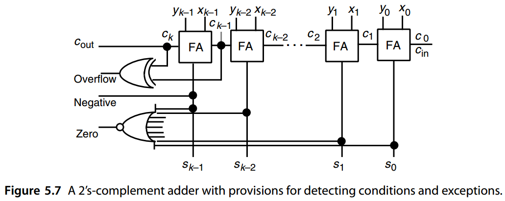

# 5. 基础的加法与计数方案

Basic Addition and Counting


> “Not everything that can be counted counts,and not everything that counts can be counted.”
> 				— ALBERT EINSTEIN


> “不是所有可以计算的东西都重要，也不是所有重要的东西都可以计算。”
> 				— 艾尔伯特爱因斯坦


As stated in Section 3.1, propagation of carries is a major impediment to high speed addition with fixed-radix positional number representations. Before exploring various ways of speeding up the carry-propagation process, however, we need to examine simple ripple-carry adders, the building blocks used in their construction, the nature of the carry-propagation process, and the special case of counting.Chapter topics include:

如第 3.1 节所述，进位传播是固定基数位置数表示法做高速加法的主要障碍。 然而，在探索加速进位传播过程的各种方法之前，我们需要研究简单的脉动进位加法器、其构造中使用的构建块、进位传播过程的性质以及计数的特殊情况。 主题包括：


-   5.1 位串行加法器与逐位进位加法器 BIT SERIAL AND RIPPLE-CARRY ADDERS
-   5.2 条件与异常 CONDITIONS AND EXCEPTIONS
-   5.3 进位传播分析 ANALYSIS OF CARRY PROPAGATION
-   5.4 进位完成的检测 CARRY-COMPLETION DETECTION
-   5.5 加上一个常数:计数器 ADDITION OF A CONSTANT: COUNTERS
-   5.6 曼彻斯特进位链与加法器 MANCHESTER CARRY CHAINS AND ADDERS


## 5.1 位串行加法器与逐位进位加法器

Single-bit half-adders (HAs) and full adders (FAs) are versatile building blocks that are used in synthesizing adders and many other arithmetic circuits. A HA receives two input bits *x* and *y*, producing a sum bit *s* = *x* ⊕ *y* = *xy* ∨ *xy* and a carry bit *c* = *xy*. Figure 5.1 depicts three of the many possible logic realizations of a HA. A HA can be viewed as a single-bit binary adder that produces the 2-bit sum of its 1-bit inputs, namely, $x + y = (c_{out}\ s)_{two}$, where the plus sign in this expression stands for arithmetic sum rather than logical OR.

单比特半加器 (HA) 和全加器 (FA) 是通用构建模块，用于合成加法器和许多其他算术电路。 HA 接收两个输入位 x 和 y，产生和 $s = x ⊕ y = xy ∨ xy$ 与进位 $c = xy$。图 5.1 描述了 HA 的多种可能逻辑实现中的三种。 HA 可以被视为一位二进制加法器，它产生 1 位输入的 2 位和，即 $x + y = (c_{out}\ s)_2$，其中该表达式中的加号代表算术和而不是逻辑或。


一比特的全加器 FA定义为：


$$
\begin{array}{l}
\text{输入: } &\text{操作数 x, y 和输入进位 }c_{in} &(\text{或第i级的 }x_i, y_i, c_i)\\
\text{输出: } &\text{加法的和 s 和输出进位}c_{out} &(\text{或第i级的 }s_i, c_{i+1}) \\
& s=x \oplus y \oplus c_{in} &(\text{奇数校验函数 odd parity function}) \\
& \ \ = xyc_{in} \vee \bar{x}\bar{y}c_{in} \vee \bar{x}y\bar{c_{in}} \vee x\bar{y}\bar{c_{in}} \\
& c_{out}=xy \vee xc_{in} \vee yc_{in} &(\text{多数函数 majority function})
\end{array}
$$


An FA can be implemented by using two HAs and an OR gate as shown in Fig. 5.2a. The OR gate in Fig. 5.2a can be replaced with a NAND gate if the two HAs are NAND-gate HAs with complemented carry outputs. Alternatively, one can implement an FA as two-level AND-OR/NAND-NAND circuits according to the preceding logic equations for  *s*  and  *c* out (Fig. 5.2b). Because of the importance of the FA as an arithmetic building block, many optimized FA designs exist for a variety of implementation technologies. Figure 5.2c shows an FA, built of seven inverters and two 4-to-1 multiplexers (mux), that is suitable for complementary metal-oxide semiconductor (CMOS) transmission-gate logic implementation. 

FA 可以通过使用两个 HA 和一个 OR 门来实现，如图 5.2a 所示。 如果两个 HA 是具有互补进位输出的 NAND 门 HA，则图 5.2a 中的 OR 门可以用 NAND 门代替。 或者，可以根据前面的 *s* 和 *c* out 逻辑方程将 FA 实现为两级 AND-OR/NAND-NAND 电路（图 5.2b）。 由于 FA 作为算术构建模块的重要性，因此针对各种实现技术存在许多优化的 FA 设计。 图 5.2c 显示了由七个反相器和两个 4 选 1 多路复用器 (mux) 构成的 FA，适用于互补金属氧化物半导体 (CMOS) 传输门逻辑实现。


Full and half-adders can be used for realizing a variety of arithmetic functions. We will see many examples in this and the following chapters. For instance, a bit-serial adder can be built from an FA and a carry flip-flop, as shown in Fig. 5.3a. The operands are supplied to the FA 1 bit per clock cycle, beginning with the least-significant bit, from a pair of shift registers, and the sum is shifted into a result register. Addition of *k*-bit numbers can thus be completed in  *k*  clock cycles. A  *k*-bit ripple-carry binary adder requires  *k*  FAs, with the carry-out of the  *i* th FA connected to the carry-in input of the ( *i* + 1)th FA. The resulting  *k*-bit adder produces a  *k*-bit sum output and a carry-out; alternatively,  *c* out can be viewed as the most-significant bit of a ( *k* + 1)-bit sum. Figure 5.3b shows a ripple-carry adder for 4-bit operands, producing a 4-bit or 5-bit sum. 

全加器和半加器可用于实现多种算术功能。我们将在本章和后续章节中看到许多示例。例如，位串行加法器可以由 FA 和进位触发器构建，如图 5.3a 所示。每个时钟周期从最低有效位开始，从一对移位寄存器向 FA 提供 1 位操作数，并将总和移入结果寄存器。因此，k位数的加法可以在k个时钟周期内完成。 k 位纹波进位二进制加法器需要 k 个 FA，第 i 个 FA 的进位输出连接到第 ( i + 1) 个 FA 的进位输入。由此产生的 k 位加法器产生 k 位和输出和进位输出；或者，c out 可以被视为 ( k + 1) 位和的最高有效位。图 5.3b 显示了 4 位操作数的纹波进位加法器，产生 4 位或 5 位和。


The ripple-carry adder shown in Fig. 5.3b leads directly to a CMOS implementation with transmission-gate logic using the FA design of Fig. 5.2c. A possible layout is depicted in Fig. 5.4, which also shows the approximate area requirements for the 4-bit ripple-carry adder in units of *λ* (half the minimum feature size). For details of this particular design, refer to [Puck94, pp. 213–223].

图 5.3b 所示的纹波进位加法器直接导致使用图 5.2c 的 FA 设计的带有传输门逻辑的 CMOS 实现。图 5.4 描述了一种可能的布局，其中还显示了 4 位纹波进位加法器的大致面积要求，单位为 λ（最小特征尺寸的一半）。有关此特定设计的详细信息，请参阅 [Puck94，第 213–223 页]。


The latency of a  *k*-bit ripple-carry adder can be derived by considering the worst-case signal propagation path. As shown in Fig. 5.5, the critical path usually begins at the  *x* 0 or  *y* 0 input, proceeds through the carry-propagation chain to the leftmost FA, and terminates at the  *sk*−1 output. Of course, it is possible that for some FA implementations, the critical path might begin at  *c* 0 and/or terminate at  *ck* . However, given that the delay from carry-in to carry-out is more important than from  *x*  to carry-out or from carry-in to *s*, FA designs often minimize the delay from carry-in to carry-out, making the path shown in Fig. 5.5 the one with the largest delay. 

$k$ 位纹波进位加法器的延迟可以通过考虑最坏情况的信号传播路径来得出。如图 5.5 所示，关键路径通常从 x 0 或 y 0 输入开始，通过进位传播链到达最左边的 FA，并在 $s_{k−1}$ 输出处终止。当然，对于某些 FA 实现，关键路径可能始于 $c_0$ 与/或终止于 $c_k$ 。然而，考虑到从进位到进位的延迟比从x到进位或从进位到s更重要，FA设计通常会最小化从进位到进位的延迟，使图5.5所示的路径成为延迟最大的路径。


We can thus write the following expression for the latency of a  *k*-bit ripple-carry adder:

因此，我们可以为 k 位纹波进位加法器的延迟编写以下表达式：


$$
T_{ripple−add} = T_{FA} (x, y → c out ) + (k − 2 ) × T_{FA} (c_{in} → c_{out} ) + T_{FA} (c_{in} → s) 
$$


where  $T_{FA}(input → output)$ represents the latency of an FA on the path between its specified input and output. As an approximation to the foregoing, we can say that the latency of a ripple-carry adder is $kT _{FA}$  

其中 $T_{FA}(输入 → 输出)$ 表示 FA 在其指定输入和输出之间的路径上的延迟。作为前述的近似，我们可以说行波进位加法器的延迟为 $kT _{FA}$ 。

We see that the latency grows linearly with  *k*, making the ripple-carry design undesirable for large  *k*  or for high-performance arithmetic units. Note that the latency of a bit-serial adder is also O( *k*), although the constant of proportionality is larger here because of the latching and clocking overheads. 

我们看到延迟随 k 线性增长，使得纹波进位设计对于大 k 或高性能算术单元来说是不可取的。请注意，位串行加法器的延迟也是 $O(k)$，尽管由于锁存和时钟开销，比例常数在这里较大。

Full and half-adders, as well as multibit binary adders, are powerful building blocks that can also be used in realizing nonarithmetic functions if the need arises. For example, a 4-bit binary adder with  *c* in, two 4-bit operand inputs,  *c* out, and a 4-bit sum output can be used to synthesize the four-variable logic function  *w* ∨  *xyz*  and its complement, as depicted and justified in Fig. 5.6. The logic expressions written next to the arrows in Fig. 5.6 represent the carries between various stages. Note, however, that the 4-bit adder need not be implemented as a ripple-carry adder for the results at the outputs to be valid.

全加法器和半加法器以及多位二进制加法器是功能强大的构建块，如果需要，也可用于实现非算术函数。例如，一个具有 $c_{in}$ 、两个 4 位操作数输入, $c_{out}$ 和一个 4 位和输出的 4 位二进制加法器可用于合成四变量逻辑函数$ w ∨ xyz$ 及其求反，如图 5.6 所示和证明。箭头旁边写的逻辑表达式表示各个阶段之间的进位。但请注意的是4 位加法器不一定实现为纹波进位加法器，输出结果还是同样有效的。


## 5.2 条件与异常

When a  *k*-bit adder is used in an arithmetic/logic unit (ALU), it is customary to provide the  *k*-bit sum along with information about the following outcomes, which are associated with flag bits within a condition/exception register:

当算术/逻辑单元 (ALU) 中使用 k 位加法器时，通常会提供 k 位和以及有关以下结果的信息，这些结果与条件/异常寄存器中的标志位相关联：


$$
\begin{array}{l}
c_{out}  & \text{表示产生了 1 的进位输出} \\
Overflow & \text{表示输出的和不正确} \\
Negative & \text{表示相加结果为负} \\
Zero     & \text{表示相加结果为零} \\
\end{array}
$$


When we are adding unsigned numbers,  *c* out and “overflow” are one and the same, and the “sign” condition is obviously irrelevant. For 2’s-complement addition, overflow occurs when two numbers of like sign are added and a result of the opposite sign is produced. Thus

当我们对无符号数进行加法时，$c_{out}$ 和“overflow”是一回事，而“sign”条件显然是不相关的。对于 2 的补码加法，当两个相同符号的数字相加并产生相反符号的结果时，就会发生溢出。因此

​		$Overflow_{2’s-compl} = x_{k−1} y_{k−1} \bar{s}_{k−1} \vee \bar{x}_{k−1} \bar{y}_{k−1} s_{k−1}$

It is fairly easy to show that overflow in 2’s-complement addition can be detected from the leftmost two carries as follows:

很容易证明，可以从最左边的两个进位检测到 2 补码加法中的溢出，如下所示：

​		$Overflow_{2’s-compl} = c_k \oplus c_{k−1} = c_k\bar{c}_{k−1} \vee \bar{c}_kc_{k−1}$

In 2’s-complement addition,  *c* out has no significance. However, since a single adder is frequently used to add both unsigned and 2’s-complement numbers,  *c* out is a useful output as well. Figure 5.7 shows a ripple-carry implementation of an unsigned or 2’s-complement adder with auxiliary outputs for conditions and exceptions. Because of the large number of inputs into the NOR gate that tests for 0, it must be implemented as an OR tree followed by an inverter. 

在 2 的补码加法中，$c_{out}$ 没有意义。然而，由于单个加法器经常用于将无符号数和 2 补码数相加，因此 $c_{out}$ 也是一个有用的输出。图 5.7 显示了带条件和异常辅助输出的无符号或 2 补码加法器的纹波进位实现。由于测试 0 的 NOR 门有大量输入，因此必须将其实现为 OR 树，后跟一个反相器。



When the sum of unsigned input operands is too large for representation in  *k*  bits, an overflow exception is indicated by the  *c* out signal in Fig. 5.5 and a “wrapped” value, which is 2 *k*  less than the correct sum, appears as the output. A similar wrapped value may appear for signed addition in the event of overflow. In certain applications, a “saturated”  value would be more appropriate than a wrapped value because a saturated value at least maintains the proper ordering of various sums. For example, if the numbers being manipulated represent the pixel intensities in an image, then an intensity value that is too large should be represented as the maximum possible intensity level, rather than as a wrapped value that could be much smaller. A saturating unsigned adder can be obtained from any unsigned adder design by using a multiplexer at the output, with its control input tied to the adder’s overflow signal. A signed saturating adder can be similarly designed.

当无符号输入操作数的总和太大而无法用 k 位表示时，图 5.5 中的 $c_{out}$ 信号会指示溢出异常，并且输出会出现比正确总和小 $2^k$ 的“绕回”的截断值。，有符号加法如果发生溢出也可能会出现类似的绕回值。在某些应用中，“饱和”值比绕回值更合适，因为饱和值至少维持了结果的正确排序。例如，如果所操作的数字表示图像中的像素强度，则太大的强度值应表示为最大可能的强度级别，而不是表示为可能小得多的绕回值。通过在输出处使用多路复用器，其控制输入与加法器的溢出信号相关联，可以从任何无符号加法器设计中获得饱和无符号加法器。有符号饱和加法器可以类似地设计。


## 5.3 进位传播分析

Various ways of dealing with the carry problem were enumerated in Section 3.1. Some of the methods already discussed include limiting the propagation of carries (hybrid signed-digit, residue number system) or eliminating carry propagation altogether (redundant representation). The latter approach, when used for adding a set of numbers in carry-save form, can be viewed as a way of amortizing the propagation delay of the final conversion step over many additions, thus making the per-add contribution of the carry-propagation delay quite small. What remains to be discussed, in this and the following two chapters, is how one can speed up a single addition operation involving conventional (binary) operands. 

3.1 节列举了处理进位问题的各种方法。已经讨论的一些方法包括限制进位传播（混合有符号数字、剩余数系统）或完全消除进位传播（冗余表示）。后一种方法，当用于以进位保存形式添加一组数字时，可以被视为一种将最终转换步骤的传播延迟分摊到多次加法上的方法，从而使进位传播延迟的每次添加贡献相当小。在本章和接下来的两章中，仍有待讨论的是如何加速涉及传统（二进制）操作数的单个加法运算。

We begin by analyzing how and to what extent carries propagate when adding two binary numbers. Consider the example addition of 16-bit binary numbers depicted in Fig. 5.8, where the carry chains of lengths 2, 3, 6, and 4 are shown. The length of a carry chain is the number of digit positions from where the carry is generated up to and including where it is finally absorbed or annihilated. A carry chain of length 0 thus means “no carry production,” and a chain of length 1 means that the carry is absorbed in the next position. We are interested in the length of the longest propagation chain (6 in Fig. 5.8), which dictates the adder’s latency. 

我们首先分析添加两个二进制数时进位如何传播以及传播到什么程度。考虑图 5.8 中所示的 16 位二进制数加法示例，其中显示了长度为 2、3、6 和 4 的进位链。进位链的长度是指从生成进位到（包括进位最终被吸收或消除）的位数位置。因此，长度为 0 的进位链意味着“无进位产生”，长度为 1 的进位链意味着进位被吸收到下一个位置。我们感兴趣的是最长传播链的长度（如图 5.8 中的6），它决定了加法器的延迟。


Given binary numbers with random bit values, for each position  *i*  we have 

- Probability of carry generation = 1 */* 4
- Probability of carry annihilation = 1 */* 4
- Probability of carry propagation = 1 */* 2

给定具有随机位值的二进制数，对于每个位置 $i$，我们有

- 进位生成的概率 = 1 / 4
- 进位湮没的概率 = 1 / 4 
- 进位传播的概率 = 1 / 2

The probability that a carry generated at position *i* will propagate up to and including position *j* − 1 and stop at position *j (j > i)* is 2− *(j*−1− *i)* × 1 */* 2 = 2− *(j*− *i)*. The expected length of the carry chain that starts at bit position *i* is, therefore, given by *k*−1

位置 $i$ 生成的进位传播到位置 $j − 1$（包括位置 $j − 1$）并停止在位置 $j (j > i)$ 的概率为 $2^{− (j−1− i)} × 1 / 2 = 2^{− (j− i)}$。因此，从位位置$ i$ 开始的进位链的长度期望值如下给出


$$
\begin{array}{l}
\sum_{j=i+1}^{k-1}(j-i)2^{-(j-i)} &+(k-i)2^{-(k-1-i)} = \\
\sum_{l=1}^{k-1-i}l2^{-l} &+(k-i)2^{-(k-1-i)} = \\
2 - (k-i+1)2^{-(k-1-i)}   &+ (k-i)2^{-(k-1-i)} = \\
2 - 2^{-(k-i-1)}
\end{array}
$$


其中简化是基于等式 $\sum_{l=1}^{p}l2^l=2-(p+2)2^{-p}$。

preceding derivation, the term  *(k* − *i)*  2− *(k*−1− *i)*  is added to the summation because carry definitely stops at position  *k*; so we do not multiply the term 2− *(k*−1− *i)*  by 1/2, as was done for the terms within the summation. 

在前面的推导中，由于进位肯定在位置 k 处停止，因此将 $(k − i) 2^{− (k−1− i)}$ 项添加到求和中；因此，我们不会像对求和中的项那样将 $2^{− (k−1− i)}$ 项乘以 1/2。

The preceding result indicates that for  *i*   *k*, the expected length of the carry chain that starts at position  *i*  is approximately 2. Note that the formula checks out for the extreme case of  *i* =  *k* − 1, since in this case, the exact carry chain length, and thus its expected value, is 1. We conclude that carry chains are usually quite short. 

前面的结果表明，对于 $i \ll k$，从位置 i 开始的进位链的预期长度约为 2。请注意，该公式检查了 $i = k − 1$ 的极端情况，因为在这种情况下，准确的进位链长度及其预期值是 1。我们得出结论，进位链通常相当短。

On the average, the longest carry chain in adding  *k*-bit numbers is of length log2  *k*. This was first observed and proved by Burks, Goldstine, and von Neumann in their classic report defining the structure of a stored-program computer [Burk46]. An interesting analysis based on Kolmogorov complexity theory has been offered in [Beig98]. The latter paper also cites past attempts at providing alternate or more complete proofs of the proposition. 

平均而言，k 位数字相加时最长的进位链长度为 $\log_2 k$。Burks、Goldstine 和 von Neumann 在定义存储程序计算机结构的经典报告中首次观察到并证明了这一点 [Burk46]。 [Beig98] 中提供了基于 [柯尔莫哥洛夫复杂度](https://zhuanlan.zhihu.com/p/586889341)理论的有趣分析。后一篇论文还引用了过去为该命题提供替代或更完整证明的尝试。

Here is one way to prove the logarithmic average length of the worst-case carry chain. The reader can skip the rest of this section without any loss of continuity. 

这是证明最坏情况进位链的对数平均长度的一种方法。读者可以跳过本节的其余部分，而不会失去任何连续性。

Let  *ηk (h)*  be the probability that the longest carry chain in a  *k*-bit addition is of length *h*  or more. Clearly, the probability of the longest carry chain being of length exactly  *h*  is *ηk(h)* −  *ηk(h* + 1 *)*. We can use a recursive formulation to find  *ηk(h)*. The longest carry chain can be of length  *h*  or more in two mutually exclusive ways:

**a.** The least-significant  *k* − 1 bits have a carry chain of length  *h*  or more. 

**b.** The least-significant  *k* − 1 bits do not have such a carry chain, but the most significant  *h*  bits, including the last bit, have a chain of the exact length  *h*. 

Thus, we have

​		 $η_k(h) ≤ η_{k−1} (h) + 2^{− (h+1 )}$ 

where 2− *(h*+1 *)*  is the product of 1/4 (representing the probability of carry generation) and 2− *(h*−1 *)* (probability that carry propagates across  *h* − 2 intermediate positions and stops in the last one). The inequality occurs because the second term is not multiplied by a probability as discussed above. Hence, assuming  *ηi(h)* = 0 for  *i < h*: 

​		$\eta_k(h)=\sum_{i=h}^{k}[\eta_i(h)-\eta_{i-1}(h)] \le (k-h+1)2^{-(h+l)} \le 2^{-(h+1)}k$

To complete our derivation of the expected length λ of the longest carry chain, we note that

令 $η_k (h)$ 为 k 位加法中最长进位链长度为 h 或更长的概率。显然，最长进位链的长度恰好为 h 的概率为 $η_k(h) − η_k(h + 1 )$。我们可以使用递归公式来求 $η_k(h)$。最长的进位链可以通过两种互斥的方式达到 $h$ 或更长的长度：

**a.** 最低有效 $k − 1$ 位具有长度为 h 或更长的进位链。

**b.** 最低有效 $k − 1$ 位没有这样的进位链，但最高有效 h 位（包括最后一位）具有精确长度为 h 的链。

因此，我们有

​		$η_k(h) ≤ η_{k−1} (h) + 2^{− (h+1 )}$ 

其中 2^{− (h+1 )} 是 1/4（表示进位生成的概率）和 2^{− (h−1 )} （进位传播穿过 $h − 2$ 个中间位置并在最后一个位置停止的概率）的乘积。出现不等式是因为第二项没有乘以上面讨论的概率。因此，假设 $η_i(h) = 0$ for $i < h$: 

​		$\eta_k(h)=\sum_{i=h}^{k}[\eta_i(h)-\eta_{i-1}(h)] \le (k-h+1)2^{-(h+l)} \le 2^{-(h+1)}k$

为了完成最长进位链的预期长度 λ 的推导，我们记为


$$
\begin{array}{l}
\lambda &= \sum_{h=1}^{k}h[\eta_k(h)-\eta_k(h+1)] \\
        &= [\eta_k(1)-\eta_k(2)]  + 2[\eta_k(2)-\eta_k(3)] + \cdots + k[\eta_k(k)-0] \\
        &= \sum_{h=1}^{k}\eta_k(h)
\end{array}
$$


We next break the final summation above into two parts: the first *γ* = log2 *k*− 1 terms and the remaining *k* − *γ* terms. Using the upper bound 1 for terms in the first part and 2− *(h*+1 *)k* for terms in the second part, we get

接下来，我们将上面的最终求和分为两部分：第一个 $γ = \left \lfloor \log_2 k \right \rfloor − 1$ 项和其余的 $k − γ$ 项。对第一部分中的项使用上限 1，对第二部分中的项使用 $2^{− (h+1 )}k$，我们得到

​		$\lambda = \sum_{h=1}^{k}\eta_k(h) \le \sum_{h=1}^{\gamma}1+\sum_{h=\gamma+1}^{k}2^{-(h+1)}k \lt \gamma + 2^{-(\gamma+1)}k$

Now let  *ε* = log2  *k* −log2  *k* or  *γ* = log2  *k* −1− *ε*, where 0 ≤  *ε <*  1. Then, substituting the latter expression for  *γ*  in the preceding inequality and noting that 2log2  *k* =  *k*  and 2 *ε <*  1 +  *ε*, we get  *λ <*  log2  *k* − 1 −  *ε* + 2 *ε <*  log2  *k*

现在令 $ε = \log_2 k − \left \lfloor \log_2 k \right \rfloor$ 或 $γ = \log_2 k −1− ε$，其中 $0 ≤ ε < 1$。然后，将后一个表达式替换前面不等式中的 γ，并注意到 $2^{\log_2 k} = k$ 和 $2^ε < 1 + ε$，我们得到

​		$λ < \log_2 k − 1 − ε + 2^ε < \log_2 k$

This concludes our derivation of the result that the expected length of the worst-case carry chain in a  *k*-bit addition with random operands is upper-bounded by log2  *k*. Experimental results verify the log2  *k*  approximation to the length of the worst-case carry chain and suggest that log2(1.25 *k*) is a better estimate [Hend61]. 

这得出了我们对结果的推导，即与随机操作数进行 k 位加法时最坏情况进位链的预期长度上限为 $\log_2 k$。实验结果验证了最坏情况进位链长度的 $\log_2 k$ 近似值，并表明 $\log_2(1.25 k)$ 是更好的估计 [Hend61]。


## 5.4 进位完成的检测

A ripple-carry adder is the simplest and slowest adder design. For  *k*-bit operands, both the worst-case delay and the implementation cost of a ripple-carry adder are linear in  *k*.  However, based on the analysis in Section 5.3, the worst-case carry-propagation chain of length  *k*  almost never materializes. 

行波进位加法器是最简单且最慢的加法器设计。对于 k 位操作数，最坏情况的延迟和纹波进位加法器的实现成本与 k 成线性关系。然而，根据 5.3 节的分析，长度为 k 的最坏情况进位传播链几乎永远不会出现。

A carry-completion detection adder takes advantage of the log2  *k*  average length of the longest carry chain to add two  *k*-bit binary numbers in O(log  *k*) time on the average. It is essentially a ripple-carry adder in which a carry of 0 is also explicitly represented and allowed to propagate between stages. The carry into stage  *i*  is represented by the two-rail code:

进位完成检测加法器利用最长进位链的 $\log_2 k$ 平均长度，平均在 $O(\log k)$ 时间内将两个 k 位二进制数相加。它本质上是一个波纹进位加法器，其中也明确表示了进位 0 并允许在级之间传播。进入阶段 i 的进位由两轨编码表示：

$(b_i, c_i) =$  

​		(0, 0) 进位未知

​		(0, 1) 进位确定为1

​		(1, 0) 进位确定为0

Thus, just as two 1s in the operands generate a carry of 1 that propagates to the left, two 0s would produce a carry of 0. Initially, all carries are (0, 0) or unknown.  After initialization, a bit position with  *xi* =  *yi*  makes the no-carry/carry determination and injects the appropriate carry ( *bi*+1,  *ci*+1 *)* =  *(xi* ∨  *yi*,  *xiyi)*  into the carry-propagation chain of Fig. 5.9 via the OR gates. The carry  *(c* in,  *c* in *)*  is injected at the right end. When every carry has assumed one of the values (0, 1) or (1, 0), carry propagation is complete.  The local “done” signals  *di* =  *bi* ∨  *ci*  are combined by a global AND function into *alldone*, which indicates the end of carry propagation. 

因此，正如操作数中的两个 1 生成向左传播的进位 1 一样，两个 0 将生成进位 0。最初，所有进位都是 (0, 0) 或未知。初始化后，$x_i = y_i$ 的位位置可以判定是无进位/进位，并通过或门将适当的进位 $(b_{i+1}, c_{i+1}) = (x_i ∨ y_i, x_iy_i)$ 注入图 5.9 的进位传播链中。进位 $(\bar{c} _{in}, c _{in} )$ 在右端注入。当每个进位都取值 (0, 1) 或 (1, 0) 之一时，进位传播就完成了。局部“done”信号 $d_i = b_i ∨ c_i$ 通过全局 AND 函数组合成 alldone，表示进位传播结束。


In designing carry-completion adders, care must be taken to avoid hazards that might lead to a spurious  *alldone*  signal. Initialization of all carries to 0 through clearing of input bits and simultaneous application of all input data is one way of ensuring hazard-free operation. 

在设计进位完成加法器时，必须小心避免可能导致虚假 alldone 信号的危险。通过清除输入位并同时应用所有输入数据将所有进位初始化为 0，是确保无危险操作的一种方法。

Excluding the initialization and carry-completion detection times, which must be considered and are the same in all cases, the latency of a  *k*-bit carry-completion adder ranges from 1 gate delay in the best case (no carry propagation at all: i.e., when adding a number to itself) to 2 *k* + 1 gate delays in the worst case (full carry propagation from  *c* in to cout), with the average latency being about $2 \log_2  k + 1$ gate delays. Note that once the final carries have arrived in all bit positions, the derivation of the sum bits is overlapped with completion detection and is thus not accounted for in the preceding latencies. 


排除初始化和进位完成检测时间（必须考虑这些时间并且在所有情况下都是相同的），k 位进位完成加法器的延迟范围从最好情况下的 1 个门延迟（根本没有进位传播：即，当将数字添加到自身时）到最坏情况下的 $2k + 1$ 个门延迟（从 $c_{in}$ 到 $c_{out}$ 的全进位传播）平均延迟约为 $2 \log_2  k + 1$ 个门延迟。请注意，一旦最终进位到达所有位位置，和的导出与完成检测重叠，因此不会算在前面得到的延迟中。

Because the latency of the carry-completion adder is data-dependent, the design of Fig. 5.9 is suitable for use in asynchronous systems. Most modern computers, however, use synchronous logic and thus cannot take advantage of the high average speed of a carry-completion adder. 

由于进位完成加法器的延迟取决于数据，因此图 5.9 的设计适合在异步系统中使用。然而，大多数现代计算机使用同步逻辑，因此无法利用进位完成加法器的高平均速度。


## 5.5 加上一个常数:计数器

When one input of the addition operation is a constant number, the design can be simplified or optimized compared with that of a general two-operand adder. With binary arithmetic, we can assume that the constant  *y*  to be added to  *x*  is odd, since in the addition *s* =  *x* +  *y* even =  *x* +  *(y* odd × 2 *h)*, one can ignore the  *h*  rightmost bits in  *x*  and add  *y* odd to the remaining bits. The special case of  *y* = 1 corresponds to standard counters, while *y* = ±1 yields an up/down counter. 

当加法运算的一个输入为常数时，与一般的二操作数加法器相比，可以简化或优化设计。对于二进制算术，我们可以假设要与 x 相加的常数 y 是奇数，因为在加法 $s = x + y_{even} = x + (y_{odd} × 2^h)$ 中，可以忽略 x 中最右边的 h 位并将 $y_{odd}$ 加到其余位。 y = 1 的特殊情况对应于标准计数器，而 y = ±1 则产生向上/向下计数器。

Let the constant to be added to  *x* =  *(xk*−1 · · ·  *x* 2 *x* 1 *x* 0 *)* two be  *y* =  *(yk*−1 · · ·  *y* 2 *y* 1 1 *)* two.  The least-significant bit of the sum is  *x* 0. The remaining bits of  *s*  can be determined by a ( *k* − 1)-bit ripple-carry adder, with  *c* in =  *x* 0, each of its cells being a HA ( *yi* = 0) or a modified HA ( *yi* = 1). The fast-adder designs to be covered in Chapters 6 and 7 can similarly be optimized to take advantage of the known bits of  *y*. 

设与$x = (x_{k−1} · · · x _2 x _1 x _0 )_2$ 相加的常数为$y = (y_{k−1} · · · y _2 y _1 1 ) _2$。和的最低有效位是 $\bar{x}_0$。 s 的其余位可以由 $( k − 1)$ 位纹波进位加法器确定，其中 $c_{in} = x_0$，其每个单元都是 HA $( y_i = 0)$ 或修改的 $HA ( y_i = 1)$。第 6 章和第 7 章中介绍的快速加法器设计可以类似地进行优化，以利用 y 的已知位。

When  *y* = 1 *(*−1 *)*, the resulting circuit is known as an  *incrementer* ( *decrementer*) and is used in the design of up (down) counters. Figure 5.10 depicts an up counter, with parallel load capability, built of a register, an incrementer, and a multiplexer. The design shown in Fig. 5.10 can be easily converted to an up/down counter by using an incrementer/decrementer and an extra control signal. Supplying the details is left as an exercise. 

当 y = 1 (−1) 时，所得电路称为增量器（减量器），并用于向上（向下）计数器的设计。图 5.10 描述了一个具有并行加载能力的向上计数器，由寄存器、增量器和多路复用器组成。通过使用增量器/减量器和额外的控制信号，图 5.10 所示的设计可以轻松转换为加/减计数器。留给读者留作练习。


Many designs for fast counters are available [Ober81]. Conventional synchronous designs are based on full carry propagation in each increment/decrement cycle, thus limiting the counter’s operating speed. In some cases, special features of the storage elements used can lead to simplifications. Figure 5.11 depicts an asynchronous counter built of cascaded negative-edge-triggered T (toggle) flip-flops. Each input pulse toggles the flip-flop at the least significant position, each 1-to-0 transition of the least-significant bit flip-flop toggles the next flip-flop, and so on. The next input pulse can be accepted before the carry has propagated all the way to the left. 

许多快速计数器的设计都是可用的[Ober81]。传统的同步设计基于每个递增/递减周期中的全进位传播，因此限制计数器的运行速度。在某些情况下，所使用的存储元件的特殊功能可以导致简化。图 5.11 描述了由级联负边沿触发 T（翻转）触发器构建的异步计数器。每个输入脉冲都会在最低有效位触发触发器，最低有效位触发器的每个 1 到 0 转换都会触发下一个触发器，依此类推。在进位一直向左传播之前，可以接受下一个输入脉冲。


Certain applications require high-speed counting, with the count potentially becoming quite large. In such cases, a high-speed incrementer must be used. Methods of designing fast adders (Chapters 6 and 7) can all be adapted for building fast incrementers. When even the highest-speed incrementer cannot keep up with the input rate or when cost considerations preclude the use of an ultrafast incrementer, the frequency of the input can be reduced by applying it to a prescaler. The lower-frequency output of the prescaler can then be counted with less stringent speed requirements. In the latter case, the resulting count will be approximate. 

某些应用需要高速计数，计数可能会变得相当大。在这种情况下，必须使用高速增量器。设计快速加法器的方法（第 6 章和第 7 章）都可以用于构建快速增量器。当即使是最高速度的增量器也无法跟上输入速率，或者当出于成本考虑而无法使用超快增量器时，可以通过将其应用于预分频器来降低输入频率。然后可以以不太严格的速度要求来计算预分频器的较低频率输出。在后一种情况下，所得计数将是近似值。

Obviously, the count value can be represented in redundant format, allowing carry-free increment or decrement in constant time [Parh87]. However, with a redundant format, reading out the stored count involves some delay to allow for conversion of the internal representation to standard binary. Alternatively, one can design the counter as a cascade that begins with a very narrow, and thus fast, counter and continues with increasingly wider counters [Vuil91]. The wider counters on the left are incremented only occasionally and thus need not be very fast (their incremented counts can be precomputed by a slow incrementer and then simply loaded into the register when required). Figure 5.12 shows this principle applied to the design of a three-stage counter. Some details of this design, as well as its extension to up/down counting, will be explored in the end-of-chapter problems. 

显然，计数值可以用冗余格式表示，允许在恒定时间内进行无进位递增或递减[Parh87]。然而，使用冗余格式时，读出存储的计数会涉及一些延迟，以允许将内部表示转换为标准二进制。或者，可以将计数器设计为级联，从非常窄且因此速度快的计数器开始，然后以越来越宽的计数器继续[Vuil91]。左侧较宽的计数器仅偶尔递增，因此不需要非常快（它们的递增计数可以由慢速递增器预先计算，然后在需要时简单地加载到寄存器中）。图 5.12 显示了该原理应用于三级计数器的设计。这个设计的一些细节，以及它对加/减计数的扩展，将在章末的问题中探讨。


## 5.6 曼彻斯特进位链与加法器

In the next three chapters, we will examine methods for speeding up the addition process for two operands (Chapters 6 and 7) and for multiple operands (Chapter 8). For two operands, the key to fast addition is a low-latency carry network, since once the carry into position  *i*  is known, the sum digit can be determined from the operand digits  *xi*  and *yi*  and the incoming carry  *ci*  in constant time through modular addtition: *si* =  *(xi* +  *yi* +  *ci)*  mod  *r*

在接下来的三章中，我们将研究加速两个操作数（第 6 章和第 7 章）和多个操作数（第 8 章）的加法过程的方法。对于两个操作数，快速加法的关键是低延迟进位网络，因为一旦知道位置 i 的进位，就可以通过模加法在恒定时间内根据操作数位 xi 和 yi 以及传入的进位 ci 确定和位： 

​		$s_i = (x_i + y_i + c_i) \mod r$


In the special case of radix 2, the relation above reduces to

在基数为 2 的特殊情况下，上面的关系简化为

​		$s_i = x_i ⊕ y_i ⊕ c_i$

So, the primary problem in the design of two-operand adders is the computation of the *k*  carries  *ci*+1 based on the 2 *k*  operand digits  *xi*  and  *yi*, 0 ≤  *i < k*. 

因此，双操作数加法器设计的首要问题是根据 $2 k$ 个操作数位 $x_i$ 和 $y_i$ 计算 $k$ 个进位 $c_{i+1}$，$0 ≤ i < k$。


From the point of view of carry propagation and the design of a carry network, the actual operand digits are not important. What matters is whether in a given position a carry is generated, propagated, or annihilated (absorbed). In the case of binary addition, the *generate*,  *propagate*, and  *annihilate* ( *absorb*) signals are characterized by the following logic equations:

从进位传播和进位网络设计的角度来看，实际的操作数并不重要。重要的是在给定位置是否产生、传播或消除（吸收）进位。在二进制加法的情况下，生成、传播和消除（吸收）信号由以下逻辑方程表征：

$g_i = x_iy_i$

$p_i = x_i ⊕ y_i$

$a_i = \bar{x}_i\bar{y}_i = \overline{x_i ∨ y_i}$


It is also helpful to define a  *transfer*  signal corresponding to the event that the carry-out will be 1, given that the carry-in is 1:

假设进位为 1，定义与进位为 1 的事件相对应的传输信号也很有帮助：

$t_i = g_i ∨ p_i = \bar a_i = x_i ∨ y_i$


More generally, for radix  *r*, we have

更一般地，对于基数 r，我们有

$g_i = 1 \iff x_i + y_i ≥ r$

$p_i = 1 \iff x_i + y_i = r − 1$

$a_i = 1 \iff x_i + y_i < r − 1$


Thus, assuming that the signals above are produced and made available, the rest of the carry network design can be based on them and becomes completely independent of the operands or even the number representation radix. 

因此，假设上述信号已产生并可用，则进位网络设计的其余部分可以基于它们，并且完全独立于操作数甚至数字表示基数。


Using the preceding signals, the  *carry recurrence*  can be written as follows:

使用前面的信号，进位递推可以写成如下： 

$c_{i+1} = g_i ∨ c_ip_i$


The carry recurrence essentially states that a carry will enter stage  *i* + 1 if it is generated in stage  *i*  or it enters stage  *i*  and is propagated by that stage. Since 

进位递归本质上是指如果进位是在阶段 i 中生成的，或者进入阶段 i 并由该阶段传播的，则进位将进入阶段 i + 1。因为 


$$
c_{i+1} = g_i ∨ c_ip_i = g_i ∨ c_ig_i ∨ c_ip_i \\
= g_i ∨ c_i(g_i ∨ p_i) = g_i ∨ c_it_i
$$


the carry recurrence can be written in terms of  *ti*  instead of  *pi*. This latter version of the carry recurrence leads to slightly faster adders because in binary addition,  *ti*  is easier to produce than  *pi* (OR instead of XOR). 

进位递推可以用 $t_i$ 而不是 $p_i$ 来写。进位循环的后一个版本导致加法器稍快一些，因为在二进制加法中，$t_i$ 比 $p_i$ 更容易生成（OR 而不是 XOR）。

In what follows, we always deal with the carry recurrence in its original form  *ci*+1 = *gi* ∨  *cipi*, since it is more intuitive, but we keep in mind that in most cases,  *pi*  can be replaced by  *ti*  if desired. 

在下文中，我们始终以原始形式处理进位递推 $c_{i+1} = g_i ∨ c_ip_i$，因为它更直观，但我们请记住，在大多数情况下，如果需要，可以用 $t_i$ 代替 $p_i$。

The carry recurrence forms the basis of a simple carry network known as  *Manchester* *carry chain*. A  *Manchester adder*  is one that uses a Manchester carry chain as its carry network. Each stage of a Manchester carry chain can be viewed as consisting of three switches controlled by the signals  *pi*,  *gi*, and  *ai*, so that the switch closes (conducts electricity) when the corresponding control signal is 1. As shown in Fig. 5.13a, the carry-out signal  *ci*+1 is connected to 0 if  *ai* = 1, to 1 if  *gi* = 1, and to  *ci*  if  *pi* = 1, thus assuming the correct logical value  *ci*+1 =  *gi* ∨  *cipi*. Note that one, and only one, of the signals  *pi*,  *gi*, and  *ai*  is 1. 

进位循环构成了称为*曼彻斯特进位链*的简单进位网络的基础。曼彻斯特加法器是一种使用曼彻斯特进位链作为其进位网络的加法器。曼彻斯特进位链的每一级可以看作由信号 $p_i$、$g_i$ 和 $a_i$ 控制的三个开关组成，因此当相应的控制信号为 1 时，开关闭合（导通）。如图 5.13a 所示，如果 $a_i = 1$，则进位信号 $c_{i+1}$ 连接到 0，如果 $g_i = 1$，则连接到 1，如果 $p_i = 1$，则连接到 $c_i$，也就得到正确的逻辑值 $c_{i+1} = g_i ∨ c_ip_i$。请注意，信号 $p_i、g_i 和 a_i$ 中只有一个是 1。

Figure 5.13b shows how a Manchester carry chain might be implemented in CMOS. When the clock is low, the  *c*  nodes precharge. Then, when the clock goes high, if  *gi*  is high,  *ci*+1 is asserted or drawn low. To prevent  *gi*  from affecting  *ci*, the signal  *pi*  must be computed as the XOR (rather than OR) of  *xi*  and  *yi*. This is not a problem because we need the XOR of  *xi*  and  *yi*  for computing the sum anyway. 

图 5.13b 显示了如何在 CMOS 中实现曼彻斯特进位链。当时钟为低电平时，c 节点预充电。然后，当时钟变高时，如果 $g_i$ 为高，则 $c_{i+1}$ 被断言或拉低。为了防止 $g_i$ 影响 $c_i$，信号 $p_i$ 必须计算为 $x_i$ 和 $y_i$ 的异或（而不是或）。这不是问题，因为无论如何我们都需要 $x_i$ 和 $y_i$ 的异或来计算总和。


For a  *k*-bit Manchester carry chain, the total delay consists of three components: 

1. The time to form the switch control signals. 

2. The setup time for the switches. 

3. Signal propagation delay through  *k*  switches in the worst case. 

对于 k 位曼彻斯特进位链，总延迟由三个部分组成：

1. 形成开关控制信号的时间。

2. 开关的建立时间。

3. 最坏情况下通过 k 个开关的信号传播延迟。

The first two components of delay are small, constant terms. The delay is thus dominated by the third component, which is at best linear in  *k*. For modern CMOS technology, the delay is roughly proportional to  *k* 2 (as  *k*  pass transistors are connected in series), making the method undesirable for direct realization of fast adders. However, when the delay is in fact linear in  *k*, speed is gained over gate-based ripple-carry adders because we have one switch delay rather than two gate delays per stage. The linear or superlinear delay of a Manchester carry chain limits its usefulness for wide words or in high-performance designs. Its main application is in implementing short chains (say, up to 8 bits) as building blocks for use with a variety of fast addition schemes and certain hybrid designs. 

延迟的前两个分量是小的常数项。因此，延迟主要由第三个分量决定，该分量至多与 k 呈线性关系。对于现代 CMOS 技术，延迟大致与 $k^2$ (因为 k 个传输晶体管串联连接)成正比，使得该方法不适合直接实现快速加法器。然而，当延迟实际上以 k 为线性时，速度比基于门的纹波进位加法器获得了提高，因为我们每级有一个开关延迟而不是两个门延迟。曼彻斯特进位链的线性或超线性延迟限制了其在宽字或高性能设计中的用途。它的主要应用是实现短链（例如，最多 8 位）作为构建块，以与各种快速加法方案和某些混合设计一起使用。

We conclude this chapter by setting the stage for fast addition schemes to follow in Chapters 6 and 7. Taking advantage of generate and propagate signals defined in this section, an adder design can be viewed in the generic form of Fig. 5.14. Any adder will have the two sets of AND and XOR gates at the top to form the  *gi*  and  *pi*  signals, and it will have a set of XOR gates at the bottom to produce the sum bits  *si*. It will differ, however, in the design of its carry network, which is represented by the large oval block in Fig. 5.14. For example, a ripple-carry adder can be viewed as having the carry network shown in Fig. 5.15. Inserting this carry network into the generic design of Fig. 5.14 will produce a complete adder. Thus, in our subsequent discussions, we will focus on different designs for the carry network, and we will compare adders with respect to latency and cost of the carry network only.

我们通过为第 6 章和第 7 章中的快速加法方案奠定基础来结束本章。利用本节中定义的生成和传播信号，可以以图 5.14 的通用形式查看加法器设计。任何加法器都会在顶部具有两组 AND 和 XOR 门以形成 $g_i$ 和 $p_i$ 信号，并且在底部具有一组 XOR 门以产生和位 $s_i$。然而，它的进位网络的设计有所不同，如图 5.14 中的大椭圆形块所示。例如，纹波进位加法器可以被视为具有图 5.15 所示的进位网络。将此进位网络插入图 5.14 的通用设计将产生一个完整的加法器。因此，在后续讨论中，我们将重点关注进位网络的不同设计，并且我们将仅根据进位网络的延迟和成本来比较加法器。


## 问题（略）


## 参考文献和进一步阅读

```
[Beig98] Beigel, R., B. Gasarch, M. Li, and L. Zhang, “Addition in log2n + O(1) Steps on
		 Average: A Simple Analysis,” Theoretical Computer Science, Vol. 191, Nos. 1–2,
		 pp. 245–248, 1998.
[Bui02]  Bui, H. T., Y. Wang, and Y. Jiang, “Design and Analysis of Low-Power 10-Transistor
		 Full Adders Using Novel XOR-XNOR Gates,” IEEE Trans. Circuits and Systems II,
		 Vol. 49, No. 1, pp. 25–30, 2002.
[Burk46] Burks, A. W., H. H. Goldstine, and J. von Neumann, “Preliminary Discussion of the
		 Logical Design of an Electronic Computing Instrument,” Institute for Advanced
		 Study, Princeton, NJ, 1946.
[Gilc55] Gilchrist, B., J. H. Pomerene, and S. Y. Wong, “Fast Carry Logic for Digital
		 Computers,” IRE Trans. Electronic Computers, Vol. 4, pp. 133–136, 1955.
[Hend61] Hendrickson, H. C., “Fast High-Accuracy Binary Parallel Addition,” IRE Trans.
		 Electronic Computers, Vol. 10, pp. 465–468, 1961.
[Jian04] Jiang, Y., A. Al-Sheraidah, Y. Wang, E. Sha, and J.-G. Chung, “A Novel
		 Multiplexer-Based Low-Power Full Adder,” IEEE Trans. Circuits and Systems II,
		 Vol. 51, No. 7, pp. 345–353, 2004.
[Kilb60] Kilburn, T., D. B. G. Edwards, and D. Aspinall, “A Parallel Arithmetic Unit Using a
		 Saturated Transistor Fast-Carry Circuit,” Proc. IEE, Vol. 107B, pp. 573–584,
		 1960.
[Laps97] Lapsley, P., DSP Processor Fundamentals: Architectures and Features, IEEE Press,
		 1997.
[Lin07]  Lin, J. F., Y.-T. Hwang, M.-H. Sheu, and C.-C. Ho, “A Novel High-Speed and Energy
		 Efficient 10-Transistor Full Adder Design,” IEEE Trans. Circuits and Systems I,
		 Vol. 54, No. 5, pp. 1050–1059, 2007.
[Ober81] Oberman, R. M. M., Counting and Counters, Macmillan, London, 1981.
[Parh87] Parhami, B., “Systolic Up/Down Counters with Zero and Sign Detection,” Proc.
		 Symp. Computer Arithmetic, pp. 174–178, 1987.
[Puck94] Pucknell, D. A., and K. Eshraghian, Basic VLSI Design, 3rd ed., Prentice-Hall, 1994.
[Stel98] Stelling, P. F., C. U. Martel, V. G. Oklobdzija, and R. Ravi, “Optimal Circuits for
	 	 Parallel Multipliers,” IEEE Trans. Computers, Vol. 47, No. 3, pp. 273–285, 1998.
[Vuil91] Vuillemin, J. E., “Constant Time Arbitrary Length Synchronous Binary Counters,”
		 Proc. Symp. Computer Arithmetic, pp. 180–183, 1991.
```

