# 6. 超前进位加法器

Cary-Lookahead Adders


> “Computers can figure out all kinds of problems, except the things in the world that just don’t add up.”
> 				— ANONYMOUS


>  “计算机可以解决各种各样的问题，除了世界上那些不合逻辑(不能加起来)的事情。”
> 				— 匿名


Adder designs considered in Chapter 5 have worst-case delays that grow at least linearly with the word width k. Since the most-significant bit of the sum is a function of all the 2k input bits, assuming that the gate fan-in is limited to d, a lower bound on addition latency is logd(2k). An interesting question, therefore, is whether one can add two k-bit binary numbers in O(log k) worst-case time. Carry-lookahead adders, covered in this chapter, represent a commonly used scheme for logarithmic time addition. Other schemes are introduced in Chapter 7.

第 5 章中考虑的加法器设计具有最坏情况下的延迟，该延迟至少随字宽 k 线性增长。 由于和的最高有效位是所有 2k 输入位的函数，假设门扇入限制为 d，加法延迟的下限为 $\log_d(2k)$。 因此，一个有趣的问题是，是否可以在 $O(\log k)$ 最坏情况时间内将两个 k 位二进制数相加。 本章介绍的超前进位加法器代表了对数时间加法的常用方案。 其他方案将在第 7 章中介绍。


-   6.1 展开进位递归 UNROLLING THE CARRY RECURRENCE
-   6.2 超前进位加法器的设计 CARRY-LOOKAHEAD ADDER DESIGN
-   6.3 LING型加法器与相关设计 LING ADDER AND RELATED DESIGNS
-   6.4 并行前缀进位计算 CARRY DETERMINATION AS PREFIX COMPUTATION
-   6.5 混合的并行前缀进位网络 ALTERNATIVE PARALLEL PREFIX NETWORKS
-   6.6 VLSI实现相关 VLSI IMPLEMENTATION ASPECTS


## 6.1 展开进位递归

Recall the *gi* (generate), *pi* (propagate), *ai* (annihilate or absorb), and *ti* (transfer) auxiliary signals introduced in Section 5.6:

回想一下 5.6 节中介绍的 $g_i$（生成）、$p_i$（传播）、$a_i$（消灭或吸收）和 $t_i$（转移）辅助信号：


$$
\begin{array}{l}
g_i = 1 \iff x_i + y_i ≥ r     & \text{进位必然产生} & \text{Carry is generated}\\
p_i = 1 \iff x_i + y_i = r − 1 & \text{进位输入可以传递到输出} & \text{Carry is propagated} \\
t_i = \bar a_i = g_i \vee p_i  & \text{进位不会被吸收} & \text{Carry is not annihilated} \\
\end{array}
$$


These signals, along with the carry recurrence

这些信号以及进位递归

$c_{i+1} = g_i \vee p_ic_i = g_i \vee t_ic_i$

allow us to decouple the problem of designing a fast carry network from details of the number system (radix, digit set). In fact it does not even matter whether we are adding or subtracting; any carry network can be used as a borrow network if we simply redefine the preceding signals to correspond to borrow generation, borrow propagation, and so on. 

让我们能够将设计快速进位网络的问题与数字系统的细节（基数、数字集）解耦。事实上，我们是加还是减并不重要；如果我们简单地重新定义前面的信号以对应借位生成、借位传播等，则任何进位网络都可以用作借位网络。

The carry recurrence  *ci*+1 =  *gi* ∨  *pici*  states that a carry will enter stage  *i* + 1 if it is generated in stage  *i*  or it enters stage  *i*  and is propagated by that stage. One can easily unroll this recurrence, eventually obtaining each carry  *ci*  as a logical function of the operand bits and  *c* in. Here are three steps of the unrolling process for  :

进位循环 $c_{i+1} = g_i ∨ p_ic_i$ 表明，如果进位在第 i 阶段生成，或者进入第 i 阶段并由该阶段传播，则进位将进入第 i + 1 阶段。人们可以很容易地展开这个递归式，最终获得每个进位 $c_i$ 作为操作数位和 $c_{in}$ 的逻辑函数。以下是 $c_i$ 展开过程的三个步骤：

$c_i = g_{i−1} ∨ c_{i−1} p_{i−1}$

$\ = g_{i−1} ∨ (g_{i−2} ∨ c_{i−2}p_{i−2})p_{i−1} = g_{i−1} ∨ g_{i−2}p_{i−1} ∨ c_{i−2}p_{i−2}p_{i−1}$

$\ =g_{i−1} ∨ g_{i−2}p_{i−1} ∨ g_{i−3}p_{i−2}p_{i−1} ∨ c_{i−3}p_{i−3}p_{i−2}p_{i−1}$

$\ = g_{i−1} ∨ g_{i−2}p_{i−1} ∨ g_{i−3}p_{i−2}p_{i−1} ∨ g_{i−4}p_{i−3}p_{i−2}p_{i−1} ∨ c_{i−4}p_{i−4}p_{i−3}p_{i−2}p_{i−1}$


The unrolling can be continued until the last product term contains  *c* 0 =  *c* in. The unrolled version of the carry recurrence has the following simple interpretation: carry enters into position  *i*  if and only if a carry is generated in position  *i* − 1  *(gi*−1 *)*, or a carry generated in position  *i* − 2 is propagated by position  *i* − 1  *(gi*−2 *pi*−1 *)*, or a carry generated in position  *i* − 3 is propagated at  *i* − 2 and  *i* − 1  *(gi*−3 *pi*−2 *pi*−1 *)*, etc. 

可以继续展开，直到最后一个乘积项包含 $c_0 = c_{in}$。进位递归的展开版本具有以下简单解释：进位进入位置 $i$ 当且仅当在位置 $i − 1$ 生成进位$(g_i−1 )$ ，或者在位置 $i − 2$ 生成的进位由位置 $i − 1$  传播$(g_{i−2} p_{i−1} )$，或者在位置 $i − 3$ 生成的进位在 $i − 2$ 和 $i − 1$ 传播($g_{i−3} p_{i−2} p_{i−1} $) 等

After full unrolling, we can compute all the carries in a  *k*-bit adder directly from the auxiliary signals ( *gi*,  *pi*) and  *c* in, using two-level AND-OR logic circuits with maximum gate fan-in of  *k* + 1. For  *k* = 4, the logic expressions are as follows: 

完全展开后，我们可以使用最大门扇入为 k + 1 的两级 AND-OR 逻辑电路，直接根据辅助信号 ( gi, pi) 和 c in 计算 k 位加法器中的所有进位。对于 k = 4，逻辑表达式如下：

$c_4 = g_3 ∨ g_2p_3 ∨ g_1p_2p_3 ∨ g_0p_1p_2p_3 ∨ c_0p_0p_1p_2p_3$
$c_3 = g_2 ∨ g_1p_2 ∨ g_0p_1p_2 ∨ c_0p_0p_1p_2$
$c_2 = g_1 ∨ g_0p_1 ∨ c_0p_0p_1$
$c_1 = g_0 ∨ c_0p_0$


Here,  *c* 0 and  *c* 4 are the 4-bit adder’s  *c* in and  *c* out, respectively. A carry network based on the preceding equations can be used in conjunction with two-input ANDs, producing the *gi*  signals, and two-input XORs, producing the  *pi*  and sum bits, to build a 4-bit binary adder. Such an adder is said to have  *full carry lookahead*. 

这里，c 0 和c 4 分别是4位加法器的$c_{in}$ 和$c_{out}$。基于前述方程的进位网络可以与产生 $g_i$ 信号的双输入 AND 和产生 $p_i$ 和和位的双输入 XOR 结合使用，以构建 4 位二进制加法器。这样的加法器被称为是有*完全进位超前进位*。

Note that since  *c* 4 does not affect the computation of the sum bits, it can be derived based on the simpler equation

注意，由于c 4 不影响和位的计算，因此可以基于更简单的方程推导

$c_4 = g_3 ∨ c_3 p_3$

with little or no speed penalty. The resulting carry network is depicted in Fig. 6.1. 

几乎没有速度损失。由此产生的进位网络如图 6.1 所示。

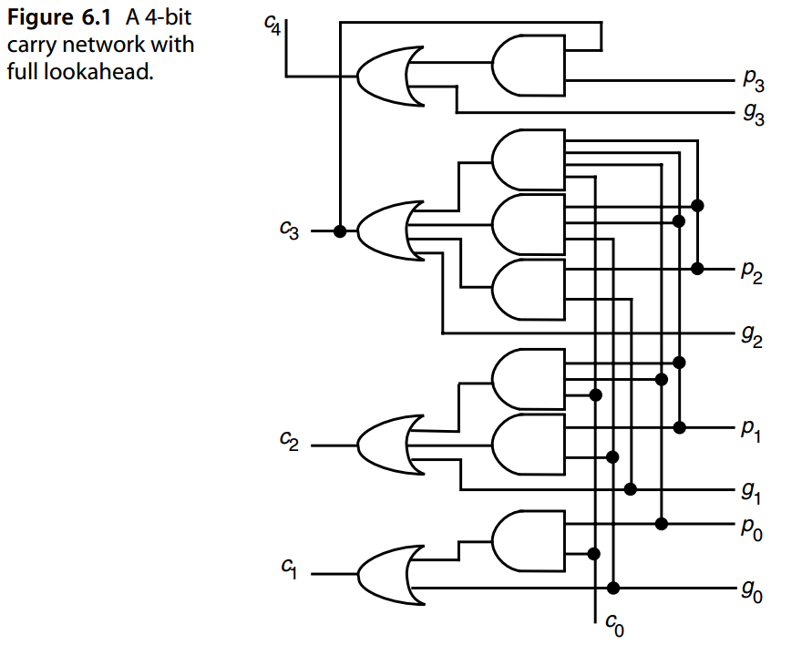

Clearly, full carry lookahead is impractical for wide words. The fully unrolled carry equation for  *c* 31, for example, consists of 32 product terms, the largest of which contains 32 literals. Thus, the required AND and OR functions must be realized by tree networks, leading to increased latency and cost. Two schemes for managing this complexity immediately suggest themselves:

- High-radix addition (i.e., radix $2^h$)

- Multilevel lookahead

  

显然，全进位超前对于宽字来说是不切实际的。例如，$c_{31}$ 的完全展开进位方程由 32 个乘积项组成，其中最大的包含32 个文字。因此，所需的“与”和“或”功能必须通过树形网络来实现，从而导致延迟和成本增加。管理这种复杂性的两种方案立即出现：

- 高基数加法（即基数 $2^h$）
- 多级前瞻

High-radix addition increases the latency for generating the auxiliary signals and sum digits but simplifies the carry network. Depending on the implementation method and technology, an optimal radix might exist. Multilevel lookahead is the technique used in practice and is covered in Section 6.2. 

高基数加法增加了生成辅助信号和和数字的延迟，但简化了进位网络。根据实现方法和技术，可能存在最佳基数。多级前瞻是实践中使用的技术，在 6.2 节中进行了介绍。


## 6.2 超前进位加法器的设计

Consider radix-16 addition of two binary numbers that are characterized by their  *gi*  and *pi*  signals. For each radix-16 digit position, extending from bit position  *i*  to bit position *i* + 3 of the original binary numbers (where  *i*  is a multiple of 4), “block generate” and “block propagate” signals can be derived as follows:

考虑以 $g_i$ 和 $p_i$ 信号为特征的两个二进制数的基 16 加法。对于每个基数 16 位位置，从原始二进制数的位位置 $i$ 延伸到位位置 $i + 3$（其中 $i$ 是 4 的倍数），“块生成”和 “块传播”信号可以如下导出：

$g_{[ i, i+3]} = g_{i+3} ∨ g_{i+2} p_{i+3} ∨ g_{i+1} p_{i+2} p_{i+3} ∨ g_ip_{i+1} p_{i+2} p_{i+3}$

$p_{[ i, i+3]} = p_ip_{i+1} p_{i+2} p_{i+3}$


The preceding equations can be interpreted in the same way as unrolled carry equations: the four bit positions collectively propagate an incoming carry  *ci*  if and only if each of the four positions propagates; they collectively generate a carry if a carry is produced in position  *i* + 3, or it is produced in position  *i* + 2 and propagated by position *i* + 3, etc. 

前面的方程可以用与展开进位方程相同的方式解释：当且仅当四个位置中的每一个都传播时，四个位位置共同传播传入进位 ci；如果在位置 $i + 3$ 产生进位，或者在位置 $i + 2$ 产生进位并通过位置 $i + 3$ 传播，等等，则它们共同产生进位。

If we replace the  *c* 4 portion of the carry network of Fig. 6.1 with circuits that produce the block generate and propagate signals  *g*[ *i*,  *i*+3] and  *p*[ *i*,  *i*+3], the 4-bit  *lookahead carry* *generator*  of Fig. 6.2a is obtained. Figure 6.2b shows the 4-bit lookahead carry generator in schematic form. We will see shortly that such a block can be used in a multilevel structure to build a carry network of any desired width. 

如果我们用产生块生成和传播信号 $g_{[i, i+3]}$和 $p_{[i, i+3]}$ 的电路替换图 6.1 进位网络的 $c_4$ 部分，则获得图 6.2a 的 4 位先行进位生成器。图 6.2b 以原理图形式显示了 4 位先行进位生成器。我们很快就会看到，这样的块可以在多层结构中使用，以构建任何所需宽度的进位网络。

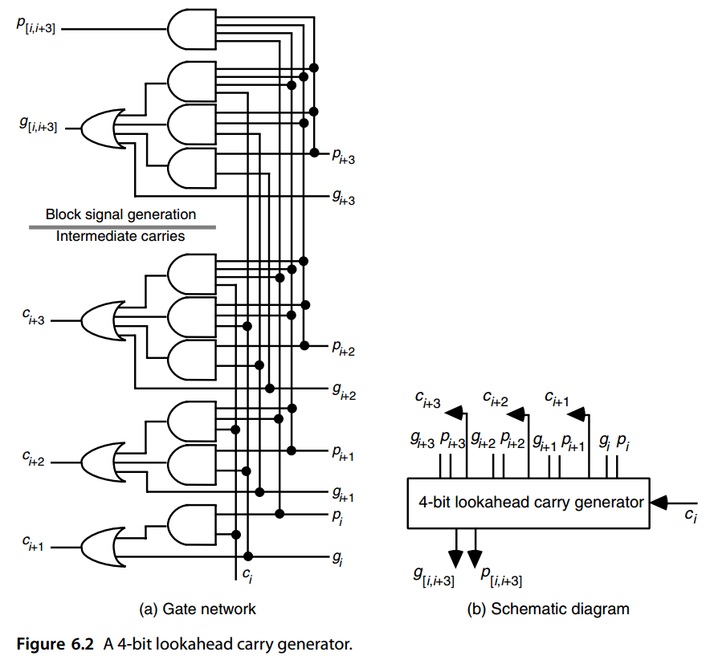

First, however, let us take a somewhat more general view of the block generate and propagate signals. Assuming  *i* 0  *< i* 1  *< i* 2, we can write 

然而，首先让我们对模块生成和传播信号有一个更一般的看法。假设 $i_0 < i_1 < i_2$，我们可以写出下面等式

$g_{[ i_0, i_2−1]} = g_{[i_1, i_2−1]} ∨ g_{[i_0, i_1−1]} p_{[ i_1, i_2−1]}$

This equation essentially says that a carry is generated by the block of positions from  *i* 0 to  *i* 2 − 1 if and only if a carry is generated by the [ *i* 1,  *i* 2 − 1] block or a carry generated *p*[ *i*,  *i*+3] by the [i0, i1 − 1] block is propagated by the [i1, i2 − 1] block. Similarly

该等式本质上表示进位是由 $i_0$ 开始的位置块生成的到 $i_2 − 1$ 当且仅当 $[ i_1, i_2 − 1]$ 块生成进位或由 $[ i_0, i_1 − 1]$ 块生成进位然后由 $[ i_1, i_2 − 1]$ 块传播。类似的有下面等式

$p[i_0,i_2−1] = p[i_0,i_1−1]p[i_1,i_2−1]$


In fact the two blocks being merged into a larger block do not have to be contiguous; they can also be overlapping. In other words, for the possibly overlapping blocks [ *i* 1,  *j* 1] and [ *i* 0,  *j* 0],  *i* 0 ≤  *i* 1 − 1 ≤  *j* 0  *< j* 1, we have 

事实上，合并成一个更大块的两个块不必是连续的；它们也可以重叠。换句话说，对于可能重叠的块 $[ i_1, j_1]$  和 $[ i_0, j_0]$, $i_0 ≤ i_1 − 1 ≤ j_0 < j_1$，我们有

$g[i_0,j_1] = g[i_1,j_1] ∨ g[i_0,j_0]p[i_1,j_1]$

$p[i_0,j_1] = p[i_0,j_0]p[i_1,j_1]$


Figure 6.3 shows that a 4-bit lookahead carry generator can be used to combine the *g*  and  *p*  signals from adjacent or overlapping blocks into the  *p*  and  *g*  signals for the combined block. 

图 6.3 显示 4 位先行进位发生器可用于将来自相邻或重叠块的 g 和 p 信号组合成组合块的 p 和 g 信号。

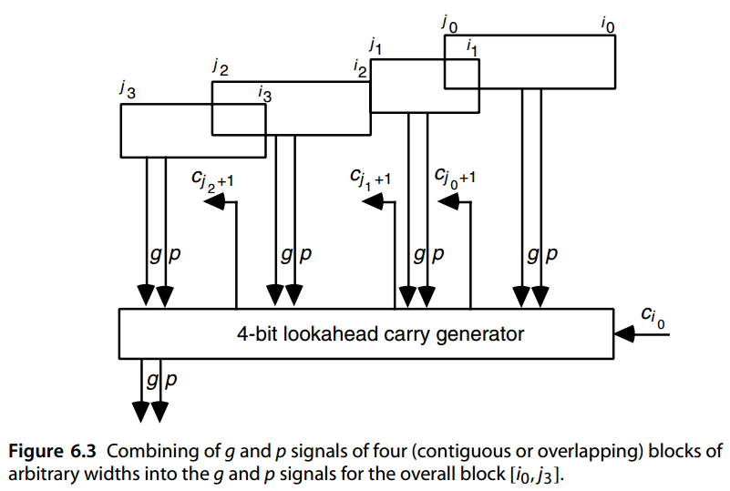


Given the 4-bit lookahead carry generator of Fig. 6.2, it is an easy matter to synthesize wider adders based on a multilevel carry-lookahead scheme. For example, to construct a two-level 16-bit carry-lookahead adder, we need four 4-bit adders and a 4-bit lookahead carry generator, connected together as shown on the upper right quadrant of Fig. 6.4. 

给定图 6.2 所示的 4 位超前进位生成器，基于多级超前进位方案合成更宽的加法器是一件容易的事。例如，要构建一个两级16位先行进位加法器，我们需要四个4位加法器和一个4位超前进位发生器，如图6.4右上象限所示连接在一起。

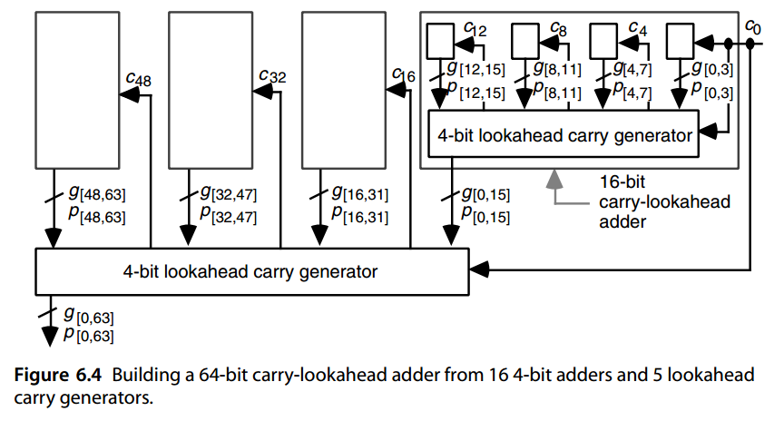

The 4-bit lookahead carry generator in this case can be viewed as predicting the three intermediate carries in a 4-digit radix-16 addition. The latency through this 16-bit adder consists of the time required for:

- Producing the  *g*  and  *p*  signals for individual bit positions (1 gate level). 
- Producing the  *g*  and  *p*  signals for 4-bit blocks (2 gate levels). 
- Predicting the carry-in signals  *c* 4,  *c* 8, and  *c* 12 for the blocks (2 gate levels). 
- Predicting the internal carries within each 4-bit block (2 gate levels). 
- Computing the sum bits (2 gate levels). 

Thus the total latency for the 16-bit adder is 9 gate levels, which is much better than the 32 gate levels required by a 16-bit ripple-carry adder. 

在这种情况下，4 位先行超前生成器可以被视为预测 4 位基 16 加法中的三个中间进位。通过该 16 位加法器的延迟包括以下所需的时间：

- 为各个位位置（1 个门级）生成 g 和 p 信号。
- 生成 4 位块（2 个门级）的 g 和 p 信号。预测块（2 个门级）的进位信号 c 4、c 8 和 c 12。
- 预测每个 4 位块（2 个门级）内的内部进位。
- 计算总和位（2 个门级）。

因此，16 位加法器的总延迟为 9 个门级，这比 16 位纹波进位加法器所需的 32 个门级要好得多。

Similarly, to construct a three-level 64-bit carry-lookahead adder, we can use four of the 16-bit adders above plus one 4-bit lookahead carry generator, connected together as shown in Fig. 6.4. The delay will increase by four gate levels with each additional level of lookahead: two levels in the downward movement of the  *g*  and  *p*  signals, and two levels for the upward propagation of carries through the extra level. Thus, the delay of a  *k*-bit carry-lookahead adder based on 4-bit lookahead blocks is

同样，要构造一个三级 64 位先行进位加法器，我们可以使用上面的 4 个 16 位加法器加上 1 个 4 位先行进位发生器，连接在一起如图 6.4 所示。每增加一个超前级别，延迟将增加四个门级别：g 和 p 信号向下移动的两个级别，以及通过额外级别的进位向上传播的两个级别。因此，基于 4 位先行块的 k 位进位先行加法器的延迟为

$\begin{equation} T_{Lookahead−add} = 4 \log_4 k + 1 \text{ gate levels} \end{equation}$

Hence, the 64-bit carry-lookahead adder of Fig. 6.4 has a latency of 13 gate levels. 

因此，图 6.4 的 64 位进位超前加法器具有 13 个门级的延迟。

One can of course use 6-bit or 8-bit lookahead blocks to reduce the number of lookahead levels for a given word width. But this may not be worthwhile in view of the longer delays introduced by gates with higher fan-in. When the word width is not a power of 4, some of the inputs and/or outputs of the lookahead carry generators remain unused, and the latency formula becomes 4 log4  *k* + 1. 

当然可以使用 6 位或 8 位先行块来减少给定字宽的先行级别。但考虑到扇入较高的门会带来更长的延迟，这可能不值得。当字宽不是 4 的幂时，先行进位生成器的一些输入和/或输出保持未使用，并且延迟公式变为 $4 \left \lceil \log_4 k \right \rceil + 1$。

One final point about the design depicted in Fig. 6.4: this 64-bit adder does not produce a carry-out signal ($c_{64}$), which would be needed in many applications. There are two ways to remedy this problem in carry-lookahead adders. One is to generate   $c_{out}$ externally based on auxiliary signals or the operand and sum bits in position  *k* − 1: 

关于图 6.4 中所示设计的最后一点：该 64 位加法器不会产生许多应用中需要的进位信号 ($c_{64}$)。在超前进位加法器中，有两种方法可以解决这个问题。一种是根据辅助信号或位置 $k − 1$ 的操作数和和位在外部生成 $c_{out}$： 

$c_{out} = g[0, k−1] ∨ c_0 p[0, k−1] = x_{k−1} y_{k−1} ∨ \bar{s}_{k−1} (x_{k−1} ∨ y_{k−1} )$ 

Another is to design the adder to be 1 bit wider than needed (e.g., 61 bits instead of 60), using the additional sum bit as  $c_{out}$. 

另一种方法是使用附加和将加法器设计为比所需宽 1 位（例如，61 位而不是 60 位）位为$c_{out}$。


## 6.3 LING型加法器与相关设计

The Ling adder is a type of carry-lookahead adder that achieves significant hardware savings. Consider the carry recurrence and its unrolling by four steps:

Ling 加法器是一种超前进位加法器，可显着节省硬件成本。考虑进位递归将其展开四步：

$\begin{array}{l} c_i &= g_{i−1} ∨ c_{i−1}p_{i−1} = g_{i−1} ∨ c_{i−1}t_{i−1}
\\ &= g_{i−1} ∨ g_{i−2}t_{i−1} ∨ g_{i−3}t_{i−2}t_{i−1} ∨ g_{i−4}t_{i−3}t_{i−2}t_{i−1} ∨ c_{i−4}t_{i−4}t_{i−3}t_{i−2}t_{i−1} \end{array}$

Ling’s modification consists of propagating *hi* = *ci* ∨ *ci*−1 instead of *ci*. To understand the following derivations, we note that *gi*−1 implies *ci (ci* = 1 if *gi*−1 = 1 *)*, which in turn implies *hi*.

Ling 的修改包括传播 hi = $c_i ∨ c_{i−1}$ 而不是 ci。为了理解以下推导，我们注意到 $g_{i−1}$ 蕴含 $c_i$ （如果 $g_{i−1} = 1$ 则 $c_i = 1$ ），这又蕴含 $h_i$。


$$
\begin{array}{rl}
c_{i−1}p_{i−1} &= c_{i−1}p_{i−1} ∨ g_{i−1}p_{i−1} \text{ \{zero\} } ∨ p_{i−1}c_{i−1}p_{i−1} \text{ \{repeated term\} } \\
               &= c_{i−1}p_{i−1} ∨ (g_{i−1} ∨ p_{i−1}c_{i−1})p_{i−1} \\
               &= (c_{i−1} ∨ c_i)p_{i−1} = h_ip_{i−1} \\
c_i &= g_{i−1} ∨ c_{i−1}p_{i−1} \\
   &= h_ig_{i−1} \text{ \{ since } g_{i−1} \text{ implies } h_i \text{\} } ∨ h_ip_{i−1} \text{ \{ from above \} } \\
   &= h_i(g_{i−1} ∨ p_{i−1}) = h_i t_{i−1} \\
h_i &= c_i ∨ c_{i−1} = (g_{i−1} ∨ c_{i−1}p_{i−1}) ∨ c_{i−1} \\
   &= g_{i−1} ∨ c_{i−1} = g_{i−1} ∨ h_{i−1}t_{i−2} \text{ \{from above\} }
\end{array}
$$


Unrolling the preceding recurrence for *hi*, we get

展开 $h_i$ 的前面的递归，我们得到
$$
\begin{array}{l}
h_i &= g_{i−1} ∨ t_{i−2} h_{i−1} = g_{i−1} ∨ t_{i−2}(g_{i−2} ∨ h_{i−2} t_{i−3}) \\
   &= g_{i−1} ∨ g_{i−2} ∨ h_{i−2} t_{i−2} t_{i−3} \text{ \{ since } t_{i−2} g_{i−2} = g_{i−2} \text{ \}} \\
   &= g_{i−1} ∨ g_{i−2} ∨ g_{i−3} t_{i−3} t_{i−2} ∨ h_{i−3} t_{i−4} t_{i−3} t_{i−2} \\
   &= g_{i−1} ∨ g_{i−2} ∨ g_{i−3} t_{i−2} ∨ g_{i−4} t_{i−3} t_{i−2} ∨ h_{i−4} t_{i−4} t_{i−3} t_{i−2} 
\end{array}
$$
We see that expressing  *hi*  in terms of  *hi*−4 needs five product terms, with a maximum four-input AND gate, and a total of 14 gate inputs. By contrast, expressing  *ci*  as 

我们看到，用 $h_{i−4}$ 表达 $h_i$ 需要 5 个乘积项，最多有 4 个输入与门，总共 14 个门输入。相比之下，将 ci 表示为

$c_i = g_{i−1} ∨ g_{i−2} t_{i−1} ∨ g_{i−3} t_{i−2} t_{i−1} ∨ g_{i−4} t_{i−3} t_{i−2} t_{i−1} ∨ c_{i−4} t_{i−4} t_{i−3} t_{i−2} t_{i−1}$

requires five terms, with a maximum five-input AND gate, and a total of 19 gate inputs. The advantage of  *hi*  over  *ci*  is even greater if we can use wired-OR (3 gates with 9 inputs vs. 4 gates with 14 inputs). Once  *hi*  is known, however, the sum is obtained by a slightly more complex expression compared with  *si* =  *pi* ⊕  *ci*:

需要 5 项，最多有 5 个输入与门，总共 19 个门输入。如果我们可以使用线或（具有 9 个输入的 3 个门与具有 14 个输入的 4 个门），则 $h_i$ 相对于 $c_i$ 的优势会更大。然而，一旦 $h_i$ 已知，与 $s_i = p_i ⊕ c_i$ 相比，可以通过稍微复杂的表达式获得总和：

$s_i = p_i ⊕ c_i = p_i ⊕ h_it_{i−1}$

This concludes our presentation of Ling’s improved carry-lookahead adder. The reader can skip the rest of this section with no harm to continuity. 

我们对 Ling 改进的超前进位加法器的介绍到此结束。读者可以跳过本节的其余部分，这不会影响连续性。

A number of related designs have been developed based on ideas similar to Ling’s. For example, Doran [Dora88] suggests that one can in general propagate $η$ instead of $c$ where

基于与凌类似的想法，已经开发出许多相关设计。例如，Doran [Dora88] 建议一般可以传播 $η$ 而不是 $c$，其中

$η_{i+1} = f (x_i, y_i, c_i) = ψ(x_i, y_i)c_i ∨ \phi(x_i, y_i)\bar{c}_i$

The residual functions *ψ* and *φ* in the preceding Shannon expansion of *f* around *ci* must be symmetric, and there are but eight symmetric functions of the two variables *xi* and *yi*. Doran shows that not all 8 × 8 = 64 possibilities are valid choices for *ψ* and *φ*, since in some cases the sum cannot be computed based on the *ηi* values. Dividing the eight symmetric functions of *xi* and *yi* into the two disjoint subsets {0, ¯ *ti*, *gi*, ¯ *pi*} and {1, *ti*, ¯ *gi*, *pi*}, Doran proves that *ψ* and *φ* cannot both belong to the same subset. Thus, there are only 32 possible adders. Four of these 32 possible adders have the desirable properties of Ling’s adder, which represents the special case of *ψ(xi*, *yi)* = 1 and *φ(xi*, *yi)* = *gi* = *xiyi*.

前面 $f$ 围绕 $c_i$ 进行的香农展开中的残差函数 $ψ$ 和 $\phi$ 必须是对称的，并且两个变量 $x_i$ 和 $y_i$ 的对称函数只有 8 个。 Doran 表明，并非所有 8 × 8 = 64 种可能性都是 $ψ$ 和 $\phi$ 的有效选择，因为在某些情况下，无法根据 $η_i$ 值计算总和。将 $x_i$ 和 $y_i$ 的八个对称函数分为两个不相交的子集 {$0, \bar{t}_i, g_i, \bar{p}_i$} 和 {$1, t_i, \bar{g}_i, p_i$}，Doran证明 $ψ$ 和 $\phi$ 不能同时属于同一个子集。因此，只有 32 个可能的加法器。这 32 个可能的加法器中有 4 个具有 Ling 加法器的理想属性，它代表 $ψ(x_i, y_i) = 1$ 和 $\phi(x_i, y_i) = g_i = x_iy_i$ 的特殊情况。


## 6.4 并行前缀进位计算

Consider two contiguous or overlapping blocks B and B and their associated generate and propagate signal pairs ( *g*,  *p*) and ( *g*,  *p*), respectively. As shown in Fig. 6.5, the generate and propagate signals for the merged block B can be obtained from the equations:

考虑两个连续或重叠的块 $B'$ 和 $B''$ 及其关联的分别生成和传播信号对 $(g', p')$ 和 $(g'', p'')$。如图 6.5 所示，合并块 B 的生成和传播信号可由以下等式获得：

$g = g'' ∨ g' p''$

$p = p' p''$

That is, carry generation in the larger group takes place if the left group generates a carry or the right group generates a carry and the left one propagates it, while propagation occurs if both groups propagate the carry. 

也就是说，如果左侧组生成进位或右侧组生成进位并且左侧组传播进位，则较大组中会发生进位生成，而如果两个组都传播进位，则会发生传播。

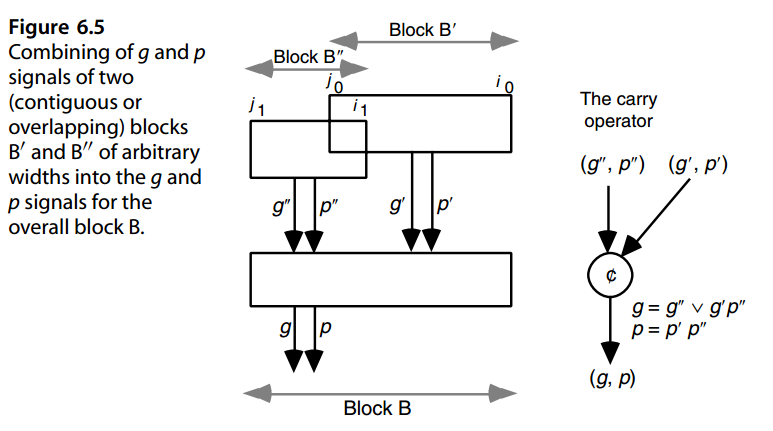

We note that in the discussion above, the indices  *i* 0,  *j* 0,  *i* 1, and  *j* 1 defining the two contiguous or overlapping blocks are in fact immaterial, and the same expressions can be written for any two adjacent groups of any width. Let us define the “carry” operator c */*  on (*g*,  *p*) signal pairs as follows (right side of Fig. 6.5):

我们注意到，在上面的讨论中，定义两个连续或重叠块的索引 $i_0 、j_0 、i_1 和 j_1$ 实际上是无关紧要的，并且可以为任何宽度的任何两个相邻组编写相同的表达式。让我们定义“进位”运算符 $\not{c}$ 在( g, p) 信号对如下（图 6.5 右侧）：

$(g, p) = (g', p' ) \not{c} (g'', p'' ) \text{ 代表 } g = g'' ∨ g' p'', p = p' p'' $

The carry operator c */*  is  *associative*, meaning that the order of evaluation does not affect the value of the expression  *(g*,  *p* *)*  c */ (g*,  *p* *)*  c */ (g*,  *p* *)*, but it is not  *commutative*, since *g* ∨  *g* *p* is in general not equal to  *g* ∨  *g* *p*. 

进位运算符 $\not{c}$ 满足结合律，这意味着求值顺序不会影响表达式 $(g', p' ) \not{c} (g'', p'' ) \not{c} (g''', p''' )$ 的值，但它不可交换，因为 $g'' ∨ g' p''$ 通常不等于 $g' ∨ g'' p'$。

Observe that in an adder with no  *c* in, we have  *ci*+1 =  *g*[0,  *i*]; that is, a carry enters position  *i*+1 if and only if one is generated by the block [0,  *i*]. In an adder with  *c* in, a carryin of 1 can be viewed as a carry generated by stage −1; we thus set  *p*−1 = 0,  *g*−1 =  *c* in and compute  *g*[−1,  *i*] for all  *i*. So, the problem remains the same, but with an extra stage ( *k* + 1 rather than  *k*). The problem of carry determination can, therefore, be formulated as follows:

观察到在没有 $c_{in}$ 的加法器中，我们有 $c_{i+1}$ = $g[0, i]$；也就是说，当且仅当块 $[0, i]$ 生成一个进位时，进位才会进入位置 $i+1$。在有$c_{in}$的加法器中，进位为1可以看作是级-1产生的进位；因此，我们设置 $p_{−1} = 0, g_{−1} = c_{in}$ 并计算所有 $i$ 的 $g[−1, i]$。因此，问题仍然相同，但有一个额外的阶段（ $k + 1$ 而不是 $k$）。因此，进位确定问题可以表述如下：

给定

$(g_0, p_0) \  (g_1, p_1) \cdots (g_{k−2}, p_{k−2})\ (g_{k−1}, p_{k−1})$

找到

$(g[0,0], p[0,0]) (g[0,1], p[0,1]) · · · (g[0,k−2], p[0,k−2]) (g[0,k−1], p[0,k−1])$

The desired signal pairs can be obtained by evaluating all the prefixes of

可以通过评估所有前缀来获得所需的信号对

$(g_0, p_0 ) \not{c} \ (g_1, p_1 ) \not{c} \cdots \not{c} (g_{k−2}, p_{k−2} ) \not{c} (g_{k−1}, p_{k−1} ) $

in parallel. In this way, the carry problem is converted to a parallel prefix computation, and any prefix computation scheme can be used to find all the carries. 

并行进行。这样，进位问题就转化为并行的前缀计算，并且可以使用任何前缀计算方案来查找所有进位。

A parallel prefix computation can be defined with any associative operator. In the following, we use the addition operator with integer operands, in view of its simplicity and familiarity, to illustrate the methods. The  *parallel prefix sums*  problem is defined as follows:

并行前缀计算可以使用任何关联运算符来定义。鉴于其简单性和熟悉性，下面我们使用带有整数操作数的加法运算符来说明该方法。并行前缀和问题定义如下：


$$
\begin{array}{l}
\text{给定：} &x_0 &x_1       &x_2          &x_3                &\cdots &x_{k−1} \\
\text{找到：} &x_0 &x_0 + x_1 &x_0 + x_1 + x_2 &x_0 + x_1 + x_2 + x_3 &\cdots &x_0 + x_1 + · · · + x_{k−1}
\end{array}
$$


Any design for this parallel prefix sums problem can be converted to a carry computation network by simply replacing each adder cell with the carry operator of Fig. 6.5. There is one difference worth mentioning, though. Addition is commutative. So if prefix sums are obtained by computing and combining the partial sums in an arbitrary manner, the resulting design may be unsuitable for a carry network. However, as long as blocks whose sums we combine are always contiguous and we do not change their ordering, no problem arises. 

通过简单地将每个加法器单元替换为图 6.5 中的进位运算符，针对此并行前缀和问题的任何设计都可以转换为进位计算网络。不过，有一个差异值得一提。加法是可交换的。因此，如果通过以任意方式计算和组合部分和来获得前缀和，则所得设计可能不适合进位网络。然而，只要我们合并的块总是连续的并且我们不改变它们的顺序，就不会出现问题。

Just as one can group numbers in any way to add them, ( *g*,  *p*) signal pairs can be grouped in any way for combining them into block signals. In fact, ( *g*,  *p*) signals give us an additional flexibility in that overlapping groups can be combined without affecting the outcome, whereas in addition, use of overlapping groups would lead to incorrect sums. 

正如人们可以以任何方式对数字进行分组以将它们相加一样，（g，p）信号对也可以以任何方式分组以将它们组合成块信号。事实上，( g, p) 信号为我们提供了额外的灵活性，因为可以组合重叠的组而不影响结果，而此外，使用重叠的组会导致不正确的总和。

Figure 6.6a depicts a four-input prefix sums network composed of four adder blocks, arranged in two levels. It produces the prefix sums 5, 7, 6, and 12 when supplied with the inputs 5, 2, −1, and 6, going from right to left. Note that we use the right-to-left ordering of inputs and outputs on diagrams, because this corresponds to how we index digit positions in positional number representation. So, what we are computing really constitutes postfix sums of the expression *x* 3 + *x* 2 + *x* 1 + *x* 0. However, we will continue to use the terms “prefix sums” and “parallel prefix networks” in accordance with the common usage. As long as we remember that the indexing in carry network diagrams goes from right to left, no misinterpretation will arise. Figure 6.6b shows the carry network derived from the prefix sums network of Fig. 6.6a by replacing each adder with a carry operator. It also shows how the outputs of this carry network are related to carries that we need to complete a 4-bit addition.

图 6.6a 描述了由四个加法器块组成的四输入前缀和网络，这些加法器块布置在两级中。当提供输入 5、2、-1 和 6（从右到左）时，它会生成前缀和 5、7、6 和 12。请注意，我们在图表上使用从右到左的输入和输出排序，因为这对应于我们在位置数字表示中索引数字位置的方式。因此，我们计算的实际上是表达式 $x_3 + x_2 + x_1 + x_0$ 的后缀和。但是，我们将继续按照常见用法使用术语“前缀和”和“并行前缀网络”。只要我们记住进位网络图中的索引是从右到左，就不会产生误解。图 6.6b 显示了通过用进位运算符替换每个加法器而从图 6.6a 的前缀和网络导出的进位网络。它还显示了该进位网络的输出如何与我们完成 4 位加法所需的进位相关。

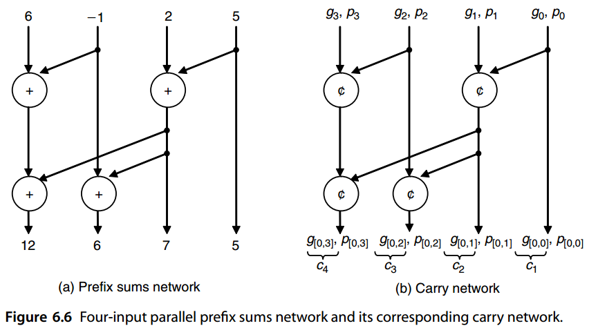


## 6.5 混合的并行前缀进位网络

Now, focusing on the problem of computing prefix sums, we can use several strategies to synthesize a parallel prefix sum network. Figure 6.7 is based on a divide-and-conquer approach as proposed by Ladner and Fischer [Ladn80]. The low-order *k*/2 inputs are processed by the subnetwork at the right to compute the prefix sums *s* 0, *s* 1, *. . .* , *sk/* 2−1. Partial prefix sums are computed for the high-order *k*/2 values (the left subnetwork) and *sk/* 2−1 (the leftmost output of the first subnetwork) is added to them to complete the computation. Such a network is characterized by the following recurrences for its delay (in terms of adder levels) and cost (number of adder cells):

现在，关注计算前缀和的问题，我们可以使用多种策略来合成并行前缀和网络。图 6.7 基于 Ladner 和 Fischer [Ladn80] 提出的分而治之方法。低阶 k/2 输入由右侧的子网络处理，以计算前缀和 $s_0, s_1, ...，s_{k/2−1}$。计算高阶 $k/2$ 值（左侧子网）的部分前缀和，并将 $s_{k/2−1}$ （第一个子网的最左侧输出）添加到其中以完成计算。这种网络的特点是其延迟（就加法器级别而言）和成本（加法器单元的数量）具有以下递归：

$\text{延迟递归：} D(k) = D(k/2) + 1 = \log_2 k $

$\text{成本递归：}C(k) = 2C(k/2) + k/2 = (k/2) \log_2 k$

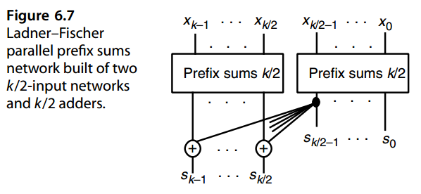

A second divide-and-conquer design for computing prefix sums, proposed by Brent and Kung [Bren82], is depicted in Fig. 6.8. Here, the inputs are first combined pairwise to obtain the following sequence of length *k*/2:

Brent 和 Kung [Bren82] 提出的用于计算前缀和的第二种分治设计如图 6.8 所示。这里，首先将输入两两组合以获得以下长度为 k/2 的序列：

$\begin{matrix}x_0 + x_1 &x_2 + x_3 &x_4 + x_5 &· · · &x_{k−4} + x_{k−3} &x_{k−2} + x_{k−1}\end{matrix}$

Parallel prefix sum computation on this new sequence yields the odd-indexed prefix sums *s* 1,  *s* 3,  *s* 5,  *. . .*  for the original sequence. Even-indexed prefix sums are then computed by using  *s* 2 *j* =  *s* 2 *j*−1 +  *x* 2 *j*. The cost and delay recurrences for the design of Fig. 6.8 are: Delay recurrence:

对此新序列的并行前缀和计算产生奇数索引前缀和 $s_1, s_3, s_5,...$为原始序列。然后使用 $s_{2 j} = s_{2 j−1} + x_{2 j}$ 计算偶索引前缀和。图 6.8 设计的成本和延迟递归为：

$\text{延迟递归：} D(k) = D(k/2) + 2 = 2\log_2 k-1 $

​             事实上后面我们可以看到是$D(k) = 2 \log_2 k − 2$

$\text{成本递归：}C(k) = C(k/2) + k - 1 = 2k-2- \log_2 k$

So, the Ladner–Fischer design is faster than the Brent–Kung design (log2  *k*  as opposed to 2 log2  *k* − 2 adder levels) but also much more expensive [ *(k/* 2 *)*  log2  *k*  as opposed to 2 *k* − 2 − log2  *k*  adder cells]. The Ladner–Fischer design also leads to large fan-out requirements if implemented directly in hardware. In other words, the output of one of the adders in the right part must feed the inputs of  *k*/2 adders in the left part. 

因此，Ladner–Fischer 设计比 Brent–Kung 设计更快（$\log_2 k$ 相对于 $2 \log_2 k − 2$ 个加法器级别），但也更昂贵 [ $(k/ 2 ) \log_2 k$ 相对于 $2 k − 2 − log2 k$ 加法器单元]。如果直接在硬件中实现，Ladner-Fischer 设计还会导致较大的扇出要求。换句话说，右侧部分中的一个加法器的输出必须馈送到左侧部分中的 k/2 个加法器的输入。

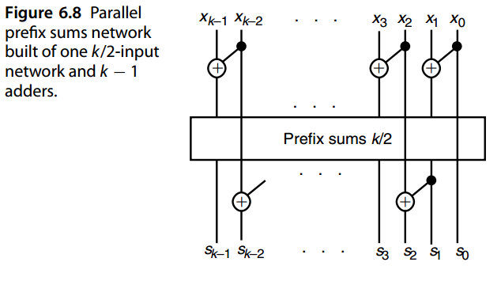

The 16-input instance of the Brent–Kung design of Fig. 6.8 is depicted in Fig. 6.9.Note that even though the graph of Fig. 6.9 appears to have seven levels, two of the levels near the middle are independent, thus implying a single level of delay. In general, a *k*-input Brent–Kung parallel prefix graph will have a delay of 2 log2 *k* − 2 levels and a cost of 2 *k* − 2 − log2 *k* cells.

图 6.8 的 Brent-Kung 设计的 16 输入实例如图 6.9 所示。请注意，即使图 6.9 的图表看起来有七级，但中间附近的两个级别是独立的，因此意味着单个延迟级别。一般来说，k 输入的 Brent-Kung 并行前缀图将具有 $2 \log_2 k − 2$ 个级别的延迟和 $2 k − 2 − log2 k$ 个单元的成本。

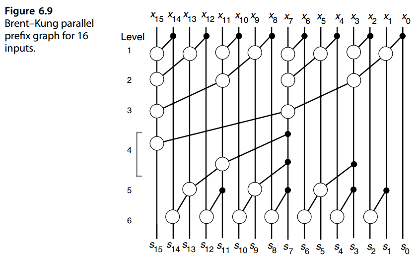

Figure 6.10 depicts a Kogge–Stone parallel prefix graph that has the same delay as the design shown in Fig. 6.7 but avoids its fan-out problem by distributing the computations. A *k*-input Kogge–Stone parallel prefix graph has a delay of log2 *k* levels and a cost of *k* log2 *k* − *k* + 1 cells. The Kogge–Stone parallel prefix graph represents the fastest possible implementation of a parallel prefix computation if only two-input blocks are allowed. However, its cost can be prohibitive for large  *k*, in terms of both the number of cells and the dense wiring between them. 

图 6.10 描绘了一个 Kogge-Stone 并行前缀图，它与图 6.7 所示的设计具有相同的延迟，但通过分布计算避免了扇出问题。 k 输入 Kogge-Stone 并行前缀图具有 $\log_2 k$ 级别的延迟和 $k \log_2 k − k + 1$ 个单元的成本。 如果只允许两个输入块，则Kogge-Stone 并行前缀图代表最快可能实现并行前缀计算。然而，对于大 k 的单元数量和单元之间的密集布线而言，其成本可能令人望而却步。

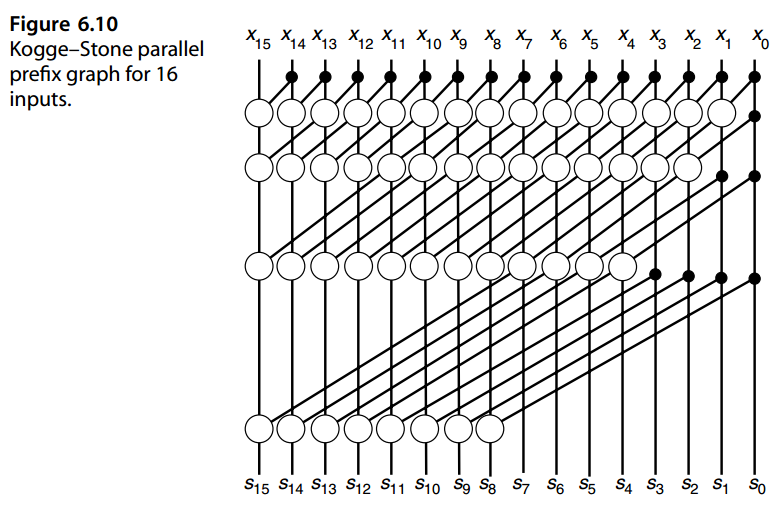

Many other parallel prefix network designs are possible. For example, it has been suggested that the Brent–Kung and Kogge–Stone approaches be combined to form hybrid designs [Sugl90]. In Fig. 6.11, the middle four of the six levels in the design of Fig. 6.9 (representing an eight-input parallel prefix computation) have been replaced by the eight-input Kogge–Stone network. The resulting design has five levels and 32 cells, placing it between the pure Brent–Kung (six levels, 26 cells) and pure Kogge–Stone (four levels, 49 cells) designs. 

许多其他并行前缀网络设计也是可能的。例如，有人建议将 Brent-Kung 和 Kogge-Stone 方法结合起来形成混合设计 [Sugl90]。在图6.11中，图6.9的设计中的六个级别中的中间四个（代表八输入并行前缀计算）已被八输入 Kogge-Stone 网络取代。最终的设计有五层和 32 个单元，介于纯 Brent-Kung（六层，26 个单元）和纯 Kogge-Stone（四层，49 个单元）设计之间。

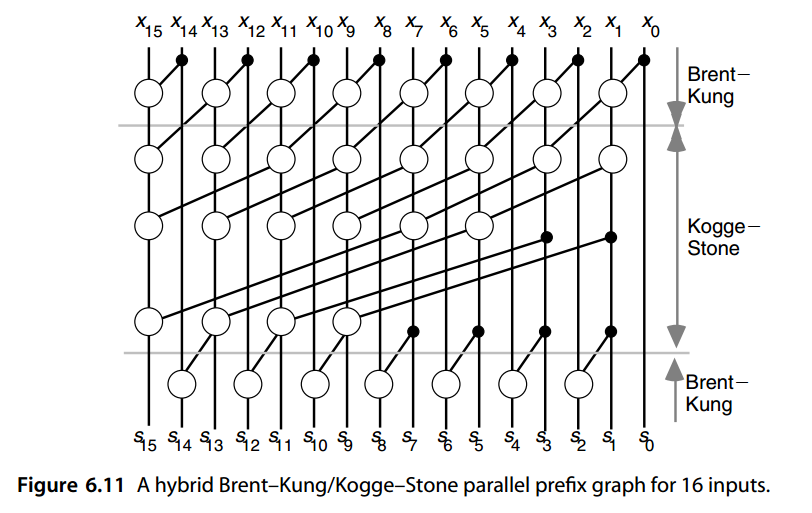

More generally, if a single Brent–Kung level is used along with a  *k*/2-input Kogge–Stone design, delay and cost of the hybrid network become log2  *k* + 1 and ( *k*/2)log2  *k*, respectively. The resulting design is thus close to minimum in terms of delay (only one level more than Kogge–Stone) but costs roughly half as much. 

更一般地，如果单个 Brent–Kung 级别与 k/2 输入 Kogge–Stone设计一起使用 ，混合网络的时延和成本分别变为$\log_2k+1$和$(k/2)\log_2k$。因此，最终的设计在延迟方面接近最低水平（仅比 Kogge-Stone 多一级），但成本大约是后者的一半。

The theory of parallel prefix graphs is quite rich and well developed. There exist both theoretical bounds and actual designs with different restrictions on fan-in/fan-out and with various optimality criteria in terms of cost and delay (see, e.g., Chapters 5–7, pp. 133–211, of [Laks94]). 

并行前缀图的理论相当丰富且发达。理论界限和实际设计都存在，对扇入/扇出有不同的限制，并且在成本和延迟方面有不同的最优标准（例如，参见[Laks94]的第5-7章，第133-211页）。

In devising their design, Brent and Kung [Bren82] were motivated by the need to reduce the chip area in very large-scale integration (VLSI) layout of the carry network. Other performance or hardware limitations may also be considered. The nice thing about formulating the problem of carry determination as a parallel prefix computation is that theoretical results and a wealth of design strategies carry over with virtually no effort.  Not all such relationships between carry networks and parallel prefix networks, or the virtually unlimited hybrid combinations, have been explored in full. 

在设计过程中，Brent 和 Kung [Bren82] 的动机是需要减少进位网络在超大规模集成 (VLSI) 布局中的芯片面积。还可以考虑其他性能或硬件限制。将进位确定问题表述为并行前缀计算的好处在于，理论结果和大量设计策略几乎可以毫不费力地延续下去。进位网络和并行前缀网络之间的所有此类关系，或几乎无限的混合组合，并未得到充分探索。


## 6.6 VLSI实现相关

The carry network of Fig. 6.9 is quite suitable for VLSI implementation, but it might be deemed too slow for high-performance designs and/or wide words. Many designers have proposed alternate networks that offer reduced latency by using features of particular technologies and taking advantage of related optimizations. We review one example here that is based on radix-256 addition of 56-bit numbers as implemented in the Advanced Micro Devices Am29050 microprocessor. The following description is based on a 64-bit version of the adder. 

图 6.9 的进位网络非常适合 VLSI 实现，但对于高性能设计和/或宽字来说可能会被认为太慢。许多设计人员提出了替代网络，通过使用特定技术的功能并利用相关优化来减少延迟。我们在此回顾一个基于 56 位数字的 radix-256 加法的示例，该示例在 Advanced Micro Devices Am29050 微处理器中实现。以下描述基于 64 位版本的加法器。

In radix-256 addition of 64-bit numbers, only the carries  *c* 8,  *c* 16,  *c* 24,  *c* 32,  *c* 40,  *c* 48, and  *c* 56 need to be computed. First, 4-bit Manchester carry chains (MCCs) of the type shown in Fig. 6.12a are used to derive  *g*  and  *p*  signals for 4-bit blocks. These signals, denoted by [0, 3], [4, 7], [8, 11], etc. on the left side of Fig. 6.13, then form the inputs to one 5-bit and three 4-bit MCCs that in turn feed two more MCCs in the third level. The six MCCs in levels 2 and 3 in Fig. 6.13 are of the type shown in Fig. 6.12b; that is, they also produce intermediate  *g*  and  *p*  signals. For example, the MCC with inputs [16, 19], [20, 23], [24, 27], and [28, 31] yields the intermediate outputs [16, 23] and [16, 27], in addition to the signal pair [16, 31] for the entire group. 

在 64 位数字的基 256 加法中，仅需要计算进位 $c_8、c_16、c_24、c_32、c_40、c_48 和 c_56$。首先，图 6.12a 所示类型的 4 位曼彻斯特进位链 (MCC) 用于导出 4 位块的 g 和 p 信号。这些信号在图 6.13 左侧用 [0, 3]、[4, 7]、[8, 11] 等表示，然后形成一个 5 位 MCC 和三个 4 位 MCC 的输入，这些 MCC 又为第三级中的另外两个 MCC 提供信号。图 6.13 中第 2 层和第 3 层的 6 个 MCC 的类型如图 6.12b 所示；也就是说，它们还产生中间 g 和 p 信号。例如，具有输入 [16, 19]、 [20, 23]、[24, 27] 和 [28, 31]的 MCC，除了整个组的信号对 [16, 31] 之外， 还生成中间输出 [16, 23] 和 [16, 27]。

Various parallel-prefix adders, all with minimum-latency designs when only node delays are considered, may turn out quite different when the effects of interconnects (including fan-in, fan-out, and signal propagation delay on wires) are considered[Beau01], [Huan00], [Know99].

当仅考虑节点延迟时，各种并行前缀加法器都采用最小延迟设计，但当考虑互连的影响（包括线路上的扇入、扇出和信号传播延迟）时，结果可能会大不相同 [Beau01], [Huan00], [Know99]。

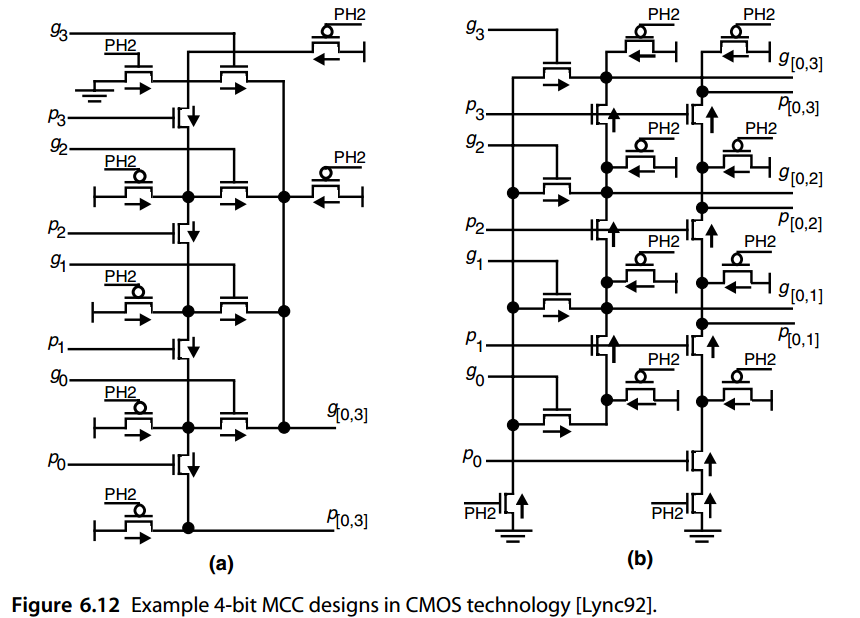

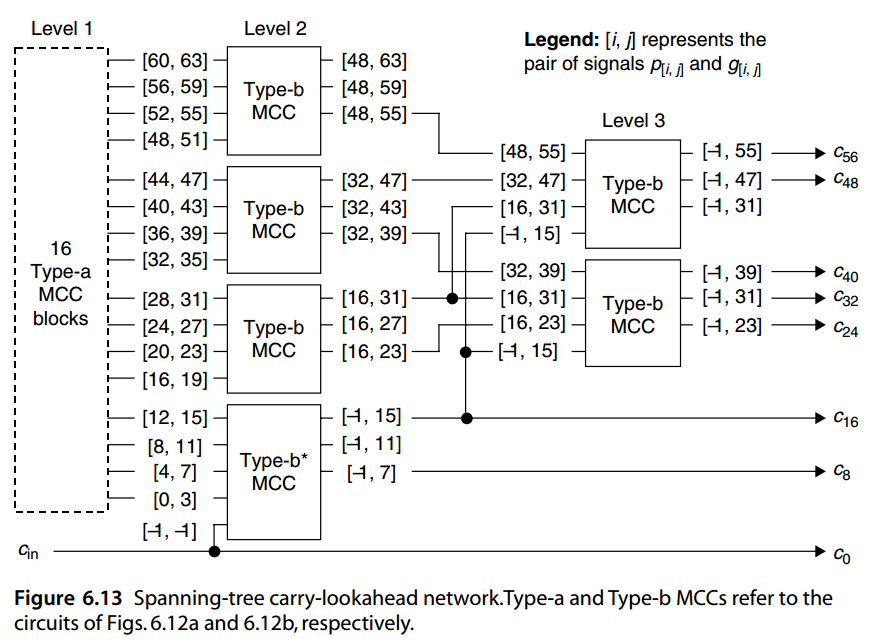


## 问题（略）


## 参考文献和进一步阅读

```
[Bayo83] Bayoumi, M. A., G. A. Jullien, and W. C. Miller, “An Area-Time Efficient NMOS
         Adder,” Integration: The VLSI Journal, Vol. 1, pp. 317–334, 1983.
[Beau01] Beaumont-Smith, A., and C.-C. Lim, “Parallel Prefix Adder Design,” Proc. 15th
         Symp. Computer Arithmetic, pp. 218–225, 2001.
[Bren82] Brent, R. P., and H. T. Kung, “A Regular Layout for Parallel Adders,” IEEE Trans.
         Computers, Vol. 31, pp. 260–264, 1982.
[Burg99] Burgess, N., and S. Knowles, "Efficient Implementation of Rounding Units", Proc.
         33rd Asilomar Conf. Signals Systems and Computers, pp. 1489–1493, 1999.
[Burg05] Burgess, N., “New Models of Prefix Adder Topologies,” J. VLSI Signal Processing,
         Vol. 40, pp. 125–141, 2005.
[Dimi05] Dimitrakopoulos, G., and D. Nikolos, “High-Speed Parallel-Prefix VLSI Ling
         Adders,” IEEE Trans. Computers, Vol. 54, No. 2, pp. 225–231, 2005.
[Dora88] Doran, R. W., “Variants of an Improved Carry Look-Ahead Adder,” IEEE Trans.
         Computers, Vol. 37, No. 9, pp. 1110–1113, 1988.
[Han87] Han, T., and D. A. Carlson, “Fast Area-Efficient Adders,” Proc. 8th Symp. Computer
         Arithmetic, pp. 49–56, 1987.
[Harr03] Harris, D., “A Taxonomy of Parallel Prefix Networks,” Proc. 37th Asilomar Conf.
         Signals, Systems, and Computers, Vol. 2, pp. 2213–2217, 2003.
[Huan00] Huang, Z., and M. D. Ercegovac, “Effect of Wire Delay on the Design of Prefix
         Adders in Deep-Submicron Technology,” Proc. 34th Asilomar Conf. Signals, Systems,
         and Computers, October 2000, pp. 1713–1717, 2000.
[Kant93] Kantabutra, V., “A Recursive Carry-Lookahead/Carry-Select Hybrid Adder,” IEEE
         Trans. Computers, Vol. 42, No. 12, pp. 1495–1499, 1993.
[Know99] Knowles, S., “A Family of Adders,” Proc. 14th Symp. Computer Arithmetic, 1999,
         printed at the end of ARITH-15 Proceedings, pp. 277–284, 2001.
[Kogg73] Kogge, P. M. and H. S. Stone, “A Parallel Algorithm for the Efficient Solution of a
         General Class of Recurrences,” IEEE Trans. Computers, Vol. 22, pp. 786–793, 1973.
[Ladn80] Ladner, R. E., and M. J. Fischer, “Parallel Prefix Computation,” J. ACM, Vol. 27,
         No. 4, pp. 831–838, 1980.
[Laks94] Lakshmivarahan, S., and S. K. Dhall, Parallel Computing Using the Prefix Problem,
         Oxford University Press, 1994.
[Ling81] Ling, H., “High-Speed Binary Adder,” IBM J. Research and Development, Vol. 25,
         No. 3, pp. 156–166, 1981.
[Lync92] Lynch, T., and E. Swartzlander, “A Spanning Tree Carry Lookahead Adder,” IEEE
         Trans. Computers, Vol. 41, No. 8, pp. 931–939, 1992.
[Mano98] Manohar, R., and J. A. Tierno, "Asynchronous Parallel Prefix Computation," IEEE
         Trans. Computers, Vol. 47, No. 11, pp. 1244–1252, 1998.
[Ngai84] Ngai, T. F., M. J. Irwin, and S. Rawat, “Regular Area-Time Efficient Carry-Lookahead
         Adders,” J. Parallel and Distributed Computing, Vol. 3, No. 3, pp. 92–105, 1984.
[Sugl90] Sugla, B., and D. A. Carlson, “Extreme Area-Time Tradeoffs in VLSI,” IEEE Trans.
         Computers, Vol. 39, No. 2, pp. 251–257, 1990.
[Wei90] Wei, B. W. Y., and C. D. Thompson, “Area-Time Optimal Adder Design,” IEEE
         Trans. Computers, Vol. 39, No. 5, pp. 666–675, 1990.
[Wein56] Weinberger, A., and J. L. Smith, “A One-Microsecond Adder Using One-Megacycle
         Circuitry,” IRE Trans. Computers, Vol. 5, pp. 65–73, 1956.
```

