# 7. 其它高速加法器 

Variations in Fast Adders

> “The most constant difficulty in contriving the engine has arisen from the desire to reduce the time in which the calculations were executed to the shortest which is possible.”
> 				— CHARLES BABBAGE , ON THE MATHEMATICAL POWERS OF THE CALCULATING ENGINE


> “设计引擎的最持续的困难源于希望将执行计算的时间减少到尽可能短的时间。”
> 				— 查尔斯·巴贝奇,论计算引擎的数学能力


The carry-lookahead method of Chapter 6 represents the most widely used design for high-speed adders in modern computers. Certain alternative designs, however, either are quite competitive with carry-lookahead adders or offer advantages with particular hardware realizations or technology constraints. The most important of these alternative designs, and various hybrid combinations, are discussed in this chapter.

第 6 章的超前进位方法代表了现代计算机中高速加法器最广泛使用的设计。 然而，某些替代设计要么与超前进位加法器具有相当的竞争力，要么在特定的硬件实现或技术限制方面提供优势。 本章讨论了这些替代设计中最重要的以及各种混合组合。


-   7.1 简单的进位跳跃加法器 SIMPLE CARRY SKIP ADDERS
-   7.2 多层次的进位跳跃加法器 MULTILEVEL CARRY SKIP ADDERS
-   7.3 进位选择加法器 CARRY-SELECT ADDERS
-   7.4 条件和加法器 CONDITIONAL-SUM ADDER
-   7.5 混合设计与优化 HYBRID DESIGNS AND OPTIMIZATIONS
-   7.6 二操作数模加法器 MODULAR TWO-OPERAND ADDERS


## 7.1 简单进位跳跃加法器

Consider a 4-bit group or block in a ripple-carry adder, from stage  *i*  to stage  *i* + 3, where *i*  is a multiple of 4 (Fig. 7.1a). A carry into stage  *i*  propagates through this group of 4 bits if and only if it propagates through all four of its stages. Thus, a  *group propagate* signal is defined as  *p*[ *i*,  *i*+3] =  *pipi*+1  *pi*+2  *pi*+3, which is computable from individual propagate signals by a single four-input AND gate. To speed up carry propagation, one can establish bypass or skip paths around 4-bit blocks, as shown in Fig. 7.1b. 

考虑纹波进位加法器中的 4 位组或块，从阶段 $i$ 到阶段 $i + 3$，其中 $i$ 是 4 的倍数（图 7.1a）。进入阶段 $i$ 的进位能通过这组 4 位传播，当且仅当它传播通过所有四个阶段时。因此，组传播信号定义为 $p[i, i+3] = p_ip_{i+1} p_{i+2} p_{i+3}$，它可以通过单个四输入 AND 门根据各个传播信号进行计算。为了加速进位传播，可以在 4 位块周围建立旁路或跳过路径，如图 7.1b 所示。

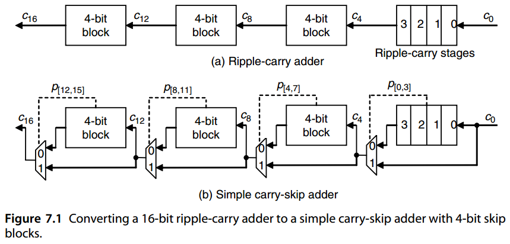

Let us assume that the delay of the skip multiplexer (mux) is equal to carry-propagation delay through one-bit position. Then, the worst-case propagation delay through the carry-skip adder of Fig. 7.1b corresponds to a carry that is generated in stage 0, ripples through stages 1–3, goes through the multiplexer, skips the middle two groups, and ripples in the last group from stage 12 to stage 15. This leads to 9 stages of propagation (18 gate levels) compared to 16 stages (32 gate levels) for a 16-bit ripple-carry adder.

让我们假设跳跃多路复用器 (mux) 的延迟等于进位通过一位位置的传播延迟。然后，最坏情况的传播延迟通过图 7.1b 的跳过进位加法器的进位对应于第 0 级中生成的进位，经过第 1-3 级脉动，经过多路复用器，跳过中间两组，最后一组从第 12 级脉动到第 15 级。与 16 位脉动进位加法器的 16 个级（32 个门级）相比，这导致 9 个传播级（18 个门级）。

Generalizing from the preceding example, the worst-case carry-propagation delay in a *k*-bit carry-skip adder with fixed block width *b*, assuming that one stage of ripple has the same delay as one skip, can be derived:

从前面的示例进行概括，假设一级纹波具有与一级跳跃相同的延迟，则可以得出具有固定块宽度 b 的 k 位跳跃进位加法器中最坏情况的进位传播延迟：


$$
\begin{matrix}
T_{fixed-skip-add} &= &(b − 1) &+ &1 &+ &(k/b − 2) &+ &(b − 1) \\
&&\text{in block 0} &&\text{mux} &&\text{skips} &&\text{in last block} \\
&≈ &2b + k/b − 3 \text{ stages} & & &
\end{matrix}
$$


The optimal fixed block size can be derived by equating *dT* fixed-skip-add */db* with 0: *dT*

最佳固定块大小可以通过求导将 $\mathrm{d}T_{fixed-skip-add} / \mathrm{d}b$ 等于 0 得出：

$\frac{\mathrm{d}T_{fixed-skip-add}}{\mathrm{d}b}=2-k/b^2=0 \Rightarrow b^{opt}=\sqrt{k/2}$

The adder delay with the optimal block size above is

上述最佳块大小的加法器延迟为

$T^{opt}_{fixed−skip−add} = 2\sqrt{k/2}+\frac{k}{\sqrt{k/2}}-3=2\sqrt{2k}-3$

For example, to construct a 32-bit carry-skip adder with fixed-size blocks, we set  *k* = 32 in the preceding equations to obtain  *b* opt = 4 bits and  *T* opt fixed−skip−add= 13 stages (26 gate levels). By comparison, the propagation delay of a 32-bit ripple-carry adder is about 2.5 times as long. 

例如，要构造一个具有固定大小块的 32 位跳进位加法器，我们设置 前面等式中的 k = 32 以获得 $b_{opt} = 4$ 位和

$T^{opt}_{fixed−skip−add}=13$ 级（26 个门级别）。相比之下，32 位纹波进位加法器的传播延迟约为 2.5 倍。

Clearly, a carry that is generated in, or absorbed by, one of the inner blocks travels a shorter distance through the skip blocks. We can thus afford to allow more ripple stages for such a carry without increasing the overall adder delay. This leads to the idea of variable skip-block sizes. 

显然，在内部块之一中生成或吸收的进位通过跳跃块行进较短的距离。因此，我们可以在不增加总体加法器延迟的情况下为此类进位允许更多纹波级。这导致了可变跳过块大小的想法。

Let there be  *t*  blocks of widths  *b* 0,  *b* 1, · · · ,  *bt*−1 going from right to left (Fig. 7.2). Consider the two carry paths (1) and (2) in Fig. 7.2, both starting in block 0, one ending in block *t* − 1 and the other in block *t* − 2. Carry path (2) goes through one fewer skip than (1), so block *t* − 2 can be 1 bit wider than block *t* − 1 without increasing the total adder delay. Similarly, by comparing carry paths (1) and (3), we conclude that block 1 can be 1 bit wider than block 0. So, assuming for ease of analysis that *b* 0 = *bt*−1 = *b* and that the number *t* of blocks is even, the optimal block widths are

设$t$个块的宽度为$b_0 、b_1 、····、b_{t−1}$ 从右到左（图7.2）。考虑图 7.2 中的两条进位路径 (1) 和 (2)，均从块 0 开始，其中一个结束在块 t-1 中，另一个在块 t-2 中。进位路径 (2) 比 (1) 少经过一次跳跃，因此块 t-2 可以比块 t-1 宽 1 位，而不会增加总加法器延迟。类似地，通过比较进位路径（1）和（3），我们得出结论：块 1可以比块 0 宽 1 位。因此，为了便于分析，假设 $b_0 = b_{t−1} = b$ 并且块的数量 t 为偶数，则最佳块宽度为

$\begin{matrix} b &b+1 &\cdots &b+\frac{t}{2}-1 &b+\frac{t}{2}-1 &\cdots &b+1 &b\end{matrix}$


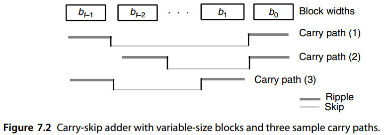


The first assumption  *(b* 0 =  *bt*−1 *)*  is justified because the total delay is a function of *b* 0 +  *bt*−1 rather than their individual values and the second one ( *t*  even) does not affect the results significantly. 

第一个假设 $(b_0 = b_{t−1})$ 是合理的，因为总延迟是 $b_0 + b_{t−1}$ 的函数，而不是它们各自的值，而第二个假设 ( t 为偶数 ) 不会显着影响结果。

Based on the preceding block widths, the total number of bits in the  *t*  blocks is

根据前面的块宽度，t 个块中的总位数为

$2[ b + (b + 1 ) + · · · + (b + t/ 2 − 1 )] = t(b + t/ 4 − 1 / 2 ) $

Equating the total above with  *k*  yields

将上述总数对k做等式化简，得到

$b = k/t − t/4 + 1/2$

The adder delay with the preceding assumptions is

前面假设的加法器延迟为


$$
T_{var−skip−add} = 2(b − 1) + 1 + t − 2 = \frac{2k}{t}+\frac{t}{2}-2
$$


The optimal number of blocks is thus obtained as follows:

由此获得最佳块数如下：


$$
\frac{\mathrm{d}T_{fixed-skip-add}}{\mathrm{d}t}=\frac{-2k}{t^2}+\frac{1}{2}=0 \Rightarrow t^{opt}=2\sqrt{k}
$$


Note that the optimal number of blocks with variable-size blocks is $\sqrt{2}$ times that obtained with fixed-size blocks. Note also that with the optimal number of blocks,  *b* becomes 1/2; thus we take it to be 1. The adder delay with  *t* opt blocks is

请注意，具有可变大小块的块的最佳数量是固定大小块的$\sqrt{2}$倍。还要注意，对于最佳块数，$b$ 变为 1/2；因此我们将其设为 1。$t^{opt}$ 块的加法器延迟为


$$
T^{opt}_{var−skip−add} \approx 2 \sqrt{k} - 2
$$


which is roughly a factor of $\sqrt{2}$ smaller than that obtained with optimal fixed-size skip-blocks.

这大约是一个因素$\sqrt{2}$比最佳固定尺寸获得的小跳过块。

The preceding analyses were based on a number of simplifying assumptions. For example, skip and ripple delays were assumed to be equal and ripple delay was assumed to be linearly proportional to the block width. These may not be true in practice. With complementary metal-oxide semiconductor implementation, for example, the ripple delay in a Manchester carry chain grows as the square of the block width. The analyses for obtaining the optimal fixed or variable block size carry-skip adder must be appropriately modified in such cases. A number of researchers have used various assumptions about technology-dependent parameters to deal with this optimization problem. Some of these variations are explored in the end-of-chapter problems.

前面的分析基于一些简化的假设。例如，假设跳跃延迟和纹波延迟相等，并且假设纹波延迟与块宽度成线性比例。这些在实践中可能并不正确。例如，在互补金属氧化物半导体实现中，曼彻斯特进位链中的纹波延迟随着块宽度的平方而增长。在这种情况下，必须适当修改用于获得最佳固定或可变块大小跳进位加法器的分析。许多研究人员使用了关于技术相关参数的各种假设来处理这个优化问题。其中一些变化将在本章末尾的问题中进行探讨。


## 7.2 多层次的进位跳跃加法器

A (single-level) carry-skip adder of the types discussed in Section 7.1 can be represented schematically as in Fig. 7.3. In our subsequent discussions, we continue to assume that the ripple and skip delays are equal, although the analyses can be easily modified to account for different ripple and skip delays. We thus equate the carry-skip adder delay with the worst-case sum, over all possible carry paths, of the number of ripple stages and the number of skip stages. 

第 7.1 节中讨论的类型的（单级）跳进位加法器可以如图 7.3 所示示意性表示。在我们随后的讨论中，我们继续假设纹波和跳跃延迟是相等的，尽管可以轻松修改分析以考虑不同的纹波和跳跃延迟。因此，我们将跳跃进位加法器延迟等同于所有可能的进位路径上纹波级数和跳跃级数的最坏情况总和。

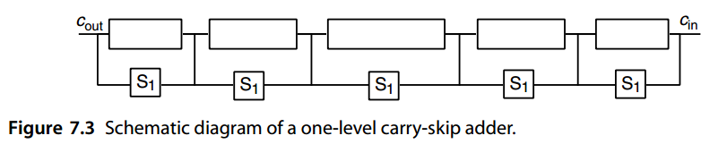

Multilevel carry-skip adders are obtained if we allow a carry to skip over several blocks at once. Figure 7.4 depicts a two-level carry-skip adder in which second-level skip logic has been provided for the leftmost three blocks. The signal controlling this second-level skip logic is derived as the logical AND of the first-level skip signals. A carry that would need 3 time units to skip these three blocks in a single-level carry-skip adder can now do so in 1 time unit. 

如果我们允许进位一次跳过多个块，则获得多级进位跳跃加法器。图 7.4 描述了一个二级跳过进位加法器，其中为最左边的三个块提供了二级跳过逻辑。控制该第二级跳跃逻辑的信号是作为第一级跳跃信号的逻辑与而导出的。在单级进位跳跃加法器中需要 3 个时间单位来跳过这三个块的进位现在只需 1 个时间单位即可完成。

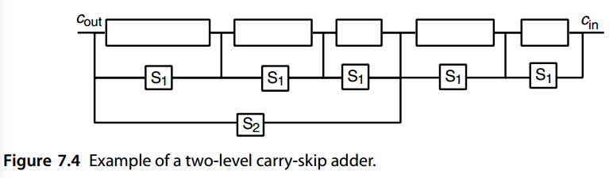

If the rightmost/leftmost block in a carry-skip adder is short, skipping it may not yield any advantage over allowing the carry to ripple through the block. In this case,  the carry-skip adder of Fig. 7.4 can be simplified by removing such inefficient skip circuits. Figure 7.5 shows the resulting two-level carry-skip adder. With our simplifying assumption about ripple and skip delays being equal, the first-level skip circuit should be eliminated only for 1-bit, and possibly 2-bit, blocks (remember that generating the skip control signal also takes some time). 

如果进位跳跃加法器中最右/最左的块很短，则跳过它可能不会比允许进位纹波通过该块产生任何优势。在这种情况下通过去除这种低效的跳跃电路，可以简化图 7.4 的跳跃进位加法器。图 7.5 显示了最终的两级跳进位加法器。通过我们关于纹波和跳跃延迟相等的简化假设，应该仅针对 1 位和可能的 2 位块消除第一级跳跃电路（请记住，生成跳跃控制信号也需要一些时间）。

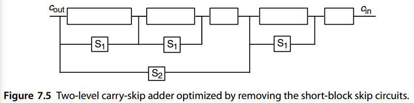


■ **EXAMPLE 7.1** Assume that each of the following operations takes 1 unit of time: generation of  *gi*  and  *pi*  signals, generation of a level- *i*  skip signal from level-( *i* − 1) skip signals, ripple, skip, and computation of sum bit once the incoming carry is known. Build the widest possible single-level carry-skip adder with a total delay not exceeding 8 time units. 

Let  *bi*  be the width of block  *i*. The numbers given on the adder diagram of Fig. 7.6 denote the time steps when the various signals stabilize, assuming that  *c* in is available at time 0. At the right end, block width is limited by the output timing requirement. For example,  *b* 1 cannot be more than 3 bits if its output is to be available at time 3 (1 time unit is taken by *gi*,  *pi*  generation at the rightmost bit, plus 2 time units for propagation across the other 2 bits).  Block 0 is an exception, because to accommodate  *c* in, its width must be reduced by 1 bit. At the left end, block width is limited by input timing. For example,  *b* 4 cannot be more than 3 bits, given that its input becomes available at time 5 and the total adder delay is to be 8 units. Based on this analysis, the maximum possible adder width is 1+3+4+4+3+2+1 = 18 bits. 

■ **示例7.1** 假设以下每个操作需要 1 个时间单位：生成 $g_i$ 和 $p_i$ 信号、从 level-$(i − 1)$ 个跳跃信号生成 level- $i$ 跳跃信号、纹波、skip ，和计算和位(有传入进位)。 构建尽可能宽的单级跳进位加法器，总延迟不超过 8 个时间单位。

令 $b_i$ 为块 $i$ 的宽度。 图 7.6 的加法器图上给出的数字表示各种信号稳定时的时间步长，假设 $c_{in}$ 在时间 0 可用。在右端，块宽度受到输出时序要求的限制。 例如，如果 $b_1$ 的输出在时间 3 可用（最右边位的 $g_i、p_i$ 生成占用 1 个时间单位，加上 2 个时间单位用于传播），则 $b_1$ 不能超过 3 位。 其他 2 位）。 块0是一个例外，因为要容纳$c_{in}$，它的宽度必须减少1位。 在左端，块宽度受到输入时序的限制。 例如，$b_4$ 不能超过 3 位，假设其输入在时间 5 可用并且总加法器延迟为 8 个单位。 根据此分析，最大可能的加法器宽度为 $1+3+4+4+3+2+1 = 18$ 位。

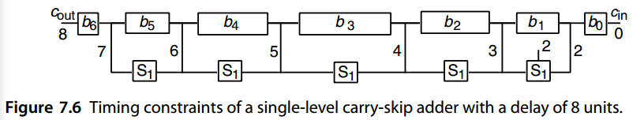


■ **EXAMPLE 7.2** With the same assumptions as in Example 7.1, build the widest possible two-level carry-skip adder with a total delay not exceeding 8 time units. 

We begin with an analysis of skip paths at level 2. In Fig. 7.7a, the notation { *β*,  *α*} for a block means that the block’s carry-out must become available no later than  *T* produce =  *β* and that the block’s carry-in can take  *T* assimilate =  *α*  time units to propagate within the block without exceeding the overall time limit of 8 units. The remaining problem is to construct single-level carry-skip adders with the parameters  *T* produce =  *β*  and  *T* assimilate =  *α*. Given the delay pair { *β*,  *α*}, the number of first-level blocks (subblocks) will be  *γ* = min *(β* −1,  *α)*, with the width of the  *i* th subblock, 0 ≤  *i* ≤  *γ* − 1, given by  *bi* = min *(β* −  *γ* +  *i* + 1,  *α* −  *i)*; the only exception is subblock 0 in block A, which has 1 fewer bit (why?). So, the total widthof such a block is *γ*−1 min *(β* −  *γ* +  *i* + 1,  *α* −  *i)*. Table 7.1 summarizes our analyses *i*=0 for the second-level blocks A–F. Note that the second skip level has increased the adder width from 18 bits (in Example 7.1) to 30 bits. Figure 7.7b shows the resulting two-level carry-skip adder. 

■ **例7.2** 采用与例7.1 相同的假设，构建尽可能宽的两级跳进位加法器，总延迟不超过8 个时间单位。

我们从第 2 层的跳跃路径分析开始。在图 7.7a 中，块的记号 {$β, α$} 意味着该块的进位输出必须在不晚于 $T_{Produce} = β$ 时可用。并且块的进位可以花费 $T_{assimilate} = α$ 时间单位在块内传播，而不超过 8 个单位的总时间限制。剩下的问题是构建单级跳进位加法器，其参数$T_{Produce} = β$ 且 $T_{assimilate} = α$ 。给定延迟对$\{β，α\}$，第一级块（子块）的数量为$γ = min(β−1，α)$，第$i$个子块的宽度为$0≤i≤γ−1$，由$b_i = min(β−γ+i+1，α−i)$给出；唯一的例外是块 A 中的子块 0，它少了 1 位（为什么？）。因此，这样一个块的总宽度是$\sum_{i=0}^{\gamma-1}min(\beta-\gamma+i+1, \alpha-i)$。表 7.1 总结了我们对于二级块 A–F的分析。请注意，第二个跳跃级已将加法器宽度从 18 位（例 7.1 中）增加到 30 位。图 7.7b 显示了最终的两级跳进位加法器。

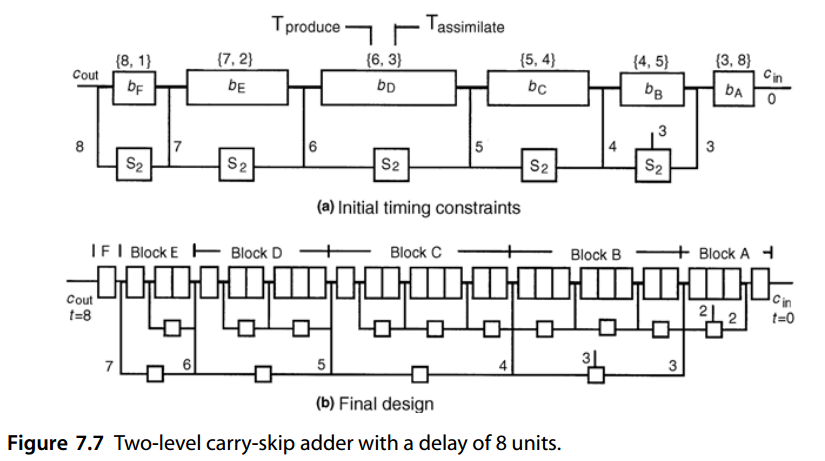

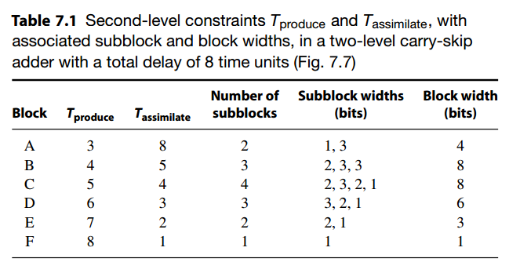

The preceding analyses of one- and two-level carry-skip adders are based on many simplifying assumptions. If these assumptions are relaxed, the problem may no longer lend itself to analytical solution. Chan et al. [Chan92] use dynamic programming to obtain optimal configurations of carry-skip adders for which the various worst-case delays in a block of  *b*  full-adder units are characterized by arbitrary given functions (Fig. 7.8). These delays include: 

- *I (b)* Internal carry-propagate delay for the block

- *G(b)*  Carry-generate delay for the block

- *A(b)* Carry-assimilate delay for the block

前面对一级和二级跳进位加法器的分析基于许多简化假设。如果放宽这些假设，问题可能不再适合解析解。陈等人。 [Chan92]使用动态规划来获得跳进位加法器的最佳配置，其中b 个全加器单元块中各种最坏情况的延迟由任意给定函数表征（图 7.8）。这些延误包括：

- $I(b)$​ : 块的内部进位传播延迟
- $G(b)$: 块的进位生成延迟
- $A(b)$: 块的进位吸收延迟

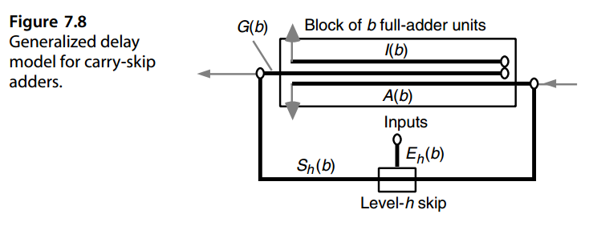


In addition, skip and enable delay functions,  *Sh(b)*  and  *Eh(b)*, are defined for each skip level  *h*. In terms of this general model, our preceding analysis can be characterized as corresponding to  *I (b)* =  *b* − 1,  *G(b)* =  *b*,  *A(b)* =  *b*,  *Sh(b)* = 1, and  *Eh(b)* =  *h* + 1. This is the model assumed by Turrini [Turr89]. Similar methods can be used to derive optimal block widths in variable-block carry-lookahead adders [Chan92]. 

此外，还为每个跳跃级别 $h$ 定义了跳跃和启用延迟函数 $S_h(b)$ 和 $E_h(b)$。根据这个通用模型，我们前面的分析可以表征为对应于$I(b) = b − 1$、$G(b) = b$、$A(b) = b$、$S_h(b) = 1$ 和 $E_h(b) = h + 1$。这是 Turrini [Turr89] 假设的模型。类似的方法可用于导出可变块超前进位加法器中的最佳块宽度[Chan92]。


## 7.3 进位选择加法器

One of the earliest logarithmic time adder designs is based on the conditional-sum addition algorithm. In this scheme, blocks of bits are added in two ways: assuming an incoming carry of 0 or of 1, with the correct outputs selected later as the block’s true carry-in becomes known. With each level of selection, the number of known output bits doubles, leading to a logarithmic number of levels and thus logarithmic time addition. Underlying the building of conditional-sum adders is the carry-select principle, which is described in this section. 

最早的对数时间加法器设计之一是基于条件和加法算法。在此方案中，位块以两种方式相加：假设传入进位为 0 或 1，稍后当知道该块的真实进位时选择正确的输出。对于每个级别的选择，已知输出位数加倍，导致级别数为对数，从而导致时间相加为对数。构建条件和加法器的基础是进位选择原理，本节将对此进行描述。

A (single-level) carry-select adder is one that combines three  *k*/2-bit adders of any design into a  *k*-bit adder (Fig. 7.9). One  *k*/2-bit adder is used to compute the lower half of the  *k*-bit sum directly. Two  *k*/2-bit adders are used to compute the upper  *k*/2 bits of the sum and the carry-out under two different scenarios:  *ck/* 2 = 0 or  *ck/* 2 = 1. The correct values for the adder’s carry-out signal and the sum bits in positions  *k*/2 through  *k* − 1 are selected when the value of  *ck/* 2 becomes known. The delay of the resulting  *k*-bit adder is two gate levels more than that of the  *k*/2-bit adders that are used in its construction. 

（单级）进位选择加法器是将任意设计的三个 $k/2$ 位加法器组合成一个 $k$ 位加法器（图 7.9）。使用一个$k/2$位加法器直接计算k位和的下半部分。两个 $k/2$ 位加法器用于在两种不同情况下计算总和和进位的高 $k/2$ 位：$c_{k/2} = 0$ 或 $c_{k/2} = 1$。当 $c_{k/2}$ 的值已知时，就会选择加法器进位输出信号以及位置 $k/2$ 到 $k−1$ 中的和位的正确值。由此产生的 $k$ 位加法器的延迟比其构造中使用的 $k/2$ 位加法器的延迟多两个门级。

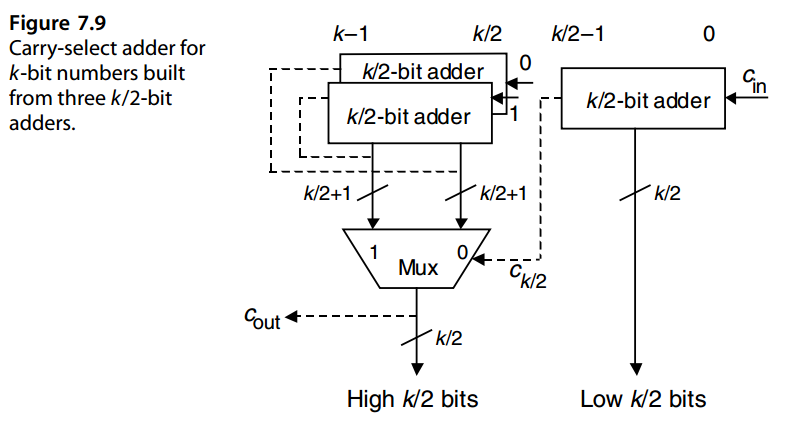

The following simple analysis demonstrates the cost-effectiveness of the carry-select method. Let us take the cost and delay of a single-bit 2-to-1 multiplexer as our units and assume that the cost and delay of a  *k*-bit adder are  *C* add *(k)*  and  *T* add *(k)*, respectively. Then, the cost and delay of the carry-select adder of Fig. 7.9 are

下面的简单分析说明了进位选择方法的成本效益。让我们以单比特2对1复用器的成本和延迟为单位，并假设k位加法器的成本和延迟分别为$C_{add}(k)$和$T_{add}(k)$。那么，图 7.9 的进位选择加法器的成本和延迟为


$$
\begin{array}{l}
C_{select−add}(k) = 3C_{add}(k/2) + k/2 + 1 \\
T_{select−add}(k) = T_{add}(k/2) + 1
\end{array}
$$


If we take the product of cost and delay as our measure of cost-effectiveness, the carry-select scheme of Fig. 7.9 is more cost-effective than the scheme used in synthesizing its component adders if and only if

如果我们将成本和延迟的乘积作为成本效益的衡量标准，则图 7.9 的进位选择方案要想比用于合成其分量加法器的方案更具成本效益，只有当且仅当

$[3 C_{add} (k/2) + k/ 2 + 1][ T_{add} (k/2) + 1] < C_{add}(k) T_{add}(k)$

For ripple-carry adders, we have *C* add *(k)* = *αk* and *T* add *(k)* = *τ k*. To simplify the analysis, assume *τ* = *α/* 2 *>* 1. Then, it is easy to show that the carry-select method is more cost-effective than the ripple-carry scheme if *k >* 16 */(α* − 1 *)*. For *α* = 4 and *τ* = 2, say, the carry-select approach is almost always preferable to ripple-carry. Similar analyses can be carried out to compare the carry-select method against other addition schemes.

对于纹波进位加法器，我们有 $C_{add}(k) = αk$ 和 $T_{add}(k) = τ k$。为了简化分析，假设 $τ = α/ 2 > 1$。然后，很容易证明，如果 $k > 16 /(α − 1)$，进位选择方法比纹波进位方案更具成本效益。例如，对于 α = 4 和 τ = 2，进位选择方法几乎总是优于纹波进位。可以进行类似的分析来将进位选择方法与其他加法方案进行比较。


Note that in the preceding analysis, the use of three complete *k*/2-bit adders was assumed. With some adder types, the two *k*/2-bit adders at the left of Fig. 7.9 can share some hardware, thus leading to even greater cost-effectiveness. For example, if the component adders used are of the carry-lookahead variety, much of the carry network can be shared between the two adders computing the sum bits with *ck/* 2 = 0 and *ck/* 2 = 1(how?).

请注意，在前面的分析中，假设使用三个完整的 k/2 位加法器。对于某些加法器类型，图 7.9 左侧的两个 k/2 位加法器可以共享一些硬件，从而带来更大的成本效益。例如，如果所使用的分量加法器属于先行进位类型，则可以在计算 ck/ 2 = 0 和 ck/ 2 = 1 的总和位的两个加法器之间共享大部分进位网络（如何做？）。


Note that the carry-select method works just as well when the component adders have different widths. For example, Fig. 7.9 could have been drawn with one *a*-bit and two *b*-bit adders used to form an ( *a* + *b*)-bit adder. Then *ca* would be used to select the upper *b* bits of the sum through a ( *b* + 1)-bit multiplexer. Unequal widths for the component adders is appropriate when the delay in deriving the selection signal *ca* is different from that of the sum bits.

请注意，进位选择方法在有不同的宽度分量加法器时也同样有效。例如，图 7.9 可以用一个 a 位加法器和两个 b 位加法器来绘制，用于形成 $(a + b)$ 位加法器。然后，$c_a$ 将用于通过 $(b + 1)$ 位多路复用器选择和的高 $b$ 位。当导出选择信号$c_a$的延迟与求和位的延迟不同时，分量加法器的不等宽度是合适的。


Figure 7.10 depicts how the carry-select idea can be carried one step further to obtain a two-level carry-select adder. Sum and carry-out bits are computed for each *k*/4-bit block (except for the rightmost one) under two scenarios. The three first-level multiplexers, each of which is  *k/* 4 + 1 bits wide, merge the results of  *k*/4-bit blocks into those of *k*/2-bit blocks. Note how the carry-out signals of the adders spanning bit positions  *k*/2 through 3 *k/* 4 − 1 are used to select the most-significant  *k*/4 bits of the sum under the two scenarios of  *ck/* 2 = 0 or  *ck/* 2 = 1. At this stage,  *k*/2 bits of the final sum are known. The second-level multiplexer, which is  *k/* 2 + 1 bits wide, is used to select appropriate values for the upper  *k*/2 bits of the sum (positions  *k*/2 through  *k* − 1) and the adder’s carry-out. 

图 7.10 描述了如何将进位选择思想进一步推进以获得两级进位选择加法器。为每个 $k/4$ 位块计算总和和进位位（除了最右边的）两种情况下。三个第一级多路复用器，每个都是 $k/ 4 + 1$ 位宽，将 $k/4$ 位块的结果合并到 $k/2$ 位块的结果中。注意加法器的进位信号如何跨越位位置 $k/2$到$3 k/ 4 − 1$用于在$c_k/ 2 = 0$或$c_k/ 2 = 1$两种情况下选择和的最高有效$k/4$位。此时，最终和的$k/2$位是已知的。第二级多路复用器的宽度为 $k/ 2 + 1$ 位，用于为和的高 $k/2$ 位（位置 $k/2$ 到 $k − 1$）和加法器的进位选择适当的值。

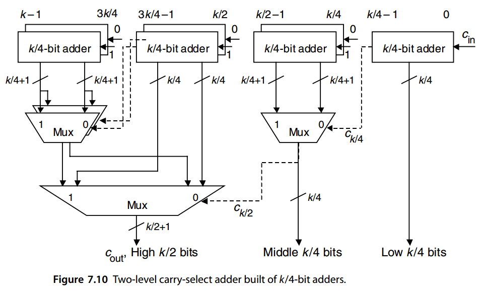

Comparing the two-level carry-select adder of Fig. 7.10 with a similar two-level carry-lookahead adder (Fig. 6.4, but with 2-bit, rather than 4-bit, lookahead carry generators), we note that the one-directional top-to-bottom data flow in Fig. 7.10 makes pipelining easier and more efficient. Of course, from Section 6.5 and the example in Fig. 6.13, we know that carry-lookahead adders can also be implemented to possess one-directional data flow. In such cases, comparison is somewhat more difficult, inso-far as carry-select adders have a more complex upper structure (the small adders) and simpler lower structure (the multiplexers). 

将图 7.10 的两级进位选择加法器与类似的两级进位超前加法器（图 6.4，但使用 2 位而不是 4 位超前进位生成器）进行比较，我们注意到图 7.10 中的单向从上到下数据流使流水线操作更容易、更高效。当然，从6.5节和图6.13中的例子，我们知道超前进位加法器也可以实现为拥有单向数据流。在这种情况下，比较有点困难，因为进位选择加法器具有更复杂的上部结构（小加法器）和更简单的下部结构（多路复用器）。

Which design comes out ahead for a given word width depends on the implementation technology, performance requirements, and other design constraints. Very often, the best choice is a hybrid combination of carry-select and carry-lookahead (see Section 7.5). 

对于给定的字宽，哪种设计领先取决于实现技术、性能要求和其他设计约束。通常，最好的选择是进位选择和进位前瞻的混合组合（参见第 7.5 节）。

To understand the similarities between carry-select and carry-lookahead adders, consider a design similar to Fig. 7.9 in which only carry signals, rather than the final sum bits, are of interest. Clearly, once all carries are known, the sum bits can be generated rapidly by means of  *k*  XOR gates. Thus, the upper half of the new circuit derived from Fig. 7.9 will be responsible for generating two versions of the carries, rather than two versions of the sum bits. The carry  *ci*+1 into position  *i* + 1 *(i* ≥  *k/* 2 *)*  is  *g*[ *k/* 2,  *i*] when  *ck/* 2 = 0, and it is  *t*[ *k/* 2,  *i*] when  *ck/* 2 = 1. Recall that  *t*[ *k/* 2,  *i*] =  *g*[ *k/* 2,  *i*] ∨  *p*[ *k/* 2,  *i*]. Thus, the pair of adders spanning positions  *k/* 2 through  *k* − 1 in Fig. 7.9 become a parallel prefix carry network that uses the signal pair  *(g*,  *t)*  instead of the usual  *(g*,  *p)*. The entire structure of the modified design based on producing carries rather than sum bits is thus quite similar to the Ladner-Fischer carry network of Fig. 6.7. It even suffers from the same drawback of large fan-out for  *ck/* 2, which is used as the selection signal for  *k/* 2 + 1 two-way multiplexers. 

为了理解进位选择加法器和进位超前加法器之间的相似之处，请考虑类似于图 7.9 的设计，其中仅对进位信号而不是最终的和位感兴趣。显然，一旦知道了所有进位，就可以通过 k 个异或门快速生成和位。因此，从图 7.9 导出的新电路的上半部分将负责生成两个版本的进位，而不是两个版本的和位。当$c_{k/2} = 0$，进位 $c_{i+1}$ 到位置 $i + 1 (i ≥ k/ 2)$ 是 $g[ k/ 2, i]$，当 $c_{k/2} = 1$ 时为 $t[k/2, i]$。回想一下 $t[ k/ 2, i] = g[ k/ 2, i] ∨ p[ k/ 2, i]$。因此，图 7.9 中跨越位置 $k/2$ 到 $k-1$ 的一对加法器成为并行前缀进位网络，它使用信号对 $(g, t)$ 而不是通常的 $(g, p)$。因此，基于产生进位而不是和位的修改设计的整个结构与图 6.7 的 Ladner-Fischer 进位网络非常相似。它甚至遭受同样的缺点，即 $c_{k/2}$ 的大扇出，用作 $k/2 + 1$ 双向多路复用器的选择信号。


## 7.4 条件和加法器

The process that led to the two-level carry-select adder of Fig. 7.10 can be continued to derive a three-level *k*-bit adder built of *k*/8-bit adders, a four-level adder composed of *k*/16-bit adders, and so on. A logarithmic time conditional-sum adder results if we proceed to the extreme of having 1-bit adders at the very top. Thus, taking the cost and delay of a 1-bit 2-to-1 multiplexer as our units, the cost and delay of a conditional-sum adder are characterized by the following recurrences:

产生图7.10的两级进位选择加法器的过程可以继续推导出由$k/8$位加法器构成的三级k位加法器、由$k/16$位加法器组成的四级加法器等等。如果我们继续在最顶部使用 1 位加法器，则会产生对数时间条件和加法器。因此，以 1 位 2比1多路复用器的成本和延迟为单位，条件和加法器的成本和延迟由以下递归式表征：


$$
\begin{array}{l}
C(k) \approx 2 C(k/2) + k + 2 \approx k( \log_2 k + 2 ) + kC( 1 ) \\
T(k) = T(k/2) + 1 = \log_2 k + T(1)
\end{array}
$$


where *C*(1) and *T* (1) are the cost and delay of the circuit of Fig. 7.11 used at the top to derive the sum and carry bits with a carry-in of 0 and 1. The term *k* + 2 in the first recurrence represents an upper bound on the number of single-bit 2-to-1 multiplexers needed for combining two *k*/2-bit adders into a *k*-bit adder.

其中 $C(1)$ 和 $T (1)$ 是图 7.11 顶部电路的成本和延迟，用于导出进位输入为 0 和 1 的和和进位位。第一个递归中的 2 表示将两个 $k/2$ 位加法器组合成 $k$ 位加法器所需的单位2到1多路复用器的数量上限。

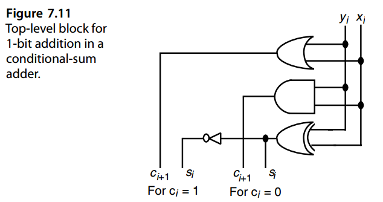

The recurrence for cost is approximate, since for simplicity, we have ignored the fact that the right half of Fig. 7.10 is less complex than its left half. In other words, we have assumed that two parallel ( *b* + 1)-bit multiplexers are needed to combine the outputs from *b*-bit adders, although in some cases, one is enough.

成本的递推是近似的，因为为了简单起见，我们忽略了图 7.10 的右半部分比左半部分复杂的事实。换句话说，我们假设需要两个并行 (b + 1) 位多路复用器来组合 b 位加法器的输出，尽管在某些情况下，一个就足够了。

An exact analysis leads to a comparable count for the number of 1-bit multiplexers needed in a conditional-sum adder. Assuming that *k* is a power of 2, the required number of multiplexers for a *k*-bit adder is

精确分析得出条件和加法器中所需的 1 位多路复用器数量的可比计数。假设k是2的幂，则k 位加法器的多路复用器的所需数量为

$(k/2 + 1) + 3(k/4 + 1) + 7(k/8 + 1) + · · · + (k − 1)2 = (k − 1)(\log_2 k + 1)$

leading to an overall cost of $(k − 1)(\log_2 k + 1 ) + kC(1)$.

导致总成本为 $(k − 1)(\log_2 k + 1 ) + kC(1)$。

The conditional-sum algorithm can be visualized by the 16-bit addition example shown in Table 7.2.

条件和的算法可以通过 16 位加法示例来可视化，如表 7.2 所示。

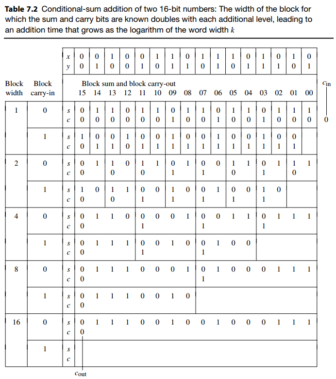

> 表 7.2 两个 16 位数字的条件和加法：已知和和进位位的块的宽度随着每个附加级别而加倍，导致加法时间随着字宽 k 的对数而增长


Given that a conditional-sum adder is actually a (log2 *k*)-level carry-select adder, the comparisons and trade-offs between carry-select adders and carry-lookahead adders, as discussed at the end of Section 7.3, are relevant here as well.

鉴于条件和加法器实际上是 ($\log_2 k$) 级进位选择加法器，进位选择加法器和进位超前加法器之间的比较和权衡（如第 7.3 节末尾所讨论的）也与此相关。


## 7.5 混合设计与优化

Hybrid adders are obtained by combining elements of two or more “pure” design methods to obtain adders with higher performance, greater cost-effectiveness, lower power consumption, and so on. Since any two or more pure design methods can be combined in a variety of ways, the space of possible designs for hybrid adders is immense. This leads to a great deal of flexibility in matching the design to given requirements and constraints. It also makes the designer’s search for an optimal design nontrivial. In this section, we review several possible hybrid adders as representative examples.

混合加法器是通过将两种或多种“纯”设计方法的元素结合起来获得的，以获得具有更高性能、更大成本效益、更低功耗等的加法器。由于任何两种或多种纯设计方法都可以以多种方式组合，因此混合加法器的可能设计空间是巨大的。这使得设计与给定要求和约束的匹配具有很大的灵活性。这也使得设计师对最佳设计的寻找变得非常重要。在本节中，我们将回顾几种可能的混合加法器作为代表性示例。

The one- and two-level carry-select adders of Figs. 7.9 and 7.10 are essentially hybrid adders, since the top-level *k*/2- or *k*/4-bit adders can be of any type. In fact, a common use for the carry-select scheme is in building fast adders whose width would lead to inefficient implementations with certain pure designs. For example, when 4-bit lookahead carry blocks are used, both 16-bit and 64-bit carry-lookahead adders can be synthesized quite efficiently (Fig. 6.4). A 32-bit adder, on the other hand, would require two levels of lookahead and is thus not any faster than the 64-bit adder. Using 16-bit carry-lookahead adders, plus a single carry-select level to double the width, is likely to lead to a faster 32-bit adder. The resulting adder has a hybrid carry-select/carry-lookahead design.

图7.9 和 7.10 的一级和二级进位选择加法器本质上是混合加法器，因为顶级 k/2 位或 k/4 位加法器可以是任何类型。事实上，进位选择方案的一个常见用途是构建快速加法器，其宽度会导致某些纯设计的低效实现。例如，当使用 4 位先行进位块时，可以非常高效地合成 16 位和 64 位先行进位加法器（图 6.4）。另一方面，32 位加法器需要两级超前，因此并不比 64 位加法器快。使用 16 位超前进位加法器，再加上单个进位选择级别以加倍宽度，可能会产生更快的 32 位加法器。由此产生的加法器具有混合进位选择/进位超前设计。

The reverse combination (viz., hybrid carry-lookahead/carry-select) is also possible and is in fact used quite widely. An example hybrid carry-lookahead/carry-select adder is depicted in Fig. 7.12. The small adder blocks, shown in pairs, may be based on Manchester carry chains that supply the required *g* and *p* signals to the lookahead carry generator and compute the final intermediate carries as well as the sum bits once the block carry-in signals have become known.

相反的组合（即混合进位超前/进位选择）也是可能的，并且实际上使用得相当广泛。图 7.12 描述了混合进位超前/进位选择加法器的示例。成对显示的小加法器块可以基于曼彻斯特进位链，其向先行进位生成器提供所需的g和p信号，并在块进位信号已知后计算最终的中间进位以及和位。

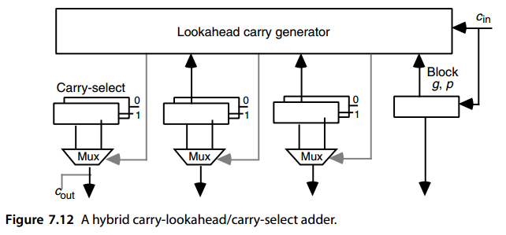

A wider hybrid carry-lookahead/carry-select adder will likely have a multilevel carry-lookahead network rather than a single lookahead carry generator as depicted in Fig. 7.12. If the needed block *g* and *p* signals are produced quickly, the propagation of signals in the carry-lookahead network can be completely overlapped with carry propagation in the small carry-select adders. The carry-lookahead network of Fig. 6.13 was in fact developed for use in such a hybrid scheme, with 8-bit carry-select adders based on Manchester carry chains [Lync92]. The 8-bit adders complete their computation at about the same time that the carries  *c* 24,  *c* 32,  *c* 40,  *c* 48, and  *c* 56 become available (Fig. 6.13). Thus, the total adder delay is only two logic levels more than that of the carry-lookahead network. 

更宽的混合先行进位/进位选择加法器可能具有多级先行进位网络，而不是如图 7.12 所示的单个先行进位生成器。如果快速产生所需的块g和p信号，则进位超前网络中的信号传播可以与小型进位选择加法器中的进位传播完全重叠。图 6.13 的超前进位网络实际上是为这种混合方案而开发的，具有基于曼彻斯特进位链的 8 位进位选择加法器 [Lync92]。 8 位加法器大约在进位 $c_{24}、c_{32}、c_{40}、c_{48}$ 和 $c_{56}$ 变得可用同时完成计算（图 6.13）。因此，总加法器延迟仅比超前进位网络的延迟多两个逻辑深度。


Another interesting hybrid design is the ripple-carry/carry-lookahead adder, an example of which is depicted in Fig. 7.13. This hybrid design is somewhat slower than a pure carry-lookahead scheme, but its simplicity and greater modularity may compensate for this drawback. The analysis of cost and delay for this hybrid design relative to pure ripple-carry and carry-lookahead adders is left as an exercise, as is the development and analysis of the reverse carry-lookahead/ripple-carry hybrid combination. 

另一个有趣的混合设计是纹波进位/超前进位加法器，其示例如图 7.13 所示。这种混合设计比纯粹的超前进位方案要慢一些，但其简单性和更高的模块化性可以弥补这一缺点。这种混合设计相对于纯纹波进位和先行进位加法器的成本和延迟的分析留作练习，反向进位先行/纹波进位混合组合的开发和分析也是如此。

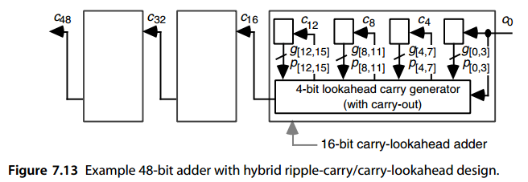

Another hybrid adder example uses the hybrid carry-lookahead/conditional-sum combination. One drawback of the conditional-sum adder for wide words is the requirement of large fan-out for the signals controlling the multiplexers at the lower levels (Fig. 7.10). This problem can be alleviated by, for example, using conditional-sum addition in smaller blocks, forming the interblock carries through carry-lookahead. For detailed description of one such adder, used in Manchester University’s MU5 computer, see [Omon94, pp. 104–111]. 

另一个混合加法器示例使用混合进位前瞻/条件和的组合。宽字条件和加法器的一个缺点是控制较低层多路复用器的信号需要大扇出（图 7.10）。这个问题可以通过例如在较小的块中使用条件和加法来缓解，通过超前进位形成块间进位。有关曼彻斯特大学 MU5 计算机中使用的此类加法器的详细说明，请参阅 [Omon94，第 104–111 页]。

A hybrid adder may use more than two different schemes. For example, the 64-bit adder in the Compaq/DEC Alpha 21064 microprocessor is designed using four different methods [Dobb92]. At the lowest level, 8-bit Manchester carry chains are employed.  The lower 32-bits of the sum are derived via carry lookahead at the second level, while conditional-sum addition is used to obtain two versions of the upper 32 bits. Carry-select is used to pick the correct version of the sum’s upper 32 bits. 

混合加法器可以使用两种以上不同的方案。例如，Compaq/DEC Alpha 21064 微处理器中的 64 位加法器是使用四种不同的方法设计的 [Dobb92]。在最低层，采用 8 位曼彻斯特进位链。总和的低 32 位是通过第二级的超前进位导出的，而条件和加法用于获得高 32 位的两个版本。进位选择用于选择和的高 32 位的正确版本。

Clearly, it is possible to combine ideas from various designs in many different ways, giving rise to a steady stream of new implementations and theoretical proposals for the design of fast adders. Different combinations become attractive with particular technologies in view of their specific cost factors and fundamental constraints [Kant93]. In addition, application requirements, such as low power consumption, may shift the balance in favor of a particular hybrid design. 

显然，可以以多种不同的方式结合各种设计的思想，从而为快速加法器的设计带来源源不断的新实现和理论建议。鉴于特定技术的特定成本因素和基本限制，不同的组合变得有吸引力[Kant93]。此外，诸如低功耗之类的应用要求可能会改变平衡，有利于特定的混合设计。

Just as optimal carry-skip adders have variable block widths, it is often possible to reduce the delay of other (pure or hybrid) adders by optimizing the block widths. For example, depending on the implementation technology, a carry-lookahead adder with fixed blocks may not yield the lowest possible delay [Niga95]. Again, the exact optimal configuration is highly technology-dependent. In fact, with modern very large-scale integration technology, gate count alone is no longer a meaningful measure of implementation cost. Designs that minimize or regularize the interconnection may actually be more cost-effective despite using more gates. The ultimate test of cost-effectiveness for a particular hybrid design or “optimal” configuration is its actual speed and cost when implemented with the target technology.

正如最佳跳进位加法器具有可变的块宽度一样，通常可以通过优化块宽度来减少其他（纯或混合）加法器的延迟。例如，根据实现技术的不同，具有固定块的超前进位加法器可能不会产生尽可能低的延迟[Niga95]。同样，确切的最佳配置高度依赖于技术。事实上，利用现代超大规模集成技术，仅门数不再是衡量实施成本的有意义的指标。最小化或使得互连更规范的设计尽管使用更多的门，但实际上可能更具成本效益。对特定混合设计或“最佳”配置的成本效益的最终测试是其使用目标技术实施时的实际速度和成本。

So far our discussion of adder delay has been based on the tacit assumption that all input digits are available at the outset, or at time 0, and that all output digits are computed and taken out after worst-case carries have propagated. The other extreme, where input/output digits arrive and leave serially, leads to very simple digit-serial adder designs. In between the two extremes, there are practical situations in which different arrival times are associated with the input digits or certain output digits must be produced earlier than others.

到目前为止，我们对加法器延迟的讨论都是基于默认假设，即所有输入数字在一开始或时间 0 时都可用，并且所有输出数字在最坏情况进位传播后计算并取出。另一个极端，即输入/输出数字串行到达和离开，导致非常简单的数字串行加法器设计。在这两个极端之间，存在一些实际情况，其中不同的到达时间与输入数字相关联或者某些输出数字必须比其他数字更早产生。

We will later see, for example, that in multiplying two binary numbers, the partial products are reduced to two binary numbers, which are then added in a fast two-operand adder to produce the final product. The individual bits of these two numbers become available at different times in view of the differing logic path depths from primary inputs. Figure 7.14 shows a typical example for the input arrival times at various bit positions of this final fast adder. This information can be used in optimizing the adder design [Oklo96]. A number of details and additional perspective can be found in [Liu03] and [Yeh00].

例如，我们稍后会看到，在将两个二进制数相乘时，部分积会减少为两个二进制数，然后将它们在快速双操作数加法器中相加以产生最终的乘积。鉴于来自主输入的不同逻辑路径深度，这两个数字的各个位在不同时间变得可用。图 7.14 显示了最终快速加法器各个位位置的输入到达时间的典型示例。该信息可用于优化加法器设计[Oklo96]。许多细节和额外的观点可以在[Liu03]和[Yeh00].

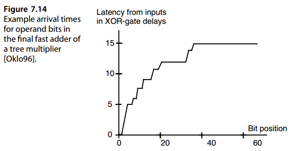


## 7.6 二操作数模加法器

In some applications, with redundant number system arithmetic and cryptographic algorithms being the most notable examples, the sum of input operands  *x*  and  *y*  must be computed modulo a given constant  *m*. In other words, we are interested in deriving *(x* +  *y)*  mod  *m*, rather than  *x* +  *y*. An obvious approach would be to perform the required computation in two stages: (1) forming  *x* +  *y*, using any of the adder designs described thus far, and (2) reducing  *x* +  *y*  modulo  *m*. Because the latency of the latter  *modular* *reduction*  step can be significant for an arbitrary value of  *m*, direct methods similar to the carry-select approach have been used to combine the two steps. 

在一些应用中，冗余数字系统算术和密码算法是最值得注意的例子，输入操作数 x 和 y 的总和必须以给定常数 m 为模进行计算。换句话说，我们感兴趣的是导出 $(x + y) \mod m$，而不是 $x + y$。一种明显的方法是分两个阶段执行所需的计算：

(1) 使用迄今为止描述的任何加法器设计形成 x + y，以及 

(2) 以 m 为模减少 x + y。由于后一个模数归约步骤的延迟对于 m 的任意值都可能很大，因此使用类似于进位选择方法的直接方法来组合这两个步骤。

Let us first focus on unsigned operands and certain special values of  *m*  that lead to simple modular addition. Clearly, when  *m* = 2 *k* , the modulo- *m*  sum is obtained by simply ignoring the carry-out. We also know that for  *m* = 2 *k* − 1, using end-around carry allows us to reduce the sum modulo  *m*  by means of a conventional binary adder. A third special case pertains to  *m* = 2 *k* + 1. Here, we need  *k* + 1 bits to represent the 2 *k* + 1 different residues modulo  *m*. Because we can represent 2 *k*+1 distinct values with  *k* + 1 bits, different encodings of the 2 *k* + 1 residues are possible. An interesting encoding that has been found to be quite efficient is the diminished-1 encoding. With this encoding, 0 is represented by asserting a special flag bit and setting the remaining  *k*  bits to 0, while a nonzero value  *x*  is represented by de-asserting the flag bit and appending it with the representation of  *x* − 1. 

让我们首先关注无符号操作数和导致简单模加法的 m 的某些特殊值。显然，当 $m = 2^k$ 时，模 m 和是通过简单地忽略进位而获得的。我们还知道，对于 $m = 2^k − 1$，使用尾部进位允许我们通过传统的二进制加法器来减少模 m 的和。第三种特殊情况涉及 $m = 2^k + 1$。这里，我们需要 $k + 1$ 位来表示 $2^k + 1$模 m 的不同余数。因为我们可以用 $k + 1$位表示 $2^k+1$ 个不同的值，可以做不同$2^k + 1$ 个余数的编码。已一种非常有效的有趣编码是减 1 编码。通过这种编码，通过置位特殊标志位并将剩余 k 位设置为 0 来表示0，而非零值 x 通过复位标志位并用 $x − 1$ 的形式来表示。


■ **EXAMPLE 7.3** Design a modulo-17 adder for unsigned integer operands in the range [0, 16], represented in the diminished-1 format. 

Each of the input operands  *x*  and  *y*  consists of a 0-flag bit and a 4-bit binary magnitude that is one less than its true value, if nonzero. The design described in the following is based on the assumption that both operands are nonzero, as is their modulo-17 sum; that is, we assume  *x* = 0,  *y* = 0,  *x* +  *y* = 17. Augmenting the design to correctly handle these special cases is left as an exercise. The output should be  *x* +  *y* − 1, the diminished-1 representation of  *x* +  *y*, if  *x* +  *y* ≤ 17, and it should be  *x* +  *y* − 18, the diminished-1 representation of *x* + *y* −17, if  *x* + *y* ≥ 18. The desired results above can be rewritten as  *(x* −1 *)*+ *(y* −1 *)*+1 if *(x*−1 *)*+ *(y*−1 *)* ≤ 15 and  *(x*−1 *)*+ *(y*−1 *)*−16 if  *(x*−1 *)*+ *(y*−1 *)* ≥ 16. These observations suggest that adding  *x* − 1 and  *y* − 1 with an inverted end-around carry (carry-in set to the complement of carry-out) will produce the desired result in either case. The inverted end-around carry arrangement will add 1 to the sum of  *x* − 1 and  *y* − 1 when  *c* out = 0, that is, *(x*−1 *)*+ *(y*−1 *)* ≤ 15, and will subtract 16 (by dropping the outgoing carry) when  *c* out = 1, corresponding to the condition  *(x* − 1 *)* +  *(y* − 1 *)* ≥ 16. 

■ 示例7.3 为范围内的无符号整数操作数设计一个模17 加法器[0, 16]，以减 1 格式表示。

每个输入操作数 x 和 y 均包含一个 0 标志位和一个 4 位二进制量值（如果非零），该二进制量值比其真实值小 1。下面描述的设计基于两个操作数均非零的假设，它们的模 17 和也是非零；也就是说，我们假设 $x \ne 0、y \ne 0、x + y \ne 17$。增强设计以正确处理这些特殊情况留作读者练习。如果 $x + y \le 17$，输出应为 $x + y − 1$，即 $x + y$ 的减 1 表示；$如果 x + y ≥ 18$，输出应为 $x + y − 18$，即 $x + y −17$ 的减 1 表示。

如果 $(x−1 )+ (y−1 ) ≤ 15$ ，则上述所需结果可重写为 $(x −1 )+ (y −1 )+1$。或$(x−1) + (y−1)−16$ 如果 (x−1 )+ (y−1) ≥ 16。这些观察结果表明，将 $x − 1$ 与$y − 1$和再加上反转的末端进位（进位输入设置为进位输出的补码），在任何一种情况下都会产生所需的结果。当 $c_{out}$ = 0 时，反转的循环进位安排将在 $x − 1$ 和 $y − 1$ 之和上加 1，即 $(x−1)+ (y−1) ≤ 15$，并且当 $c_{out} = 1$ 时将减去 16（通过丢弃传出进位），对应于条件$ (x − 1 ) + (y − 1 ) ≥ 16$。


For a general modulus *m*, we need to compare the sum *x* + *y* to the modulus *m*, subtracting *m* from the computed sum if it equals or exceeds *m*. Because both the comparison and the ensuing subtraction require full carry propagation in the worst case, this approach would add a significant delay to the operation, which may be unacceptable. An alternative is to compute *x* + *y* and *x* + *y* − *m* in parallel and then use the sign of the latter value to decide whether *x* + *y* ≥ *m*. If so, then *x* + *y* − *m* is the correct result; otherwise, *x* + *y* should be selected as the output. The resulting design, shown in Fig. 7.15, is quite fast, given that it only adds a full-adder level (the carry-save adder) and a multiplexer to the critical path of a conventional adder.

对于一般模数 m，我们需要将总和 $x + y$ 与模数 $m$ 进行比较，如果等于或超过 $m$，则从计算的总和中减去 $m$。因为在最坏的情况下比较和随后的减法都需要完全进位传播，所以这种方法会给操作增加显着的延迟，这可能是不可接受的。另一种方法是并行计算 $x + y$ 和 $x + y − m$，然后使用后一个值的符号来确定是否 $x + y ≥ m$。如果是，则 $x + y − m$ 为正确结果；否则，应选择 $x + y$ 作为输出。由此产生的设计如图 7.15 所示，速度相当快，因为它仅在传统加法器的关键路径上添加了一个全加器级（进位保存加法器）和一个多路复用器。


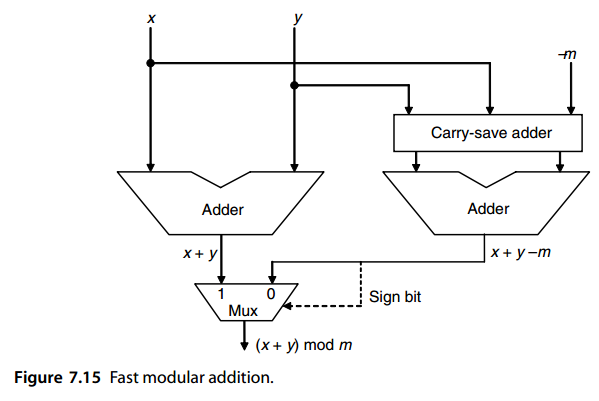


## 问题（略）


## 参考文献和进一步阅读

```
[Bedr62] Bedrij, O. J., “Carry-Select Adder,” IRE Trans. Electronic Computers, Vol. 11,
         pp. 340–346, 1962.
[Chan90] Chan, P. K., and M. D. F. Schlag, “Analysis and Design of CMOS Manchester Adders
         with Variable Carry Skip,” IEEE Trans. Computers, Vol. 39, pp. 983–992, 1990.
[Chan92] Chan, P. K., M. D. F. Schlag, C. D. Thomborson, and V. G. Oklobdzija, “Delay
         Optimization of Carry-Skip Adders and Block Carry-Lookahead Adders Using
         Multidimensional Dynamic Programming,” IEEE Trans. Computers, Vol. 41, No. 8,
         pp. 920–930, 1992.
[Dobb92] Dobberpuhl, D., et al., “A 200 MHz 64-b Dual-Issue CMOS Microprocessor,” IEEE
         J. Solid-State Circuits, Vol. 27, No. 11, 1992.
[Guyo87] Guyot, A., and J.-M. Muller, “A Way to Build Efficient Carry-Skip Adders,” IEEE
         Trans. Computers, Vol. 36, No. 10, pp. 1144–1152, 1987.
[Jabe09] Jaberipur, G. and B. Parhami, “Unified Approach to the Design of Modulo-(2n ± 1)
         Adders Based on Signed-LSB Representation of Residues,” Proc. 19th IEEE Int’l
         Symp. Computer Arithmetic, June 2009, pp. 57–64.
[Kala00] Kalampoukas, L., D. Nikolos, C. Efstathiou, H. T. Vergos, and J. Kalamatianos,
         “High-Speed Parallel-Prefix Modulo 2n − 1 Adders,” IEEE Trans. Computers, Vol.
         49, No. 7, pp. 673–680, 2000.
[Kant93] Kantabutra, V., “Designing Optimum One-Level Carry-Skip Adders,” IEEE Trans.
         Computers, Vol. 42, No. 6, pp. 759–764, 1993.
[Lehm61] Lehman, M., and N. Burla, “Skip Techniques for High-Speed Carry Propagation in
         Binary Arithmetic Units,” IRE Trans. Electronic Computers, Vol. 10, pp. 691–698,
         1961.
[Liu03] Liu, J., S. Zhou, H. Zhu, and C.-K. Cheng, “An Algorithmic Approach for Generic
         Parallel Adders,” Proc. IEEE/ACM Int’l Conf. Computer-Aided Design, November
         2003, pp. 734–740.
[Lync92] Lynch, T., and E. Swartzlander, “A Spanning Tree Carry Lookahead Adder,” IEEE
         Trans. Computers, Vol. 41, No. 8, pp. 931–939, 1992.
[Maje67] Majerski, S., “On Determination of Optimal Distributions of Carry Skip in Adders,”
         IEEE Trans. Electronic Computers, Vol. 16, pp. 45–58, 1967.
[Niga95] Nigaglioni, R. H., and E. E. Swartzlander, “Variable Spanning Tree Adder,” Proc.
         Asilomar Conf. Signals, Systems, and Computers, 1995, pp. 586–590, 1995.
[Oklo96] Oklobdzija, V. G., D. Villeger, and S. S. Liu, “A Method for Speed Optimized Partial
         Product Reduction and Generation of Fast Parallel Multipliers Using an Algorithmic
         Approach,” IEEE Trans. Computers, Vol. 45, No. 3, pp. 294–306, 1996.
[Omon94] Omondi, A. R., Computer Arithmetic Systems: Algorithms, Architecture and
         Implementation, Prentice-Hall, 1994.
[Skla60] Sklansky, J., “Conditional-Sum Addition Logic,” IRE Trans. Electronic Computers,
         Vol. 9, No. 2, pp. 226–231, 1960.
[Turr89] Turrini, S., “Optimal Group Distribution in Carry-Skip Adders,” Proc. 9th Symp.
         Computer Arithmetic, pp. 96–103, 1989.
[Yeh00] Yeh, W.-C., and C.-W. Jen, “High-Speed Booth-Encoded Parallel Multiplier Design,”
         IEEE Trans. Computers, Vol. 49, No. 7, pp. 692–701, 2000.
```

