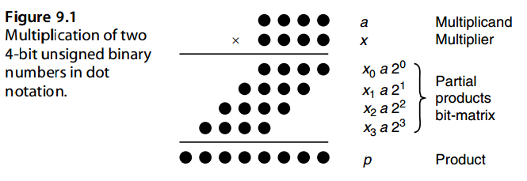
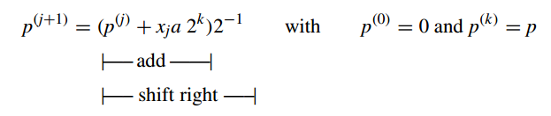

# 9. 基础的乘法方案

Basic Mutiplication Schemes

> “Science: That false secondary power by which we multiply distinctions.”
> WILLIAM WORDSWORTH

> “科学：一种虚假的次要力量，通过它我们可以倍增差异。”
> 威廉·华兹华斯

The multi-operand addition process needed for multiplying two k-bit operands can be realized in k cycles of shifting and adding, with hardware, firmware, or software control of the loop. In this chapter,we review such economical,but slow,bit-at-a-time designs and set the stage for speedup methods and variations to be presented in Chapters 10–12. We also consider the special case of multiplication by a constant. Chapter topics include:

两个k位操作数相乘所需的多操作数加法过程可以通过循环的硬件、固件或软件控制在k个移位和加法周期中实现。 在本章中，我们回顾了这种经济但缓慢的一次设计，并为第 10 章至第 12 章中介绍的加速方法和变体奠定了基础。 我们还考虑乘以常数的特殊情况。 章节主题包括：

-   9.1 移位相加乘法算法 SHIFT-ADD MULTIPLICATION ALGORITHMS
-   9.2 程序实现的乘法 PROGRAMMED MULTIPLICATION
-   9.3 基础硬件乘法器 BASIC HARDWARE MULTIPLIERS
-   9.4 有符号数乘法 MULTIPLICATION OF SIGNED NUMBERS
-   9.5 乘与一个常数 MULTIPLICATION BY CONSTANTS
-   9.6 高速乘法器的预览 PREVIEW OF FAST MULTIPLIERS

## 9.1 移位相加乘法算法

我们后面的讨论使用如下的记法:

$$
\begin{array}{l}
a &\text{Multiplicand} &a_{k−1}a_{k−2} · · · a_1a_0 \\
x &\text{Multiplier}   &x_{k−1}x_{k−2} · · · x_1x_0 \\
p &\text{Product}      &p_{2k−1}p_{2k−2} · · · p_1p_0
\end{array}
$$

Figure 9.1 shows the multiplication of two 4-bit unsigned binary numbers in dot notation. The two numbers a and x are shown at the top. Each of the following four rows of dots corresponds to the product of the multiplicand  *a*  and 1 bit of the multiplier  *x*, with each dot representing the product (logical AND) of two bits. Since  *xj*  is in {0, 1}, each term *xja*  is either 0 or  *a*. Thus, the problem of binary multiplication reduces to adding a set of numbers, each of which is 0 or a shifted version of the multiplicand  *a*. 

图 9.1 以点表示法显示了两个 4 位无符号二进制数的乘法。 两个数字 a 和 x 显示在顶部。 接下来的四行点分别对应被乘数 *a* 和乘数 *x*中1比特位的乘积，每个点代表乘积（逻辑与）。 由于 $x_j$ 位于 {0, 1} 中，因此每一项 $x_ja$ 要么是 0，要么是 *a*。 因此，二进制乘法的问题简化为添加一组数字，每个数字都是 0 或被乘数 $a$ 的移位版本。

Figure 9.1 also applies to nonbinary multiplication, except that with  *r >*  2, computing the terms  *xja*  becomes more difficult and the resulting numbers will be one digit wider than  *a*. The rest of the process (multioperand addition), however, remains substantially the same. 

图 9.1 也适用于非二进制乘法，只不过当 $r > 2$ 时，计算项 $x_ja$ 变得更加困难，并且所得数字将比 a 宽一位数。然而，该过程的其余部分（多操作数加法）基本保持不变。

Sequential or bit-at-a-time multiplication can be done by keeping a cumulative partial product (initialized to 0) and successively adding to it the properly shifted terms  $x_ja$.  Since each successive number to be added to the cumulative partial product is shifted by 1 bit with respect to the preceding one, a simpler approach is to shift the cumulative partial product by 1 bit in order to align its bits with those of the next partial product.  Two versions of this algorithm can be devised, depending on whether the partial product terms  $x_ja$  in Fig. 9.1 are processed from top to bottom or from bottom to top. 

顺序或一次一位乘法可以通过保持累积部分积（初始化为 0）并连续添加正确移位的项 $x_ja$ 来完成。由于要添加到累积部分积的每个连续数字相对于前一个数字移位 1 位，因此一种更简单的方法是将累积部分积移位 1 位，以便将其位与下一个部分积的位对齐。可以设计该算法的两个版本，具体取决于图 9.1 中的部分积项 xja 是从上到下还是从下到上处理。

In multiplication with right shifts, the partial product terms  *xja*  are accumulated from top to bottom:

在右移乘法中，部分积项 xja 从上到下累加：

Because the right shifts will cause the first partial product to be multiplied by 2− *k* by the time we are done, we premultiply *a* by 2 *k* to offset the effect of the right shifts. This premultiplication is done simply by aligning *a* with the upper half of the 2 *k*-bit cumulative partial product in the addition steps (i.e., storing *a* in the left half of a double-width register).

因为在完成时右移将导致第一个部分积乘以 $2^{−k}$，所以我们将 a 预乘以 $2^k$ 以抵消右移的影响。这种预乘法只需在加法步骤中将 a 与 2k 位累积部分积的上半部分对齐即可完成（即，将 a 存储在双宽度寄存器的左半部分）。

After *k* iterations, the preceding recurrence leads to

经过 k 次迭代后，前面的递归导致

$p^{(k)} = ax + p^{(0)}2^{−k}$

Thus if instead of 0, *p(* 0 *)* is initialized to *y* 2 *k* , the expression *ax* + *y* will be evaluated. This multiply-add operation is quite useful for many applications and is performed at essentially no extra cost compared with plain shift/add multiplication.

因此，如果 $p^{(0)}$ 初始化为 $y 2^k$ 而不是 0，则将计算表达式 $ax + y$。这种乘加运算对于许多应用来说非常有用，并且与普通的移位/加法乘法相比，基本上不需要额外的成本即可执行。

## 9.2 程序实现的乘法

## 9.3 基础硬件乘法器

## 9.4 有符号数乘法

## 9.5 乘与一个常数

## 9.6 高速乘法器的预览

## 问题（略）

## 参考文献和进一步阅读