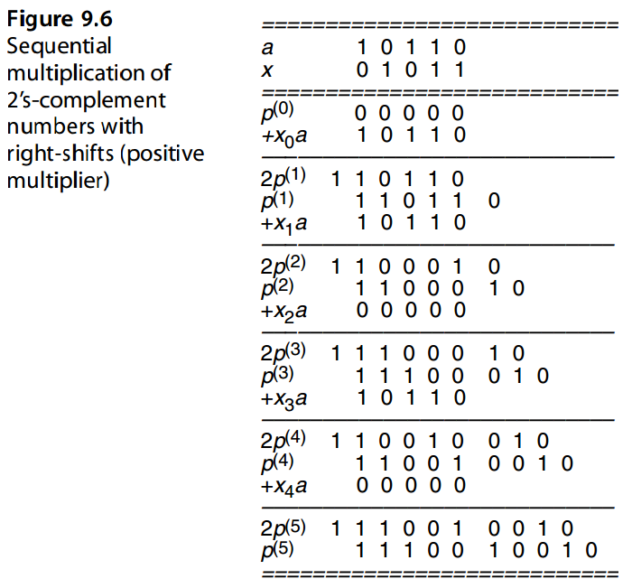

# 9. 基础的乘法方案

Basic Mutiplication Schemes


> “Science: That false secondary power by which we multiply distinctions.”
> WILLIAM WORDSWORTH


> “科学：一种虚假的次要力量，通过它我们可以倍增差异。”
> 威廉·华兹华斯


The multi-operand addition process needed for multiplying two k-bit operands can be realized in k cycles of shifting and adding, with hardware, firmware, or software control of the loop. In this chapter,we review such economical,but slow,bit-at-a-time designs and set the stage for speedup methods and variations to be presented in Chapters 10–12. We also consider the special case of multiplication by a constant. Chapter topics include:


两个k位操作数相乘所需的多操作数加法过程可以通过循环的硬件、固件或软件控制在k个移位和加法周期中实现。 在本章中，我们回顾了这种经济但缓慢的一次设计，并为第 10 章至第 12 章中介绍的加速方法和变体奠定了基础。 我们还考虑乘以常数的特殊情况。 章节主题包括：


-   9.1 移位相加乘法算法 SHIFT-ADD MULTIPLICATION ALGORITHMS
-   9.2 程序实现的乘法 PROGRAMMED MULTIPLICATION
-   9.3 基础硬件乘法器 BASIC HARDWARE MULTIPLIERS
-   9.4 有符号数乘法 MULTIPLICATION OF SIGNED NUMBERS
-   9.5 乘以一个常数 MULTIPLICATION BY CONSTANTS
-   9.6 高速乘法器的预览 PREVIEW OF FAST MULTIPLIERS


## 9.1 移位相加乘法算法

我们后面的讨论使用如下的记法:


$$
\begin{array}{l}
a &\text{Multiplicand} &a_{k−1}a_{k−2} · · · a_1a_0 \\
x &\text{Multiplier}   &x_{k−1}x_{k−2} · · · x_1x_0 \\
p &\text{Product}      &p_{2k−1}p_{2k−2} · · · p_1p_0
\end{array}
$$


Figure 9.1 shows the multiplication of two 4-bit unsigned binary numbers in dot notation. The two numbers a and x are shown at the top. Each of the following four rows of dots corresponds to the product of the multiplicand  *a*  and 1 bit of the multiplier  *x*, with each dot representing the product (logical AND) of two bits. Since  *xj*  is in {0, 1}, each term *xja*  is either 0 or  *a*. Thus, the problem of binary multiplication reduces to adding a set of numbers, each of which is 0 or a shifted version of the multiplicand  *a*. 

图 9.1 以点表示法显示了两个 4 位无符号二进制数的乘法。 两个数字 a 和 x 显示在顶部。 接下来的四行点分别对应被乘数 *a* 和乘数 *x*中1比特位的乘积，每个点代表乘积（逻辑与）。 由于 $x_j$ 位于 {0, 1} 中，因此每一项 $x_ja$ 要么是 0，要么是 *a*。 因此，二进制乘法的问题简化为添加一组数字，每个数字都是 0 或被乘数 $a$ 的移位版本。


Figure 9.1 also applies to nonbinary multiplication, except that with  *r >*  2, computing the terms  *xja*  becomes more difficult and the resulting numbers will be one digit wider than  *a*. The rest of the process (multioperand addition), however, remains substantially the same. 

图 9.1 也适用于非二进制乘法，只不过当 $r > 2$ 时，计算项 $x_ja$ 变得更加困难，并且所得数字将比 a 宽一位数。然而，该过程的其余部分（多操作数加法）基本保持不变。


Sequential or bit-at-a-time multiplication can be done by keeping a cumulative partial product (initialized to 0) and successively adding to it the properly shifted terms  $x_ja$.  Since each successive number to be added to the cumulative partial product is shifted by 1 bit with respect to the preceding one, a simpler approach is to shift the cumulative partial product by 1 bit in order to align its bits with those of the next partial product.  Two versions of this algorithm can be devised, depending on whether the partial product terms  $x_ja$  in Fig. 9.1 are processed from top to bottom or from bottom to top. 


顺序或一次一位乘法可以通过保持累积部分积（初始化为 0）并连续添加正确移位的项 $x_ja$ 来完成。由于要添加到累积部分积的每个连续数字相对于前一个数字移位 1 位，因此一种更简单的方法是将累积部分积移位 1 位，以便将其位与下一个部分积的位对齐。可以设计该算法的两个版本，具体取决于图 9.1 中的部分积项 xja 是从上到下还是从下到上处理。


In multiplication with right shifts, the partial product terms  *xja*  are accumulated from top to bottom:

在右移乘法中，部分积项 xja 从上到下累加：


Because the right shifts will cause the first partial product to be multiplied by 2− *k* by the time we are done, we premultiply *a* by 2 *k* to offset the effect of the right shifts. This premultiplication is done simply by aligning *a* with the upper half of the 2 *k*-bit cumulative partial product in the addition steps (i.e., storing *a* in the left half of a double-width register).

因为在完成时右移将导致第一个部分积乘以 $2^{−k}$，所以我们将 a 预乘以 $2^k$ 以抵消右移的影响。这种预乘法只需在加法步骤中将 a 与 2k 位累积部分积的上半部分对齐即可完成（即，将 a 存储在双宽度寄存器的左半部分）。

After *k* iterations, the preceding recurrence leads to

经过 k 次迭代后，前面的递归导致

$p^{(k)} = ax + p^{(0)}2^{−k}$

Thus if instead of 0, *p(* 0 *)* is initialized to *y* 2 *k* , the expression *ax* + *y* will be evaluated. This multiply-add operation is quite useful for many applications and is performed at essentially no extra cost compared with plain shift/add multiplication.

因此，如果 $p^{(0)}$ 初始化为 $y 2^k$ 而不是 0，则将计算表达式 $ax + y$。这种乘加运算对于许多应用来说非常有用，并且与普通的移位/加法乘法相比，基本上不需要额外的成本即可执行。

In multiplication with left shifts, the terms  *xja*  are added up from bottom to top: 

在左移乘法中，项 $x_ja$ 从下到上相加：


After *k* iterations, the preceding recurrence leads to

经过 k 次迭代后，前面的递归导致

$p^{(k)} = ax + p^{(0)} 2^k$

In this case, the expression  *ax* +  *y*  will be evaluated if we initialize  *p(* 0 *)*  to  *y* 2− *k* . 

在这种情况下，如果我们将 p( 0 ) 初始化为 y 2− k ，则表达式 ax + y 将被求值。

Figure 9.2 shows the multiplication of  *a* =  *(* 10 *)* ten =  *(* 1010 *)* two and  *x* =  *(* 11 *)* ten = *(* 1011 *)* two, to obtain their product  *p* =  *(* 110 *)* ten =  *(* 0110 1110 *)* two, using both the right-and left-shift algorithms. 

图 9.2 显示了 $a = ( 10 )_{10} = ( 1010 )_2$ 和 $x = ( 11 ) _{10} = ( 1011 )_2$的乘法，使用右移和左移算法获得它们的乘积 $p = ( 110 )_{10} = ( 0110 1110 )_2$。

From the examples in Fig. 9.2, we see that the two algorithms are quite similar. Each algorithm entails  *k*  additions and  *k*  shifts; however, additions in the left-shift algorithm are 2 *k*  bits wide (the carry produced from the lower  *k*  bits may affect the upper  *k*  bits), whereas the right-shift algorithm requires  *k*-bit additions. For this reason, multiplication with right shifts is preferable. 

从图 9.2 的例子中，我们看到这两种算法非常相似。每个算法都需要 k 个加法和 k 个移位；然而，左移算法中的加法是 2 k 位宽（低 k 位产生的进位可能影响高 k 位），而右移算法需要 k 位加法。因此，优选右移乘法。


## 9.2 程序实现的乘法

On a processor that does not have a multiply instruction, one can use shift and add instructions to perform integer multiplication. Figure 9.3 shows the structure of the needed program for the right-shift algorithm. The instructions used in this program fragment are typical of instructions available on many processors. 

在没有乘法指令的处理器上，可以使用移位和加法指令来执行整数乘法。图 9.3 显示了右移算法所需的程序结构。该程序片段中使用的指令是许多处理器上可用的典型指令。


Ignoring operand load and result store instructions (which would be needed in any case), the function of a multiply instruction is accomplished by executing between 6 *k* +3 and 7 *k*+3 machine instructions, depending on the multiplier. More precisely, if the binary representation of the multiplier  *x*  is of weight  *w* (i.e., its number of 1 bits equals  *w*), then 6 *k* +  *w* + 3 instructions will be executed by the program of Fig. 9.3. The dependence of program execution time on w arises from the fact that the add instruction is skipped when the bit of  *x*  being processed in a particular iteration is 0. For 32-bit operands, this means 200+ instructions for each multiplication on the average. The situation improves somewhat if a special instruction that does some or all of the required functions within the multiplication loop is available. However, even then, no fewer than 32 instructions are executed in the multiplication loop. We thus see the importance of hardware multipliers for applications that involve many numerical computations. 

忽略操作数加载和结果存储指令（在任何情况下都需要），乘法指令的功能是通过执行 $6 k +3$ 和 $7 k+3$ 条机器指令之间来完成的，具体取决于乘数。更准确地说，如果乘数 x 的二进制表示的权重为 w（即，其 1 位数等于 w），则图 9.3 的程序将执行 $6 k + w + 3$ 条指令。程序执行时间对 w 的依赖是由于当特定迭代中正在处理的 x 的位为 0 时，加法指令会被跳过。对于 32 位操作数，这意味着每次乘法平均需要 200 多个指令。如果可以使用在乘法循环内执行部分或全部所需功能的特殊指令，则情况会有所改善。然而，即便如此，乘法循环中执行的指令也不少于 32 条。因此，我们看到了硬件乘法器对于涉及许多数值计算的应用的重要性。

Processors with microprogrammed control and no hardware multiplier essentially

具有微程序控制且本质上没有硬件乘法器的处理器

use a microroutine very similar to the program in Fig. 9.3 to effect multiplication. Since microinstructions typically contain some parallelism and built-in conditional branching,  the number of microinstructions in the main loop is likely to be smaller than 6. This reduction, along with the savings in machine instruction fetching and decoding times, makes multiplication microroutines significantly faster than their machine-language counterparts, though still slower than the hardwired implementations we examine next. 

使用与图 9.3 中的程序非常相似的微程序来实现乘法。由于微指令通常包含一些并行性和内置条件分支，主循环中的微指令数量可能小于 6。这种减少，加上机器指令获取和解码时间的节省，使得乘法微例程比机器语言对应的微例程快得多，尽管仍然比我们接下来检查的硬连线实现慢。


## 9.3 基础硬件乘法器

Hardware realization of the multiplication algorithm with right shifts is depicted in Fig. 9.4a. The multiplier  *x*  and the cumulative partial product  *p*  are stored in shift registers. The next bit of the multiplier to be considered is always available at the right end of the  *x*  register and is used to select 0 or  *a*  for the addition. Addition and shifting can be performed in 2 separate cycles or in 2 subcycles within the same clock cycle. In either case, temporary storage for the adder’s carry-out signal is needed. Alternatively, shifting can be performed by connecting the  *i* th sum output of the adder to the ( *k* +  *i* − 1)th bit of the partial product register and the adder’s carry-out to bit 2 *k* − 1, thus doing the addition and shifting as a single operation. 

右移乘法算法的硬件实现如图 9.4a 所示。乘数 $x$ 和累积部分积 $p$ 存储在移位寄存器中。要考虑的乘法器的下一位始终位于 $x$ 寄存器的右端，用于选择 0 或 a 进行加法。加法和移位可以在 2 个单独的周期或同一时钟周期内的 2 个子周期中执行。无论哪种情况，都需要临时存储加法器的进位信号。或者，可以通过将加法器的第 $i$ 个和输出连接到部分积寄存器的第 $(k + i − 1)$ 位并将加法器的进位输出连接到位 $2 k − 1$ 来执行移位，从而将加法和移位作为单个操作进行。

The control portion of the multiplier, which is not shown in Fig. 9.4a, consists of a counter to keep track of the number of iterations and a simple circuit to effect initialization and detect termination. Note that the multiplier and the lower half of the cumulative partial product can share the same register, since as  *p*  expands into this register, bits of  *x* are relaxed, keeping the total number of bits at 2 *k*. This gradual expansion of  *p*  into the lower half of the double-width partial product register (at the rate of 1 bit per cycle) is readily observable in Fig. 9.2a. 

乘法器的控制部分（图 9.4a 中未显示）由一个用于跟踪迭代次数的计数器和一个用于实现初始化和检测终止的简单电路组成。请注意，乘法器和累积部分乘积的下半部分可以共享相同的寄存器，因为当 $p$ 扩展到该寄存器时，$x$ 的位被放宽，从而使总位数保持在 $2 k$。 $p$ 逐渐扩展到双宽部分积寄存器的下半部分（以每周期 1 位的速率）在图 9.2a 中很容易观察到。


Figure 9.5 shows the double-width register shared by the cumulative partial product and the unused part of the multiplier, along with connections needed to effect simultaneous loading and shifting. Since the register is loaded at the very end of each cycle, the change in its least-significant bit, which is controlling the current cycle, will not cause any problem. 

图 9.5 显示了由累积部分积和乘法器未使用部分共享的双宽度寄存器，以及实现同时加载和移位所需的连接。由于寄存器在每个周期的最后加载，因此控制当前周期的最低有效位的变化不会引起任何问题。


Hardware realization of the algorithm with left shifts is depicted in Fig. 9.4b. Here too the multiplier  *x*  and the cumulative partial product  *p*  are stored in shift registers, but the registers shift to the left rather than to the right. The next bit of the multiplier to be considered is always available at the left end of the  *x*  register and is used to select 0 or  *a*  for the addition. Note that a 2 *k*-bit adder (actually, a  *k*-bit adder in the lower part, augmented with a  *k*-bit incrementer at the upper end) is needed in the hardware realization of multiplication with left shifts. Because the hardware in Fig. 9.4b is more complex than that in Fig. 9.4a, multiplication with right shifts is the preferred method. 

左移算法的硬件实现如图 9.4b 所示。这里，乘数 x 和累积部分积 p 也存储在移位寄存器中，但寄存器向左移位而不是向右移位。要考虑的乘法器的下一位始终位于 x 寄存器的左端，用于选择 0 或 a 进行加法。注意，左移乘法的硬件实现需要一个2k位加法器（实际上是下半部分的k位加法器，上端增加了k位增量器）。由于图 9.4b 中的硬件比图 9.4a 中的硬件更复杂，因此右移乘法是首选方法。

The control portion of the multiplier, which is not shown in Fig. 9.4b, is similar to that for multiplication with right shifts. Here, register sharing is possible for the multiplier and the upper half of the cumulative partial product, since with each 1-bit expansion in  *p*, 1 bit of  *x*  is relaxed. This gradual expansion of  *p*  into the upper half of the double-width partial product register (at the rate of 1 bit per cycle) is readily observable in Fig. 9.2b. One difference with the right-shift scheme is that because the double-width register is shifted at the beginning of each cycle, temporary storage is required for keeping the multiplier bit that controls the rest of the cycle. 

乘法器的控制部分（图 9.4b 中未示出）与右移乘法的控制部分类似。这里，寄存器共享对于乘法器和累积部分乘积的上半部分是可能的，因为随着p中的每1位扩展，x的1位被放松。 p 逐渐扩展到双宽部分积寄存器的上半部分（以每周期 1 位的速率）在图 9.2b 中很容易观察到。与右移方案的一个区别是，由于双宽度寄存器在每个周期开始时移位，因此需要临时存储来保存控制周期其余部分的乘法器位。

Note that for both Figs. 9.4a and 9.4b, the multiplexer (mux) can be replaced by a set of  *k*  AND gates, with one input of each tied to  *xi*. We will see later that, for signed multiplication, one of three possible values must be fed to the left input of the adder in Fig. 9.4:  *a*,  *a* compl, or 0. In the latter case, we can use a 2-way multiplexer with its enable signal tied to  *xi*. When  *xi* = 0, the value 0 will be sent to the adder; otherwise,  *a*  or  *a* compl is sent, depending on the setting of a selection signal supplied by the control unit. 

请注意，对于两个图。 9.4a 和 9.4b 中，多路复用器 (mux) 可以由一组 k 个与门代替，每个与门的一个输入连接到 $x_i$。稍后我们将看到，对于有符号乘法，必须将三个可能值之一馈送到图 9.4 中的加法器的左侧输入：$a$、$a^{compl}$ 或 0。在后一种情况下，我们可以使用 2 路多路复用器，其使能信号与 $x_i$ 相连。当$x_i = 0$时，值0将被发送到加法器；否则，根据控制单元提供的选择信号的设置，发送$a$或$a^{compl}$。


## 9.4 有符号数乘法

The preceding discussions of multiplication algorithms and hardware realizations assume unsigned operands and result. Multiplication of signed-magnitude numbers needs little more, since the product’s sign can be computed separately by XORing the operand signs. One way to multiply signed values with complement representations is to complement the negative operand(s), multiply unsigned values, and then complement the result if only one operand was complemented at the outset. Such an indirect multiplication scheme is quite efficient for 1’s-complement numbers but involves too much overhead for 2’s-complement representation. It is preferable to use a direct multiplication algorithm for such numbers, as discussed in the remainder of this section.

前面对乘法算法和硬件实现的讨论假设操作数和结果是无符号数。 有符号数值的乘法几乎不需要更多改变，因为可以通过对操作数符号进行异或来单独计算乘积的符号。 将有符号值与补码表示相乘的一种方法是对负操作数求补，将无符号值相乘，如果一开始只对一个操作数求补，则对结果求补。 这种间接乘法方案对于 1 补数表示非常有效，但对于 2 补数表示涉及太多开销。 最好对这些数字使用直接乘法算法，如本节其余部分所述。

We first note that the preceding bit-at-a-time algorithms can work directly with a negative 2’s-complement multiplicand and a positive multiplier. In this case, each *xja* term will be a 2’s-complement number and the sum will be correctly accumulated if we use sign-extended values during the addition process. Figure 9.6 shows the multiplication of a negative multiplicand *a* = *(*−10 *)* ten = *(* 10110 *)* 2s−compl by a positive multiplier *x* = *(* 11 *)* ten = *(* 01011 *)* 2s−compl using the right-shift algorithm. Note that the leftmost digit of the sum *p(i)* + *xia* is obtained assuming sign-extended operands.

我们首先注意到，前面的一次比特算法可以直接使用负 2 补码被乘数和**正乘数**。在这种情况下，每个 $x_ja$ 项将是一个 2 的补数，如果我们在加法过程中使用符号扩展值，则总和将正确累加。图 9.6 显示了使用右移算法将负被乘数 $a = (−10 ) _{ten} = ( 10110 ) _{2s−compl}$ 与正乘数 $x = ( 11 )_{ten} = ( 01011 ) _{2s−compl}$ 相乘。请注意，$p^{(i)} + x_ia$ 之和的最左边数字是在假设符号扩展操作数的情况下获得的。



In view of the negative-weight interpretation of the sign bit in 2’s-complement numbers, a negative 2’s-complement multiplier can be handled correctly if *xk*−1 *a* is subtracted, rather than added, in the last cycle. In practice, the required subtraction is performed by adding the 2’s-complement of the multiplicand or, actually, adding the 1’s-complement of the multiplicand and inserting a carry-in of 1 into the adder (see Fig. 2.7). The required control logic becomes only slightly more complex. Figure 9.7 shows the multiplication of negative values *a* = *(*−10 *)* ten = *(* 10110 *)* 2s−compl and *x* = *(*−11 *)* ten = *(* 10101 *)* two by means of the right-shift algorithm.

鉴于 2 补码数中符号位的负权重解释，如果在最后一个周期中减去而不是加 $x_{k−1} a$ ，则可以正确处理负 2 补码乘数。实际上，所需的减法是通过添加被乘数的 2 补码来执行的，或者实际上是添加被乘数的 1 补码并将进位 1 插入加法器（见图 2.7）。所需的控制逻辑仅变得稍微复杂一些。图9.7显示通过右移算法将负值 $a = (−10 ) _{ten} = ( 10110 ) _{2's−compl}$ 和 $x = (−11 ) _{ten} = ( 10101 ) _{two}$ 相乘。


Figure 9.8 shows a hardware 2’s-complement multiplier whose structure is substantially the same as that of Fig. 9.4a. The control unit, not shown in Fig. 9.8, causes the multiplicand to be added to the partial product in all but the final cycle, when a subtraction is performed by choosing the complement of the multiplicand and inserting a carry-in of 1.

图9.8显示了一个硬件2的补码乘法器，其结构与图9.4a基本相同。当通过选择被乘数的补数并插入进位 1 来执行减法时，控制单元（图 9.8 中未显示）会导致除最后一个循环之外的所有循环中的被乘数与部分积相加。

Multiplication with left shifts becomes even less competitive when we are dealing with 2’s-complement numbers directly. Referring to Fig. 9.4b, we note that the

multiplicand must be sign-extended by *k* bits. We thus have a more complex adder as well as slower additions. With right shifts, on the other hand, sign extension occurs incrementally; thus the adder needs to be only 1 bit wider. Alternatively, a *k*-bit adder can be augmented with special logic to handle the extra bit at the left. 

An alternate way of dealing with 2’s-complement numbers is to use Booth’s recoding to represent the multiplier  *x*  in signed-digit format. 

当我们直接用 2 的补码进行乘法运算，左移乘法变得更加没有竞争力。参考图9.4b，我们注意到被乘数必须符号扩展 k 位。因此，我们有一个更复杂的加法器以及更慢的加法。另一方面，对于右移，符号扩展是逐渐发生的。因此加法器只需加宽 1 位。或者，可以使用特殊逻辑来增强 k 位加法器，以处理左侧的额外位。

处理 2 补码的另一种方法是使用 Booth 重新编码以有符号数字格式表示乘数 x。

Booth’s recoding (also known as Booth’s encoding) was first proposed for speeding up radix-2 multiplication in early digital computers. Recall that radix-2 multiplication consists of a sequence of shifts and adds. When 0 is added to the cumulative partial product in a step, the addition operation can be skipped altogether. This does not make sense in the designs of Fig. 9.4, since the data paths go through the adder. But in an asynchronous implementation, or in developing a (micro)program for multiplication, shifting alone is faster than addition followed by shifting, and one may take advantage of this fact to reduce the multiplication time on the average. The resulting algorithm or its associated hardware implementation will have variable delay depending on the multiplier value: the more 1s there are in the binary representation of  *x*, the slower the multiplication. Booth observed that whenever there are a large number of consecutive 1s in  *x*, multiplication can be speeded up by replacing the corresponding sequence of additions with a subtraction at the least-significant end and an addition in the position immediately to the left of its most-significant end. In other words

布斯重新编码（也称为布斯编码）最初是为了加速早期数字计算机中的基 2 乘法而提出的。回想一下，基 2 乘法由一系列移位和加法组成。当一步中将0添加到累积部分积时，可以完全跳过加法操作。这在图 9.4 的设计中没有意义，因为数据路径经过加法器。但在异步实现中，或在开发乘法（微）程序时，单独移位比先加后移位要快，并且可以利用这一事实来平均减少乘法时间。生成的算法或其相关硬件实现将具有可变延迟，具体取决于乘数值：x 的二进制表示中的 1 越多，乘法就越慢。 Booth 观察到，每当 x 中存在大量连续 1 时，通过将相应的加法序列替换为最低有效端的减法和紧邻最高有效端左侧位置的加法，可以加快乘法速度。换句话说

$2^j + 2^{j−1} + · · · + 2^{i+1} + 2^i = 2^{j+1} − 2^i$


The longer the sequence of 1s, the larger the savings achieved. The effect of this transformation is to change the binary number  *x*  with digit set [0, 1] to the binary signed-digit number  *y*  using the digit set [−1, 1]. Hence, Booth’s recoding can be viewed as a kind of digit-set conversion. Table 9.1 shows how the digit  *yi*  of the recoded number  *y* can be obtained from the two digits  *xi*  and  *xi*−1 of  *x*. Thus, as  *x*  is scanned from right to left, the digits  *yi*  can be determined on the fly and used to choose add, subtract, or no-operation in each cycle. 

的序列越长，节省的成本就越大。此转换的效果是将具有数字集 [0, 1] 的二进制数 $x$ 更改为使用数字集 [−1, 1] 的二进制有符号数字 $y$。因此，布斯的重新编码可以被视为一种数字集转换。表9.1显示了如何从$x$的两位数字$x_i$和$x_{i−1}$获得重新编码的数字$y$的数字$y_i$。因此，当从右向左扫描 $x$ 时，可以动态确定数字 $y_i$ 并用于在每个周期中选择加法、减法或无操作。


For example, consider the following 16-bit binary number and its recoded version: 1 0 0 1

例如，考虑以下 16 位二进制数及其重新编码版本：

```
     1 0 0 1   1  1 0 1    1 0  1 0   1 1  1 0    Operand x
(1) -1 0 1 0   0 -1 1 0   -1 1 -1 1   0 0 -1 0    Recoded version y
```


In this particular example, the recoding does not reduce the number of additions. However, the example serves to illustrate two points. First, the recoded number may have to be extended by 1 bit if the value of *x* as an unsigned number is to be preserved. Second, if *x* is a 2’s-complement number, then not extending the width (ignoring the leftmost 1 in the recoded version above) leads to the proper handling of negative numbers. Note how in the example, the sign bit of the 2’s-complement number has assumed a negative weight in the recoded version, as it should. A complete multiplication example is given in Fig. 9.9. 

在该特定示例中，重新编码并没有减少添加的数量。 然而，这个例子可以说明两点。 首先，如果要保留 *x* 的值作为无符号数，则重新编码的数可能必须扩展 1 位。 其次，如果 *x* 是 2 的补码数，则不扩展宽度（忽略上面重新编码版本中最左边的 1）会导致正确处理负数。 请注意，在示例中，2 的补码数的符号位在重新编码的版本中采用了负权重，正如它应该的那样。 图 9.9 给出了一个完整的乘法示例。


The multiplier of Fig. 9.8 can be easily converted to a Booth multiplier. All that is required is to provide a flip-flop on the right side of the multiplier register to hold *xi*−1 as it is shifted out, and a two-input, two-output combinational circuit to derive a representation of  *yi*  based on  *xi*  and  *xi*−1 (see Table 9.1). A convenient representation of *yi*  consists of the 2 bits “nonzero” (tied to the multiplexer’s enable input) and “negative” (feeding the multiplexer’s select input and the adder’s carry-in). 

Radix-2 Booth recoding is not directly applied in modern arithmetic circuits, but it serves as a tool in understanding the radix-4 version of this recoding, to be discussed in Section 10.2. 

图 9.8 的乘数可以很容易地转换为布斯乘数。所需要的只是在乘法器寄存器的右侧提供一个触发器，以在移出时保存 $x_{i−1}$，以及一个两输入、两输出组合电路，以根据 $x_i$ 和 $x_{i−1}$ 导出 $y_i$ 的表示形式（参见表 9.1）。 $y_i$ 的方便表示由 2 位“非零”（与多路复用器的使能输入相关）和“负”组成（馈送多路复用器的选择输入和加法器的进位输入）。

Radix-2 Booth 重新编码并不直接应用于现代算术电路，但它可以作为理解该重新编码的 radix-4 版本的工具，将在 10.2 节中讨论。


## 9.5 乘以一个常数

When a hardware multiplier, or a corresponding firmware routine, is unavailable, multiplication must be performed by a software routine similar to that in Fig. 9.3. In applications that are not arithmetic-intensive, loss of speed due to the use of such routines is tolerable. However, many applications involve frequent use of multiplication; in these applications, indiscriminate use of such slow routines may be unacceptable.

当硬件乘法器或相应的固件例程不可用时，乘法必须由类似于图9.3中的软件例程来执行。在非算术密集型的应用程序中，由于使用此类例程而造成的速度损失是可以容忍的。然而，许多应用都涉及频繁使用乘法；在这些应用中，不加区别地使用这种缓慢的例程可能是不可接受的。

Even for applications involving many multiplications, it is true that in a large fraction of cases, one of the operands is a constant that is known at circuit-design or program-compilation time. We know that multiplication and division by powers of 2 can be done through shifting. It is less obvious that multiplication by many other constants can be performed by short sequences of simple operations without a need to use a hardware multiplier or to invoke a complicated general multiplication routine or instruction.

即使对于涉及许多乘法的应用，在很大一部分情况下，操作数之一确实是在电路设计或程序编译时已知的常数。我们知道2的乘法和除法可以通过移位来完成。不太明显的是，乘以许多其他常数可以通过简单操作的短序列来执行，无需使用硬件乘法器或调用复杂的通用乘法例程或指令。

Besides explicit multiplications appearing in arithmetic expressions within programs, there are many implicit multiplications to compute offsets into arrays. For example, if an *m* × *n* array *A* is stored in row-major order, the offset of the element *Ai*, *j* (assuming 0-origin indexing) is obtained from the expression *ni*+ *j*. In such implicit multiplications, as well as in a significant fraction of explicit ones, one of the operands is a constant. A multiply instruction takes much longer to execute than a shift or an add instruction even if a hardware multiplier is available. Thus, one might want to avoid the use of a multiply instruction even when it is supported by the hardware.

除了程序中算术表达式中出现的显式乘法之外，还有许多隐式乘法来计算数组的偏移量。例如，如果 $m × n$ 数组 A 按行优先顺序存储，则元素 $A_{i, j}$（假设从 0 开始索引）的偏移量可从表达式 $ni+ j$ 获得。在此类隐式乘法以及显式乘法的很大一部分中，其中一个操作数是常量。即使硬件乘法器可用，乘法指令的执行时间也比移位或加法指令要长得多。因此，即使硬件支持乘法指令，人们也可能希望避免使用它。

In the remainder of this section, we describe algorithms for multiplication by integer constants in terms of shift and add/subtract operations performed on register contents.

The algorithms can thus be readily translated to sequences of instructions for any specific processor. The algorithms described can also be viewed as hardware structures to be built into application-specific designs. For example, a digital filter may be characterized by the equation *y*[ *t*] = *ax*[ *t*] + *bx*[ *t* − 1] + *cx*[ *t* − 2] + *dy*[ *t* − 1] + *ey*[ *t* − 2], in which *a*- *e* are constants, *x*[ *i*] is the input at time step *i*, and *y*[ *j*] is the output at time step *j*. Depending on the constants involved, the circuit computing *y*[ *t*] may not need multipliers at all. In fact, the circuit could be less complex, faster, and lower-powered if implemented by means of adders only. With the latter interpretation, the registers would represent intermediate bundles of wire that interconnect adder modules. Multiple additions can be performed via conventional two-operand adders or by means of carry-save adder trees, followed by a final carry-propagate adder. In both the hardware and software interpretations, the goal is to produce an optimal arrangement that requires a minimal number of operations and intermediate values. In the case of compiler-initiated optimizations, the complexity of the algorithm used for deriving the optimal sequence of operations is also of interest, as it affects the compiler’s running time.

在本节的其余部分中，我们将根据对寄存器内容执行的移位和加/减运算来描述乘以整数常量的算法。因此，算法可以很容易地转换为任何特定处理器的指令序列。所描述的算法也可以被视为构建到特定应用设计中的硬件结构。例如，数字滤波器可以用方程 $y[ t] = ax[ t] + bx[ t − 1] + cx[ t − 2] + dy[ t − 1] + ey[ t − 2]$ 来表征，其中 $a-e$ 是常数，$x[ i]$ 是时间步 i 的输入，$y[ j]$ 是时间步 j 的输出。根据所涉及的常数，计算 $y[t]$ 的电路可能根本不需要乘法器。事实上，如果仅通过加法器实现，电路可能会更简单、更快且功耗更低。对于后一种解释，寄存器将代表互连加法器模块的中间线束。多重加法可以通过传统的双操作数加法器或通过进位保存加法器树以及最后的进位传播加法器来执行。在硬件和软件解释中，目标是产生需要最少数量的操作和中间值的最佳安排。在编译器启动的优化的情况下，用于导出最佳操作序列的算法的复杂性也令人感兴趣，因为它会影响编译器的运行时间。

In the examples that follow, R1 denotes the register holding the multiplicand and R *i* will denote an intermediate result that is *i* times the multiplicand (e.g., R65 denotes the result of multiplying the multiplicand *a* by 65). Note that a new value R *j* can be saved in the same physical register that holds R *i*, provided the old value in R *i* is not needed for subsequent computation steps.

在下面的示例中，$R_1$ 表示保存被乘数的寄存器，$R_i$ 表示 $i$ 倍被乘数的中间结果（例如，$R_{65}$ 表示被乘数 $a$ 乘以 65 的结果）。请注意，如果后续计算步骤不需要 $R_i$ 中的旧值，则新值 R j 可以保存在保存 R i 的同一物理寄存器中。

A simple way to multiply the contents of a register by an integer constant multiplier is to write the multiplier in binary format and to use shifts and adds according to the 1s in the binary representation. For example to multiply R1 by 113 = *(* 1110001 *)* two, one might use

将寄存器的内容乘以整数常量乘数的一种简单方法是以二进制格式编写乘数，并根据二进制表示形式中的 1 使用移位和加法。例如，要将 R1 乘以 113 = ( 1110001 ) 二，可以使用

```
R2   ← R1 shift-left 1
R3   ← R2 + R1
R6   ← R3 shift-left 1
R7   ← R6 + R1
R112 ← R7 shift-left 4
R113 ← R112 + R1
```

Only two registers are required; one to store the multiplicand *a* and one to hold the latest partial result.

只需要两个寄存器； 一个存储被乘数 a，一个保存最新的部分结果。

If a shift-and-add instruction is available, the sequence above becomes

如果移位加法指令可用，则上面的序列变为

```
R3   ← R1 shift-left 1 + R1
R7   ← R3 shift-left 1 + R1
R113 ← R7 shift-left 4 + R1
```

If only 1-bit shifts are allowed, the last instruction in the preceding sequence must be replaced by three shifts followed by a shift-and-add. Note that the pattern of shift-andadds and shifts (s&a, s&a, shift, shift, shift, s&a) in this latter version matches the bit pattern of the multiplier if its most-significant bit is ignored (110001). 

如果只允许 1 位移位，则前面序列中的最后一条指令必须替换为三个移位，然后是移位加法。请注意，如果忽略最高有效位 (110001)，则后一个版本中的移位与加法和移位 (s&a, s&a, shift, shift, shift, s&a) 的模式与乘法器的位模式匹配。

Many other instruction sequences are possible. For example, one could proceed by computing R16, R32, R64, R65, R97 *(* R65 + R32 *)*, and R113 *(* R97 + R16). However, this would use up more registers. If subtraction is allowed in the sequence, the number of instructions can be reduced in some cases. For example, by taking advantage of the equality 113 = 128 − 16 + 1 = 16 *(* 8 − 1 *)* + 1, one can derive the following sequence of instructions for multiplication by 113:

许多其他指令序列是可能的。例如，可以通过计算 R16、R32、R64、R65、R97 (R65 + R32) 和 R113 (R97 + R16)。然而，这会占用更多的寄存器。如果序列中允许减法，则在某些情况下可以减少指令数量。例如，利用等式 113 = 128 − 16 + 1 = 16 ( 8 − 1 ) + 1，可以导出以下乘以 113 的指令序列：

```
R8   ← R1 shift-left 3
R7   ← R8 − R1
R112 ← R7 shift-left 4
R113 ← R112 + R1
```

In general, the use of subtraction helps if the binary representation of the integer has several consecutive 1s, since a sequence of *j* consecutive 1s can be replaced by 1 0 0 0 · · · 0 0 -1, where there are *j* − 1 zeros (Booth’s recoding).

一般来说，如果整数的二进制表示有几个连续的 1，则使用减法会有所帮助，因为 j 个连续 1 的序列可以用 1 0 0 0 · · · 0 0 -1替换，其中有 j − 1 个零（布斯重新编码）。

Factoring a number sometimes helps in obtaining efficient code. For example, to multiply R1 by 119, one can use the fact that 119 = 7 × 17 = *(* 8 − 1 *)* × *(* 16 + 1 *)* to obtain the sequence

对数字进行因式分解有时有助于获得高效的代码。例如，要将 R1 乘以 119，可以使用 119 = 7 × 17 = ( 8 − 1 ) × ( 16 + 1 ) 来获得序列

```
R8   ← R1 shift-left 3
R7   ← R8 − R1
R112 ← R7 shift-left 4
R119 ← R112 + R7
```

With shift-and-add/subtract instructions, the preceding sequence reduces to only two instructions:

使用移位和加/减指令，前面的序列减少到只有两条指令：

```
R7   ← R1 shift-left 3 − R1
R119 ← R7 shift-left 4 + R7
```

In general, factors of the form 2 *b* ± 1 translate directly into a shift followed by an add or subtract and lead to a simplification of the computation sequence. 

一般来说，2 b ± 1 形式的因子直接转换为移位，然后进行加法或减法，从而简化计算序列。

In a compiler that removes common subexpressions, moves invariant code out of loops, and performs a reduction of strength on multiplications inside loops (in particular changes multiplications to additions where possible), the effect of multiplication by constants is quite noticeable. It is not uncommon to obtain a 20% improvement in the resulting code, and some programs exhibit 60% improved performance [Bern86]. 

在删除公共子表达式的编译器中，将不变代码移出循环，并降低循环内乘法的强度（特别是在可能的情况下将乘法更改为加法），乘以常数的效果非常明显。生成的代码获得 20% 的改进并不罕见，有些程序的性能提高了 60% [Bern86]。

For many small constants of practical interest, one can obtain reasonably efficient sequences of shift and add/subtract operations by trial and error, although the optimal synthesis problem for constant multiplication is known to be NP-complete in general [Capp84]. Optimal implementations have been derived by means of exhaustive search for constants of up to 19 bits [Gust02]. Additionally, automated design tools can assist us with finding suitable designs under various implementation technologies and constraints [Xili99]. 

对于许多具有实际意义的小常数，人们可以通过反复试验获得相当有效的移位和加/减运算序列，尽管常数乘法的最佳综合问题通常已知是 NP 完全问题 [Capp84]。通过对最多 19 位常量的穷举搜索得出了最佳实现 [Gust02]。此外，自动化设计工具可以帮助我们在各种实施技术和约束下找到合适的设计 [Xili99]. 


## 9.6 高速乘法器的预览

If one views multiplication as a multioperand addition problem, there are but two ways to speed it up:

- Reducing the number of operands to be added.

- Adding the operands faster.


如果人们将乘法视为多操作数加法问题，那么只有两种方法可以加速它：

- 减少要添加的操作数的数量。
- 更快地对操作数做加法。

Reducing the number of operands to be added leads to high-radix multipliers in which several bits of the multiplier are multiplied by the multiplicand in 1 cycle. Speedup is achieved for radix 2 *j* as long as multiplying *j* bits of the multiplier by the multiplicand and adding the result to the cumulative partial product takes less than *j* times as long as multiplying 1 bit and adding the result. High-radix multipliers are covered in Chapter 10.

减少要相加的操作数数量会导致高基数乘法器，其中乘法器的几个位在 1 个周期内与被乘数相乘。对于基数 $2^j$，只要将乘法器的 $j$ 位乘以被乘数并将结果与累积部分积相加，所需时间少于乘以 1 位并将结果相加的 $j$ 倍，即可实现加速。第 10 章介绍了高基数乘法器。

To add the partial products faster, one can design hardware multioperand adders that minimize the latency and/or maximize the throughput by using some of the ideas discussed in Chapter 8. These multioperand addition techniques lead to tree and array multipliers, which form the subjects of Chapter 11.

为了更快地添加部分乘积，可以使用第 8 章中讨论的一些想法来设计硬件多操作数加法器，以最小化延迟和/或最大化吞吐量。这些多操作数加法技术导致了树和数组乘法器，它们构成了第 11 章的主题。


## 问题（略）


## 参考文献和进一步阅读

```
[Bern86] Bernstein, R., “Multiplication by Integer Constants,” Software—Practice and
         Experience, Vol. 16, No. 7, pp. 641–652, 1986.
[Boot51] Booth, A. D., “A Signed Binary Multiplication Technique,” Quarterly J. Mechanics
         and Applied Mathematics, Vol. 4, Pt. 2, pp. 236–240, 1951.
[Boul03] Boullis, N., and A. Tisserand, “Some Optimizations of Hardware Multiplication by
         Constant Matrices,” Proc. 16th IEEE Symp. Computer Arithmetic, June 2003, pp.
         20–27.
[Bris08] Brisebarre, N., and J.-M. Muller, “Correctly Rounded Multiplication by Arbitrary
         Precision Constants,” IEEE Trans. Computers, Vol. 57, No. 2, pp. 165–174, 2008.
[Capp84] Cappelo, P. R., and K. Steiglitz, “Some Complexity Issues in Digital Signal
         Processing,” IEEE Trans. Acoustics, Speech and Signal Processing, Vol. 32, No. 5,
         pp. 1037–1041, 1984.
[Gust02] Gustafsson, O., A. G. Dempster, and L. Wanhammar, “Extended Results for
         Minimum-Adder Constant Integer Multipliers,” Proc. IEEE Int’l Symp. Circuits and
         Systems, Vol. 1, pp. 73–76, 2002.
[Kore93] Koren, I., Computer Arithmetic Algorithms, Prentice-Hall, 1993.
[Omon94] Omondi, A. R., Computer Arithmetic Systems: Algorithms, Architecture and
         Implementations, Prentice-Hall, 1994.
[Robe55] Robertson, J. E., “Two’s Complement Multiplication in Binary Parallel Computers,”
         IRE Trans. Electronic Computers, Vol. 4, No. 3, pp. 118–119, 1955.
[Shaw50] Shaw, R. F., “Arithmetic Operations in a Binary Computer,” Rev. Scientific
         Instruments, Vol. 21, pp. 687–693, 1950.
[Voro07] Voroneko, Y., and M. Puschel, “Multiplierless Multiple Constant Multiplication,”
         ACM Trans. Algorithms, Vol. 3, No. 2, Article 11, 38 pp., 2007.
[Xili99] Xilinx Corporation, “Constant (K) Coefficient Multiplier Generator for Virtex,”
         Application note, March 1999.
```

