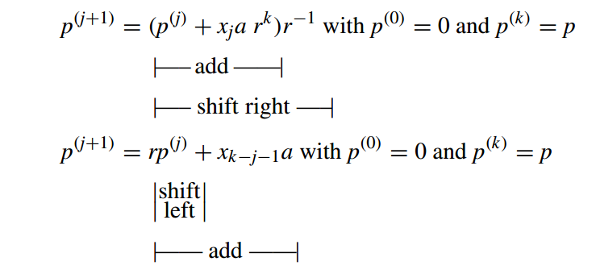

# 10. 高基乘法器 

High-Radix Multipliers

> “We go on multiplying our conveniences only to multiply our cares.We increase our possessions only to the enlargement of our anxieties.”
> ANNA C . BRACKETT


> “我们不断增加我们的便利，只会增加我们的忧虑。我们增加我们的财产，只会加剧我们的焦虑。”
> 安娜·C. 布莱克特


In this chapter, we review multiplication schemes that handle more than 1 bit of the multiplier in each cycle (2 bits per cycle in radix 4, 3 bits in radix 8, etc.). The reduction in the number of cycles, along with the use of recoding and carry-save addition to simplify the required computations in each cycle, leads to significant gains in speed over the basic multipliers of Chapter 9. Chapter topics include:

在本章中，我们回顾在每个周期中处理超过 1 位乘法器的乘法方案（基 4 中每个周期 2 位，基 8 中每个周期 3 位，等等）。 循环数量的减少，以及使用重新编码和进位保存加法来简化每个循环中所需的计算，与第 9 章的基本乘法器相比，速度显着提高。本章主题包括：


-   10.1 基 4 乘法 RADIX 4 MULTIPLICATION
-   10.2 改进的布斯编码 MODIFIED BOOTH'S RECODING
-   10.3 应用进位保留加法器 USING CARRY SAVE ADDERS
-   10.4 基 8 与基 16 乘法器 RADIX 8 AND RADIX-16 MULTIPLIERS
-   10.5 多节拍乘法器 MULTIBEAT MULTIPLIERS
-   10.6 VLSI复杂性分析主题 VLSI COMPLEXITY ISSUES


## 10.1 基 4 乘法

For a given range of numbers to be represented, a higher representation radix leads to fewer digits. Thus, a digit-at-a-time multiplication algorithm requires fewer cycles as we move to higher radices. This motivates us to study high-radix multiplication algorithms and associated hardware implementations. Since a *k*-bit binary number can be interpreted as a *k/* 2-digit radix-4 number, a *k/* 3-digit radix-8 number, and so on, the use of high-radix multiplication essentially entails dealing with more than 1 bit of the multiplier in each cycle.

对于给定的要表示的数字范围，较高的表示基数会导致较少的数字。因此，当我们转向更高的基数时，一次数字乘法算法需要更少的周期。这激励我们研究高基数乘法算法和相关的硬件实现。由于 k 位二进制数可以解释为 $\left \lceil k/ 2 \right \rceil$ 位基数 4 数、$\left \lceil k/ 3 \right \rceil$ 位基数 8 数等，因此使用高基数乘法本质上需要在每个周期中处理多于 1 位的乘法器。


We begin by presenting the general radix- *r* versions of the multiplication recurrences given in Section 9.1:

我们首先介绍第 9.1 节中给出的乘法递归的一般基数-r 版本：



Since multiplication by *r*−1 or *r* still entails right or left shifting by one digit, the only difference between high-radix and radix-2 multiplication is in forming the terms *xia*, which now require more computation.

由于乘以 $r−1$ 或 $r$ 仍然需要右移或左移一位数，因此高基数乘法和基 2 乘法之间的唯一区别在于形成项 $x_ia$，现在需要更多计算。

For example, if multiplication is done in radix 4, in each step, the partial product term *(xi*+1 *xi)* two *a* needs to be formed and added to the cumulative partial product. Figure 10.1 shows the multiplication process in dot notation. Straightforward application of this method leads to the following problem. Whereas in radix-2 multiplication, each row of dots in the partial products matrix represents 0 or a shifted version of *a*, here we need the multiples 0 *a*, 1 *a*, 2 *a*, and 3 *a*. The first three of these present no problem (2 *a* is simply the shifted version of *a*). But computing 3 *a* needs at least an addition operation (3 *a* = 2 *a* + *a*).

例如，如果以基数4进行乘法，则在每一步中，需要形成部分积项$(x_{i+1}x_i)_2$和a，并将其与累积部分积相加。图 10.1 以点表示法显示了乘法过程。直接应用该方法会导致以下问题。而在基 2 乘法中，部分积矩阵中的每一行点代表 0 或 $a$ 的移位版本，这里我们需要倍数 $0 a、1 a、2 a$ 和 $3 a$。其中前三个没有问题（2 a 只是 a 的移位版本）。但计算$3a$至少需要一次加法运算（$3a=2a+a$）。


In the remainder of this section, and in Section 10.2, we review several solutions for the preceding problem in radix-4 multiplication.

在本节的剩余部分和第 10.2 节中，我们回顾了基 4 乘法中上述问题的几种解决方案。

The first option is to compute 3 *a* once at the outset and store it in a register for future use. Then, the rest of the multiplier hardware will be very similar to that depicted in Fig. 9.4a, except that the two-way multiplexer (mux) is replaced by a four-way multiplexer as shown in Fig. 10.2. An example multiplication is given in Fig. 10.3.

第一个选项是从一开始就计算 $3 a$ 一次并将其存储在寄存器中以供将来使用。然后，乘法器硬件的其余部分将与图 9.4a 中所示的非常相似，除了两路多路复用器（mux）被四路多路复用器取代，如图10.2所示。图 10.3 给出了一个乘法示例。


Another possible solution exists when 3 *a* needs to be added: we add − *a* and send a carry of 1 into the next radix-4 digit of the multiplier (Fig. 10.4). Including the incoming carry, the needed multiple in each cycle is in [0, 4]. The multiples 0, 1, and 2 are handled directly, while the multiples 3 and 4 are converted to −1 and 0, respectively, plus an outgoing carry of 1, which is stored in a flip-flop (FF) for addition to the next radix-4 multiplier digit. An extra cycle may be needed at the end because of the carry.

存在另一种可能的加 $3 a$ 解决方案：我们加 $− a$ 并将进位 1 发送到乘法器的下一个基 4 数字中（图 10.4）。包括传入的进位在内，每个周期所需的倍数在[0, 4]中。倍数 0、1 和 2 直接处理，而倍数 3 和 4 分别转换为 -1 和 0，加上传出进位 1，将其存储在触发器 (FF) 中以添加到下一个基数 4 乘数位数。由于进位，最后可能需要一个额外的周期。


The multiplication schemes depicted in Figs. 10.2 and 10.4 can be extended to radices 8, 16, etc., but the multiple generation hardware becomes more complex for higher radices, nullifying most, if not all, of the gain in speed due to fewer cycles. For example, in radix 8, one needs to precompute the multiples 3 *a*, 5 *a*, and 7 *a*, or else precompute only 3 *a*  and use a carry scheme similar to that in Fig. 10.4 to convert the multiples 5 *a*, 6 *a*, and 7 *a*  to −3 *a*, −2 *a*, and − *a*, respectively, plus a carry of 1. Supplying the details is left as an exercise. 

图 1 和 2 中描绘的乘法方案。 10.2和10.4可以扩展到基数 8、16 等，但对于更高的基数，多代硬件变得更加复杂，抵消了大部分（如果不是全部）由于周期数较少而带来的速度增益。例如，在基数 8 中，需要预先计算倍数 $3a$、$5a$ 和 $7a$，或者仅预先计算 $3a$，并使用类似于图 10.4 中的进位方案将倍数 $5a$、$6a$ 和 $7a$ 分别转换为 $-3a$、$-2a$ 和 $-a$，再加上进位 1。提供详细信息留作练习。

We will see later in this chapter that with certain other hardware implementations, even higher radices become practical. 

我们将在本章后面看到，通过某些其他硬件实现，甚至更高的基数也变得实用。


## 10.2 改进的布斯编码

As stated near the end of Section 9.4, radix-2 Booth recoding is not directly applied in modern arithmetic circuits; however, it does serve as a tool in understanding the higher-radix versions of Booth’s recoding. It is easy to see that when a binary number is recoded using Table 9.1, the result will not have consecutive 1s or -1s. Thus, if radix-4 multiplication is performed with the recoded multiplier, only the multiples ± *a* and ±2 *a* of the multiplicand will be required, all of which are easily obtained by shifting and/or complementation.

正如第 9.4 节末尾所述，radix-2 Booth 重新编码并不直接应用于现代算术电路中； 然而，它确实可以作为理解布斯重新编码的高基数版本的工具。 很容易看出，当使用表9.1重新编码一个二进制数时，结果不会有连续的$1$或$-1$。 因此，如果用重新编码的乘法器执行基4乘法，则仅需要被乘数的倍数±*a*和±2*a*，所有这些都可以通过移位和/或求补来容易地获得。


Now since *yi*+1 depends on *xi*+1 and *xi*, and *yi* depends on *xi* and *xi*−1, the radix-4 digit *zi/* 2 = *(yi*+1 *yi)* two, *i* even, can be obtained directly from *xi*+1, *xi*, and *xi*−1 without a need for first forming the radix-2 recoded number *y* (Table 10.1).

现在，由于 $y_{i+1}$ 取决于 $x_{i+1}$ 和 $x_i$，并且 $y_i$ 取决于 $x_i$ 和 $x_i−1$，因此基-4数字 $z_{i/2} = (y_{i+1} y_{i})_2 $，其中 $i$是偶数，可以直接从 $x_{i+1}、x_i$ 和 $x_{i−1}$ 获得，而不需要首先形成基 2 重新编码的数字 $y$（表 10.1）。


Like the radix-2 version, radix-4 Booth’s recoding can be viewed as digit-set conversion: the recoding takes a radix-4 number with digits in [0, 3] and converts it to the digit set [−2, 2]. As an example, Table 10.1 can be used to perform the following conversion of an unsigned number into a signed-digit number:

与 radix-2 版本一样，radix-4 Booth 的重新编码可以视为数字集转换：重新编码把数字为 [0, 3] 的 radix-4 数字转换为数字集 [−2, 2]的数字。例如，表 10.1 可用于执行以下无符号数到有符号数的转换：


$$
\begin{array}{lr}
( 21\ 31\ 22\ 32 )_4 &= & &(10 &01 & 11 & 01 &10 &10 &11 &10)_2 \\
                     &= &( 1 &^-2 &2  &^-1 &2 &^-1 &^-1 &0 &^-2 )_4
\end{array}
$$
Note that the 16-bit unsigned number turns into a 9-digit radix-4 number. Generally, the radix-4 signed-digit representation of a *k*-bit unsigned binary number will need *k/* 2 + 1 = *(k* + 1 *)/* 2 digits when its most-significant bit is 1. Note also that *x*−1 = *xk* = *xk*+1 = 0 is assumed. If the binary number in the preceding example is interpreted as being in 2’s-complement format, then simply ignoring the extra radix-4 digit produced leads to correct encoding of the represented value:

请注意，16 位无符号数会变成 9 位基数 4 数。一般来说，当最高有效位为 1 时，$k$-位无符号二进制数的基 4 有符号数字表示将需要 $\left \lfloor k/ 2 \right \rfloor + 1 = \left \lceil (k + 1 )/ 2 \right \rceil$ 位。另请注意 $x_{−1} = x_k = x_{k+1} = 0$。如果上例中的二进制数被解释为 2 的补码格式，然后简单地忽略生成的额外基数 4 数字即可得到所表示值的正确编码： 

$( 10\ 01\ 11\ 01\ 10\ 10\ 11\ 10 )_{2’s-compl} = (^-2\ 2\ ^-1\ 2\ ^-1\ ^-1\ 0\ ^-2 )_4$


Thus, for *k*-bit binary numbers in 2’s-complement format, the Booth-encoded radix-4 version will have *k/* 2 digits. When *k* is odd, *xk* = *xk*−1 is assumed for proper recoding. In any case, *x*−1 = 0.

因此，对于 2 补码格式的 k 位二进制数，布斯编码的 radix-4版本将有 k/ 2 位数字。当 k 为奇数时，假设 $x_k = x_{k−1}$ 以便正确重新编码。无论如何，$x_{−1} = 0$。


The digit-set conversion process defined by radix-4 Booth’s recoding entails no carry propagation. Each radix-4 digit in [−2, 2] is obtained, independently from all others, by examining 3 bits of the multiplier, with consecutive 3-bit segments overlapping in 1 bit. For this reason, radix-4 Booth’s recoding is said to be based on overlapped 3-bit scanning of the multiplier. This can be extended to overlapped multiple-bit scanning schemes for higher radices (see Section 10.4).

radix-4 Booth 重新编码定义的数字集转换过程不需要进位传播。 $[−2, 2]$ 中的每个基数 4 数字都是通过检查乘法器的 3 位（其中连续 3 位段在 1 位中重叠）独立于所有其他数字而获得的。因此，radix-4 Booth 的重编码被称为是基于重叠 3 位扫描的乘法器。这可以扩展到更高基数的重叠多位扫描方案（参见第 10.4 节）。

An example radix-4 multiplication using Booth’s recoding is shown in Fig. 10.5. The 4-bit 2’s-complement multiplier *x* = *(* 1010 *)* two is recoded as a 2-digit radix-4 number *z* = *(*-1-2 *)* four, which then dictates the multiples *z* 0 *a* = −2 *a* and *z* 1 *a* = − *a* to be added to the cumulative partial product in the 2 cycles. Note that in all intermediate steps, the upper half of the cumulative partial product is extended from 4 bits to 6 bits to accommodate the sign extension needed for proper handling of the negative values. Also, note the sign extension during the right shift to obtain *p(* 1 *)* from 4 *p(* 1 *)*.

使用 Booth 重新编码的基 4 乘法示例如图 10.5 所示。 4 位 2 的补码乘法器 $x = ( 1010 )_2$ 被重新编码为 2 位基数 4 数 $z = (-1\ -2 )_4$，然后指示要添加到 2 个周期中的累积部分积的倍数 $z_0 a = −2 a$ 和 $z_1 a = − a$。请注意，在所有中间步骤中，累积部分积的上半部分从 4 位扩展到 6 位，以适应正确处理负值所需的符号扩展。另外，请注意右移期间的符号扩展，以便从 $4p^{( 1 )}$ 获得 $p^{( 1 )}$ 。


Figure 10.6 depicts a possible circuit implementation for multiple generation based on radix-4 Booth’s recoding. Since five possible multiples of *a* or digits (0, ±1, ±2) are

involved, we need at least 3 bits to encode a desired multiple. A simple and efficient encoding is to devote 1 bit to distinguish 0 from nonzero digits, 1 bit to the sign of a nonzero digit, and 1 bit to the magnitude of a nonzero digit (2 encoded as 1 and 1 as 0). The recoding circuit thus has three inputs ( *xi*+1, *xi*, *xi*−1) and produces three outputs: “neg” indicates whether the multiple should be added (0) or subtracted (1), “non0” indicates if the multiple is nonzero, and “two” indicates that a nonzero multiple is 2.


图 10.6 描述了基于 radix-4 Booth 重新编码的多重生成的可能电路实现。由于可能涉及到$a$的五个的倍数或数字（0、±1、±2），我们至少需要 3 位来编码所需的倍数。一种简单而高效的编码是用 1 位来区分 0 和非零数字，用 1 位来区分非零数字的符号，用 1 位来区分非零数字的大小（2 编码为 1，1 编码为 0）。因此，重新编码电路具有三个输入（$x_{i+1}、x_i、x_{i−1}$）并产生三个输出：

- “neg”表示倍数是加（0）还是减（1），
- “non0” 表示倍数是否非零，
- “two”表示非零倍数为 2。


It is instructive to compare the recoding scheme implicit in the design of Fig. 10.4 with Booth’s recoding of Fig. 10.6 in terms of cost and delay. This is left as an exercise. Note, in particular, that while the recoding produced in Fig. 10.4 is serial and must thus be done from right to left, Booth’s recoding is fully parallel and carry-free. This latter property is of no avail in designing digit-at-a-time multipliers, since the recoded digits are used serially anyway. But we will see later that Booth’s recoding can be applied to the design of tree and array multipliers, where all the multiples are needed at once.

比较图 10.4 设计中隐含的重编码与图 10.6 Booth重编码的方案的成本和延迟是有启发性的。这留作练习。请特别注意，虽然图 10.4 中产生的重新编码是串行的，因此必须从右到左完成，但布斯的重新编码是完全并行且无进位的。后一个在设计一次数字乘法器时没有任何用处，因为无论如何重新编码的数字都是串行使用的。但稍后我们会看到，布斯的重新编码可以应用于树和数组乘法器的设计，其中所有倍数都同时需要。


## 10.3 应用进位保留加法器

Carry-save adders (CSAs) can be used to reduce the number of addition cycles as well as to make each cycle faster. For example, radix-4 multiplication without Booth’s recoding can be implemented by using a CSA to handle the 3 *a* multiple, as shown in Fig. 10.7. Here, the CSAhelps us in doing radix-4 multiplication (generating the required multiples) without reducing the add time. In fact, one can say that the add time is slightly increased, since the CSA overhead is paid in every cycle, regardless of whether we actually need 3 *a*.

进位保存加法器 (CSA) 可用于减少加法周期数并使每个周期更快。例如，无需布斯重新编码的基 4 乘法可以通过使用 CSA 来处理 $3a$ 的倍数来实现，如图 10.7 所示。在这里，CSA 帮助我们进行基 4 乘法（生成所需的倍数），而无需减少加法时间。事实上，可以说加法时间略有增加，因为 CSA 开销是在每个周期中支付的，无论我们是否实际上需要 $3a$ 。


The CSA and multiplexers in the radix-4 multiplier of Fig. 10.7 can be put to better use for reducing the addition time in radix-2 multiplication by keeping the cumulative partial product in stored-carry form. In fact, only the upper half of the cumulative partial product needs to be kept in redundant form, since as we add the three values that form the next cumulative partial product, 1 bit of the final product is obtained in standard binary form and is shifted into the lower half of the double-width partial product register (Fig. 10.8b). This eliminates the need for carry propagation in all but the final addition.

图 10.7 的 radix-4 乘法器中的 CSA 和多路复用器可以通过将累积部分积保持为存储进位形式来更好地用于减少 radix-2 乘法中的加法时间。事实上，只有累积部分积的上半部分需要以冗余形式保留，因为当我们将形成下一个累积部分积的三个值相加时，最终积的 1 位将以标准二进制形式获得，并移入两倍宽度部分积寄存器（图10.8b）的下半部分。 这消除了除最后加法之外的所有过程中进位传播的需要。


Each of the first *k* −1 cycles can now be made much shorter, since in these cycles, signals pass through only a few gate levels corresponding to the multiplexers and the CSA. In particular, the delay in these cycles is independent of the word width *k*. Compared with a simple sequential multiplier (Fig. 9.4a), the additional components needed to implement the CSA-based binary multiplier of Fig. 10.8a are a *k*-bit register, a *k*-bit CSA, and a *k*-bit multiplexer; only the extra *k*-bit register is missing in the design of Fig. 10.7.

现在可以使前 k -1 个周期中的每个周期变得更短，因为在这些周期中，信号仅通过与多路复用器和 CSA 相对应的几个门级。特别地，这些周期中的延迟与字宽k无关。与简单的顺序乘法器（图9.4a）相比，实现图10.8a的基于CSA的二进制乘法器所需的附加组件是k位寄存器、k位CSA和k位多路复用器；图 10.7 的设计中仅缺少额外的 k 位寄存器。

The CSA-based design of Fig. 10.8 can be combined with radix-4 Booth’s recoding to reduce the number of cycles by 50%, while also making each cycle considerably shorter. The changes needed in the design of Fig. 10.8 to accomplish this are depicted in Fig. 10.9, where the small 2-bit adder is needed to combine 2 bits of the sum, 1 bit of the carry, and a carry from a preceding cycle into 2 bits that are shifted into the lower half of the cumulative partial product (PP) register and a carry that is kept for the next cycle. In other words, whereas a 1-bit right shift of the stored-carry partial product at the bottom of Fig. 10.8b moves 1 bit from the upper half to the lower half of the double-width partial product, as indicated by the dashed arrow, a 2-bit right shift in radix-4 multiplication would move 3 bits: one from column *k* and two from column *k* + 1. The 2-bit adder converts these bits from redundant to nonredundant format, which is the format used in the lower half of the partial product register. The use of the carry-in input of the 2-bit adder is explained shortly.

图 10.8 中基于 CSA 的设计可以与 radix-4 Booth 的重新编码相结合，将周期数减少 50%，同时也使每个周期大大缩短。为了实现这一点，图 10.8 的设计中需要进行的更改如图 10.9 所示，其中需要小型 2 位加法器，将 2 位和、1 位进位以及来自前一周期的进位合并为 2 位，这些位被移入累积部分积 (PP) 寄存器的下半部分以及为下一个周期保留的进位。换句话说，如图 10.8b 底部的存储进位部分积的 1 位右移将 1 位从两倍宽部分积的上半部分移动到下半部分，如虚线箭头所示，而基 4 乘法中的 2 位右移将移动 3 位：一位来自 k 列，两位来自 k + 1 列。2 位加法器将这些位从冗余格式转换为非冗余格式，这是下层中使用的格式。部分产品登记册的一半。简短地解释了 2 位加法器的进位输入的使用。


The Booth recoding and multiple selection logic of Fig. 10.9 is different from the arrangement in Fig. 10.6, since the sign of each multiple must be incorporated in the multiple itself, rather than as a signal that controls addition/subtraction. Figure 10.10 depicts Booth recoding and multiple selection circuits that can be used for stored-carry and parallel multipliers.

图10.9的布斯重新编码和倍数选择逻辑与图10.6中的布置不同，因为每个倍数的符号必须合并在倍数本身中，而不是作为控制加法/减法的信号。图10.10描述了可用于存储进位和并行乘法器的布斯重新编码和多重选择电路。


Note that in the circuit of Fig. 10.10, the negative multiples − *a* and −2 *a* are produced in 2’s-complement format. As usual, this is done by bitwise complementation of *a* or 2 *a* and the addition of 1 in the least-significant bit position. The multiple *a* or 2 *a* produced from *xi* and *xi*+1 is aligned at the right with bit position *i* and thus must be padded with *i* zeros at its right end when viewed as a 2 *k*-bit number. Bitwise complementation of these 0s, followed by the addition of 1 in the least-significant bit position, converts them back to 0s and causes a carry to enter bit position *i*. For this reason, we can continue to ignore positions 0 through *i* − 1 in the negative multiples and insert the extra “dot” directly in bit position *i* (Fig. 10.9).

请注意，在图 10.10 的电路中，负倍数 − a 和 −2 a 以 2 补码格式生成。与往常一样，这是通过对 a 或 2 a 按位补码并在最低有效位位置加 1 来完成的。由 xi 和 xi+1 生成的倍数 a 或 2 a 与位位置 i 右侧对齐，因此当将其视为 2 k 位数字时，必须在其右端填充 i 个零。对这些 0 按位补码，然后在最低有效位位置加 1，将它们转换回 0，并导致进位进入位位置 i。因此，我们可以继续忽略负倍数中的位置 0 到 i-1，并将额外的“点”直接插入位位置 i（图 10.9）。

Alternatively, one can do away with Booth’s recoding and use the scheme depicted in Fig. 10.7 to accommodate the required 3 *a* multiple. Now, four numbers (the sum and carry components of the cumulative partial product, *xia*, and 2 *xi*+1 *a*) need to be combined, thus necessitating a two-level CSA tree (Fig. 10.11).

或者，可以取消 Booth 的重新编码，并使用图 10.7 中描述的方案来适应所需的 3 个倍数。现在，四个数字（总和累积部分积 $x_ia$ 和 $2 x_{i+1} a$) 的进位分量需要组合，因此需要两层 CSA 树（图 10.11）。


## 10.4 基 8 与基 16 乘法器

From the radix-4 multiplier in Fig. 10.11, it is an easy step to visualize higher-radix multipliers. A radix-8 multiplier, for example, might have a three-level CSA tree to combine the carry-save cumulative partial product with the three multiples *xia*, 2 *xi*+1 *a*, and 4 *xi*+2 *a* into a new cumulative partial product in carry-save form. However, once we have gone to three levels of CSA, we might as well invest in one more CSA to implement a radix-16, or 4-bits-at-a-time, multiplier. The resulting design is depicted in Fig. 10.12.

从图 10.11 中的基数 4 乘法器中，可以轻松地可视化更高基数乘法器。例如，基 8 乘法器可能具有三级 CSA 树，用于将进位保存累积部分积与三个倍数 $x_ia$、$2 x_{i+1} a$ 和 $4 x_{i+2} a$ 组合成进位保存形式的新累积部分积。然而，一旦我们达到了三个级别的 CSA，我们不妨再投资一个 CSA 来实现基数 16 或一次 4 位乘法器。最终的设计如图 10.12 所示。


An alternative radix-16 multiplier can be derived from Fig. 10.11 if we replace each of the multiplexers with Booth recoding and multiple selection circuits. Supplying the details of the multiplier design, including proper alignment and sign extension for the inputs to the CSA tree, is left as an exercise.

如果我们用 Booth 重新编码和多重选择电路替换每个多路复用器，则可以从图 10.11 中得出替代的 radix-16 乘法器。提供乘法器设计的细节，包括 CSA 树输入的正确对齐和符号扩展，留作练习。

Which of the preceding radix-16 multipliers (Fig. 10.12 or Fig. 10.11 modified to include Booth’s recoding) is faster or more cost-effective depends on the detailed circuit-level designs as well as technological parameters.

前面的基 16 乘法器（修改图 10.12 或图 10.11包括布斯的重新编码）中哪一个更快或更具成本效益取决于详细的电路级设计以及技术参数。

Note that in radix-2 *b* multiplication with Booth’s recoding, we have to reduce *b/*2 multiples to 2 using a ( *b/* 2 + 2)-input CSA tree whose other two inputs are taken by the carry-save partial product. Without Booth’s recoding, a ( *b* + 2)-input CSA tree would be needed. Whether to use Booth’s recoding is a fairly close call, since Booth recoding circuit and multiple selection logic is somewhat slower than a CSA but also has a larger reduction factor in the number of operands (2 vs. 1.5).

请注意，在 radix-$2^b$ 与 Booth 重新编码的乘法中，我们必须 $b/ 2$个乘积归并到2个 ，使用 $( b/ 2 + 2)$ 输入 CSA 树，该树的其他两个输入由进位保存部分积占用。如果没有 Booth 的重新编码，将需要 (b + 2) 输入 CSA 树。是否使用 Booth 重新编码是一个相当接近的决定，因为 Booth 重新编码电路和多重选择逻辑比 CSA 稍慢，但操作数数量也有更大的减少因子（2 vs. 1.5）。

Varied as the preceding choices are, they do not exhaust the design space. Other alternatives include radix-8 and radix-16 Booth’s recoding, which represent the multiplier using the digit sets [−4, 4] and [−8, 8], respectively. We will explore the recoding process and the associated multiplier design options in the end-of-chapter problems. Note, for example, that with radix-8 recoding, we have the ±3 *a*  multiples to deal with. As before, we can precompute 3 *a*  or represent it as the pair of numbers 2 *a*  and  *a*, leading to the requirement for an extra input into the CSA tree. 

尽管前面的选择多种多样，但它们并不是所有设计空间。其他替代方案包括 radix-8 和 radix-16 Booth 的重新编码，它们代表乘数分别使用数字集 [−4, 4] 和 [−8, 8]。我们将在章末问题中探讨重新编码过程和相关的乘法器设计选项。请注意，例如，使用 radix-8 重新编码时，我们需要处理 $±3 a$ 倍数。和以前一样，我们可以预先计算 $3 a$ 或将其表示为一对数字 $2 a$ 和 $a$，从而需要向 CSA 树提供额外的输入。

There is, no compelling reason to stop at radix 16. A design similar to that in Fig. 

10.12 can be used for radix-256 (8-bits-at-a-time) multiplication if Booth’s recoding is applied first. This would require that the four multiplexers in Fig. 10.12 be replaced by the Booth recoding and selection logic. Again, whether this new arrangement will lead to a cost-effective design (compared, for example, with taking 7 bits of the multiplier and adding nine numbers in a four-level CSA tree) depends on the technology and cannot be discerned in general. 

没有理由一定要停止在基16 处。 如果先用 Booth 重新编码，则类似于图 10.12 可用于 radix-256（一次 8 位）乘法的设计。这需要将图 10.12 中的四个多路复用器替换为Booth 重新编码和选择逻辑。同样，这种新的安排是否会带来具有成本效益的设计（例如，与采用乘法器的 7 位并在四级 CSA 树中加 9 个数字相比）取决于工艺，一般无法辨别。

Designs such as the ones depicted in Figs. 10.11 and 10.12 can be viewed as intermediate between basic sequential (1-bit-at-a-time) multiplication and fully parallel tree multipliers to be discussed in Chapter 11. Thus, high-radix or partial-tree multipliers can be viewed as designs that offer speedup over sequential multiplication or economy over fully parallel tree multipliers (Fig. 10.13). 

如图所示的设计。 10.11 和 10.12 可以被视为基本顺序（一次 1 位）乘法和完全并行树乘法器之间的中间体，将在第 11 章中讨论。因此，高基数或部分树乘法器可以被视为比顺序乘法提供加速或比完全并行树乘法器更经济的设计（图 10.13）。


## 10.5 多节拍乘法器

In the CSA-based binary multiplier shown in Fig. 10.8a, CSA outputs are loaded into the same registers that supply its inputs. A common implementation method is to use master-slave flip-flops for the registers. In this method, each register has two sides: the master side accepts new data being written into the register while the slave side, which supplies the register’s outputs, keeps the old data for the entire half-cycle when the clock is high. When the clock goes low, the new data in the master side is transferred to the slave side in preparation for the next cycle. In this case, one might be able to insert an extra CSA between the master and slave registers, with little or no effect on the clock’s cycle time. This virtually doubles the speed of partial-product accumulation.

在图 10.8a 所示的基于 CSA 的二进制乘法器中，CSA 输出加载到提供其输入的相同寄存器中。常见的实现方法是对寄存器使用主从触发器。在这种方法中，每个寄存器都有两侧：主侧接受写入寄存器的新数据，而从侧提供寄存器的输出，在时钟为高电平时在整个半周期内保留旧数据。当时钟变低时，主机侧的新数据被传输到从机侧，为下一个周期做准备。在这种情况下，人们可以在主寄存器和从寄存器之间插入一个额外的 CSA，这对时钟周期时间影响很小或没有影响。这实际上使部分产品积累的速度加倍。

Figure 10.14 shows a schematic representation of a 3-bit-at-a-time twin-beat multiplier that effectively retires 6 bits of the multiplier in each clock cycle. This multiplier, which uses radix-8 Booth’s recoding, is similar to the twin-beat design used in Manchester University’s MU5 computer [Gosl71].

图 10.14 显示了一次 3 位双节拍乘法器的示意图，该乘法器在每个时钟周期有效地退出了乘法器的 6 位。该乘法器使用 radix-8 Booth 的重新编码，类似于曼彻斯特大学 MU5 计算机 [Gosl71] 中使用的双节拍设计。


Each clock cycle is divided into two phases or beats. In the first beat, the left multiplier register is used to determine the next multiple to be added, while in the second beat, the right multiplier register is used. After each cycle (two beats), the small adder at the lower right of Fig. 10.14 determines 6 bits of the product, which are shifted into the lower half of the cumulative partial product register. This adder is in all likelihood slower than the CSAs; hence, to make each cycle as short as possible, the adder must be pipelined. Since the product bits, once produced, do not change, the latency in deriving these bits has no effect on the rest of the computation in the carry-save portion of the circuit.

每个时钟周期分为两个阶段或节拍。在第一个节拍中，左乘法器寄存器用于确定下一个要相加的倍数，而在第二个节拍中，使用右乘法器寄存器。每个周期（两个节拍）后，图 10.14 右下角的小加法器确定乘积的 6 位，这些位被移入累积部分乘积寄存器的下半部分。该加法器很可能比 CSA 慢；因此，为了使每个周期尽可能短，加法器必须采用流水线方式。由于乘积位一旦产生就不会改变，因此导出这些位的延迟对电路进位保存部分中的其余计算没有影响。

Figure 10.15 helps us understand the workings of the twin-beat multiplier and allows us to extend the application of this method to other designs. Consider an arbitrary sequential circuit realized as in Fig. 10.15a and running at a clock frequency *f* . We can convert this design to the one depicted in Fig. 10.15b, where PH1 and PH2 are nonoverlapping clocks with the same frequency *f* . When the PH1 clock is low and PH2 is high, the upper latches provide stable outputs, which lead to stable inputs for the lower latches. The situation reverses when PH1 is high and PH2 is low. Essentially, the circuit performs useful computation during both clock half-cycles, rather than only during one of them.

图 10.15 帮助我们理解双节拍乘法器的工作原理，并允许我们将此方法的应用扩展到其他设计。考虑如图 10.15a 所示实现并以时钟频率 f 运行的任意时序电路。我们可以将此设计转换为图 10.15b 所示的设计，其中 PH1 和 PH2 是具有相同频率 f 的非重叠时钟。当 PH1 时钟为低电平且 PH2 时钟为高电平时，上部锁存器提供稳定的输出，从而为下部锁存器提供稳定的输入。当 PH1 为高且 PH2 为低时，情况相反。本质上，电路在两个时钟半周期期间执行有用的计算，而不是仅在其中一个时钟半周期期间。


The twin-beat concept can be easily extended to obtain a three-beat multiplier. Such a design can be visualized by putting the three CSAs and associated latches into a ring (Fig. 10.16), whose nodes are driven by a three-phase clock [deAn95]. Each node requires two beats before making its results available to the next node, thus leading to separate accumulation of odd- and even-indexed partial products. At the end, the four operands are reduced to two operands, which are then added to obtain the final product.

双节拍概念可以很容易地扩展以获得三节拍乘法器。这种设计可以通过将三个 CSA 和相关锁存器放入一个环中来可视化（图 10.16），其节点由三相时钟驱动 [deAn95]。每个节点在将其结果提供给下一个节点之前需要两次节拍，从而导致奇数和偶数索引部分积的单独累积。最后，将四个操作数减少为两个操作数，然后将其相加以获得最终结果。


## 10.6 VLSI复杂性分析主题

Implementation of sequential radix-2 and high-radix multipliers described thus far in Chapters 9 and 10 is straightforward. The components used are CSAs, registers, multiplexers, and a final fast carry-propagate adder, for which numerous designs are available. A small amount of random control logic is also required. Note that each 2-to-1 multiplexer with one of the inputs tied to 0 can be simplified to a set of AND gates. Similarly, a multiplexer with complementary inputs, *a* and *a* compl, may be replaceable with a set of XOR gates, with one input of every gate tied to the original multiplexer selection signal.

第 9 章和第 10 章中描述的顺序基 2 和高基乘法器的实现非常简单。所使用的组件包括 CSA、寄存器、多路复用器和最终的快速进位传播加法器，针对这些组件有多种设计可供选择。还需要少量的随机控制逻辑。注意输入之一连接到 0 的 2 选 1 多路复用器可以简化为一组 AND 门。类似地，具有互补输入$a$和$a^{compl}$的多路复用器可以用一组异或门代替，每个门的一个输入与原始多路复用器选择信号相关。

For the CSA tree of a radix-2 *b* multiplier, typically a bit slice is designed and then replicated. Since without Booth’s recoding, the CSA tree receives *b* + 2 inputs, the required slice is a ( *b* + 2; 2)-counter; see Section 8.5. For example, a set of (7; 2)-counter slices can be used to implement the CSA tree of a radix-32 multiplier without Booth’s recoding. When radix-2 *h* Booth’s recoding is applied first, then the number of multiples per cycle is reduced by a factor of *h* and a ( *b/h* + 2; 2)-counter slice will be needed.


对于基 $2^b$ 乘法器的 CSA 树，通常会设计一个位片，然后进行复制。由于没有 Booth 重新编码，CSA 树接收 $b + 2$ 个输入，因此所需的切片是 $( b + 2; 2)$-计数器；参见第 8.5 节。例如，一组 $(7; 2)$-计数器切片可用于实现 radix-32 乘法器的 CSA 树，而无需 Booth 重新编码。当首先应用radix-$2^h$ Booth重编码时，则每个周期的倍数数量减少h倍，并且将需要$(b/h + 2; 2)$计数器片。

In performing radix-2 *b* multiplication, *bk* two-input AND gates are required to form the *b* multiples for each cycle in parallel. The area complexity of the CSA tree that reduces these *b* multiples to 2 is O( *bk*). Since these complexities dominate that of the final fast adder, the overall area requirement is seen to be

在执行基 $2^b$ 乘法时，需要 $bk$ 个二输入与门来并行形成每个周期的 $b$ 倍数。将这些$b$倍数减少到2的CSA树的面积复杂度是$O(bk)$。由于这些复杂性主导了最终快速加法器的复杂性，因此总体面积要求为

$A = O (bk)$

In view of the logarithmic height of the CSA tree, as discussed in Section 8.3, multiplication is performed in *k/b* cycles of duration O *(* log *b)*, plus a final addition requiring O *(* log *k)* time. The overall time complexity thus becomes

鉴于 CSA 树的对数高度，如第 8.3 节中所讨论的，乘法以持续时间为 $O ( \log b)$ 的 $k/b$ 周期执行，加上需要 O ( log k) 时间的最终加法。整体时间复杂度因此变为

$T = O ((k/b) \log b + \log k)$

It is well known that any circuit computing the product of two *k*-bit integers must satisfy the following constraints involving its on-chip layout area *A* and computational latency *T* : *AT* is at least proportional to *k*√*k* and *AT* 2 grows at least as fast as *k* 2 [Bren81]. For the preceding implementations, we have

众所周知，任何计算两个 k 位整数乘积的电路都必须满足以下约束，涉及其片上布局面积 A 和计算延迟 T ：AT 至少与 $k\sqrt{k}$  成正比，且 $AT^2$的增长速度至少与 $k^2$ 一样快 [Bren81]。对于前面的实现，我们有

$AT = O (k^2 \log b + bk \log k)$

$AT^2 = O ((k^3/b) \log^2 b)$

At the lower end of the complexity scale, where *b* is a constant, the *AT* and *AT* 2 measures for our multipliers become O( *k* 2) and O( *k* 3), respectively. At the other extreme corresponding to *b* = *k*, where all the multiplier bits are considered at once, we have *AT* = O *(k* 2 log *k)* and *AT* 2 = O *(k* 2 log2 *k)*. Intermediate designs do not yield better values for *AT* and *AT* 2; thus, the multipliers remain asymptotically suboptimal for the entire range of the parameter *b*.

在复杂性范围的下端，其中 b 是常数，乘法器的 AT 和 AT 2 度量分别变为 $O(k^2)$ 和 $O(k^3)$。在对应于 $b = k$ 的另一个极端，其中所有乘数位都被同时考虑，我们有$AT = O (k^2 \log k)$ 且 $AT^2 = O (k^2 \log^2 k)$。中间设计不会为 $AT$ 和 $AT^2$ 产生更好的值；因此，对于参数 b 的整个范围，乘法器仍然是渐近次优的。

By the *AT* measure, which is often taken as an indicator of cost-effectiveness, the slower radix-2 multipliers are better than high-radix or tree multipliers. Therefore, in applications calling for a large number of independent multiplications, it may be appropriate to use the available chip area for a large number of slow multipliers as opposed to a small number of faster units.

根据通常被视为成本效益指标的 AT 衡量标准，较慢的基 2 乘法器优于高基数或树乘法器。因此，在需要大量独立乘法的应用中，将可用芯片面积用于大量慢速乘法器而不是少量更快的单元可能是合适的。

We will see, in Chapter 11, that the time complexity of high-radix multipliers can actually be reduced from O *((k/b)* log *b* + log *k)* to O *(k/b* + log *k)* through a more effective pipelining scheme. Even though the resulting designs lead to somewhat better *AT* and *AT* 2 measures, the preceding conclusions do not change.

在第 11 章中，我们将看到，通过更有效的流水线方案，高基乘法器的时间复杂度实际上可以从 $O((k/b) \log b + \log k)$ 降低到 $O(k/b + \log k)$。尽管最终的设计导致了更好的 $AT$ 和 $AT^2$ 测量，但前面的结论并没有改变。

Despite these negative results pointing to the asymptotic suboptimality of high-radix and tree multipliers, such designs are quite practical for a wide range of the parameter *b*, given that the word width *k* is quite modest in practice. Multiplication with very wide words (large values of *k*) does find applications, such as in cryptography. However, in nearly all such applications, multiprecision arithmetic, using multipliers with short-to-moderate word widths, is the preferred method, [Scot07].

尽管这些负面结果表明高基数和树乘法器的渐近次优性，但考虑到字宽 k 在实践中相当适中，这种设计对于大范围的参数 b 来说非常实用。与非常宽的字（较大的 k 值）相乘确实有应用，例如在密码学中。然而，在几乎所有此类应用中，使用短到中等字宽的乘法器的多精度算术是首选方法，[Scot07]。


## 问题（略）


## 参考文献和进一步阅读

```
[Boot51] Booth, A. D., “A Signed Binary Multiplication Technique,” Quarterly J. Mechanics
         and Applied Mathematics, Vol. 4, Pt. 2, pp. 236–240, June 1951.
[Bren81] Brent, R. P., and H. T. Kung, “The Area-Time Complexity of Binary Multiplication,”
         J. ACM, Vol. 28, No. 3, pp. 521-534, 1981.
[deAn95] de Angel, E., A. Chowdhury, and E. E. Swartzlander, “The Star Multiplier,” Proc.
         29th Asilomar Conf. Signals, Systems, and Computers, pp. 604–607, 1995.
[Gosl71] Gosling, J. B., “Design of Large High-Speed Binary Multiplier Units,” Proc. IEE,
         Vol. 118, Nos. 3/4, pp. 499–505, 1971.
[MacS61] MacSorley, O. L., “High-Speed Arithmetic in Binary Computers,” Proc. IRE, Vol. 49,
         pp. 67–91, 1961.
[Rubi75] Rubinfield, L. P., “A Proof of the Modified Booth’s Algorithm for Multiplication,”
         IEEE Trans. Computers, Vol. 25, No. 10, pp. 1014–1015, 1975.
[Sam90] Sam, H., and A. Gupta, “A Generalized Multibit Recoding of the Two’s Complement
         Binary Numbers and Its Proof with Application in Multiplier Implementations,” IEEE
         Trans. Computers, Vol. 39, No. 8, pp. 1006–1015, 1990.
[Scot07] Scott, M., and P. Szczechowiak, “Optimizing Multiprecision Multiplication for Public
         Key Cryptography,” Cryptology ePrint Archive: http://eprint.iacr.org/2007/299.pdf.
[Seid05] Seidel, P.-M., L. D. McFearin, and D. W. Matula, “Secondary Radix Recodings for
         Higher Radix Multipliers,” IEEE Trans. Computers, Vol. 54, No. 2, pp. 111–123,
         2005.
[Vass89] Vassiliadis, S., E. M. Schwartz, and D. J. Hanrahan, “A General Proof for Overlapped
         Multiple-Bit Scanning Multiplications,” IEEE Trans. Computers, Vol. 38, No. 2,
         pp. 172–183, 1989.
[Wase82] Waser, S., and M. J. Flynn, Introduction to Arithmetic for Digital Systems Designers,
         Holt, Rinehart, & Winston, 1982.
[Zura87] Zurawski, J. H. P., and J. B. Gosling, “Design of a High-Speed Square-Root,
         Multiply, and Divide Unit,” IEEE Trans. Computers, Vol. 36, No. 1, pp. 13–23, 1987.
```

