# 11. 树型乘法器与阵列乘法器 

Tree and Array Multipliers

> “All my discoveries were simply improvements in notation”
> GOTTFRIED WILHELM VON LEIBNIZ


> “我所有的发现都只是符号的改进”
> 戈特弗里德·威廉·冯·莱布尼茨


Tree,or fully parallel,multipliers constitute limiting cases of high-radix multipliers (radix-2^k).With a high-performance carry-save adder (CSA) tree followed by a fast adder, logarithmic time multiplication becomes possible. The resulting multipliers are expensive but justifiable for applications in which multiplication speed is critical. One-sided CSA trees lead to much slower, but highly regular, structures known as array multipliers that offer higher pipelined throughput than tree multipliers and significantly lower chip area at the same time.Chapter topics include:

树型或完全并行乘法器构成了高基数乘法器 (radix-$2^k$) 的极限情况。通过高性能进位保存加法器 (CSA) 树和后接的快速加法器，对数时间乘法成为可能。 由此产生的乘法器价格昂贵，但对于乘法速度至关重要的应用来说是合理的。 单边 CSA 树导致速度慢得多，但高度规则的结构，称为阵列乘法器，它提供比树乘法器更高的流水线吞吐量，同时显着降低芯片面积。章节主题包括：


-   11.1 满树乘法器 FULL-TREE MULTIPLIERS
-   11.2 替代约简树树 ALTERNATIVE REDUCTION TREES
-   11.3 有符号数的树型乘法器 TREE MULTIPLIERS FOR SIGNED NUMBERS
-   11.4 截断乘法器与树型乘法器 PARTIAL-TREE AND TRUNCATED MULTIPLIER
-   11.5 阵列乘法器 ARRAY MULTIPLIERS
-   11.6 流水化乘法器与阵列乘法器 PIPELINED TREE AND ARRAY MULTIPLIERS


## 11.1 满树乘法器

In their simplest forms, parallel or full-tree multipliers can be viewed as extreme cases of the design in Fig. 10.12, where all the *k* multiples of the multiplicand are produced at once and a *k*-input carry-save adder (CSA) tree is used to reduce them to two operands for the final addition. Because all the multiples are combined in one pass, the tree does not require feedback links, making pipelining quite feasible.

在最简单的形式中，并行或全树乘法器可以被视为图 10.12 中设计的极端情况，其中被乘数的所有 k 个倍数都是一次性生成的，并且使用 k 输入进位保存加法器 (CSA) 树将它们减少为两个操作数以进行最终加法。由于所有倍数都在一次传递中组合，因此树不需要反馈链接，可以做流水线。

Figure 11.1 shows the general structure of a full-tree multiplier. Various multiples of the multiplicand *a*, corresponding to binary or high-radix digits of the multiplier *x* or its recoded version, are formed at the top. The multiple-forming circuits may be a collection ofAND gates (binary multiplier), radix-4 Booth’s multiple generators (recoded multiplier), and so on. These multiples are added in a combinational partial products reduction tree, which produces their sum in redundant form. Finally, the redundant result is converted to standard binary output at the bottom.

图 11.1 显示了全树乘法器的一般结构。被乘数 $a$ 的各种倍数，对应于乘数 $x$ 或其记录版本的二进制或高基数数字，在顶部形成。多重形成电路可以是AND门（二进制乘法器）、radix-4 Booth多重生成器（重新编码乘法器）等的集合。这些倍数被添加到组合部分积归约树中，从而以冗余形式生成它们的总和。最后，在底层将冗余结果转换为标准二进制输出。

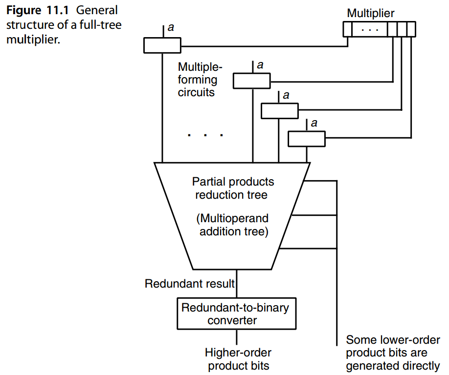

Many types of tree multipliers have been built or proposed. These are distinguished by the designs of the following three elements in Fig. 11.1:

- Multiple-forming circuits
- Partial-products reduction tree
- Redundant-to-binary converter

已经建造或提出了许多类型的树乘法器。它们的区别在于图 11.1 中以下三个元素的设计：

- 乘积成形电路
- 部分积约简树
- 冗余二进制转换器

In the remainder of this section, we focus on tree multiplier variations involving unsigned binary multiples and CSA reduction trees. With the redundant result in carry-save form, the final converter is simply a fast adder. Deviations from the foregoing multiple generation and reduction schemes are discussed in Section 11.2. Signed tree multipliers are covered in Section 11.3.

在本节的其余部分中，我们将重点关注涉及无符号二进制倍数和 CSA 约简树的树乘法器变体。由于冗余结果采用进位保存形式，最终转换器只是一个快速加法器。与前述乘积生成和缩减方案的偏差将在第 11.2 节中讨论。第 11.3 节介绍了有符号树乘法器。

From our discussion of sequential multiplication in Chapters 9 and 10, we know how the partial-products can be formed and how, through the use of high-radix methods, the number of partial products can be reduced. The trade-offs mentioned for high-radix multipliers exist here as well: more complex multiple-forming circuits can lead to simplification in the reduction tree. Again, we cannot say in general which combination will lead to greater cost-effectiveness because the exact nature of the trade-off is design- and technology-dependent. 

从第 9 章和第 10 章对顺序乘法的讨论中，我们知道如何形成部分乘积以及如何通过使用高基数方法来减少部分乘积的数量。提到的高基数乘法器的权衡这里也存在：更复杂的乘积形成电路可以导致树的简化。同样，我们不能笼统地说哪种组合会带来更大的成本效益，因为权衡的确切性质取决于设计和工艺。

Recall Wallace’s and Dadda’s strategies for constructing CSA trees discussed in Section 8.3. These give rise to Wallace and Dadda tree multipliers, respectively. Essentially, Wallace’s strategy for building CSA trees is to combine the partial-product bits at the earliest opportunity. With Dadda’s method, combining takes place as late as possible, while keeping the critical path length of the CSA tree at a minimum. Wallace’s method leads to the fastest possible design, and Dadda’s strategy usually leads to a simpler CSA tree and a wider carry-propagate adder (CPA).

回想一下第 8.3 节中讨论的 Wallace 和 Dadda 构建 CSA 树的策略。这些分别产生华莱士树乘数和达达树乘数。本质上，华莱士构建 CSA 树的策略是尽早组合部分乘积位。使用 Dada 的方法，合并尽可能晚地发生，同时保持 CSA 树的关键路径长度最短。 Wallace 的方法会带来尽可能最快的设计，而 Dadda 的策略通常会带来更简单的 CSA 树和更宽的进位传播加法器 (CPA)。

As a simple example, we derive Wallace and Dadda tree multipliers for 4 × 4 multiplication. Figure 11.2 shows the design process and results in tabular form, where the integers indicate the number of dots remaining in the various columns. Each design begins with 16 AND gates forming the *xiaj* terms or dots, 0 ≤ *i*, *j* ≤ 3. The resulting 16 dots are spread across seven columns in the pattern 1, 2, 3, 4, 3, 2, 1. The Wallace tree design requires 3 full adders (FAs) and 1 half-adder (HA) in the first level, then 2 FAs and 2 HAs in the second level, and a 4-bit CPA at the end. With the Dadda tree design, our first goal is to reduce the height of the partial products dot matrix from 4 to 3, thus necessitating 2 FAs in the first level. These are followed by 2 FAs and 2 HAs in the second level (reducing the height from 3 to 2) and a 6-bit CPA at the end.

作为一个简单的例子，我们推导出用于 4 × 4 乘法的 Wallace 和 Dadda 树乘子。图 11.2 以表格形式显示了设计过程和结果，其中整数表示各列中剩余的点数。每个设计都以 16 个与门开始，形成 $x_ia_j$ 项或点，$0 ≤ i，j ≤ 3$。生成的 16 个点以模式 1、2、3、4、3、2、1 分布在七列中。华莱士树设计在第一级需要 3 个全加器 (FA) 和 1 个半加器 (HA)，然后第二级有 2 个FA 和 2 个 HA，最后有 4 位 CPA。通过 Dada 树设计，我们的第一个目标是将部分积点阵的高度从 4 减少到 3，因此在第一层需要 2 个 FA。接下来是第二级中的 2 个 FA 和 2 个 HA（将高度从 3 降低到 2），最后是 6 位 CPA。

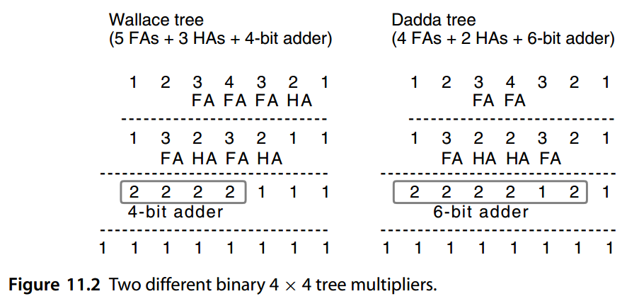

Intermediate approaches between those of Wallace and Dadda yield various designs that offer speed-cost trade-offs. For example, it may be that neither the Wallace tree nor the Dadda tree leads to a convenient width for the fast adder. In such cases, a hybrid approach may yield the best results. 

Note that the results introduced for carry-save multioperand addition in Chapter 8 apply to the design of partial products reduction trees with virtually no change. The only modifications required stem from the relative shifting of the operands to be added. For example, in Fig. 8.12, we see that in adding seven right-aligned *k*-bit operands, the CSAs are all *k* bits wide. In a seven-operand CSA tree of a 7 × 7 tree multiplier, the input operands appear with shifts of 0 to 6 bits, leading to the input configuration shown at the top of Fig. 11.3. We see that the shifted inputs necessitate somewhat wider blocks at the bottom of the tree. It is instructive for the reader to compare Fig. 11.3 and Fig. 8.12, noting all the differences.

华莱士和达达之间的中间方法产生了各种提供速度与成本权衡的设计。例如，华莱士树和达达树都可能无法为快速加法器带来方便的宽度。在这种情况下，混合方法可能会产生最佳结果。

注意第 8 章中介绍的进位保存多操作数加法的结果适用于部分乘积归约树的设计，几乎没有任何变化。唯一需要的修改源于要添加的操作数的相对移位。例如，在图8.12中，我们看到在添加七个右对齐的k位操作数时，CSA都是$k$位宽。在 $7 × 7$ 树乘法器的七操作数 CSA 树中，输入操作数出现 0 到 6 位的移位，导致输入配置如图 11.3 顶部所示。我们看到，移位的输入需要在树的底部设置更宽的块。 比较图 11.3 和图 8.12，对读者来说是有启发性的，注意所有的差异。

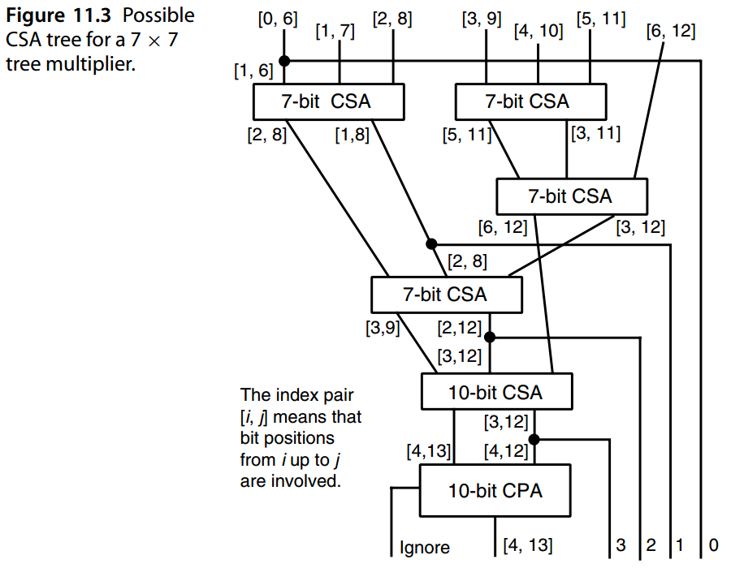

There is no compelling reason to keep all the bits of the input or intermediate operands together and feed them to multibit CSAs, thus necessitating the use of many HAs that simply rearrange the dots without contributing to their reduction. Doing the reduction with 1-bit FAs and HAs, as in Fig. 11.2, leads to lower complexity and perhaps even greater speed. Deriving the Wallace and Dadda tree multipliers to perform the same function as the circuit of Fig. 11.3 is left as an exercise.

没有令人信服的理由将输入或中间操作数的所有位保持在一起并将它们馈送到多位CSA，因此需要使用许多HA，这些HA只是简单地重新排列点而无助于减少它们。如图 11.2 所示，使用 1 位 FA 和 HA 进行缩减可以降低复杂性，甚至可能提高速度。推导 Wallace 和 Dadda 树乘法器以执行与图 11.3 电路相同的功能留作练习。

One point is quite clear from Fig. 11.3 or its Wallace tree and Dadda tree equivalents: a logarithmic depth reduction tree based on CSAs has an irregular structure that makes its design and layout quite difficult. Additionally, connections and signal paths of varying lengths lead to logic hazards and signal skew that have implications for both performance and power consumption. In very large-scale integration (VLSI) design, we strive to build circuits from iterated or recursive structures that lend themselves to efficient automatic synthesis and layout. Alternative reduction trees that are more suitable for VLSI implementation are discussed next.

从图 11.3 或其华莱士树和达达树等价物中可以清楚地看出一点：基于 CSA 的对数深度缩减树具有不规则的结构，这使得其设计和布局相当困难。此外，不同长度的连接和信号路径会导致逻辑危险和信号偏差，从而影响性能和功耗。在超大规模集成（VLSI）设计中，我们努力从迭代或递归结构构建电路，以实现高效的自动综合和布局。接下来讨论更适合 VLSI 实现的替代约简树。


## 11.2 替代约简树

Recall from our discussion in Section 8.4 that a (7; 2)-counter slice can be designed that takes 7 bits in the same column *i* as inputs and produces 1 bit in each of the columns *i* and *i* + 1 as outputs. Such a slice, when suitably replicated, can perform the function of the reduction tree part of Fig. 11.3. Of course, not all columns in Fig. 11.3 have seven inputs. The preceding iterative circuit can then be left intact and supplied with dummy 0 inputs in the interest of regularity, or it can be pruned by removing the redundant parts in each slice. Such optimizations are well within the capabilities of automated design tools.

回想一下我们在第 8.4 节中的讨论，可以设计一个 $(7; 2)$ 计数器片，将同一列 $i$ 中的 7 位作为输入，并在 $i$ 列和 $i + 1$ 列中的每一列中产生 1 位作为输出。当适当复制时，这样的切片可以执行图 11.3 的归约树部分功能。当然，并非图 11.3 中的所有列都有七个输入。然后，前面的迭代电路可以保持完整并为了规律性而提供虚拟0输入，或者可以通过删除每个切片中的冗余部分来修剪它。这种优化完全在自动化设计工具的能力范围内。


Based on Table 8.1, an (11; 2)-counter has at least five FA levels. Figure 11.4 shows a particular five-level arrangement of FAs for performing 11-to-2 reduction with the property that all outputs are produced after the same number of FA delays. Observe how all carries produced in level *i* enter FAs in level *i* + 1. The FAs of Fig. 11.4 can be laid out to occupy a narrow vertical slice that can then be replicated to form an 11-input reduction tree of desired width. Such balanced-delay trees are quite suitable for VLSI implementation of parallel multipliers.

根据表 8.1，$(11; 2)$ 计数器至少有五个 FA 级别。图 11.4 显示了用于执行 11-2 缩减的 FA 的特定五级排列，其特性是所有输出都是在相同数量的 FA 延迟后产生的。观察第 i 级中产生的所有进位如何进入第 i+1 级中的 FA。图 11.4 中的 FA 可以布局为占据一个狭窄的垂直切片，然后可以复制该切片以形成所需宽度的 11 输入缩减树。这种平衡延迟树非常适合并行乘法器的VLSI实现。

The circuit of Fig. 11.4 is composed of three columns containing one, three, and five FAs, going from left to right. It is now easy to see that the number of inputs can be expanded from 11 to 18 by simply appending to the right of the circuit an additional column of seven FAs. The top FA in the added column will accommodate three new inputs, while each of the others, except for the lowermost two, can accept one new input; these latter FAs must also accommodate a sum coming from above and a carry coming from the right. Note that the FAs in the various columns are more or less independent in that adjacent columns are linked by just one wire. This property makes it possible to lay out the circuit in a narrow slice without having to devote a lot of space to the interconnections.

图 11.4 的电路由三列组成，从左到右分别包含 1、3 和 5 个 FA。现在很容易看出，只需在电路右侧附加一列由七个 FA 组成的附加列，即可将输入数量从 11 个扩展到 18 个。添加列中的顶部 FA 将容纳三个新的输入，而除了最下面的两个之外，其他每个都可以接受一个新输入；后面的 FA 还必须容纳来自上方的总和以及来自右侧的进位。请注意，各个列中的 FA 或多或少是独立的，因为相邻列仅通过一根电线连接。这一特性使得可以在狭窄的切片中布局电路，而无需为互连投入大量空间。

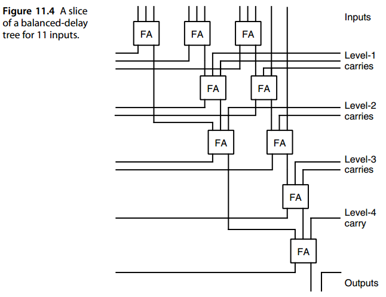

Instead of building partial products reduction trees from CSAs, or (3; 2)-counters, one can use a module that reduces four numbers to two as the basic building block. Then, partial products reduction trees can be structured as binary trees that possess a recursive structure making them more regular and easier to lay out (Fig. 11.5a). Figure 11.6 shows a possible way of laying out the seven-module tree of Fig. 11.5a. Note that adding a level to the tree of Fig. 11.6 involves duplicating the tree and inserting a 4-to-2 reduction module between them.

我们可以使用将四个数字减少到两个的模块作为基本构建块，而不是从 CSA 或 (3; 2) 计数器构建部分乘积归约树。这样的部分积归约树可以构造为具有递归结构的二叉树，使它们更加规则且更易于布局（图 11.5a）。图 11.6 显示了布置图 11.5a 的七个模块树的一种可能方法。请注意，向图 11.6 的树添加一个级别涉及复制该树并在它们之间插入一个 4 到 2 的缩减模块。

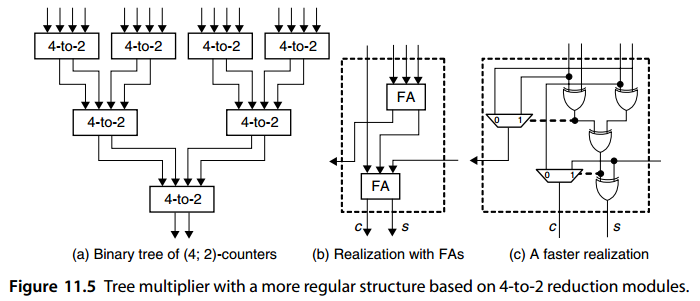


In Fig. 11.6, the first, third, fifth, and seventh rectangular boxes correspond to top-level blocks of Fig. 11.5a. These blocks receive four multiples of the multiplicand (two from above and two from below) and reduce them to a pair of numbers for the second and sixth blocks. Each of the latter blocks in turn supplies two numbers to the fourth block, which feeds the redundant-to-binary converter.

在图11.6中，第一、第三、第五和第七矩形框对应于图11.5a的顶级块。这些块接收被乘数的四个倍数（两个上面的两个和下面的两个）并将它们减少为第二个和第六个块的一对数字。后面的每个块依次向第四个块提供两个数字，第四个块为冗余到二进制转换器提供数据。

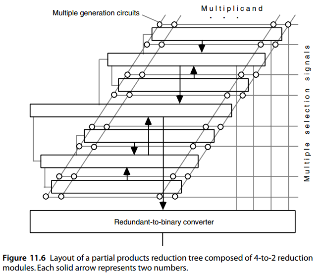

If the 4-to-2 reduction modules are internally composed of two CSA levels, as suggested in Fig. 11.5b, then there may be more CSA levels in the binary tree structure than in Wallace or Dadda trees. However, regularity of interconnections, and the resulting efficient layout, can more than compensate for the added logic delays due to the greater circuit depth. Direct realization of 4-to-2 reduction modules from their input/output specifications can lead to more compact and/or faster circuits. The realization depicted in Fig. 11.5c, for example, has a latency of three XOR gate levels, compared with four XOR gate levels that would result from the design of Fig. 11.5b.

如果 4-to-2 归约模块内部由两个 CSA 级别组成，如图 11.5b 所示，那么二叉树结构中可能比 Wallace 或 Dadda 树中有更多的 CSA 级别。然而，互连的规律性以及由此产生的高效布局可以充分补偿由于更大的电路深度而增加的逻辑延迟。根据其输入/输出规格直接实现 4 比 2 缩减模块可以导致更紧凑和/或更快的电路。例如，图 11.5c 所示的实现具有三个异或门级别的延迟，而图 11.5b 的设计则具有四个异或门级别的延迟。

Note that a 4-to-2 reduction circuit for binary operands can be viewed as a generalized signed-digit adder for radix-2 numbers with the digit set [0, 2], where the digits are encoded in the following 2-bit code:

请注意，二进制操作数的 4-to-2 约简电路可以被视为具有数字集 [0, 2] 的基 2 数字的通用符号数字加法器，其中数字以以下 2 位代码进行编码：

- Zero: ( 0, 0 )

- One:( 0, 1 ) 或 ( 1, 0 )

- Two: ( 1, 1 )

A variant of this binary tree reduction scheme is based on binary signed-digit (BSD), rather than carry-save, representation of the partial products [Taka85]. These partial products are combined by a tree of BSD adders to obtain the final product in BSD form. The standard binary result is then obtained via a BSD-to-binary converter, which is essentially a fast subtractor for subtracting the negative component of the BSD number from its positive part. One benefit of BSD partial products is that negative multiples resulting from the sign bit in 2’s-complement numbers can be easily accommodated (see Section 11.3). Some inefficiency results from the extra bit used to accommodate the digit signs going to waste for most of the multiples that are positive.

这种二叉树缩减方案的一个变体基于二进制有符号数字（BSD），而不是进位保存，表示部分积[Taka85]。这些部分乘积由 BSD 加法器树组合以获得 BSD 形式的最终乘积。然后通过 BSD 到二进制转换器获得标准二进制结果，该转换器本质上是一个快速减法器，用于从 BSD 数的正数部分中减去 BSD 数的负数部分。 BSD 部分积的好处之一是可以轻松容纳由 2 补码数中的符号位产生的负倍数（请参见第 11.3 节）。由于用于容纳数字符号的额外位会浪费大多数正倍数，因此会导致效率低下。

Carry-save and BSD numbers are not the only ones that allow fast reduction via limited-carry addition. Several other digit sets are possible that offer certain advantages depending on technological capabilities and constraints [Parh96]. For example, radix-2 partial products using the digit set [0, 3] lend themselves to an efficient parallel-carries addition process (Fig. 3.11c), while also accommodating three, rather than one or two, multiples of a binary multiplicand. Interestingly, the final conversion from the redundant digit set [0, 3] to [0, 1] is not any harder than conversion from [0, 2] to [0, 1].

进位保存和 BSD 数字并不是唯一允许通过有限进位加法快速约减的数字。根据工艺能力和限制，其他几种数字集也可能具有一定的优势[Parh96]。例如，使用数字集 [0, 3] 的基 2 部分积有助于高效的并行进位加法过程（图 3.11c），同时还可以容纳三个而不是一个或两个二进制被乘数的倍数 。 有趣的是，从冗余数字集 [0, 3] 到 [0, 1] 的最终转换并不比从 [0, 2] 到 [0, 1] 的转换困难。

Clearly, any method used for building the CSA tree can be combined with radix-2 *b* Booth’s recoding to reduce the tree size. However, for modern VLSI technology, the use of Booth recoding in tree multipliers has been questioned [Vill93]; it seems that the additional CSAs needed for reducing *k*, rather than *k*/ *b*, numbers could be less complex than the Booth recoding logic when wiring and the overhead due to irregularity and nonuniformity are taken into account.

显然，任何用于构建 CSA 树的方法都可以与 radix-$2^b$ Booth 的重新编码相结合，以减小树的大小。然而，对于现代VLSI技术，在树乘法器中使用Booth重新编码受到了质疑[Vill93]；当考虑到布线以及由于不规则和不均匀性导致的开销时，似乎减少 $k$（而不是 $k/ b$）数字所需的额外 CSA 可能比 Booth 重新编码逻辑更简单。


## 11.3 有符号数的树型乘法器

When one is multiplying 2’s-complement numbers directly, each of the partial products to be added is a signed number. Thus, for the CSA tree to yield the correct sum of its inputs, each partial product must be sign-extended to the width of the final product. Recall our discussion of signed multioperand addition in Section 8.5, where the 2’s-complement operands were assumed to be aligned at their least-significant bits. In particular, refer to Fig. 8.19 for two possible methods based on sign extension (with hardware sharing) and transforming negative bits into positive bits.

当直接乘以 2 的补码时，要相加的每个部分积都是一个有符号数。因此，为了使 CSA 树产生正确的输入总和，每个部分乘积必须符号扩展至最终乘积的宽度。回想一下我们第 8.5 节中对有符号多操作数加法的讨论，其中假定 2 的补码操作数在其最低有效位处对齐。特别是，请参考图 8.19，了解基于符号扩展（具有硬件共享）和将负位转换为正位的两种可能的方法。

Considerations for adding 2’s-complement partial products are similar, the only difference being the shifts. Figure 11.7 depicts an example with three sign-extended partial products. We see that here too a single FA can produce the results needed in several different columns. If this procedure is applied to all rows in the partial products bit matrix, the resulting structure will be somewhat more complex than the one assuming unsigned operands. Note that because of the shifts, there are fewer repetitions in Fig. 11.7 than in Fig. 8.19, thus making the expansion in width to accommodate the signs slightly larger.

添加 2 的补码部分积的注意事项类似，唯一的区别是移位。 图 11.7 描述了具有三个符号扩展部分积的示例。 我们在这里看到，单个 FA 也可以产生多个不同列所需的结果。 如果将此过程应用于部分乘积位矩阵中的所有行，则所得结构将比假设无符号操作数的结构稍微复杂一些。 请注意，由于这些变化，图 11.7 中的重复次数比图 8.19 中的要少，因此，为了容纳符号而扩大的宽度稍大一些。

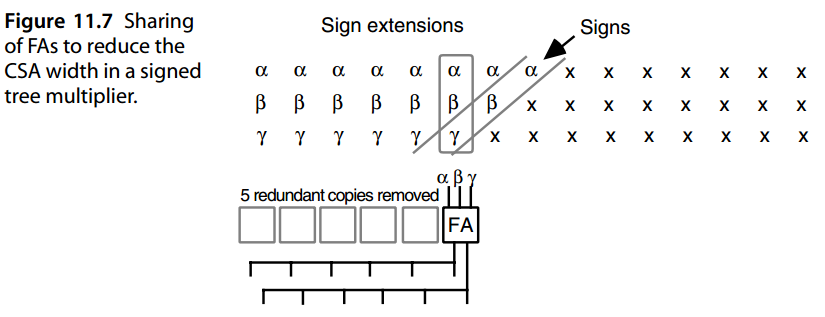


Another approach, due to Baugh and Wooley [Baug73], is even more efficient and is thus often preferred, in its original or modified form, for 2’s-complement multiplication. To understand this method, we begin with unsigned multiplication in Fig. 11.8a and note that the negative weight of the sign bit in 2’s-complement representation must be taken into account to obtain the correct product (Fig. 11.8b). To avoid having to deal with negatively weighted bits in the partial products matrix, Baugh and Wooley suggest that we modify the bits in the way shown in Fig. 11.8c, adding five entries to the bit matrix in the process.

Baugh 和 Wooley [Baug73] 提出的另一种方法甚至更有效，因此在 2 补码乘法中，以其原始形式或修改形式通常是首选方法。为了理解这种方法，我们从图 11.8a 中的无符号乘法开始，并注意必须考虑 2 补码表示中符号位的负权重才能获得正确的乘积（图 11.8b）。为了避免处理部分乘积矩阵中的负权重位，Baugh 和 Wooley 建议我们按照图 11.8c 所示的方式修改位，在此过程中向位矩阵添加五个条目。

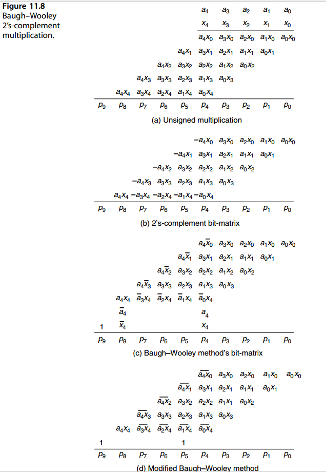

Baugh and Wooley’s strategy increases the maximum column height by 2, thus potentially leading to greater delay through the CSA tree. For example, in the 5 × 5 multiplication depicted in Fig. 11.8c, maximum column height is increased from 5 to 7, leading to an extra CSA level. In this particular example, however, the extra delay can be avoided by removing the *x* 4 entry from column 4 and placing two *x* 4 entries in column 3, which has only four entries. This reduces the maximum height to 6, which can still be handled by a three-level CSA tree.

Baugh 和 Wooley 的策略将最大列高增加了 2，因此可能会导致 CSA 树出现更大的延迟。 例如，在图 11.8c 所示的 5 × 5 乘法中，最大列高从 5 增加到 7，导致额外的 CSA 级别。 然而，在此特定示例中，可以通过从第 4 列中删除 $x_4$ 条目并将两个 $x_4$ 条目放置在只有四个条目的第 3 列中来避免额外的延迟。 这将最大高度减少到 6，但仍可以由三层 CSA 树处理。

To prove the correctness of the Baugh–Wooley scheme, let us focus on the entry *a* 4 *x* 0 in Fig. 11.8c. Given that the sign bit in 2’s-complement numbers has a negative weight, this entry should have been − *a* 4 *x* 0. We note that

为了证明 Baugh-Wooley 方案的正确性，让我们关注图 11.8c 中$a_4\bar{x}_0$ 项。鉴于 2 补码中的符号位具有负权重，该条目应该是 $− a_4 x_0$。我们注意到


$− a_4 x_0 = a_4 ( 1 − x_0 ) − a_4 = a_4 \bar{x}_0 − a_4$


Hence, we can replace − *a* 4 *x* 0 with the two entries *a* 4 *x* 0 and − *a* 4. If instead of − *a* 4 we use an entry *a* 4, the column sum increases by 2 *a* 4. To compensate for this, we must insert − *a* 4 in the next higher column. The same argument can be repeated for *a* 4 *x* 1, *a* 4 *x* 2, and *a* 4 *x* 3. Each column, other than the first, gets an *a* 4 and a − *a* 4, which cancel each other out. The *p* 8 column gets a − *a* 4 entry, which can be replaced with *a* 4 − 1. The same argument can be repeated for the *aix* 4 entries, leading to the insertion of *x* 4 in the *p* 4 column and *x* 4 − 1 in the *p* 8 column. The two −1s thus produced in the eighth column are equivalent to a −1 entry in the *p* 9 column, which can in turn be replaced with a 1 and a borrow into the nonexistent (and inconsequential) tenth column.

因此，我们可以将 $− a_4 x_0$ 替换为两个条目 $a_4 \bar{x}_0$ 和 $− a_4$。如果我们使用条目 $a_4$ 代替 $− a_4$，则列总和会增加 $2 a_4$。为了补偿这一点，我们必须在下一个更高的列中插入$− a_4$。可以对 $a_4 \bar{x}_1$、$a_4 \bar{x}_2$ 和 $a_4 \bar{x}_3$ 重复相同的参数。除了第一列之外，每一列都得到 $a_4$ 和 $− a_4$，它们相互抵消。 $p 8$ 列获取 $− a_4$ 条目，可以将其替换为 $\bar{a}_4 − 1$。可以对 $\bar{a}_ix_4$ 条目重复相同的做法，从而导致在 $p_4$ 列中插入 $x_4$和 $p8$ 列中的 $\bar{x}_4 − 1$ 。这样在第八列中产生的两个 -1 相当于 $p_9$ 列中的一个 -1 条目，它又可以用 1 替换并借用了不存在的（且无关紧要的）第十栏。


Another way to justify the Baugh–Wooley method is to transfer all negatively weighted $a_4 x_i$ terms, $0 ≤ i ≤ 3$, to the bottom row, thus leading to two negative numbers (the preceding number and the one formed by the $a_ix_4$ bits, $0 ≤ i ≤ 3$) in the last two rows. Now, the two numbers *x* 4 *a* and *a* 4 *x* must be subtracted from the sum of all the positive elements. Instead of subtracting *x* 4 × *a*, we add *x* 4 times the 2’s complement of *a*, which consists of 1’s complement of *a* plus *x* 4 (similarly for *a* 4 *x*). The reader should be able to supply the other details.

证明 Baugh-Wooley 方法合理性的另一种方法是将所有负权重 $a_4 x_i$  项, $0 ≤ i ≤ 3$, 转移到底行，从而产生两个负数（前一个数和后一个 由最后两行中的 $a_ix_4$ 位 $0 ≤ i ≤ 3$组成的数）。 现在，必须从所有正元素的总和中减去 $x_4a$ 和 $a_4 x$ 这两个数字。 我们不是减去 $x_4 × a$，而是加上 $x_4$ 乘以 *a* 的 2 补码，其中包括 *a* 的 1 补码加上 $x_4$（与 $a_4x$ 类似） 。 读者应该能够提供其他细节。

A modified form of the Baugh–Wooley method, (Fig. 11.8d) is preferable because it does not lead to an increase in the maximum column height. Justifying this modified form is left as an exercise.

Baugh-Wooley 方法的修改形式（图 11.8d）更可取，因为它不会导致最大柱高度的增加。证明这个修改后的形式的合理性留作练习。


## 11.4 截断乘法器与树型乘法器

If the cost of a full-tree multiplier is unacceptably high for a particular application, then a variety of mixed serial-parallel designs can be considered. Let  *h*  be a number smaller than  *k*. One idea is to perform the  *k*-operand addition needed for  *k* ×  *k*  multiplication via   *k/h* passes through a smaller CSA tree. Figure 11.9 shows the resulting design that includes an ( *h* + 2)-input CSA tree for adding the cumulative partial product (in stored-carry form) and  *h*  new operands, feeding back the resulting sum and carry to be combined with the next batch of  *h*  operands. 

如果全树乘法器的成本对于特定应用而言高得令人无法接受，则可以考虑各种混合串行并行设计。令$h$为小于$k$的数。一种想法是通过 $\left \lceil k/h \right \rceil$ 遍历较小的 CSA 树来执行 $k × k$ 乘法所需的 $k$ 操作数加法。图 11.9 显示了最终的设计，其中包括一个$ ( h + 2) $输入 CSA 树，用于添加累积部分积（以存储进位形式）和 $h$ 个新操作数，反馈结果总和和进位以与下一批 $h$ 操作阵列合。

Since the next batch of  *h*  operands will be shifted by  *h*  bits with respect to the current batch,  *h*  bits of the derived sum and  *h* − 1 bits of the carry can be relaxed after each pass. These are combined using an  *h*-bit adder to yield  *h*  bits of the final product, with the carry-out kept in a flip-flop to be combined with the next inputs. Alternatively, these relaxed bits can be kept in carry-save form by simply shifting them to the right in their respective registers and postponing the conversion to standard binary format to the very end. This is why parts of Fig. 11.9 are rendered in light gray. The latter approach might be followed if a fast double-width adder is already available in the arithmetic/logic unit for other reasons. 

由于下一批的 $h$ 操作数将相对于当前批次移位 $h$ 位，因此每次传递后可以放宽导出和的 $h$ 位和进位的 $h − 1$ 位。使用 $h$ 位加法器将它们组合起来，产生最终乘积的 h 位，并将进位保留在触发器中以与下一个输入组合。或者，通过简单地将这些宽松位在各自的寄存器中右移并将到标准二进制格式的转换推迟到最后，可以将这些宽松位保持为进位保存形式。这就是图 11.9 的部分部分呈现为浅灰色的原因。如果由于其他原因在算术/逻辑单元中已经可以使用快速双宽度加法器，则可以采用后一种方法。

Note that the design depicted in Fig. 11.9 corresponds to radix-2 *h*  multiplication. Thus, our discussions in Sections 10.3 and 10.4 are relevant here as well. In fact, the difference between high-radix and partial-tree multipliers is quantitative rather than qualitative (see Fig. 10.13). When  *h*  is relatively small, say up to 8 bits, we tend to view the multiplier of Fig. 11.9 as a high-radix multiplier. On the other hand, when  *h* is a significant fraction of  *k*, say  *k*/2 or  *k*/4, then we view the design as a partial-tree multiplier. In Section 11.6, we will see that a pipelined variant of the design in Fig. 11.9 can be considerably faster when *h* is large.

请注意，图 11.9 中描述的设计对应于 radix-$2^h$ 乘法。因此，我们在第 10.3 节和第 10.4 节中的讨论也与此相关。事实上，高基乘数和部分树乘数之间的差异是定量的而不是定性的（见图 10.13）。当 h 相对较小时，比如最多 8 位，我们倾向于将图 11.9 的乘法器视为高基数乘法器。另一方面，当 h 是 k 的重要分数（例如 $k/2$ 或 $k/4$）时，我们将设计视为部分树乘法器。在第 11.6 节中，我们将看到图 11.9 中设计的流水线变体当 h 很大时，速度会快得多。


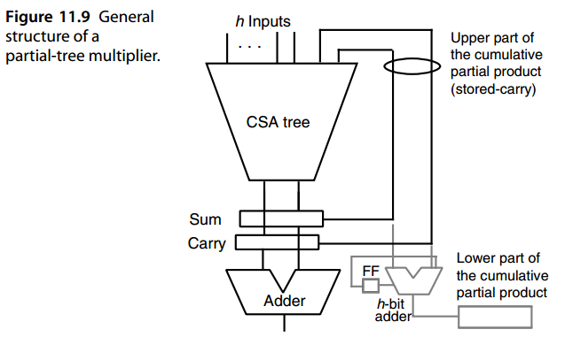


Figure 11.9 has been drawn with the assumption of radix-2 multiplication. If radix-2 *b* Booth’s recoding is applied first to produce one multiple for every *b* bits of the multiplier, then *b* times fewer passes are needed and *bh* bits can be relaxed after each pass. In this case, the small adder in Fig. 11.9 will be *bh* bits wide.

图 11.9 是在基数 2 乘法的假设下绘制的。如果首先应用 radix-$2^b$ Booth 重新编码来为乘法器的每 b 位生成一个倍数，则需要 b 倍的通过次数，并且在每次通过后可以放宽 $bh$ 位。在这种情况下，图 11.9 中的小加法器将为 $bh$ 位宽。

Thus far, our multipliers were all designed to produce double-width, or full-precision, products. In many applications, a single-width product might be sufficient. Consider, for example, *k*-bit fractional operands *a* and *x*, whose exact product has 2 *k* bits. A *k*-bit fractional result can be obtained by truncating or rounding the double-width result to *k* bits. However, this might be viewed as wasteful, given that all the bits on the right half of the partial products bit-matrix of Fig. 11.10, to the right of the vertical dashed line, have only a slight impact on the final result. Why not simply drop all those bits to save on the AND gates that produce them and the CSAs that combine and reduce them? Let us see what would happen if we do decide to drop the said bits in the 8 × 8 multiplication depicted in Fig. 11.10. In the worst case, when all the dropped bits are 1s, we would lose a value equal to 8 */* 2 + 7 */* 4 + 6 */* 8 + 5 */* 16 + 4 */* 32 + 3 */* 64 + 2 */* 128 + 1 */* 256 ≈ 7.004 *ulp*, where *ulp* is the weight or worth of the least-significant bit of each operand. If this maximum error of −7 *ulp* is tolerable, then the multiplier can be greatly simplified.

到目前为止，我们的乘法器都是为产生双宽度或全精度乘积而设计的。在许多应用中，单宽度乘积可能就足够了。例如，考虑 k 位小数操作数 a 和 x，其精确乘积有 2 k 位。通过将双倍宽度结果截断或四舍五入为k位，可以获得k位小数结果。然而，这可能被视为浪费，因为图 11.10 的部分乘积位矩阵的右半部分（垂直虚线右侧）上的所有位对最终结果仅产生轻微影响。为什么不简单地丢弃所有这些位以节省产生它们的 AND 门以及组合和减少它们的 CSA？让我们看看如果我们决定在图 11.10 所示的 8 × 8 乘法中删除这些位，会发生什么。在最坏的情况下，当所有丢弃的位都是 1 时，我们将丢失等于 $8 / 2 + 7 / 4 + 6 / 8 + 5 / 16 + 4 / 32 + 3 / 64 + 2 / 128 + 1 / 256 ≈ 7.004 \text{ ulp}$ 

的值，其中 ulp 是每个操作数最低有效位的权重或值。如果−7 ulp 的最大误差是可以容忍的，那么乘法器就可以大大简化。

However, we can do substantially better, will little additional cost. One way to reduce the error of our truncated multiplier is to keep the first column of dots to the right of the vertical dashed line in Fig. 11.10, dropping only the dots in columns indexed −10 to −16. This modification will improve the error bound computed above by 8 */* 2 = 4 *ulp* in the partial products accumulation phase, but introduces a possible error of *ulp/* 2 when the extra product bit *p*−9 is dropped to form a *k*-bit final product. Thus, the maximum error is reduced from 7 *ulp* to 3.5 *ulp*, at the expense of more circuitry to generate and process the eight previously ignored dots. Another possibility is to drop columns −9 and beyond as before, but introduce a compensating 1 term in column −6. The error now ranges from about −3 *ulp*, when all the dropped bits are 1s, to 4 *ulp*, when all the dropped bits are 0s. The latter error is comparable in magnitude to that of the preceding method, but it is achieved at a much lower cost. This *constant compensation* method can be further refined to produce better results. Finally, we can resort to *variable* *compensation*, exemplified by the insertion of two dots with values *a*−1 and *x*−1 (leading bits of the two operands) in column −7. The idea here is to provide greater compensation for the value of the dropped bits when they are more likely to be 1s. Error analysis for this approach is left as an exercise.

然而，我们可以做得更好，且几乎不需要额外的成本。减少截断乘法器误差的一种方法是将第一列点保持在图 11.10 中垂直虚线的右侧，仅删除索引为 -10 到 -16 的列中的点。此修改将在部分乘积累积阶段将上面计算的误差范围提高 $8 / 2 = 4$ ulp，但是当丢弃额外乘积位 $p_{−9}$ 以形成 k 位最终乘积时，会引入 ulp/ 2 的可能错误。因此，最大误差从 7 ulp 减少到 3.5 ulp，但代价是需要更多电路来生成和处理先前忽略的八个点。另一种可能性是像以前一样删除−9 列及之后的列，但在−6 列中引入补偿1的项。现在，当所有丢弃的位均为 1 时，误差范围约为 -3 ulp，当所有丢弃的位均为 0 时，误差范围为 4 ulp。后一种误差的大小与前一种方法的误差相当，但其实现成本要低得多。这种恒定补偿方法可以进一步细化以产生更好的结果。最后，我们可以诉诸变量补偿，例如在 -7 列中插入值为 $a_{−1}$ 和 $x_{−1}$（两个操作数的前导位）的两个点。这里的想法是，当丢弃的位更有可能为 1 时，为它们的值提供更大的补偿。这种方法的错误分析留作练习。


## 11.5 阵列乘法器

Consider a full-tree multiplier (Fig. 11.1) in which the reduction tree is one-sided and the final adder has a ripple-carry design, as depicted in Fig. 11.11. Such a tree multiplier, which is composed of the slowest possible CSA tree and the slowest possible CPA, is known as an array multiplier.

考虑一个全树乘法器（图 11.1），其中约简树是单侧的，并且最终加法器具有纹波进位设计，如图 11.11 所示。这种由最慢的 CSA 树和最慢的 CPA 组成的树乘法器称为阵列乘法器。

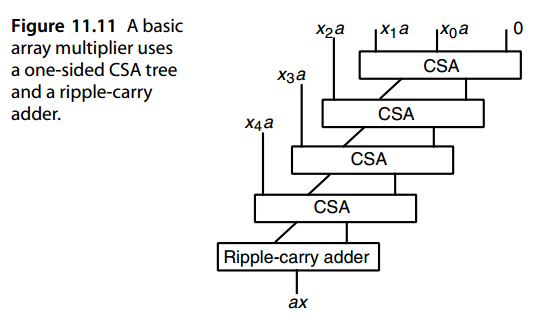


But why would anyone be interested in such a slow multiplier? The answer is that an array multiplier is very regular in its structure and uses only short wires that go from one FA to horizontally, vertically, or diagonally adjacent FAs. Thus, it has a very simple and efficient layout in VLSI. Furthermore, it can be easily and efficiently pipelined by inserting latches after every CSAor after every few rows (the last row must be handled differently, as discussed in Section 11.6, because its latency is much larger than the others).

但为什么有人会对如此缓慢的乘数感兴趣呢？答案是，阵列乘法器的结构非常规则，仅使用从一个 FA 到水平、垂直或对角相邻 FA 的短线。因此，它在 VLSI 中具有非常简单且高效的布局。此外，通过在每个 CSA 之后或每隔几行之后插入锁存器，可以轻松高效地进行流水线处理（最后一行必须以不同方式处理，如第 11.6 节中所述，因为它的延迟比其他行大得多）。

The free input of the topmost CSA in the array multiplier of Fig. 11.11 can be used to realize a multiply-add module yielding *p* = *ax* + *y*. This is useful in a variety of applications involving convolution or inner-product computation. When only the computation of *ax* is desired, the topmost CSA in the array multiplier of Fig. 11.11 can be removed, with *x* 0 *a* and *x* 1 *a* input to the second CSA directly.

图11.11的阵列乘法器中最顶层CSA的自由输入可以用于实现乘加模块，产生 p = ax + y。这在涉及卷积或内积计算的各种应用中非常有用。当只需要计算 ax，则可以删除图 11.11 的阵列乘法器中最上面的 CSA，将 $x_0 a$ 和 $x_1 a$ 直接输入到第二个 CSA。

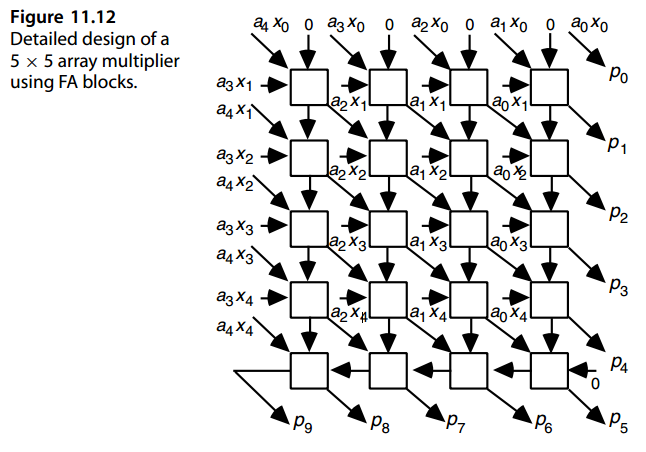

Figure 11.12 shows the design of a 5 × 5 array multiplier in terms of FA cells and two-input AND gates. The sum outputs are connected diagonally, while the carry outputs are linked vertically, except in the last row, where they are chained from right to left.  The design in Fig. 11.12 assumes unsigned numbers, but it can be easily converted to a 2’s-complement array multiplier using the Baugh–Wooley method. This involves adding a FA at the right end of the ripple-carry adder, to take in the *a* 4 and *x* 4 terms, and a couple of FAs at the lower left edge to accommodate the *a* 4, *x* 4, and 1 terms of Fig. 11.8C (see Fig. 11.13). Most of the connections between FA blocks in Fig. 11.13 have been removed to avoid clutter. The modified diagonal connections in Fig. 11.13 will be described shortly.

图 11.12 显示了 5 × 5 阵列乘法器的 FA 单元和两输入与门的设计。和输出对角连接，而进位输出垂直连接，除了最后一行，它们从右到左链接。图 11.12 中的设计假设无符号数，但可以使用 Baugh-Wooley 方法轻松将其转换为 2 补码阵列乘法器。这涉及到在纹波进位加法器的右端添加一个 FA，以接收 $a_4$ 和 $x_4$ 项，并在左下边缘添加几个 FA 以容纳图 11.8C（见图11.13） 中的 $\bar{a}_4、\bar{x}_4$ 和 1 项。图 11.13 中 FA 块之间的大部分连接已被删除以避免混乱。下面简要描述图 11.13 中修改的对角线连接。

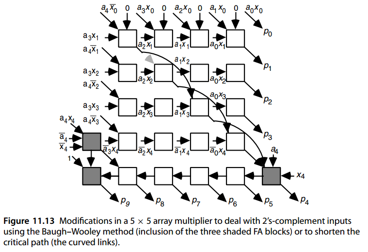

In view of the simplicity of an array multiplier for 2’s-complement numbers based on the Baugh–Wooley method, we no longer use techniques proposed by Pezaris [Peza71] and others that required in some of the array positions variants of an FA cell capable of accommodating some negatively weighted input bits and producing one or both outputs with negative weight(s). 

鉴于基于 Baugh-Wooley 方法的 2 补码阵列乘法器的简单性，我们不再使用 Pezaris [Peza71] 以及其他人提出的技术，那需要在 FA 单元的某些阵列位置变体中能够容纳一些负权重输入位并产生一个或两个具有负权重的输出的情况。

If we build a cell containing an FA and an AND gate to internally form the term *ajxi*, the unsigned array multiplier of Fig. 11.12 turns into Fig. 11.14. Here, the  *xi*  and  *aj* bits are broadcast to rows and columns of cells, with the row- *i*, column- *j*  cell, forming the term  *ajxi*  and using it as an input to its FA. If desired, one can make the design less complex by replacing the cells in the first row, or the first two rows, by AND gates. 

如果我们构建一个包含 FA 和 AND 门的单元来在内部形成项 $a_jx_i$，则图 11.12 的无符号阵列乘法器将变成图 11.14。这里，$x_i$ 和 $a_j$ 位被广播到单元的行和列，其中第 i 行、第 j 列的单元形成术语 $a_jx_i$并将其用作 FA 的输入。如果需要，可以通过用“与”门替换第一行或前两行中的单元来降低设计的复杂性。

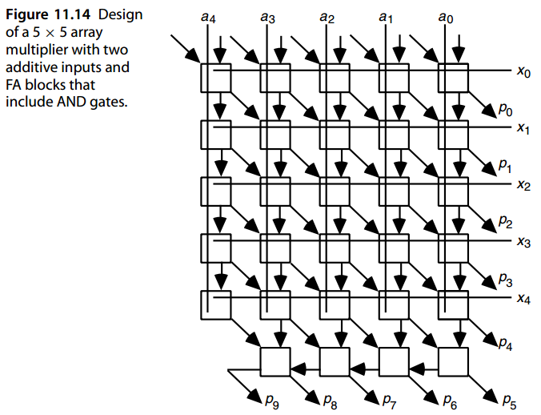

The critical path through a  *k* ×  *k*  array multiplier, when the sum generation logic of an FA block has a longer delay than the carry-generation circuit, goes through the main (top left to bottom rigt) diagonal in Fig. 11.13 and proceeds horizontally in the last row to the  *p* 9 output. The overall delay of the array multiplier can thus be reduced by rearranging the FA inputs such that some of the sum signals skip rows (they go from row  *i*  to row  *i* +  *h*  for some  *h >*  1). Figure 11.13 shows the modified connections on the main diagonal for  *h* = 2. The lower right cell now has one too many inputs, but we can redirect one of them to the second cell on the main diagonal, which now has one free input. Note, however, that such skipping of levels makes for a less regular layout, which also requires longer wires, and hence may not be a worthwhile modification in practice. 

当 FA 模块的求和生成逻辑比进位生成电路具有更长的延迟时，通过 $k × k$ 阵列乘法器的关键路径会穿过图 11.13 中的主对角线（从左上到右下），并在最后一行中水平前进到 $p_9$ 输出。因此，可以通过重新排列 FA 输入来减少阵列乘法器的整体延迟，使得一些和信号跳过行（对于某些 $h > 1$，它们从行 $i$ 到行 $i + h$）。图 11.13 显示了 $h = 2$ 时主对角线上的修改后的连接。右下角单元现在有太多输入，但我们可以将其中之一重定向到主对角线上的第二个单元，该单元现在有一个空闲输入。但请注意，这种级别的跳过会导致布局不太规则，这也需要更长的电线，因此在实践中可能不是值得进行的修改。

Since almost half the latency of an array multiplier is due to the cells in the last row, it is interesting to speculate about whether we can do the final addition faster. Obviously, it is possible to replace the last row of cells with a fast adder, but this would adversely affect the regularity of the design. Besides, even a fast adder is still much slower than the other rows, making pipelining more difficult. 

由于阵列乘法器的延迟几乎有一半是由最后一行中的单元引起的，因此推测我们是否可以更快地进行最终加法是很有趣的。显然，可以用快速加法器替换最后一行单元格，但这会产生影响设计规律性的不利影响。此外，即使是快速加法器仍然比其他行慢得多，这使得流水线更加困难。

To see how the ripple-carry portion of an array multiplier can be eliminated, let us arrange the  $k^2$ terms  $a_jx_i$  in a triangle, with bits distributed in $2 k − 1$ columns according to the pattern

为了了解如何消除阵列乘法器的纹波进位部分，让我们将 $k^2$ 项 $a_jx_i$ 排列在一个三角形中，根据模式将位分布在 $2 k − 1$ 列中

​          ```1  2  3   · · ·   k−1   k    k−1    · · ·    3  2  1```

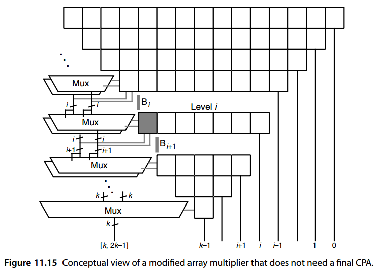

The least-significant bit of the product is output directly, and the other bits are reduced gradually by rows of FAs and HAs (rectangular boxes in Fig. 11.15). Let us focus on the *i* th level and assume that the first *i* − 1 levels have already yielded two versions of the final product bits past the *Bi* boundary, one assuming that the next carry-save addition will produce a carry across *Bi* and another assuming no carry (Fig. 11.16).

乘积的最低有效位直接输出，其他位按FA和HA的行逐渐减少（图11.15中的矩形框）。让我们关注第 $i$ 个级别，并假设前 $i−1$ 个级别已经产生了超过 $B_i$ 边界的最终乘积位的两个版本，一个假设下一个进位保存加法将产生跨 $B_i$ 的进位，另一个假设没有进位（图 11.16）。

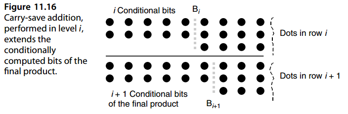

At the *i* th level, the shaded block in Fig. 11.15 produces two versions of its sum and carry, conditional upon a future carry or no carry across *Bi*+1. The conditional sum bits from the shaded block are simply appended to the *i* bits coming from above. So, two versions of the upper *i* + 1 bits of the product are obtained, conditional upon the future carry across the *Bi*+1 boundary. The process is then repeated in the lower levels, with each level extending the length of the conditional portion by 1 bit and the lowermost multiplexer (mux) providing the last *k* bits of the end product in nonredundant form.

在第 $i$ 层，图 11.15 中的阴影块产生其和和进位的两个版本，条件是 $B_{i+1}$ 上未来进位或无进位。来自阴影块的条件和位简单地附加到来自上面的 $i$ 位。因此，根据未来跨越 $B_{i+1}$ 边界的进位，获得乘积的高 $i+1$ 位的两个版本。然后在较低级别重复该过程，每个级别将条件部分的长度扩展 1 位，并且最下面的多路复用器 (mux) 以非冗余形式提供结果乘积的最后 k 位。

The conceptual design of Fig. 11.15 can be translated to an actual multiplier circuit after certain optimizations to remove redundant elements [Cimi96], [Erce90].

经过某些优化以删除冗余元素后，图 11.15 的概念设计可以转化为实际的乘法器电路 [Cimi96]、[Erce90]。


## 11.6 流水化乘法器与阵列乘法器

A full-tree multiplier can be easily pipelined. The partial products reduction tree of a full-tree multiplier is a combinational circuit that can be sliced into pipeline stages. A new set of inputs cannot be applied to the partial-tree multiplier of Fig. 11.9, however, until the sum and carry for the preceding set have been latched. Given that for large *h*, the depth of the tree can be significant, the rate of the application of inputs to the tree, and thus the speed of the multiplier, is limited.

全树乘法器可以轻松地流水线化。全树乘法器的部分积归约树是一个可以分割成流水线级的组合电路。然而，在前一组输入的和和进位被锁存之前，一组新的输入不能应用于图 11.9 的部分树乘法器。考虑到对于较大的 h，树的深度可能很大，因此树的输入应用率以及乘法器的速度受到限制。

Now, if instead of feeding back the tree outputs to its inputs, we feed them back into the middle of the ( *h* + 2)-input tree, as shown in Fig. 11.17, the pipeline rate will be dictated by the delay through only two CSA levels rather than by the depth of the entire tree. This leads to much faster multiplication.

现在，如果我们不将树输出反馈到其输入，而是将它们反馈到 $(h + 2)$ 输入树的中间，如图 11.17 所示，则管道速率将由仅通过两个 CSA 级别的延迟决定，而不是由整个树的深度决定。这导致乘法速度更快。

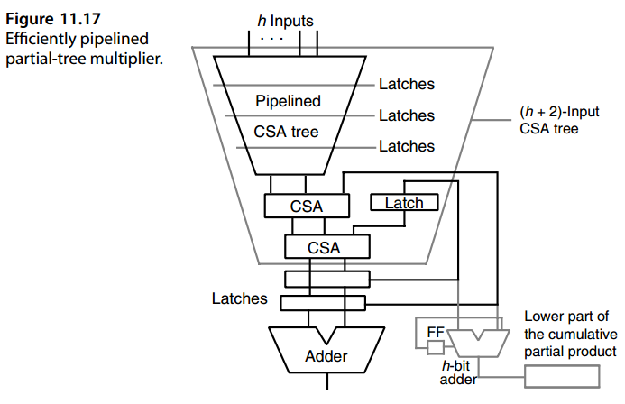

Figure 11.18 shows one way to pipeline an array multiplier. Inputs are applied from above and the product emerges from below after 9 clock cycles (2 *k* − 1 in general). All FA blocks used are assumed to have output latches for both sum and carry. Note how the *xi* inputs needed for the various rows of the array multiplier are delayed through the insertion of latches in their paths and how the 4-bit ripple-carry adder at the bottom row of Fig. 11.14 has been pipelined in Fig. 11.18.

图 11.18 显示了一种流水线数组乘法器的方法。输入从上方应用，乘积在 9 个时钟周期（一般为 $2 k − 1$）后从下方出现。假定使用的所有 FA 块都具有用于求和和进位的输出锁存器。请注意阵列乘法器各行所需的 $x_i$ 输入如何通过在其路径中插入锁存器来延迟，以及图 11.14 底行的 4 位纹波进位加法器如何在图 11.18 中进行流水线处理。

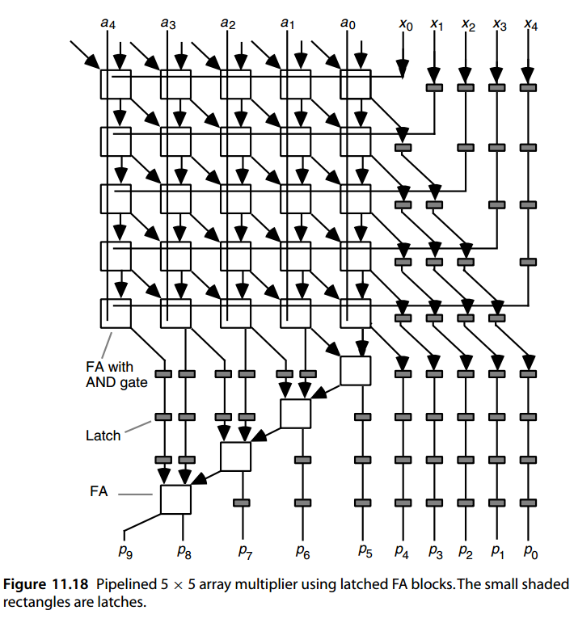


## 问题（略）


## 参考文献和进一步阅读

```
[Baug73] Baugh, C. R., and B. A. Wooley, “A Two’s Complement Parallel Array Multiplication
         Algorithm,” IEEE Trans. Computers, Vol. 22, pp. 1045–1047, 1973.
[Bewi94] Bewick, G. W., “Fast Multiplication: Algorithms and Implementation,” PhD
         dissertation, Stanford University, 1994.
[Blan74] Blankenship, P. E., “Comments on ‘A Two’s Complement Parallel Array
         Multiplication Algorithm,’” IEEE Trans. Computers, Vol. 23, p. 1327, 1974.
[Cimi96] Ciminiera, L., and P. Montuschi, “Carry-Save Multiplication Schemes Without Final
         Addition,” IEEE Trans. Computers, Vol. 45, No. 9, pp. 1050–1055, 1996.
[Dadd65] Dadda, L., “Some Schemes for Parallel Multipliers,” Alta Frequenza, Vol. 34,
         pp. 349–356, 1965.
[Erce90] Ercegovac, M. D., and T. Lang, “Fast Multiplication Without Carry-Propagate
         Addition,” IEEE Trans. Computers, Vol. 39, No. 11, pp. 1385–1390, 1990.
[Gok06]  Gok, M., M. J. Schulte, and M. G. Arnold, “Integer Multipliers with Overflow
         Detection,” IEEE Trans. Computers, Vol. 55, No. 8, pp. 1062–1066, 2006.
[Mou92]  Mou, Z.-J., and F. Jutand, “ ‘Overturned-Stairs’Adder Trees and Multiplier Design,”
         IEEE Trans. Computers, Vol. 41, No. 8, pp. 940–948, 1992.
[Parh96] Parhami, B., “Comments on ‘High-Speed Area-Efficient Multiplier Design Using
         Multiple-Valued Current Mode Circuits,’” IEEE Trans. Computers, Vol. 45, No. 5,
         pp. 637–638, 1996.
[Peza71] Pezaris, S. D., “A 40-ns 17-Bit by 17-Bit Array Multiplier,” IEEE Trans. Computers,
         Vol. 20, pp. 442–447, 1971.
[Robi98] Robinson, M. E., and E. Swartzlander Jr., “A Reduction Scheme to Optimize the
         Wallace Multiplier,” Proc. Int’l Conf. Computer Design, pp. 122–127, 1998.
[Schu93] Schulte, M. J., and E. E. Swartzlander, Jr., “Truncated Multiplication with Correction
         Constant,” in VLSI Signal Processing VI, pp. 388–396, 1993.
[Swar99] Swartzlander, E. E., “Truncated Multiplication with Approximate Rounding,” Proc.
         33rd Asilomar Conf. Signals Systems and Computers, pp. 1480–1483, 1999.
[Taka85] Takagi, N., H. Yasuura, and S. Yajima, “High-Speed VLSI Multiplication Algorithm
         with a Redundant Binary Addition Tree,” IEEE Trans. Computers, Vol. 34, No. 9,
         pp. 789–796, 1985.
[Town03] Townsend, W. J., E. E. Swartzlander, and J. A. Abraham, “A Comparison of Dadda
         and Wallace Multiplier Delays,” Proc. SPIE Conf. Advanced Signal Processing:
         Algorithms, Architectures, and Implementations, pp. 552–560, 2003.
[Vill93] Villager, D., and V. G. Oklobdzija, “Analysis of Booth Encoding Efficiency in Parallel
         Multipliers Using Compressors for Reduction of Partial Products,” Proc. Asilomar
         Conf. Signals, Systems, and Computers, pp. 781–784, 1993.
[Vuil83] Vuillemin, J., “A Very Fast Multiplication Algorithm for VLSI Implementation,”
         Integration: The VLSI Journal, Vol. 1, pp. 39–52, 1983.
[Wall64] Wallace, C. S., “A Suggestion for a Fast Multiplier,” IEEE Trans. Electronic
         Computers, Vol. 13, pp. 14–17, 1964.
[Zura86] Zuras, D., and W. H. McAllister, “Balanced Delay Trees and Combinatorial Division
         in VLSI,” IEEE J. Solid-State Circuits, Vol. 21, pp. 814–819, 1986.
```

