# 12. 其它乘法器 

Variations in Multipliers


> “If it’s zero degrees outside today and it’s supposed to be twice as cold tomorrow, how cold is it going to be?”
> STEPHEN WRIGHT


> “如果今天外面的气温为零度，明天的温度应该是原来的两倍，那么会有多冷？”
> 斯蒂芬·赖特


We do not always synthesize our multipliers from scratch but may desire, or be required, to use building blocks such as adders, small multipliers, or lookup tables. Furthermore, limited chip area and/or pin availability may dictate the use of bit-serial designs. In this chapter, we discuss such variations and also deal with modular multipliers,the special case of squaring,and multiply-accumulators. Chapter topics include:

我们并不总是从头开始合成乘法器，但可能希望或被要求使用加法器、小型乘法器或查找表等构建块。 此外，有限的芯片面积和/或引脚可用性可能决定使用位串行设计。 在本章中，我们讨论这些变化，并讨论模乘法器、平方的特殊情况和乘法累加器。 章节主题包括：


-   12.1 分治算法 DIVIDE AND CONQUER DESIGNS
-   12.2 乘加模块 ADDITIVE MULTIPLY MODULES
-   12.3 位串行乘法器 BIT-SERIAL MULTIPLIERS
-   12.4 模乘法器 MODUL AR MULTIPLIERS
-   12.5 平方运算器 THE SPECIAL CASE OF SQUARING
-   12.6 乘加混合单元 COMBINED MULTIPLY-ADD UNITS


## 12.1 分治算法

Suppose you have *b* × *b* multipliers and would like to use them to synthesize a 2 *b* × 2 *b* multiplier. Denoting the high and low halves of the multiplicand (multiplier) by *a* H and *a* L *(x* H and *x* L), we can use four *b* × *b* multipliers to compute the four partial products *a* L *x* L, *a* L *x* H, *a* H *x* L, and *a* H *x* H as shown in Fig. 12.1a. These four values must then be added to obtain the final product. Actually, as shown in Fig. 12.1b, only three values need to be added, since the nonoverlapping partial products *a* H *x* H and *a* L *x* L can be viewed as a single 4 *b*-bit number.

假设您有 $b × b$ 乘法器，并想用它们合成 $2 b × 2 b$ 乘法器。用$a_H$和$a_L$（$x_H$和$x_L$）表示被乘数（乘数）的高半部分和低半部分，我们可以使用四个$b × b$乘数来计算四个部分积$a_L x_L$，$a_L x_H$，$a_H x_L$和$a_H x_H$，如图12.1a所示。然后必须将这四个值相加以获得最终乘积。实际上，如图 12.1b 所示，只需要加三个值，因为不重叠的部分积 $a_H x_H$ 和 $a_L x_L$ 可以被视为单个 $4 b$ 位数字。

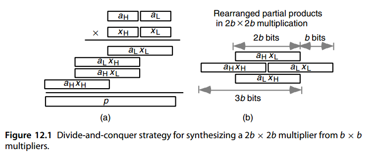

We see that our original 2 *b* × 2 *b*  multiplication problem has been reduced to four *b* ×  *b*  multiplications and a three-operand addition problem. The  *b* ×  *b*  multiplications can be performed by smaller hardware multipliers or via table lookup. Then, we can compute the 4 *b*-bit product by means of a single level of carry-save addition, followed by a 3 *b*-bit carry-propagate addition. Note that  *b*  bits of the product are directly available following the  *b* ×  *b*  multiplications. 

我们看到原来的 $2 b × 2 b$ 乘法问题已简化为四个 $b × b$ 乘法和一个三操作数加法问题。 $b × b$ 乘法可以通过较小的硬件乘法器或通过查表来执行。然后，我们可以通过单级进位保存加法，然后是 $3 b$ 位进位传播加法来计算 $4 b$ 位乘积。请注意，在 $b × b$ 乘法之后，乘积的 $b$ 位可直接获得。

Larger multipliers, such as 3 *b* × 3 *b*  or 4 *b* × 4 *b*, can be similarly synthesized from *b* ×  *b*  multiplier building blocks. Figure 12.2 shows that 3 *b* × 3 *b*  multiplication leads to five numbers, while 4 *b* × 4 *b*  multiplication produces seven numbers. Hence, we can complete the multiplication process in these two cases by using a row of (5; 2)- or (7; 2)-counters, followed by a 5 *b*- or 7 *b*-bit fast adder, respectively. Note that  *b*  bits of the product are obtained directly from a small multiplier in each case. 

更大的乘法器，例如 $3 b × 3 b$ 或 $4 b × 4 b$，可以类似地从 $b × b$ 乘法器构建块合成。图 12.2 显示 $3 b × 3 b$ 乘法产生 5 个数字，而 $4 b × 4 b$ 乘法产生 7 个数字。因此，我们可以通过使用一行 $(5; 2)$ 或 $(7; 2)$ 计数器，然后分别跟随一个 $5 b$ 位或 $7 b$ 位快速加法器来完成这两种情况下的乘法过程。请注意，在每种情况下，乘积的 b 位都是直接从小乘法器获得的。

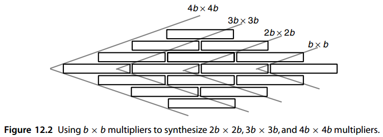

For example, given 4 × 4 multipliers as building blocks, we can synthesize a 16 × 16multiplier using 16 of the small multipliers, along with 24 (7; 2)-counters and a 28-bit fast adder. The structure of a 32 × 32 multiplier built of 8 × 8-multiplier building blocks is identical to the one just discussed. 

例如，给定 4 × 4 乘法器作为构建块，我们可以使用 16 个小型乘法器，以及 24 个 (7; 2) 计数器和一个 28 位快速加法器, 合成一个 16 × 16 乘法器。由 8 × 8 乘法器构建块构建的 32 × 32 乘法器的结构与刚才讨论的结构相同。

One can view the preceding divide-and-conquer scheme, depicted in Figs. 12.1 and 12.2, as radix-2 *b*  multiplication, except that each radix-2 *b*  digit of the multiplier produces several partial products, one for each radix-2 *b*  digit of the multiplicand, instead just one. 

人们可以查看前面的分而治之方案，如图 12.1 和 12.2 所示。 作为基 $2^b$ 乘法，不同之处在于乘数的每个基 $2^b$ 数字产生多个部分乘积，被乘数的每个基 $2^b$ 数字产生一个部分积，而不是仅产生一个。

For 2 *b* × 2 *b*  multiplication, one can use  *b*-bit adders exclusively to accumulate the partial products, as shown in Fig. 12.3 for  *b* = 4. The pair [ *i*,  *j*] of numbers shown next to a solid line in Fig. 12.3 indicates that the 4-bit bundle of wires represented by that line spans bit positions *i* through *j*. A gray line represents 1 bit, with its positions given by a single integer. We need five *b*-bit adder blocks, arranged in a circuit of depth 4, to perform the accumulation. This is attractive if *b*-bit adders are available as economical, off-the-shelf components. The resulting design is not much slower than the design based on carry-save adder (CSA) reduction if the latter design uses a cascade of three *b*-bit adders for the final 3 *b*-bit addition.

对于 $2 b × 2 b$ 乘法，可以专门使用 b 位加法器来累加部分积，如图 12.3（b = 4）所示。接下来图 12.3 中的实线显示的数字对 $[ i, j]$ 表示该线代表的 4 位线束跨越位位置 $i$ 到 $j$。灰线代表 1 比特位，其位置由单个整数给出。我们需要五个 b 位加法器块，排列在深度 4 的电路中来执行累加。如果 b 位加法器可作为经济的、现成的组件，那么这将是很有吸引力的。如果基于进位保存加法器 (CSA) 缩减的设计使用级联的三个 b 位加法器进行最终的 3 b 位加法，则所得设计不会慢很多。

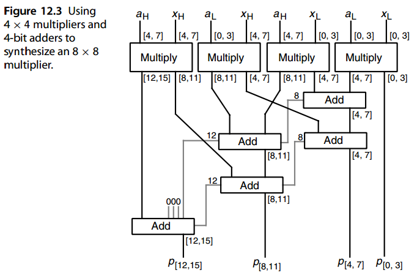


Instead of *b* × *b* multipliers, one can use *b* × *c* multipliers. For example, with 8 × 4 multipliers as building blocks, a 16 × 16 multiplier can be synthesized from eight such units, followed by a 5-to-2 reduction circuit and a 28-bit adder.

可以使用 $b × c$ 乘法器来代替 $b × b$ 乘法器。例如，8 × 4 乘法器作为构建块，可以由八个这样的单元合成一个 $16 × 16$ 乘法器，后面是一个 5 比 2 缩减电路和一个 28 位加法器。

Note that we can perform a double-width multiplication using only three single-width multiplications, as indicated by the following identity attributed to Karatsuba [Mont05]: 

请注意，我们可以仅使用三个单宽乘法来执行双宽乘法，如 Karatsuba [Mont05] 的以下恒等式所示：


$$
(2^ba_H + a_L)(2^bx_H + x_L)
= 2^{2 b}a_H x_H + 2^b[ (a_H + a_L)(x_H + x_L) − a_H x_H − a_L x_L] + a_L x_L
$$


By contrast, our four-multiplication scheme was based on the identity:

相比之下，我们的四乘法方案基于以下恒等式：

​     $(2^ba_H + a_L)(2^bx_H + x_L) = 2^{2 b}a_H x_H + 2^b[ a_H x_L + a_L x_H] + a_L x_L$

The three single-width multiplications in Karatsuba’s algorithm compute *a* H *x* H, *a* L *x* L, and ( *a* H + *a* L *)(x* H + *x* L). So, Karatsuba’s modified multiplication method removes one multiplication and introduces three extra additions/subtractions. This constitutes a good tradeoff in the case of extremely wide numbers, when the method is applied recursively.

Karatsuba 算法中的三个单宽度乘法计算 $a_Hx_H$、$a_L  x_L$ 和 $(a_H + a_L )(x_H + x_L)$。因此，Kaatsuba 的改进乘法方法删除了一项乘法，并引入了三项额外的加法/减法。当递归应用该方法时，在极宽的数字的情况下，这构成了一个很好的权衡。


## 12.2 乘加模块

We note from the discussion in Section 12.1, and Fig. 12.3 in particular, that synthesizing large multipliers from smaller ones requires both multiplier and adder units. If we can combine the multiplication and addition functions into one unit, then perhaps a single module type will suffice for implementing such multipliers. This is the idea behind additive multiply modules (AMMs).

我们从第 12.1 节的讨论中注意到，特别是图 12.3，从较小的乘法器合成较大的乘法器需要乘法器和加法器单元。如果我们可以将乘法和加法函数组合到一个单元中，那么也许单个模块类型就足以实现此类乘法器。这就是加法乘法模块 (AMM) 背后的想法。

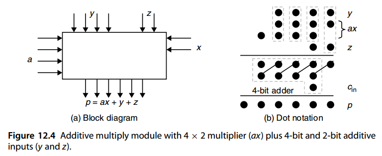

The AMM in Fig. 12.4a, performs the computation *p* = *ax* + *y* + *z*, where *a* and *y* are 4-bit numbers and *x* and *z* are 2-bit numbers. The maximum value of the result *p* is *(* 15 × 3 *)* + 15 + 3 = 63, which can be represented with 6 bits. Figure 12.4b shows an implementation of this AMM using four full adders (FAs), depicted as boxes enclosing three dots, and a 4-bit adder.

图 12.4a 中的 AMM 执行计算 $p = ax + y + z$，其中 a 和 y 是 4 位数字，x 和 z 是 2 位数字。结果p的最大值为(15×3)+15+3=63，可以用6位来表示。图 12.4b 显示了该 AMM 的实现，该实现使用四个全加器 (FA)（描绘为包含三个点的框）和一个 4 位加法器。

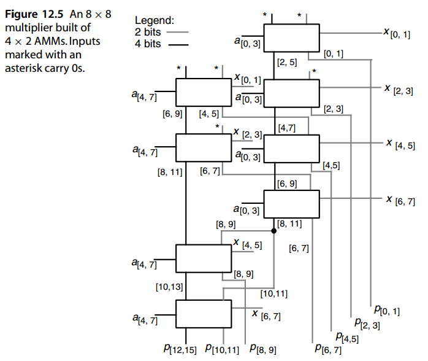

Figure 12.5 shows how the 8 × 8 multiplier example of Fig. 12.3 can be built from eight AMMs of the type depicted in Fig. 12.4. Note that eight 4 × 2 multipliers would have been needed for this design; so the number of modules is kept to a minimum. Each AMM is slower than a 4 × 2 multiplier by at most one FA level. So, the delay in Fig. 12.5 that is attributable to the addition function is no more than six FA delays (the critical path goes through six AMMs). Thus, given that the cost of a 4 × 2 AMM is less than the combined costs of a 4 × 2 multiplier and a 4-bit adder, the design shown in Fig. 12.5 is very cost-effective.

图 12.5 显示了如何利用图 12.4 所示类型的八个 AMM 构建图 12.3 的 8 × 8 乘法器示例。请注意，此设计需要八个 4 × 2 乘法器；因此模块的数量保持在最低限度。每个 AMM 比 4 × 2 乘法器最多慢 1 个 FA 级别。所以，如图12.5所示的延迟。归因于加法功能的 FA 延迟不超过 6 个（关键路径经过 6 个 AMM）。因此，考虑到 4 × 2 AMM 的成本低于 4 × 2 乘法器和 4 位加法器的总成本，图 12.5 所示的设计非常经济高效。

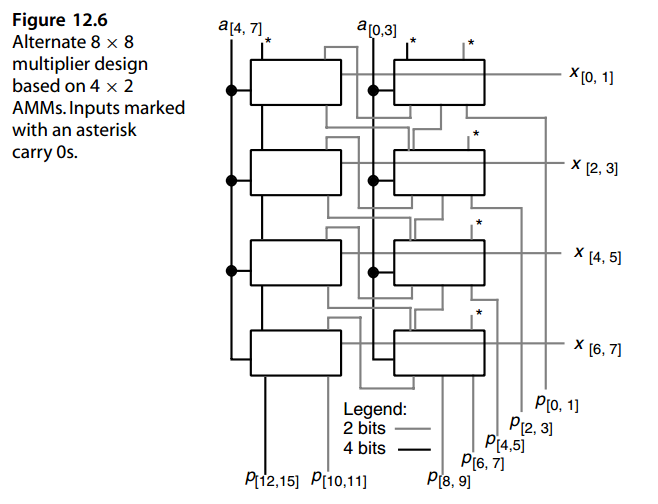

Figure 12.6 depicts an alternate design for an 8 × 8 multiplier using the same number and type of 4 × 2 AMMs as in Fig. 12.5 (as well as the same notational conventions). This latter design is slower than the design of Fig. 12.5 because its critical path goes through all eight modules. However, it is more regular and, thus, readily generalizable to any 4 *h* 2 × 2 *h* 1 multiplier with compact layout.

图 12.6 描述了 8 × 8 乘法器的替代设计，使用与图 12.5 相同数量和类型的 4 × 2 AMM（以及相同的符号约定）。后一种设计比图 12.5 的设计慢，因为它的关键路径经过所有八个模块。然而，它更加规则，因此很容易推广到任何具有紧凑布局的 4 h 2 × 2 h 1 乘法器。

In general, a *b* × *c* AMM will have a pair of *b*-bit and *c*-bit multiplicative inputs, two *b*-bit and *c*-bit additive inputs, and a ( *b* + *c*)-bit output. The number of bits in the output is just adequate to represent the largest possible output value, as is evident from the following identity:

一般来说，$b × c$ AMM 将具有一对 $b$ 位和 $c$ 位乘法输入、两个 $b$ 位和 $c$ 位加法输入以及一个 $( b + c)$ 位输出。输出中的位数足以表示最大可能的输出值，从以下恒等式可以明显看出：


$$
(2^b − 1)(2^c − 1) + (2^b − 1) + (2^c − 1) = 2^{b+c} − 1
$$
In designing larger multipliers based on *b* × *c* AMMs, the ( *b* + *c*)-bit output of each AMM is divided into a *b*-bit upper part and a *c*-bit lower part that are supplied as additive inputs to other AMMs or serve as primary outputs. An AMM that receives *a*[ *j*, *j*+ *b*−1] and *x*[ *i*, *i*+ *c*−1] as its multiplicative inputs should have values spanning the bit positions [ *i* + *j*, *i* + *j* + *b* − 1] and [ *i* + *j*, *i* + *j* + *c* − 1] as its additive inputs (why?). To design a *k* × *l* multiplier, where *b* and *c* divide both *k* and *l*, one can organize the *kl*/( *bc*) AMMs as a ( *k*/ *b*) × ( *l*/ *c*) or a ( *k*/ *c*) × ( *l*/ *b*) array. This provides some flexibility in fitting the design to the available chip area. However, the choice may have nontrivial implications for speed.

在设计基于 $b × c$ AMM 的较大乘法器时，每个 AMM 的 $(b + c)$ 位输出被分为 b 位上部和 c 位下部，它们作为附加输入提供给其他 AMM 或用作主要输出。接收 $a_{[ j, j+ b−1]}$ 和 $x_{[ i, i+ c−1]}$ 作为其乘法输入的 AMM 应该具有跨越位位置 $[ i + j, i + j + b − 1]$ 和 $[ i + j, i + j + c − 1]$ 的值作为其加法输入（为什么？）。要设计一个 k × l 乘法器，其中 b 和 c 均除 k 和 l，可以将 $kl/( bc)$ AMM 组织为 $( k/ b) × ( l/ c)$ 或 $( k/ c) × ( l/ b)$ 阵列。这为将设计适应可用芯片区域提供了一定的灵活性。然而，这种选择可能会对速度产生重大影响。


## 12.3 位串行乘法器

Bit-serial arithmetic is attractive in view of its smaller pin count, reduced wire length, and lower floor space requirements in very large-scale integration. In fact, the compactness of the design may allow us to run a bit-serial multiplier at a clock rate high enough to make the unit almost competitive with much more complex designs with regard to speed.

位串行算法因其在超大规模集成中具有较少的引脚数、较短的导线长度和较低的占地面积而具有吸引力。事实上，设计的紧凑性可能允许我们以足够高的时钟速率运行位串行乘法器，从而使该单元在速度方面几乎可以与更复杂的设计竞争。

In addition, in certain application contexts, inputs are supplied bit-serially anyway. In such a case, using a parallel multiplier would be quite wasteful, since the parallelism may not lead to any speed benefit. Furthermore, in applications that call for a large number of independent multiplications, multiple bit-serial multipliers may be more cost-effective than a complex highly pipelined unit.

此外，在某些应用程序环境中，输入无论如何都是按位串行提供的。在这种情况下，使用并行乘法器将非常浪费，因为并行性可能不会带来任何速度优势。此外，在需要大量独立乘法的应用中，多个位串行乘法器可能比复杂的高度流水线单元更具成本效益。

Bit-serial multipliers can be designed as systolic arrays: synchronous arrays of processing elements that are interconnected by only short, local wires thus allowing very high clock rates. Let us begin by introducing a semisystolic multiplier, so named because its design involves broadcasting a single bit of the multiplier *x* to a number of circuit elements, thus violating the “short, local wires” requirement of pure systolic design [Kung82].

位串行乘法器可以设计为脉动阵列：仅通过短的本地电线互连的处理元件的同步阵列，从而允许非常高的时钟速率。让我们首先介绍一个半脉动乘法器，之所以如此命名，是因为它的设计涉及将乘法器 x 的单个位广播到多个电路元件，从而违反了纯脉动设计的“短局部线路”要求 [Kung82].

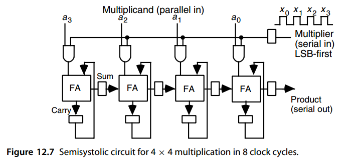

Figure 12.7 shows a semisystolic 4 × 4 multiplier. The multiplicand *a* is supplied in parallel from above and the multiplier *x* is supplied bit-serially from the right, with its least-significant bit (LSB) arriving first. Each bit *xi* of the multiplier is multiplied by *a* and the result added to the cumulative partial product, kept in carry-save form in the carry and sum latches. The carry bit stays in its current position, while the sum bit is passed on to the neighboring cell on the right. This corresponds to shifting the partial product to the right before the next addition step (normally the sum bit would stay put and the carry bit would be shifted to the left). Bits of the result emerge serially from the right as they become available.

图 12.7 显示了半收缩 4 × 4 乘法器。被乘数 a 从上方并行提供，乘数 x 从右侧按位串行提供，其最低有效位 (LSB) 首先到达。乘法器的每一位 $x_i$ 与$a$相乘并将结果加到累积部分积中，以进位保存形式保存在进位锁存器和求和锁存器中。进位位保留在其当前位置，而和位则传递到右侧的相邻单元。这对应于在下一个加法步骤之前将部分积向右移动（通常和位将保持不变，进位位将向左移动）。结果的各个位在可用时从右侧连续出现。

A *k*-bit unsigned multiplier *x* must be padded with *k* zeros to allow the carries to propagate to the output, yielding the correct 2 *k*-bit product. Thus, the semisystolic multiplier of Fig. 12.7 can perform one *k* × *k* unsigned integer multiplication every 2 *k* clock cycles. If *k*-bit fractions need to be multiplied, the first *k* output bits are discarded or used to properly round the most-significant *k* bits. Such a multiplier is useful in designing a cell that must multiply a bit-serial input by a constant chosen from among a set of values stored in its local memory. The chosen constant *a* is read out from the cell’s random-access memory, stored in a register, and used for 1 operating cycle (2 *k* clock cycles) to perform the multiplication by *x*. Different constants may be used in different operating cycles, hence the need for a general multiplier, rather than a constant multiplier of the types discussed in Section 9.5.

k 位无符号乘法器 x 必须用 k 个零填充，以允许进位传播到输出，从而产生正确的 $2 k$ 位乘积。因此，图 12.7 的半脉动乘法器可以每 $2 k$ 个时钟周期执行一次 $k × k$ 无符号整数乘法。如果需要乘以 k 位分数，则前 k 个输出位将被丢弃或用于正确舍入最高有效 k 位。这种乘法器在设计必须将位串行输入乘以从存储在其本地存储器中的一组值中选择的常数的单元时非常有用。所选常数 a 从单元的随机存取存储器中读出，存储在寄存器中，并用于 1 个操作周期（2 k 时钟周期）来执行 x 乘法。不同的常数可以用在不同的操作周期中，因此需要通用乘法器，而不是第 9.5 节中讨论的类型的常数乘法器。

To make the multiplier of Fig. 12.7 fully systolic, we must remove the broadcasting of the multiplier bits. This can be accomplished by a process known as systolic retiming, which is briefly explained below.

为了使图 12.7 的乘法器完全脉动，我们必须删除乘法器位的广播。这可以通过称为脉动重新定时的过程来完成，下面对此进行简要说明。

Consider a synchronous (clocked) circuit, with each line between two functional parts having an integral number of unit delays (possibly 0). Then, if we cut the circuit into two parts cL and cR, we can delay (advance) all the signals going in one direction and advance (delay) the ones going in the opposite direction by the same amount without affecting the correct functioning or external timing relations of the circuit. For this claim to hold, the primary inputs and outputs to the two parts cL and cR must be correspondingly advanced or delayed too (see Fig. 12.8).

考虑一个同步（时钟）电路，两个功能部分之间的每条线路都具有整数个单位延迟（可能为 0）。然后，如果我们将电路分成两部分 $c_L$ 和 $c_R$，我们可以延迟（提前）朝一个方向传播的所有信号，并提前（延迟）相反方向传播的信号相同的量，而不会影响电路的正确功能或外部时序关系。为了使这一主张成立，$c_L$ 和 $c_R$ 两个部分的主要输入和输出也必须相应地提前或延迟（见图 12.8）。

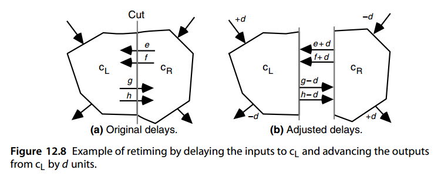

For the retiming shown in Fig. 12.8 to be possible, all the signals that are advanced by *d* must have had original delays of *d* or more (negative delays are not allowed). Note that all the signals going into cL have been delayed by *d* time units. Thus, cL will work as before, except that everything, including output production, occurs *d* time units later than before retiming. Advancing the outputs by *d* time units will keep the external view of the circuit unchanged.

为了使图 12.8 中所示的重定时成为可能，提前 d 的所有信号必须具有 d 或更多的原始延迟（不允许负延迟）。请注意，进入 $c_L$ 的所有信号均已延迟 d 个时间单位。因此，$c_L$ 将像以前一样工作，只是一切（包括输出产生）发生的时间比重定时之前晚 d 个时间单位。将输出提前 d 个时间单位将使电路的外部视图保持不变。

We apply the preceding process to the multiplier circuit of Fig. 12.7 in three successive steps corresponding to cuts 1, 2, and 3 in Fig. 12.9, each time delaying the left-moving signal by one unit and advancing the right-moving signal by one unit. Verifying that the multiplier in Fig. 12.9 works correctly is left as an exercise. This new version of our multiplier does not have the fan-out problem of the design in Fig. 12.7, but it suffers from long signal propagation delay through the four FAs in each clock cycle, leading to inferior operating speed. Note that the culprits are zero-delay lines that lead to signal propagation through multiple circuit elements.

我们将前面的过程应用到图12.7的乘法器电路中，分三个连续步骤，对应于图12.9中的切分处1、2和3，每次将向左移动的信号延迟一个单位，并将向右移动的信号提前一个单位。验证图 12.9 中的乘法器是否正常工作留作练习。我们的乘法器的这个新版本不存在图12.7中设计的扇出问题，但它在每个时钟周期内通过四个FA的信号传播延迟很长，导致运行速度较差。请注意，罪魁祸首是导致信号通过多个电路元件传播的零延迟线。

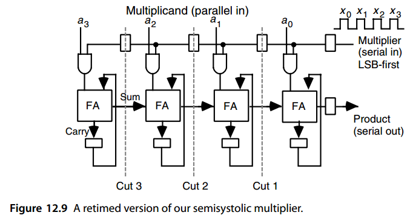

One way of avoiding zero-delay lines in our design is to begin by doubling all the delays in Fig. 12.7. This is done by simply replacing each of the sum and carry flip-flops with two cascaded flip-flops before retiming is applied. Since the circuit is now operating at half its original speed, the multiplier *x* must also be applied on alternate clock cycles. The resulting design in Fig. 12.10 is fully systolic, inasmuch as signals move only between adjacent cells in each clock cycle. However, twice as many cycles are needed.

在我们的设计中避免零延迟线的一种方法是首先将图 12.7 中的所有延迟加倍。这是通过在应用重定时之前简单地用两个级联触发器替换每个求和触发器和进位触发器来完成的。由于电路现在以原始速度的一半运行，因此乘法器 x 也必须应用于交替的时钟周期。图 12.10 中的最终设计是完全脉动的，因为信号在每个时钟周期中仅在相邻单元之间移动。然而，需要两倍的周期。


The easiest way to derive a multiplier with both inputs entering bit-serially is to allow *k* clock ticks for the multiplicand bits to be put into place in a shift register and then use the design of Fig. 12.7 (or its fully systolic counterpart in Fig. 12.10) to compute the product. This increases the total delay by *k* cycles.

导出两个输入均按位串行输入的乘法器的最简单方法是允许将被乘数位的 k 个时钟周期放入移位寄存器中，然后使用图 12.7 的设计（或图 12.10 中的完全脉动对应部分）来计算乘积。这会使总延迟增加 k 个周期。

An alternative bit-serial input/output design is obtained by writing the relationship between the output and inputs in the form of a recurrence and then implementing it in hardware. Let *a(i)* and *x(i)* denote the values of *a* and *x* up to bit position *i* ( *a(* 0 *)* = *a* 0, *a(* 1 *)* = *(a* 1 *a* 0 *)* two, etc.). Assume that the *k*-bit, 2’s-complement inputs are sign-extended to 2 *k* bits. Define the partial product *p(i)* as follows: *p(i)* = 2− *(i*+1 *)a(i)x(i)*

另一种位串行输入/输出设计是通过以递归形式编写输出和输入之间的关系，然后在硬件中实现它来获得的。令 $a^{(i)}$ 和 $x^{(i)}$ 表示位置 $i$ 的 $a$ 和 $x$ 的值 ( $a^{(0)} =a_0$、$a^{(1)} = (a_1 a_0)_2$ 等）。假设 k比特 2 的补码输入被符号扩展为 $2 k$ 位。定义部分积 p(i) 如下： 

$p^{(i)} = 2^{−(i+1)}a^{(i)}x^{(i)}$


Then, given that *a(i)* = 2 *iai* + *a(i*−1 *)* and *x(i)* = 2 *ixi* + *x(i*−1 *)*, we have: 

然后，假设 $a^{(i)} = 2^ia_i + a^{(i−1)}$ 和 $x^{(i)} = 2^ix_i + x^{(i−1)}$，我们有： 


$$
\begin{array}{l}
2 p^{(i)} &= 2^{− i}( 2^ia_i + a^{(i−1 )})( 2^ix_i + x^{(i−1 )}) \\
          &= p^{(i−1)} + a_ix^{(i−1)} + x_ia^{(i−1)} + 2^ia_ix_i
\end{array}
$$


Thus, if *p(i*−1 *)* is stored in double–carry-save form (three rows of dots in dot notation, as opposed to two for ordinary carry-save), it can be combined with the terms *aix(i*−1 *)* and *xia(i*−1 *)* using a (5; 3)-counter to yield a double–carry-save result for the next step. The final term 2 *iaixi* has a single 1 in the *i* th position where all the other terms have 0s. Thus it can be handled by using a multiplexer (mux) (Fig. 12.11). In cycle *i*, *ai* and *xi* are input and stored in the *i* th cell (the correct timing is achieved by a “token” *t*, which is provided to cell 0 at time 0 and is then shifted leftward with each clock tick). The terms *a(i*−1 *)* and *x(i*−1 *)*, which are already available in registers, are ANDed with *xi* and *ai*, respectively, and supplied along with the three bits of *p(i*−1 *)* as inputs to the (5; 3)-counter. Figures 12.11 and 12.12 show the complete cell design and cell interconnection [Ienn94]. The AND gate computing *aixi* is replicated in each cell for the sake of uniformity. A single copy of this gate could be placed outside the cells, with its output broadcast to all cells.

因此，如果 $p^{(i−1)}$ 以双进位保存形式存储（点表示法中的三行点，而不是普通进位保存的两行），则可以使用 (5; 3) 计数器将其与项 $a_ix^{(i−1)}$ 和 $x_ia^{(i−1)}$ 组合，以产生双进位保存结果下一步。最后一项 $2^ia_ix_i$ 在第 $i$ 个位置有一个 1，而所有其他项都是 0。因此它可以通过使用多路复用器（mux）来处理（图12.11）。在周期 $i$ 中，$a_i$ 和 $x_i$ 被输入并存储在第 $i$ 个单元中（正确的时序是通过“令牌”t 实现的，该令牌在时间 0 处提供给单元 0，然后在每个时钟周期内向左移动）。寄存器中已经存在的项 $a^{(i−1)}$ 和 $x^{(i−1)}$ 分别与 $x_i$ 和 $a_i$ 进行 AND 运算，并与 $p^{(i−1)}$ 的三位一起作为 (5; 3) 计数器的输入提供。图 12.11 和 12.12 显示了完整的单元设计和单元互连 [Ienn94]。为了统一起见，与门计算 $a_ix_i$ 在每个单元中复制。该门的单个副本可以放置在单元外部，其输出广播到所有单元。

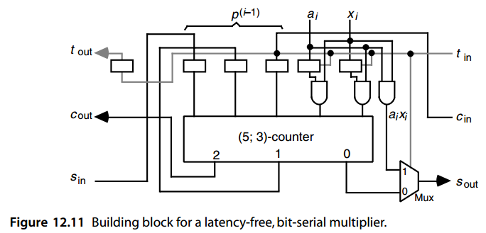

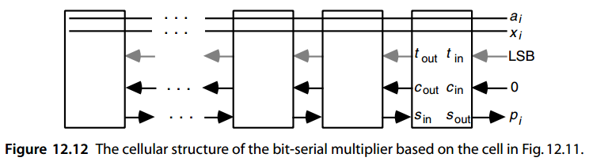

Note that the 3-bit sum of the five inputs to the (5; 3)-counter is shifted rightward before being stored in latches by connecting its LSB to the right neighboring cell, keeping its middle bit in place, and shifting its most-significant bit to the left. The product becomes available bit-serially at the *s* out output of the rightmost cell. Only *k* − 1 such cells are needed to compute the full 2 *k*-bit product of two *k*-bit numbers. The reason is that the largest intermediate partial product is 2 *k* − 1 bits wide, but by the time we get to this partial product, *k* bits of the product have already been produced and shifted out.

请注意，(5; 3) 计数器的五个输入的 3 位总和在存储到锁存器中之前会向右移动，方法是将其 LSB 连接到右侧相邻单元，保持其中间位不变，并将其最高有效位向左移动。该产品在最右侧单元的 $s_{out}$ 输出处以位串行方式可用。只需 $k − 1$ 个这样的单元即可计算两个 k 位数字的完整 $2 k$ 位乘积。原因是最大的中间部分积的宽度为 $2 k − 1$ 位，但是当我们得到这个部分积时，该乘积的 k 位已经被生成并移出。

Figure 12.13 uses dot notation to show the justification for the bit-serial multiplier design in Figs. 12.11 and 12.12. Figure 12.13a depicts the meanings of the various partial operands and results, while Fig. 12.13b represents the operation of the (5; 3)-counters. Note, in particular, how the dot representing *aixi* is transferred to the *s* out output by the cell holding the token (refer to the lower right corner of Fig. 12.11).

图 12.13 使用点表示法显示了图 12.11 和 12.12 中位串行乘法器设计的合理性。  图 12.13a 描述了各个部分操作数和结果的含义，而图 12.13b 表示 (5; 3) 计数器的操作。 请特别注意，代表 $a_ix_i$ 的点如何通过持有令牌的单元传输到 $s_{out}$（参见图 12.11 的右下角）。

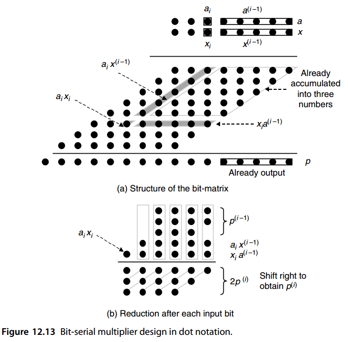


## 12.4 模乘法器

A modular multiplier is one that produces the product of two (unsigned) integers modulo some fixed constant  *m*. It is useful, for example, for implementing the multiplication operation for residue number systems. A modular multiplier could be implemented by attaching a modular reduction circuit to the output of an ordinary binary multiplier. However, simpler designs are often possible if the modular reduction is intertwined with the accumulation of partial products. In particular, this approach obviates the need for keeping wider intermediate values. 

模乘法器是一种产生两个（无符号）整数以某个固定常数 m 为模的乘积的乘法器。例如，它对于实现余数系统的乘法运算很有用。模块化乘法器可以通过将模块化缩减电路附加到普通二进制乘法器的输出来实现。然而，如果模块化简化与部分产品的积累交织在一起，则通常可以实现更简单的设计。特别是，这种方法不需要保留更宽的中间值。

The two special cases of  *m* = 2 *b*  and  *m* = 2 *b* − 1 are, as usual, simpler to deal with (see Section 8.6). For example, if the partial products are accumulated through carry-save addition, then for  *m* = 2 *b*, the modular version simply ignores the carry output of the FA in position  *b* − 1 and for  *m* = 2 *b* − 1, the carry out of position  *b* − 1 is combined with bits in column 0 (Fig. 12.14). 

像往常一样，$m = 2^b$ 和 $m = 2^b − 1$ 的两种特殊情况更容易处理（参见第 8.6 节）。例如，如果部分乘积通过进位保存加法进行累加，则对于 $m = 2^b$，模块化版本简单地忽略位置 $b − 1$ 中 FA 的进位输出，而对于 $m = 2^b − 1$，位置 $b − 1$ 的进位输出与第 0 列中的位组合（图 12.14）。

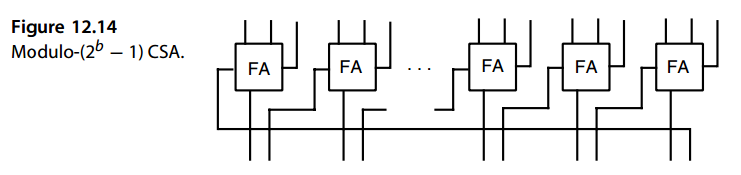

As an example, consider the design of a modulo-15 multiplier for 4-bit operands. Since 16 = 1 mod 15, the six heavy dots enclosed by the gray triangle in the upper left corner of Fig. 12.15 can be moved as shown, leading to the square partial products matrix on the lower left. The four 4-bit values can then be reduced by two levels of CSA (with wraparound links, as in Fig. 12.14) followed by a 4-bit adder (again with end-around carry). We see that this particular modular multiplier is in fact simpler than an ordinary 4 × 4 binary multiplier.

例如，考虑 4 位操作数的模 15 乘法器的设计。由于 16 = 1 mod 15，图 12.15 左上角灰色三角形包围的六个黑点可以如图所示移动，从而得到左下角的方形部分乘积矩阵。然后可以将四个 4 位值减少两个级别，CSA（带有环绕链接，如图 12.14 所示），后面跟着一个 4 位加法器（同样带有结束进位）。我们看到这个特定的模乘法器实际上比普通的 4 × 4 二进制乘法器更简单。

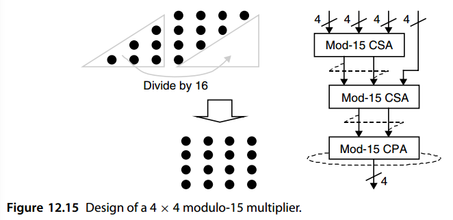

The special case of *m* = 2^*b* + 1 is also worth discussing, as it finds applications in low-cost residue number system designs. Assuming diminished-1 representation of nonzero mod- *(* 2^*b* +1 *)* inputs, we simply need to multiply each bit of *x* by the diminished-1 representation of *a*, adding all the terms. Some adjustments are required to compensate for the 0 terms resulting from the 0 digits of *x*, as these are not in the diminished-1 format, and for the representation of *x* being 1 less than its true value. These adjustments are not difficult to derive, and they do not significantly increase the cost or latency of the multiplier [Verg07].

$m = 2^b + 1$ 的特殊情况也值得讨论，因为它在低成本余数系统设计中找到了应用。假设非零 mod-$(2^b +1 )$ 输入的减 1 表示，我们只需将 x 的每一位乘以 a 的减 1 表示，并将所有项相加。需要进行一些调整来补偿由 x 的 0 位产生的 0 项，因为这些项不是减 1 格式，并且 x 的表示形式比其真实值小 1。这些调整并不难推导，并且它们不会显着增加乘法器的成本或延迟[Verg07]。

Similar techniques can be used to handle modular multiplication in the general case. For example, a modulo-13 multiplier can be designed by using the identities 16 = 3 mod 13, 32 = 6 mod 13, and 64 = 12 mod 13. Each dot inside the triangle in Fig. 12.15 must now be replaced with two dots in the four lower-order columns (Fig. 12.16). Thus, some complexity is added in view of the larger number of dots to be reduced and the need for the final adjustment of the result to be in [0, 12].

类似的技术可用于处理一般情况下的模乘法。例如，可以使用恒等式 $16=3 \mod 13$ 、$32 = 6 \mod 13$ 和 $64 = 12 \mod 13$。图 12.15 中三角形内的每个点现在必须替换为四个较低顺序列中的两个点（图 12.16）。因此，考虑到需要减少的点数较多以及需要将结果最终调整在[0, 12]之间，因此增加了一定的复杂度。

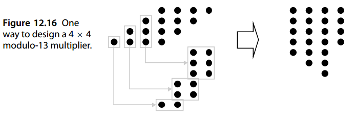


To complete the design of our 4 × 4 modulo-13 multiplier, the values shown on the right-hand side of Fig. 12.16 must be added modulo 13. After a minor simplification, consisting of removing one dot from column 1 and replacing it with two dots in column 0, a variety of methods can be used for the required modular multioperand addition as discussed at the end of Section 8.6.

为了完成我们的 4 × 4 模 13 乘法器的设计，图 12.16 右侧所示的值必须对 13 进行加法。经过轻微简化（包括从第 1 列中删除一个点并用第 0 列中的两个点替换它），可以使用多种方法来实现所需的模多操作数加法，如第 8.6 节末尾所述。

For example, one can use a CSA tree in which carries into column 4 are reinserted into columns 0 and 1. However, this scheme will not work toward the end of the process and must thus be supplemented with a different modular reduction scheme. Another approach is to keep some of the bits emerging from the left end (e.g., those that cannot be accommodated in the dot matrix without increasing its height) and reduce them modulo 13 by means of a lookup table or specially designed logic circuit. Supplying the details is left as an exercise. Figure 12.17 shows a general method for converting an *n*-input modulo- *m* addition problem to a three-input problem.

例如，可以使用 CSA 树，其中将进入第 4 列的进位重新插入到第 0 列和第 1 列。但是，该方案在过程结束时将不起作用，因此必须用不同的模数缩减方案进行补充。另一种方法是保留一些从左端出现的位（例如，那些在不增加点阵高度的情况下无法容纳在点阵中的位），并通过查找表或专门设计的逻辑电路对它们进行模13减少。提供详细信息留作练习。图 12.17 显示了将 n 输入模加法问题转换为三输入问题的通用方法。

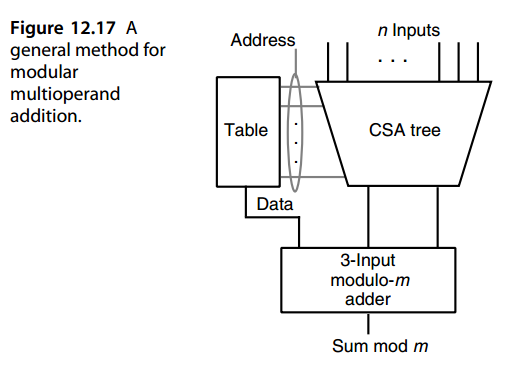

When dealing with very large numbers, say having widths of the order of hundreds of bits, a modular multiplication algorithm known as Montgomery multiplication is quite efficient. Such multiplications are used extensively in cryptographic applications. We postpone discussion of this algorithm to Section 15.4, where we describe it along with Montgomery modular reduction.

当处理非常大的数字时，例如宽度为数百位的数字，称为蒙哥马利乘法的模乘算法非常有效。这种乘法广泛应用于密码学应用中。我们将该算法的讨论推迟到第 15.4 节，我们在其中描述了它以及蒙哥马利模约简。


## 12.5 平方运算器

Any ordinary or modular multiplier can be used for computing *p* = *x* 2 if both its inputs are connected to *x*. However, a special-purpose *k*-bit squarer, if built in hardware, will be significantly lower in cost and delay than a *k* × *k* multiplier.

如果任何普通或模乘法器的两个输入都连接到 x，则可以使用它来计算 $p = x^2$。然而，专用的 k 位平方器如果内置于硬件中，其成本和延迟将明显低于 $k × k$ 乘法器。

To see why, consider the problem of squaring a 5-bit unsigned binary integer $( x_4 x_3 x_2 x_1 x_0 )_{two}$. As shown in Fig. 12.18a, the partial products matrix can be considerably simplified before performing multioperand addition. A term *xixi* reduces to *xi* and a pair of terms *xixj* and *xjxi* in any given column can be replaced by *xixj* in the next higher column. The resulting simplified partial products matrix for our 5-bit example is shown in Fig. 12.18b. We see that the two LSBs of the square are obtained with no effort and that computing the remaining bits involves a three-operand addition as opposed to a five-operand addition needed for 5 × 5 multiplication.

要了解原因，请考虑对 5 位无符号二进制整数$( x_4 x_3 x_2 x_1 x_0 )_2$ 进行平方的问题。如图 12.18a 所示，在执行多操作数加法之前，可以大大简化部分乘积矩阵。项 $x_ix_i$ 简化为 $x_i$，并且任何给定列中的一对项 $x_ix_j$ 和 $x_jx_i$ 可以被下一个更高列中的 $x_ix_j$ 替换。我们的 5 位示例的简化部分乘积矩阵如图 12.18b 所示。我们看到，平方的两个 LSB 是毫不费力地获得的，并且计算剩余位涉及三操作数加法，而不是 5 × 5 乘法所需的五操作数加法。

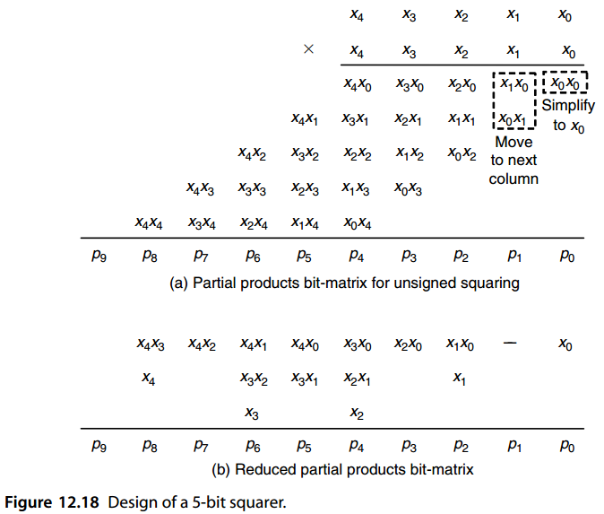

Further simplifications and fine-tuning are often possible. For example, based on the identities

通常可以进行进一步的简化和微调。例如，根据等式


$$
\begin{array}{l}
x_1x_0 + x_1 &= 2x_1x_0 + x_1 − x_1x_0 \\
             &= 2x_1x_0 + x_1(1 − x_0) \\
             &= 2x_1x_0 + x_1x_0
\end{array}
$$


we can remove the two terms *x* 1 *x* 0 and *x* 1 from column 2, replacing them by *x* 1 *x* 0 in column 2 and *x* 1 *x* 0 in column 3. This transformation reduces the width of the final carry-propagate adder from 7 to 6 bits. Similar substitutions can be made for the terms in columns 4 and 6, but they do not lead to any simplification or speedup in this particular example. The design of truncated and modular squarers will be explored in the end-of-chapter problems.

我们可以从第 2 列中删除两项 x 1 x 0 和 x 1，并用第 2 列中的 x 1 x 0 和第 3 列中的 x 1 x 0 替换它们。此转换将最终进位传播加法器的宽度从 7 位减少到 6 位。可以对第 4 列和第 6 列中的术语进行类似的替换，但它们不会导致此特定示例中的任何简化或加速。截断和模块化平方器的设计将在本章末尾的问题中探讨。

For a small word width *k*, the square of a *k*-bit number can be easily obtained from a 2 *k* × *(* 2 *k* − 2 *)* lookup table, whereas a much larger table would be needed for multiplying two *k*-bit numbers. In fact, two numbers can be multiplied based on two table-lookup evaluations of the square function, and three additions, using the identity *ax* = [ *(a* +  *x)* 2 −  *(a* −  *x)* 2] */* 4. Chapter 24 contains a comprehensive discussion of table-lookup methods for performing, or facilitating, arithmetic computations. 

对于较小的字宽 $k$，可以从 $2^k × (2 k − 2)$ 查找表轻松获得 $k$ 位数字的平方，而将两个 $k$ 位数字相乘则需要更大的表。事实上，两个数相乘可以通过两个平方函数的查表求值，以及三个加法，使用恒等式 $ax = [ (a + x)^2 − (a − x)^2] / 4$  完成。第 24 章全面讨论了用于执行或促进算术计算的查表方法。

Finally, exponentiation can be performed by a sequence of squaring or square-multiply steps. For example, based on the identity

最后，求幂可以通过一系列平方或平方-乘步骤来执行。例如，根据等式

$x^{13} = x((x(x^2)) ^2 ) ^2$

we can compute  *x* 13 by squaring  *x*, multiplying the result by  *x*, squaring twice, and finally multiplying the result by  *x*. We discuss exponentiation for both real and integer operands in greater detail in Section 23.3. 

我们可以通过对 x 进行平方、将结果乘以 x、平方两次、最后将结果乘以 x 来计算 x 13。我们在第 23.3 节中更详细地讨论了实数和整数操作数的求幂。


## 12.6 乘加混合单元

In certain computations, such as vector inner-product, convolution, or fast Fourier transform, multiplications are commonly followed by additions. In such cases, implementing a multiply-add unit in hardware to compute  *p* =  *ax* +  *y*  might be cost-effective. Since the preceding computations are commonplace in signal processing applications, most modern digital signal processors have built-in hardware capability for multiply-add, or multiply-accumulate, operations. 

在某些计算中，例如向量内积、卷积或快速傅立叶变换，乘法后通常紧接着加法。在这种情况下，在硬件中实现乘加单元来计算 $p = ax + y$ 可能具有成本效益。由于上述计算在信号处理应用中很常见，因此大多数现代数字信号处理器都具有用于乘加或乘累加运算的内置硬件功能。

We have already discussed AMMs (Section 12.2) that add one or two numbers to the product of their multiplicative inputs. Similarly, at several points in this and the preceding three chapters we have hinted at a means of incorporating an additive input into the multiplication process (e.g., by initializing the cumulative partial product to a nonzero value or by entering a nonzero value to the top row of an array multiplier). In all cases, however, the additive inputs are comparable in width to the multiplicative inputs. 

我们已经讨论过 AMM（第 12.2 节），它将一或两个数字加到输入的乘积上。类似地，在本章和前三章的一些地方，我们暗示了将加法输入合并到乘法过程中的方法（例如，通过将累积部分积初始化为非零值或通过在数组乘法器的顶行输入非零值）。然而，在所有情况下，加法输入的宽度与乘法输入的宽度相当。

The type of multiply-add operation of interest to us here involves an additive input that is significantly wider than the multiplicative inputs (perhaps even wider than their product). For example, we might have 24-bit multiplicative inputs, yielding a 48-bit product, that is then added to a 64-bit running sum. The wider running sum may be required to avoid overflow in the intermediate computation steps or to provide greater precision to counter the accumulation of errors when dealing with fractional values. 

我们在这里感兴趣的乘加运算类型涉及加法输入，该加法输入明显宽于乘法输入（甚至可能比它们的乘积更宽）。例如，我们可能有 24 位乘法输入，产生 48 位乘积，然后将其添加到 64 位运行和中。可能需要更宽的运行总和以避免中间计算步骤中的溢出或提供更高的精度以在处理分数值时抵消误差的累积。

Figure 12.19 depicts several methods for incorporating a wide additive input into the multiplication process. First, we might use a CSA tree to find the product of the multiplicative inputs in carry-save form and then add the result to the additive input using a CSA followed by a fast adder (Fig. 12.19a). To avoid a carry-propagate addition in every step, the running sum may itself be kept in carry-save form, leading to the requirement for two CSA levels (Fig. 12.19b). The resulting hardware implementation for this latter scheme is quite similar to the partial-tree multiplier of Fig. 11.9. 

图 12.19 描述了将宽加法输入合并到乘法过程中的几种方法。首先，我们可以使用 CSA 树以进位保存形式查找乘法输入的乘积，然后使用 CSA 和快速加法器将结果加到加法输入（图 12.19a）。为了避免在每个步骤中进行进位传播加法，运行和本身可以保持进位保存形式，从而导致需要两个 CSA 级别（图 12.19b）。后一种方案的最终硬件实现与图 11.9 的部分树乘法器非常相似。

Alternatively, the two-step process of computing the product in carry-save form and adding it to the running sum can be replaced by a merged multiply-add operation that directly operates on the dots from the additive input(s) and the partial products bit matrix (Figs. 12.19c and 12.19d). In the latter case, the speed and cost penalties for including the additive input in a parallel tree multiplier are fairly small, thus leading to a cost-effective design. We will revisit this notion of merged arithmetic in Section 23.6.

或者，以进位保存形式计算乘积并将其加到运行和中的两步过程可以由直接对来自加法输入和部分乘积的点进行操作的合并乘加运算来代替 位矩阵（图 12.19c 和 12.19d）。 在后一种情况下，将加性输入包含在并行树乘法器中的速度和成本损失相当小，从而实现具有成本效益的设计。 我们将在 23.6 节中重新讨论合并算术的概念。

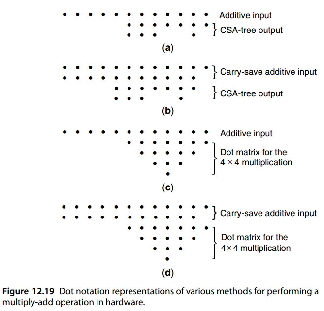

Multiply-add and multiply-accumulate units are particularly useful when dealing with floating-point operands. Merging the two steps, so that a single rounding operation is used just before producing the final result, leads to a fused multiply-add or fused multiply-accumulate operation. Such a fused operation saves time and reduces computation errors. These notions will be further discussed in Section 18.5.

乘加和乘加单元在处理浮点操作数时特别有用。合并这两个步骤，以便在生成最终结果之前使用单个舍入运算，从而产生融合乘加或融合乘累加运算。这种融合操作可以节省时间并减少计算错误。这些概念将在 18.5 节中进一步讨论。


## 问题（略）


## 参考文献和进一步阅读

```
[Alia91] Alia, G., and E. Martinelli, “A VLSI Modulo m Multiplier,” IEEE Trans. Computers,
         Vol. 40, No. 7, pp. 873–878, 1991.
[Chen79] Chen, I.-N., and R. Willowner, “An O(n) Parallel Multiplier with Bit-Sequential
         Input and Output,” IEEE Trans. Computers, Vol. 28, No. 10, pp. 721–727, 1979.
[Dany05] Danysh, A., and D. Tan, “Architecture and Implementation of a Vector/SIMD
         Multiply-Accumulate Unit,” IEEE Trans. Computers, Vol. 54, No. 3, pp. 284–293,
         2005.
[Ghes71] Ghest, C., “Multiplying Made Easy for Digital Assemblies,” Electronics, Vol. 44,
         pp. 56–61, 22 November, 1971.
[Hakk01] Hakkennes, E., and S. Vassiliadis, “Multimedia Execution Hardware Accelerator,”
         J. VLSI Signal Processing, Vol. 28, No. 3, pp. 221–234, 2001.
[Hayn96] Haynal, S., and B. Parhami, “Arithmetic Structures for Inner-Product and Other
         Computations Based on a Latency-Free Bit-Serial Multiplier Design,” Proc. 30th
         Asilomar Conf. Signals, Systems, and Computers, pp. 197–201, 1996.
[Hwan79] Hwang, K., Computer Arithmetic: Principles, Architecture, and Design, Wiley,
         1979.
[Ienn94] Ienne, P., and M. A. Viredaz, “Bit-Serial Multipliers and Squarers,” IEEE Trans.
         Computers, Vol. 43, No. 12, pp. 1445–1450, 1994.
[Kung82] Kung, H. T., “Why Systolic Architectures?” Computer, Vol. 15, No. 1, pp. 37–46,
         1982.
[Lidd00] Liddicoat, A. A., and M. J. Flynn, “Parallel Square and Cube Computations,” Proc.
         34th Asilomar Conf. Signals, Systems, and Computers, pp. 1325–1329, 2000.
[Mont05] Montgomery, P., “Five, Six, and Seven-Term Karatsuba-Like Formulae,” IEEE
         Trans. Computers, Vol. 54, No. 3, pp. 362–369, 2005.
[Parh93] Parhami, B., and H.-F. Lai, “Alternate Memory Compression Schemes for Modular
         Multiplication,” IEEE Trans. Signal Processing, Vol. 41, No. 3, pp. 1378–1385,
         1993.
[Pies94] Piestrak, S. J., “Design of Residue Generators and Multioperand Modular Adders
         Using Carry-Save Adders,” IEEE Trans. Computers, Vol. 43, No. 1, pp. 68–77,
         1994.
[Stro03] Strollo, A. G. M., and D. De Caro, “Booth Folding Encoding for High Performance
         Squarer Circuits,” IEEE Trans. Circuits and Systems II, Vol. 50, No. 5, pp. 250–254,
         2003.
[Verg07] Vergos, H. T., and C. Efstathiou, “Design of Efficient Modulo 2n + 1 Multipliers,”
         IET Computers and Digital Techniques, Vol. 1, No. 1, pp. 49–57, 2007.
[Walt04] Walters, E. G. III, M. J. Schulte, and M. G. Arnold, “Truncated Squarers with
         Constant and Variable Correction,” Advanced Signal Processing Algorithms,
         Architectures, and Implementations XIV (Proc. SPIE Conf. 5559), pp. 40–50, 2004.
[Wire99] Wires, K. E., M. J. Schulte, L. P. Marquette, and P. I. Balzola, “Combined Unsigned
         and Two’s Complement Squarers,” Proc. 33rd Asilomar Conf. Signals Systems and
         Computers, pp. 1215–1219, 1999.
```

