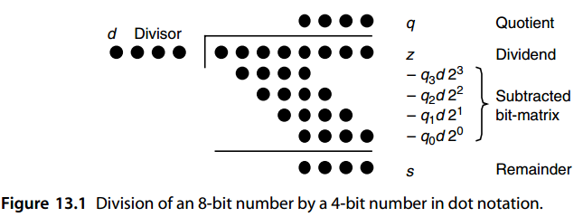
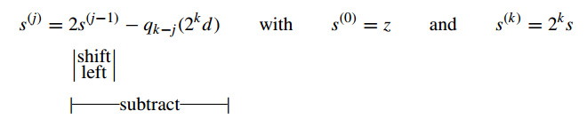
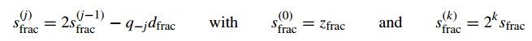
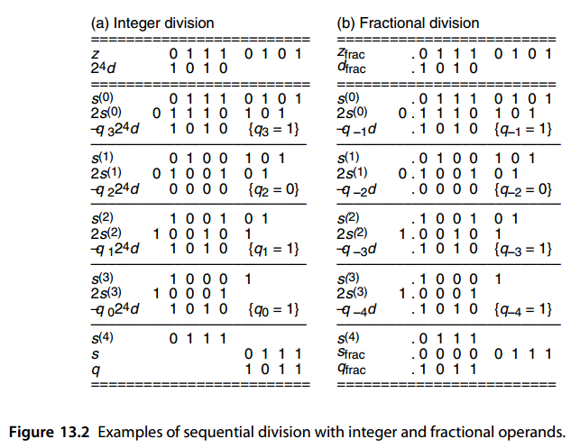
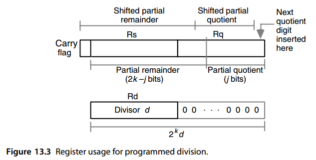
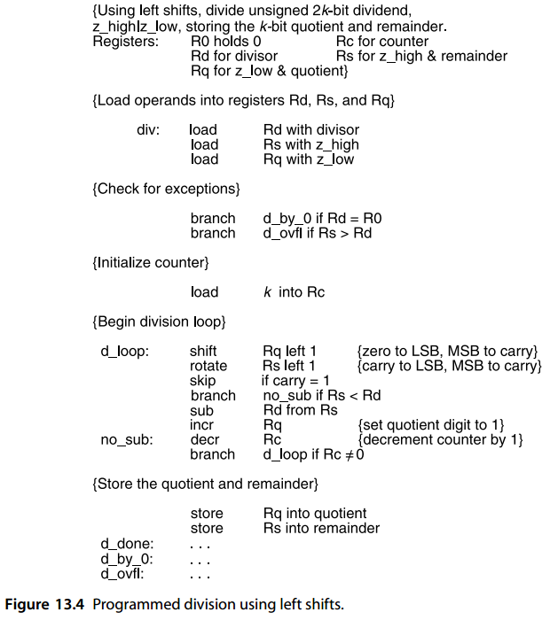
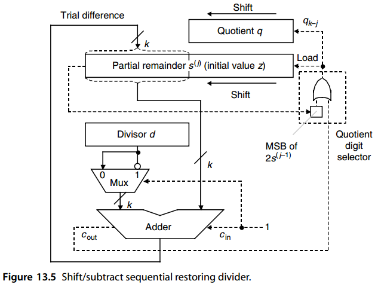
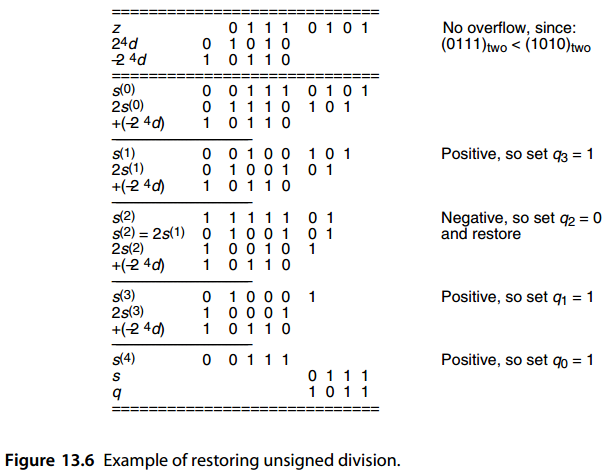
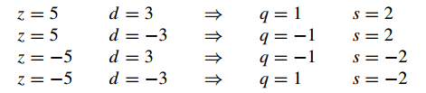
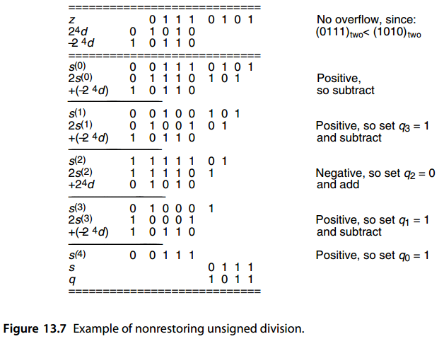

# 13. 基础除法方案 

Basic Division Schemes

> “I don’t think you need to worry about your failure at long division. I mean, after all, you got through short division,and short division is all that a lady ought to be called on to cope with.”
> 			— TENNESSEE WILLIAMS , BABY DOLL

> “我认为你不需要担心不会长除法。 我的意思是，毕竟你已经会短除法了，而短除法就是一位女士应该知道的一切了。”
> 			— 田纳西·威廉姆斯，洋娃娃

Like sequential multiplication of k-bit operands, yielding a 2k-bit product, division of a 2k-bit dividend by a k-bit divisor can be realized in the k cycles of shifting and adding (actually subtracting),with hardware,firmware,or software control of the loop. In this chapter, we review such economical, but slow, bit-at-a-time designs and set the stage for speedup methods and variations to be presented in Chapters 14–16. We also consider the special case of division by a constant. Chapter topics include:

与 k 位操作数的顺序乘法产生 2k 位乘积一样，2k 位被除数除以 k 位除数可以在 k 个移位和加法（实际上是减法）周期中实现，通过硬件、固件、 或循环的软件控制。 在本章中，我们回顾了这种经济但缓慢的、一次一点的设计，并为第 14-16 章中介绍的加速方法和变体奠定了基础。 我们还考虑除以常数的特殊情况。 章节主题包括：

-   13.1 移位相减除法算法 SHIFT/SUBTRACT DIVISION ALGORITHMS
-   13.2 程序实现的除法算法 PROGRAMMED DIVISION
-   13.3 恢复余数除法器 RESTORING HARDWARE DIVIDERS
-   13.4 不恢复余数除法器与有符号数除法 NONRESTORING AND SIGNED DIVISION
-   13.5 除以一个常数 DIVISION BY CONSTANTS
-   13.6 基2 SRT除法 RADIX-2 SRT DIVISION

## 13.1 移位相减除法算法

The following notation is used in our discussion of division algorithms:

我们在讨论除法算法时使用以下符号：

$$
\begin{array}{l}
z &\text{被除数Dividend} &z_{2k-1}z_{2k-2}\cdots z_1z_0 \\
d &\text{除数Divisor}   &d_{k-1}d_{k-2}\cdots d_1d_0 \\
q &\text{商Quotient}   &q_{k-1}q_{k-2}\cdots q_1q_0 \\
s &\text{余数Remainder } [z-(d\times q)] &s_{k-1}s_{k-2}\cdots s_1s_0
\end{array}
$$

The expression *z* − *(d* × *q)* for the remainder *s* is derived from the basic division equation *z* = *(d* × *q)* + *s*. This equation, along with the condition *s < d* , completely defines unsigned integer division.

余数 $s$ 的表达式 $z − (d × q)$ 由基本除法方程 $z = (d × q) + s$ 导出。该方程与条件 $s < d$ 一起完整定义了无符号整数除法。

Figure 13.1 shows a 2 *k*-bit by *k*-bit unsigned integer division in dot notation. The dividend *z* and divisor *d* are shown near the top. Each of the following four rows of dots corresponds to the product of the divisor *d* and 1 bit of the quotient *q*, with each dot representing the product (logical AND) of 2 bits. Since *qk*− *j* is in {0, 1}, each term *qk*− *jd* is either 0 or *d*. Thus, the problem of binary division reduces to subtracting a set of numbers, each being 0 or a shifted version of the divisor *d* , from the dividend *z*.

图 13.1 显示了采用点表示法的 $2 k$ 位乘 $k$ 位无符号整数除法。被除数 $z$ 和除数 $d$ 显示在顶部附近。接下来的四行点中的每一行都对应于除数 $d$ 与商 $q$ 的 1 位的乘积，每个点代表 2 位的乘积（逻辑与）。由于 $q_{k−j}$ 在 {0, 1} 中，因此每一项 $q_{k−j}d$ 要么是 $0$，要么是 $d$。因此，二进制除法的问题简化为从被除数 $z$ 中减去一组数字，每个数字都是 $0$ 或除数 $d$ 的移位版本。

Figure 13.1 also applies to nonbinary division, except that with *r >* 2, both the selection of the next quotient digit *qk*− *j* and the computation of the terms *qk*− *jd* become more difficult and the resulting products are one digit wider than *d* . The rest of the process, however, remains substantially the same.

图 13.1 也适用于非二进制除法，只是 $r > 2$ 时，下一个商位 $q_{k−j}$ 的选择和 $q_{k−j}d$ 项的计算都变得更加困难，并且所得乘积比 d 宽一位数。然而，该过程的其余部分基本保持不变。

Just as sequential multiplication was done by repeated additions, sequential division is performed by repeated subtractions. The partial remainder is initialized to *s(* 0 *)* = *z*. In step *j*, the next quotient digit *qk*− *j* is selected. Then, the product *qk*− *jd* (which is either 0 or *d* ) is shifted and the result subtracted from the partial remainder. So, compared with multiplication, division has the added complication of requiring quotient digit selection or estimation.

正如顺序乘法是通过重复加法完成的，顺序除法是通过重复减法完成的。部分余数被初始化为 $s^{(0)}$ = z。在步骤$j$中，选择下一个商位$q_{k−j}$。然后，乘积 $q_{k− j}d$ （要么是 0 或 d ) 被移位并从部分余数中减去结果。因此，与乘法相比，除法增加了需要商位选择或估计的复杂性。

Another aspect of division that is different from multiplication is that whereas the product of two *k*-bit numbers is always representable in 2 *k* bits, the quotient of a 2 *k*-bit number divided by a *k*-bit number may have a width of more than *k* bits. Thus, an overflow check is needed before a division algorithm is applied. Since, for unsigned division, we have *q <* 2 *k* and *s < d* , to avoid overflow, we must have 

除法与乘法不同的另一个方面是，虽然两个 $k$ 位数字的乘积始终可以用 $2 k$ 位表示，但 $2 k$-比特数除以$k$比特数可以具有多于$k$比特的宽度。因此，在应用除法算法之前需要进行溢出检查。因为对于无符号除法，我们有 $q < 2 ^k$ 且 $s < d$ ，为了避免溢出，我们必须有 

$z < ( 2^k − 1 )d + d = 2^k d$

Hence, the high-order *k* bits of *z* must be strictly less than *d* . Note that this overflow check also detects the divide-by-0 condition.

因此， z 的高阶 k 位必须严格小于 d 。请注意，此溢出检查还会检测被 0 除的情况。

Fractional division can be reformulated as integer division, and vice versa. In an integer division characterized by *z* = *(d* × *q)* + *s*, we multiply both sides by 2−2 *k* : 

分数除法可以重新表述为整数除法，反之亦然。在以 $z = (d × q) + s$ 为特征的整数除法中，我们将两边都乘以 $2^{−2 k}$ ： 

$2^{−2 k} z = ( 2^{− k} d ) × ( 2^{− k} q) + 2^{−2 k} s$

Now, letting the 2 *k*-bit and *k*-bit inputs be fractions, we see that their fractional values are related by

现在，让 $2 k$ 位和 $k 位$输入为分数，我们看到它们的分数值通过以下关系相关：

$z_{frac} = (d_{frac} × q_{frac} ) + 2^{− k} s_{frac}$ 

Therefore, we can divide fractions just as we divide integers, except that the final remainder must be shifted to the right by *k* bits. In effect, this means that *k* zeros are to be inserted after the radix point to make the *k*-bit (fractional) remainder into a 2 *k*-bit fractional number with *k* leading 0s. This makes sense because when we divide *z* frac by a number *d* frac that is less than 1, the remainder should be less than *ulp* in the quotient (otherwise, the quotient could be increased without the remainder going negative). The condition for no overflow in this case is *z* frac *< d* frac, which is checked in exactly the same way as for integer division.

因此，我们可以像除整数一样除分数，只是最后的余数必须向右移动 k 位。实际上，这意味着要在小数点后插入 k 个零，以使 k 位（小数）余数变为 2 k 位小数，其中 k 个前导 0。这是有道理的，因为当我们将 $z_{frac}$ 除以小于 1 的数字 $d_{frac}$ 时，余数应小于商中的 ulp（否则，商可能会增加而余数不会变为负数）。在这种情况下，不溢出的条件是 $z_{frac} < d_{frac}$，其检查方式与整数除法完全相同。

Sequential or bit-at-a-time division can be performed by keeping a partial remainder, initialized to *s(* 0 *)* = *z*, and successively subtracting from it the properly shifted terms *qk*− *jd* (Fig. 13.1). Since each successive number to be subtracted from the partial remainder is shifted by 1 bit with respect to the preceding one, a simpler approach is to shift the partial remainder by 1 bit, to align its bits with those of the next term to be subtracted. This leads to the well-known sequential division algorithm with left shifts: 

顺序或一次一位除法可以通过保留部分余数来执行，初始化为 s(0)=z，并连续从中减去正确移位的项 $q_{k−j}d$（图 13.1）。由于要从部分余数中减去的每个连续数字都相对于前一个数字移位 1 位，因此更简单的方法是将部分余数移位 1 位，以将其位与下一项要减去的位对齐。这导致了著名的左移顺序除法算法： 

The factor 2^*k* by which *d* is premultiplied ensures proper alignment of the values. After *k* iterations, the preceding recurrence leads to

预乘 d 的因子 $2^k$ 可确保值的正确对齐。经过 k 次迭代后，前面的递归导致

$s^{(k)}=2^ks^{(0)}-q(2^kd)=2^k[z-(q\times d)]=2^ks$

小数版本的除法迭代记为

Note that unlike multiplication, where the partial products can be produced and processed from top to bottom or bottom to top, in the case of division, the terms to be subtracted from the initial partial remainder must be produced from top to bottom. The reason is that the quotient bits become known sequentially, beginning with the most-significant one, whereas in multiplication all the multiplier bits are known at the outset. This is why we do not have a division algorithm with right shifts (corresponding to multiplication with left shifts).

请注意，与乘法不同，乘法可以从上到下或从下到上产生和处理部分积，而在除法的情况下，必须从上到下产生要从初始部分余数中减去的项。原因是商位从最高有效位开始按顺序已知，而在乘法中，所有乘数位一开始就已知。这就是为什么我们没有右移除法算法（对应于左移乘法）。

如图 13.2a 所示: $z = ( 117 )_{ten} = ( 0111 0101 )_2$ 除以 $d = ( 10 )_{ten} = ( 1010 )_2$ 得到商 $q = ( 11 )_{ten} = ( 1011 )_2$ 和余数 $s = ( 7 )_{ten} = ( 0111 )_2$ 。

图 13.2b 显示了同一除法的小数版本，操作数 $z = ( 117 / 256 )_{ten} = (.0111 0101 )_2$，$d = ( 10 / 16 )_{ten} = (.1010 )_2$，结果 $q = ( 11 / 16 )_{ten} = (.1011 )_2$，$s = ( 7 / 256 )_{ten} = (.0 000 0111)_2$。

In practice, the required subtraction is performed by adding the 2’s complement of 2 *k d* or *d* to the partial remainder (more on this later). Note that there are but two choices for the value of the next quotient digit *qk*− *j* or *q*− *j* in radix 2, with the value 1 selected whenever the shifted partial remainder 2 *s(j*−1 *)* is greater than 2 *k d* or *d* . Sections 13.3 and 14.2 contain more detailed discussions on quotient digit selection.

实际上，所需的减法是通过将 $2^k d$ 或 $d$ 的 2 的补码与部分余数相加来执行的（稍后会详细介绍）。请注意，基数 2 中下一个商位 $q_{k− j}$ 或 $q_{− j}$ 的值只有两种选择，每当移位的部分余数 $2 s^{(j−1)}$ 大于 $2^k d$ 或 $d$ 时，就选择值 1。第 13.3 节和 14.2节 包含关于商数字选择的更详细讨论。

## 13.2 程序实现的除法算法

On a processor that does not have a divide instruction, one can use shift and add instructions to perform integer division. Since one quotient digit is produced after each left shift of the partial remainder, we need only two *k*-bit registers to store the partial remainder and the quotient: Rs for the most-significant *k* bits of the partial remainder, and Rq for the rest of the partial remainder plus the partial quotient produced thus far (Fig. 13.3). In each cycle, the double-width register Rs|Rq is shifted left and the new quotient digit is inserted in the just-vacated least-significant bit (LSB) of Rq. This insertion is accomplished by incrementing Rq by 1 if the next quotient digit is 1.

在没有除法指令的处理器上，可以使用移位和加法指令来执行整数除法。由于部分余数每次左移后都会产生一个商数字，因此我们只需要两个 k 位寄存器来存储部分余数和商：$R_s$ 代表部分余数的最高有效 k 位，$R_q$ 代表部分余数的其余部分加上迄今为止产生的部分商（图 13.3）。在每个周期中，双宽寄存器 Rs|Rq 左移，并将新的商位插入到 Rq 刚刚空出的最低有效位 (LSB) 中。如果下一个商数字为 1，则通过将 Rq 增加 1 来完成此插入。

Figure 13.4 shows the structure of the needed program for sequential division. The instructions used in this program fragment are typical of instructions available on many processors.

图 13.4 显示了顺序除法所需的程序结构。该程序片段中使用的指令是许多处理器上可用的典型指令。

The subtract instruction in the program fragment of Fig. 13.4 needs some elaboration. If we reach the subtract instruction by falling through its preceding branch instruction, then Rs ≥ Rd, and the desired effect of leaving Rs − Rd in Rs is achieved through subtraction. However, if we reach the subtract instruction from the skip instruction, then the carry flag is 1 and Rs *<* Rd. In this case, the proper result is to leave (2 *k* + Rs) − Rd in Rs, where 2 *k* represents the most-significant bit (MSB) of the shifted partial remainder held in the carry flag. But we have

图 13.4 程序片段中的减法指令需要一些详细说明。如果我们通过前一个分支指令到达减法指令，则 Rs ≥ Rd，并且将 Rs − Rd 保留在 Rs 中的预期效果通过减法实现。然而，如果我们从跳过指令到达减法指令，则进位标志为 1 并且 Rs < Rd。在这种情况下，正确的结果是将 $(2^k + Rs) - Rd$ 保留在 Rs 中，其中 $2^k$ 表示进位标志中保存的移位部分余数的最高有效位 (MSB)。但我们有

$$
\begin{array}{l}
( 2^k + Rs ) − Rd &= Rs + ( 2^k − Rd ) \\
                  &= Rs + \text{2’s-complement of }Rd
\end{array}
$$

Thus, even though we are performing unsigned division, a 2’s-complement subtract instruction produces the proper result in either case.

因此，即使我们执行无符号除法，2 的补码减法指令在任何一种情况下都会产生正确的结果。

Ignoring operand load and result store instructions (which would be needed in any implementation), the function of a divide instruction is accomplished by executing between 6 *k* + 3 and 8 *k* + 3 machine instructions, depending on the operands. More precisely, if the binary representation of the quotient *q* is of weight *w* (i.e., its number of 1 bits equals *w*), then 6 *k* + 2 *w* + 3 instructions will be executed by the program of Fig. 13.4. The dependence of program execution time on *w* arises from the fact that the subtract and increment instructions are skipped in an iteration when the derived bit of *q* is 0. For 32-bit operands, this means well over 200 instructions on the average. The situation improves somewhat if a special instruction that does some or all of the required functions within the division loop is available. However, even then, no fewer than 32 instructions would be executed in the division loop. We thus see the importance of hardware dividers for applications that involve a great deal of numerical computations.

忽略操作数加载和结果存储指令（在任何实现中都需要），除法指令的功能是通过执行 $6 k + 3$ 和 $8 k + 3$ 机器指令来完成的，具体取决于操作数。更准确地说，如果商 q 的二进制表示的权重为 w（即其 1 的位数等于 w），则图 13.4的程序将执行 $6 k + 2 w + 3$ 条指令。。程序执行时间对 w 的依赖是由于当 q 的派生位为 0 时，在迭代中会跳过减法和增量指令。对于 32 位操作数，这意味着平均超过 200 条指令。如果可以使用在除法循环内执行部分或全部所需功能的特殊指令，则情况会有所改善。然而，即便如此，除法循环中也将执行不少于 32 条指令。因此，我们看到了硬件除法器对于涉及大量数值计算的应用的重要性。

Microprogrammed processors with no hardware divider use a microroutine very

similar to the program in Fig. 13.4 to perform division. For the same reasons given near the end of Section 9.2 in connection with programmed multiplication, division microroutines are significantly faster than their machine-language counterparts, though still slower than the hardwired implementations we examine next.

没有硬件除法器的微程序处理器非常使用类似于图13.4中的微例程程序来执行除法。出于与第 9.2 节末尾附近有关编程乘法的相同原因，除法微例程比机器语言对应的微例程要快得多，尽管仍然比我们接下来检查的硬连线实现慢。

## 13.3 恢复余数除法器

Figure 13.5 shows a hardware realization of the sequential division algorithm for unsigned integers. At the start of each cycle  *j*, the partial remainder  *s(j*−1 *)*  is shifted to the left, with its MSB moving into a special flip-flop. Then the trial difference 2 *s(j*−1 *)* −  *qk*− *j(* 2 *kd)*  is computed. Because of the 2 *k*  factor in the preceding expression, the divisor is aligned with the upper  *k*  bits of the partial remainder for the trial subtraction and the lower part of the partial remainder is not affected. 

图 13.5 显示了无符号整数的顺序除法算法的硬件实现。在每个周期 $j$开始时，部分余数 $s^{(j−1)}$ 左移，其 MSB 移入特殊触发器。然后计算试验差 $2 s^{(j−1)} − q_{k− j}(2^kd) $。由于上式中存在 $2 k$ 个因子，因此在试减时除数与部分余数的高 $k$ 位对齐，而部分余数的低位不受影响。

As stated in connection with programmed division in Section 13.2, the next quotient digit should be 1 if the MSB of 2 $2 s^{(j−1 )}$​, held in the special flip-flop, is 1 or if the trial difference is positive ( *c* out = 1). In either case,  *qk*− *j* = 1 becomes the shift input for the quotient register and also causes the trial difference to be loaded into the upper half of the partial remainder register to form the new partial remainder for the next cycle. Otherwise,  *qk*− *j* = 0, and the partial remainder does not change. 

如第 13.2 节中与编程除法相关的所述，如果特殊触发器中保存的 $2 s^{(j−1 )}$ 的 MSB 为 1 或者如果试验差为正（ $c_{out} = 1$ ），则下一个商数位应为 1。在任何一种情况下，$q_{k−j} = 1$ 都会成为商寄存器的移位输入，并且还会导致尝试差被加载到部分余数寄存器的上半部分，以形成下一个周期的新部分余数。否则，$q_{k−j} = 0$，部分余数不变。

We refer to the division scheme of Fig. 13.5 as restoring division. The quotient digit in radix 2 is in {0, 1}. The trial subtraction corresponds to assuming  *qk*− *j* = 1. If the trial difference is positive, then the next quotient digit is indeed 1. Otherwise,  *qk*− *j* = 1 is too large and the quotient digit must be 0. The term  *restoring division*  means that the remainder is restored to its correct value if the trial subtraction indicates that 1 was not the right choice for  *qk*− *j*. Note that we could have chosen to load the trial difference in the partial remainder register in all cases, restoring the remainder to its correct value by a compensating addition step when needed. However, this would have led to slower hardware. 

我们将图13.5的划分方案称为恢复除法。基数 2 中的商位位于 {0, 1} 中。试验减法对应于假设 $q_{k− j} = 1$。如果试验差为正，则下一个商位确实为 1。否则，$q_{k− j} = 1$ 太大，商位必须为 0。术语“恢复除法”意味着，如果试减表明 1 不是 $q_{k− j}$ 的正确选择，则将余数恢复为正确值。请注意，我们可以选择在所有情况下将试验差异加载到部分余数寄存器中，并在需要时通过补偿加法步骤将余数恢复为其正确值。然而，这会导致硬件速度变慢。

Just as the multiplier could be stored in the lower half of the partial product register (Fig. 9.4a), the quotient and the lower part of the partial remainder can share the same space, since quotient bits are derived as bits of the partial remainder move left, freeing the required space for them. Excluding the control logic, the hardware requirements of multiplication and division are quite similar, so the two algorithms can share much hardware components (compare Figs. 9.4a and 13.5). 

正如乘数可以存储在部分乘积寄存器的下半部分（图 9.4a）一样，商和部分余数的下半部分可以共享相同的空间，因为商位是随着部分余数的位向左移动而导出的，从而释放了它们所需的空间。除控制逻辑外，乘法和除法的硬件要求非常相似，因此两种算法可以共享很多硬件组件（比较图9.4a和13.5）。

As a numerical example, we use the restoring algorithm to redo the integer division given in Fig. 13.2. The result is shown in Fig. 13.6; note the restoration step corresponding to  *q* 2 = 0 and the extra bit devoted to sign in intermediate operands. A shifted partial remainder does not need an extra sign bit, since its magnitude is immediately reduced by a trial subtraction. 

作为一个数值示例，我们使用恢复算法来重做图 13.2 中给出的整数除法。结果如图13.6所示；请注意对应于 $q_2 = 0$ 的恢复步骤以及专用于中间操作数中符号的额外位。移位的部分余数不需要额外的符号位，因为它的大小会通过尝试减法立即减小。

Thus far, we have assumed unsigned operands and results. For signed operands, the basic division equation  *z* =  *(d* ×  *q)* +  *s*, along with 

到目前为止，我们假设了无符号的操作数和结果。对于有符号操作数，基本除法方程 $z = (d × q) + s$，以及

$ sign(s) = sign(z)$  和$| s| < | d|$

uniquely define the quotient  *q*  and remainder  *s*. 

唯一定义商 q 和余数 s。

Consider the following examples of integer division with all possible combinations of signs for *z* and *d* :

考虑以下使用 z 和 d 的所有可能的符号组合进行整数除法的示例：

We see from the preceding examples that the magnitudes of *q* and *s* are unaffected by the input signs and that the signs of *q* and *s* are easily derivable from the signs of *z* and *d* . Hence, one way to do signed division is through an indirect algorithm that converts the operands into unsigned values and, at the end, accounts for the signs by adjusting the sign bits or via complementation. This is the method of choice with the restoring division algorithm.

从前面的例子中我们可以看出，q 和 s 的大小不受输入符号的影响，并且 q 和 s 的符号很容易从 z 和 d 的符号导出。因此，进行有符号除法的一种方法是通过间接算法，将操作数转换为无符号值，最后通过调整符号位或通过补码来计算符号。这是恢复除法算法所选择的方法。

## 13.4 不恢复余数除法器与有符号数除法

Implementation of restoring division requires paying attention to the timing of various events. Each of the  *k*  cycles must be long enough to allow the following events in sequence:

- Shifting of the registers. 

- Propagation of signals through the adder. 

- Storing of the quotient digit. 

恢复除法的实施需要注意各种事件发生的时机。每个 k 个周期必须足够长，以允许按顺序发生以下事件：

- 寄存器的移位。

- 通过加法器传播信号。

- 存储商数。

Thus, the sign of the trial difference must be sampled near the end of the cycle (say at the negative edge of the clock). To avoid such timing issues, which tend to lengthen the clock cycle, one can use the nonrestoring division algorithm. As before, we assume *qk*− *j* = 1 and perform a subtraction. However, we always store the difference in the partial remainder register. This may lead to the partial remainder being temporarily incorrect (hence the name “nonrestoring”). 

因此，必须在周期结束时（例如在时钟的下降沿）对试验差值的符号进行采样。为了避免这种会延长时钟周期的时序问题，可以使用非恢复除法算法。和之前一样，我们假设 $q_{k− j} = 1$ 并执行减法。然而，我们总是将差异存储在部分余数寄存器中。这可能会导致部分余数暂时不正确（因此称为“不可恢复”）。

Let us see why it is acceptable to store an incorrect value in the partial remainder register. Suppose that the shifted partial remainder at the start of the cycle was  *u*. If we had restored the partial remainder  *u* − 2 *k d*  to its correct value  *u*, we would proceed with the next shift and trial subtraction, getting the result 2 *u* − 2 *k d* . Instead, because we used the incorrect partial remainder, a shift and trial subtraction would yield 2 *(u* − 2 *k d )* − 2 *k d* = 2 *u* −  *(* 3 × 2 *k d )*, which is not the intended result. However, an addition would do the trick, resulting in 2 *(u* − 2 *k d )* + 2 *k d* = 2 *u* − 2 *k d* , which is the same value obtained after restoration and trial subtraction. Thus, in nonrestoring division, when the partial remainder becomes negative, we keep the incorrect partial remainder, but note the correct quotient digit and also remember to add, rather than subtract, in the next cycle. 

让我们看看为什么可以在部分余数寄存器中存储不正确的值。假设循环开始时移位的部分余数为 $u$。如果我们将部分余数 $u − 2^k d$ 恢复为其正确值 $u$，我们将继续进行下一次移位和试减，得到结果 $2 u − 2^k d$ 。相反，因为我们使用了不正确的部分余数，所以移位和尝试减法将得到 $2 (u − 2^k d ) − 2^k d = 2 u − ( 3 × 2^k d )$，这不是预期的结果。然而，加法就可以解决问题，得到 $2 (u − 2^k d ) + 2^k d = 2 u − 2^k d$ ，这与恢复和试减后获得的值相同。因此，在非恢复除法中，当部分余数变为负数时，我们保留不正确的部分余数，但记下正确的商位数，并记住在下一个循环中进行加法而不是减法。

Before discussing the adaptation of nonrestoring algorithm for use with signed operands, let us use the nonrestoring algorithm to redo the example division of Fig. 13.6. The result is shown in Fig. 13.7. We still need just 1 extra bit for the sign of  *s(j)*, which doubles as a magnitude bit for 2 *s(j)*. 

在讨论用于引入带符号操作数的非恢复算法的之前，让我们使用非恢复算法来重做图 13.6 的示例除法。结果如图13.7所示。我们仍然只需要 1 个额外位来表示 $s^{(j)}$ 的符号，它兼作 $2 s^{(j)} $的幅度位。

Figure 13.8 illustrates the relationship between restoring division and nonrestoring division for the preceding example division, namely, (117)ten/(10)ten. In each cycle, the value 2 *k d* =  *(* 160 *)* ten is added to or subtracted from the shifted partial remainder. 

图 13.8 说明了前面示例除法的恢复除法和非恢复除法之间的关系，即 $(117)_{ten}/(10)_{ten}$。在每个循环中，将值$2^k d = ( 160 )_{10}$ 添加到移位的部分余数中或从移位的部分余数中减去。

## 13.5 除以常数

## 13.6 基-2 SRT除法

## 问题（略）

## 参考文献和进一步阅读